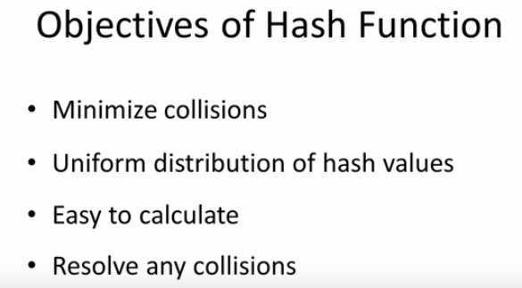
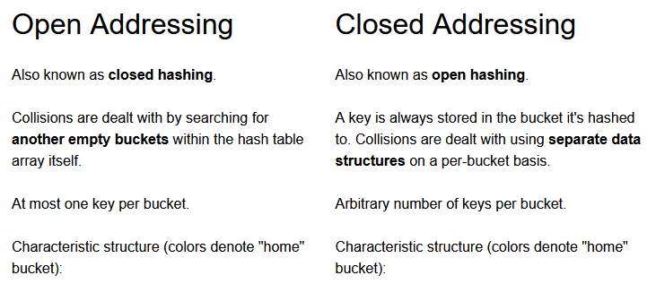
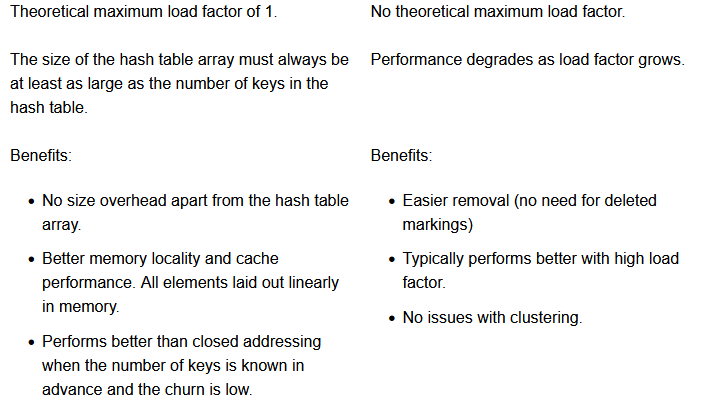
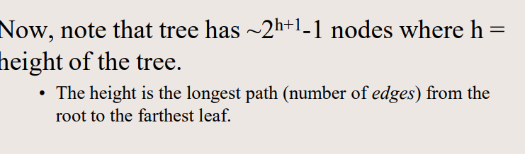
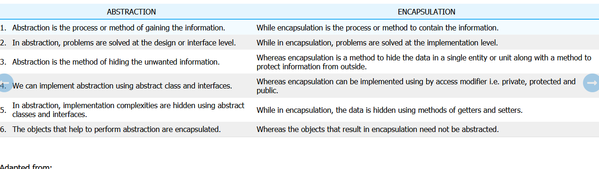

# Paper-I 
## Section-B 
---
### Data Structures and Algorithms

- **Source**:`Data Structures and Algorithms.pdf`
#### Main Notes
- a finite sequence of instructions, each of which has a clear meaning and can be performed with a finite amount of effort in a finitelength of time
- The idea that the implementational details are hidden from the user
and protected from outside access is known as **encapsulation**
- In computer science, the obvious way to store an ordered collection of items is as an array.
Array items are typically stored in a sequence of computer memory locations, but to discuss
them. [1, 4, 17, 3, 90, 79, 4, 6, 81]
is an example of an array of integers.
- The standard approach in most programming languages for repeating a process a certain
number of times, such as moving sequentially through an array to perform the same operations
on each item, involves a loop.
```
for( INITIALIZATION ; CONDITION ; UPDATE ) {
REPEATED PROCESS
}

for( i = 0, sum = 0 ; i < 20 ; i++ ) {
sum += a[i];
}
```

- An **invariant**, as the name suggests, is a condition that does not change during execution of
a given program or algorithm. Invariants are also called **inductive assertions**
- loop-invariant is a condition that is true at the beginning and end of every
iteration of the given loop. Invariants are important for data
structures and algorithms because they enable correctness proofs and verification
- A list can involve virtually anything
- In order to communicate data structures between different computers and possibly different
programming languages, **XML (eXtensible Markup Language)** has become a quasi-standard.
```
<ol>
<li>3</li>
</ol>
```
- **Array vs List:** Arrays are specially optimised for arithmetic computations so if you’re going to perform similar operations you should consider using an array instead of a list.Also lists are containers for elements having differing data types but arrays are used as containers for elements of the same data type
- In context of c++: An array is a contiguous chunk of memory with a fixed size whereas a list is typically implemented as individual elements linked to each other via pointers and does not have a fixed size. Once an array is initialized, it cannot be resized, and it uses a fixed amount of memory regardless of how much stuff you put in it
- **Stacks** are, on an abstract level, equivalent to linked lists. They are the ideal data structure
to model a First-In-Last-Out (FILO), or Last-In-First-Out (LIFO), strategy in search.
- A **queue** is a data structure used to model a First-In-First-Out (FIFO) strategy. Conceptually,
we add to the end of a queue and take away elements from its front `18`
```
Imperative Programming means any style of programming where your program is structured out of instructions describing how the operations performed by a computer will happen.

Declarative Programming means any style of programming where your program is a description either of the problem or the solution - but doesn't explicitly state how the work will be done.

Functional Programming is programming by evaluating functions and functions of functions... As (strictly defined) functional programming means programming by defining side-effect free mathematical functions so it is a form of declarative programming but it isn't the only kind of declarative programming.

Logic Programming (for example in Prolog) is another form of declarative programming. It involves computing by deciding whether a logical statement is true (or whether it can be satisfied). The program is typically a series of facts and rules - i.e. a description rather than a series of instructions.

Term Rewriting (for example CASL) is another form of declarative programming. It involves symbolic transformation of algebraic terms. It's completely distinct from logic programming and functional programming.

```
- A **linked list** is a linear data structure, in which the elements are not stored at contiguous memory locations.  A linked list consists of nodes where each node contains a data field and a reference(link) to the next node in the list.
- **Recusion**  `https://www.tutorialspoint.com/data_structures_algorithms/recursion_basics.html`
  Time Complexity: A call made to a function is Ο(1), hence the (n) number of times a recursive call is made makes the recursive function Ο(n).
  Space Complexity: In case of recursion, the system needs to store activation record each time a recursive call is made. Hence, it is considered that space complexity of recursive function may go higher than that of a function with iteration.

**Searching and Sorting Algorithms**
- https://www.studytonight.com/data-structures/search-algorithms
- Converting the binary search to linked list form is problematic, because there
is no efficient way to split a linked list into two segments
-  for time-critical problems, such as keeping track of aeroplanes in certain sectors of air space, it
may be totally unacceptable for the software to take too long if the worst case arises.
- https://www.geeksforgeeks.org/ for all sorting algos
**Big-O notation:**
  - Sorting Techniques
  - enumeration sorting Consider all items. If we know that there are N items which are
    smaller than the one we are currently considering, then its final position will be at number N + 1.
  - exchange sorting If two items are found to be out of order, exchange them. Repeat
    till all items are in order.
  - selection sorting Find the smallest item, put it in the first position, find the smallest
    of the remaining items, put it in the second position . . .
  - insertion sorting Take the items one at a time and insert them into an initially
    empty data structure such that the data structure continues to be
    sorted at each stage.
  - divide and conquer Recursively split the problem into smaller sub-problems till you
    just have single items that are trivial to sort. Then put the sorted
    ‘parts’ back together in a way that preserves the sorting.
 **Sorting algorithm stability**
 - The easiest way to determine whether a given algorithm is stable is to consider whether
the algorithm can ever swap identical items past each other
Summary of comparison-based sorting algorithms : `82`
- we can’t get time complexity better than O(nlog2 n) with comparison
based algorithms.

- We have seen that there is a variant of binary search trees which keeps
the worst case the same as the average case, the so-called self-balancing binary search tree,
but that is more complicated to both understand and program. For those trees, insertion,
deletion, search, retrieval and update, can all be done with time complexity O(log2 n), and
traversal has O(n) complexity.`88`
- 


- Bubble Sort:
  - Worst and Average Case Time Complexity: O(n*n). Worst case occurs when array is reverse sorted.
  - Best Case Time Complexity: O(n). Best case occurs when array is already sorted.
  - Auxiliary Space: O(1)
  - Boundary Cases: Bubble sort takes minimum time (Order of n) when elements are already sorted.
- Merge Sort:
  - Time Complexity: Sorting arrays on different machines. Merge Sort is a recursive algorithm and time complexity can be expressed as following recurrence relation. 
    T(n) = 2T(n/2) + θ(n)
    The above recurrence can be solved either using the Recurrence Tree method or the Master method. It falls in case II of Master Method and the solution of the recurrence is θ(nLogn). Time complexity of Merge Sort is  θ(nLogn) in all 3 cases (worst, average and best) as merge sort always divides the array into two halves and takes linear time to merge two halves.
  - Auxiliary Space: O(n)
  - Algorithmic Paradigm: Divide and Conquer
- Quick Sort:
- Heap Sort:
  - Time Complexity: Time complexity of heapify is O(Logn). Time complexity of createAndBuildHeap() is O(n) and the overall time complexity of Heap Sort is O(nLogn).

    Efficiency –  The time required to perform Heap sort increases logarithmically while other algorithms may grow exponentially slower as the number of items to sort increases. This sorting algorithm is very efficient.
    Memory Usage – Memory usage is minimal because apart from what is necessary to hold the initial list of items to be sorted, it needs no additional memory space to work
    Simplicity –  It is simpler to understand than other equally efficient sorting algorithms because it does not use advanced computer science concepts such as recursion
- Selection Sort:
    - Time Complexity: O(n2) as there are two nested loops.
    - Auxiliary Space: O(1) 
    - The good thing about selection sort is it never makes more than O(n) swaps and can be useful when memory write is a costly operation.
- Insertions Sort:
  - Time Complexity: O(n^2) 
  - Auxiliary Space: O(1)
  - Boundary Cases: Insertion sort takes maximum time to sort if elements are sorted in reverse order. And it takes minimum time (Order of n) when elements are already sorted.
  - Algorithmic Paradigm: Incremental Approach


- **Hastable**
- Two different strings can have same hashcode because infinite num of string but finite hashcode
   
   
   
   
- Most common hash function MD5
- A bucket is simply a fast-access location (like an array index) that is the the result of the hash function
- By the way, "separate list" hints at why open hashing is also known as "separate chaining".
- Perfect Hash function: a hash function that maps each item into a unique slot (no collisions).
- Two or more items would need to be in the same slot. This is referred to as a collision (it may also be called a “clash”).
- Common way for constructing hash function:
    1. **folding method** for constructing hash functions begins by dividing the item into equal-size pieces.These pieces are then added together to give the resulting hash value. For example, if our item was the phone number 436-555-4601, we would take the digits and divide them into groups of 2 (43,65,55,46,01). After the addition, 43+65+55+46+01, we get 210. If we assume our hash table has 11 slots, then we need to perform the extra step of dividing by 11 and keeping the remainder. In this case 210 % 11 is 1, 
    2. Another numerical technique for constructing a hash function is called the **mid-square method**. We first square the item, and then extract some portion of the resulting digits. For example, if the item were 44, we would first compute 442=1,936. By extracting the middle two digits, 93, and performing the remainder step, we get 5 (93 % 11)
```
Following are the collision resolution techniques used:

    Open Hashing (Separate chaining)
    Closed Hashing (Open Addressing)
        Liner Probing
        Quadratic probing
        Double hashing
```


- **Open Addressing Techniques**
- When two items hash to the same slot, we must have a systematic method for placing the second item in the hash table. This process is called **collision resolution**
- Linear Probing:A simple way to do this is to start at the original hash value position and then move in a sequential manner through the slots until we encounter the first slot that is empty, **Disadvantage: clustering**. linear probing has the best cache performance but is most sensitive to clustering
- A variation of the linear probing idea is called **quadratic probing**. Instead of using a constant “skip” value, we use a rehash function that increments the hash value by 1, 3, 5, 7, 9, and so on.quadratic hashing falls in-between in both areas.
-  **Double Hashing** is based upon the idea that in the event of a collision we use an another hashing function with the key value as an input to find where in the open addressing scheme the data should actually be placed at.double hashing has poor cache performance but exhibits virtually no clustering.Also more computation.
-  **Chaining**: In the simplest chained hash table technique, each slot in the array references a linked list of inserted records that collide to the same slot. Insertion requires finding the correct slot, and appending to either end of the list in that slot; deletion requires searching the list and removal.
-  **Coalesced hashing**
A hybrid of chaining and open addressing, coalesced hashing links together chains of nodes within the table itself. Like open addressing, it achieves space usage and (somewhat diminished) cache advantages over chaining. Like chaining, it does not exhibit clustering effects; in fact, the table can be efficiently filled to a high density. Unlike chaining, it cannot have more elements than table slots.
- **Probabilistic hashing**: Perhaps the simplest solution to a collision is to replace the value that is already in the slot with the new value
- **Bucket Hashing** :One implementation for closed hashing groups hash table slots into buckets. The M slots of the hash table are divided into B buckets, with each bucket consisting of M/B slots. The hash function assigns each record to the first slot within one of the buckets. If this slot is already occupied, then the bucket slots are searched sequentially until an open slot is found. If a bucket is entirely full, then the record is stored in an overflow bucket of infinite capacity at the end of the table. All buckets share the same overflow bucket.

**Expression Notations**
- Infix, Prefix and Postfix Expressions
- 

**Trees**
   
  - Root is the topmost node of the tree
  - Edge is the link between two nodes
  - Child is a node that has a parent node
  - Parent is a node that has an edge to a child node
  - Leaf is a node that does not have a child node in the tree
  - Height is the length of the longest path to a leaf
  - Depth is the length of the path to its root
  - Binary Tree:  a binary tree is a tree data structure in which each node has at the most two children, which are referred to as the left child and the right child
  - Tree traversal: Depth-First Search (DFS) and Breadth-First Search (BFS).
  - DFS “is an algorithm for traversing or searching tree data structure. One starts at the root and explores as far as possible along each branch before backtracking.
  -  types of DFS: pre-order, in-order, and post-order.
  - BFS “is an algorithm for traversing or searching tree data structure. It starts at the tree root and explores the neighbor nodes first, before moving to the next level neighbors.”

- it is observed that BST's worst­case performance is closest to linear search algorithms, that is Ο . In real­timedata, we cannot predict data pattern and their frequencies. So, a need arises to balance out the existing BST.
Named after their inventor Adelson, Velski & Landis, **AVL trees** are height balancing binary search tree. AVL tree checks the height of the left and the right sub­trees and assures that the difference is not more than 1. This difference is called the **Balance Factor**.

To balance itself, an AVL tree may perform the following four kinds of rotations −
Left rotation
Right rotation
Left­Right rotation
Right­Left rotation


  
  **Greedy Algorithm**
  - Greedy algorithms try to find a localized optimum solution, which may eventually lead to globally optimized solutions. However, generally greedy algorithms do not provide globally optimized solutions
  
---
#### Keywords
- correctness proofs
- invariants
- specification,verification, Performance analysis
- data structure
- abstract data types
- encapsulation
- design patterns
- loops
- arrays
- constructors, selectors and conditions
- Linked List, Doubly Linked List, Circular Linked List
- Seach Problems ,Their specification `23`
---
#### Questions
1. WHat is algorithm ?
2. What are programming paradigms ?
3. What is declarative programming and imperative programming ?
4. What is a pseudo-code ?
5. What are the questions regarding Algorithms ?
6. What is specification,verification, Performance analysis ? How to perform these ?
7. difference between list and array
8. What are invariants ?Thier other name ? What are they importent for ?
9. What is XML and what is it used for ?
10. What is a Queue, stack and Linked List ?
11. What is Abstract Data Type ADT ?
12. Difference between abstract class vs ADT
13. What is recursion ? Time and space complexity ?
14. Recursion vs iteration ?
15. What are Linked List ? Why are ADTs used even through they are less efficient ?
16.  Pictures of Array, Queue, Linked List ? Their selectors and constructors, Conditions ?
17.  Advantages of Abstract Data types ?
18.  What are the 2 searching algorithms ? Their time complexity ? Their step by step implementation ? Advantages ?
19.  Which search algo works on ordered or unordered list/array ?
20.  Do at implementation of these in c++. Once .
21.  Algorithmic Paradigm
22.  Why array based representation for Binary Heap? https://www.geeksforgeeks.org/heap-sort/
23.  What is Binary Heap? https://www.geeksforgeeks.org/heap-sort/
24.  What is Complete Binary Tree? https://www.geeksforgeeks.org/heap-sort/
25.  what is Sorting algorithm stability ?`72`
26.  What are Hashtables ?Their average and worst case in Space,search,insert,Delete ?`https://en.wikipedia.org/wiki/Hash_table`
27.  What is a hashcode ?Principle of storing data in hash table or hash map ?
28.  What is hashing algorithm ? 
29.  What is collision ?Why is collision possible ?
30.  Techniques for resolving  collision ?
31.  What is a load factor in hashtable ? its purpose ? Formula
32.  Open and close addressing in Hash maps ? which techniques are which in collision ?
33.  What are objectives of hash function ?
34.  What is chaining , Its advantages and disadvantages ?
35.  What is Linear Probing,Quadratic Probing , Double Hash ? Advantages and Disadvantages ?
36.  What is a bucket in hash tables?
37.  What probablistic hashing, Bucket hashing , coalesed hashing ?
38.  What are trees ?
39.  Compare Insert,delete,search time complexity for tree, arrays, and linked List ?
40.  What is the formula for calculating number of nodes based on height of a tree ?
41.  What is height of a tree ?
42.  What is leaf in a tree ?
43.  What is depth ?
44.  What are different types of tree traversal techniques ?
45.  What is AVL tree ? How does it balance itself ?
46.  What are graphs ? In what case graphs and trees are same ? Visual example ?
47.  Describe these techniques and do a rough traversal ?
48.  What are pre-order, in-order, and post-order traversal ? Do these traversal of trees ?
49.  What are Infix, Prefix and Postfix ? How does conversion into each work ?
50.  Easiest way to do deletion from a tree ? Increment type ?
51.  What is genetic algorithm ? Who invented it ? 
52.  Give a pseudo code of Genetic algorithm ?
53.  Different components of GA. WHich one is the hardest ?
54. What are Greedy algorithms ? How do they find solution ? Example of greedy algorithms ?


---
### Object Oriented Paradigm  

#### Main Notes
- Object-oriented paradigm:
- **Data abstraction**: is a programming design technique that relies on the separation of interface
and implementation.

Abstraction separates code into interface and implementation. So while designing your
component, you must keep interface independent of the implementation so that if you change
underlying implementation then interface would remain intact.
Benefits: Class internals are protected from inadvertent user-level errors, which might corrupt the
state of the object.
The class implementation may evolve over time in response to changing requirements or
bug reports without requiring change in user-level code.

- Encapsulation:Data encapsulation, also known as data hiding, is the mechanism whereby the implementation details of a class are kept hidden from the user. The user can only perform a restricted set of operations on the hidden members of the class by executing special functions commonly called methods.
- Inheritance:
- Polymorphism:
- There are two simple ways in C++ to define constants:
  Using #define preprocessor.
  Using const keyword

- **Files**
  - seekg moves the file input pointer(position of reading frm file) while seekp moves file output pointer( position f writing to file). Another question from juice answerable simply by reading the documentation
  - tellp():It returns the position of the current character in the output stream.	
  - tellg():It returns the position of the current character in the input stream.

   

- A friend function is a friend of a class that is allowed to access to Public, private, or protected data in that same class. If the function is defined outside the class cannot access such information.

A friend can be declared anywhere in the class declaration, and it cannot be affected by access control keywords like private, public, or protected.
  
#### Keywords
---
#### Questions
1. What is Object oriented paradigm ?
2. What is data abstraction ? How do you do it ? Examples in c++ ? What are benefits ?
3. What is encapsulation ? Example ?
4. What is inheritance ?
5. What is polymorphism ?
6. What is 
7. What are the ways to define a constant in C++ ? 
8. What is a constructor and Destructor ? Give example c++ ?
9. What are exceptions ? How to handle them in c++ ? How to derive new exceptions in c++ code from exception class ?
10. What is the standard library for reading file in c++ ?
11. Data types for that lib and what do they mean ?
12. In how many modes can you open a file and their function ?
13. How do you read from a file and write to a file c++ ?
14. What are file position pointers ? What methods do they have to control them ?
15. What is the difference between seekg and seekp?
16. What are the additional attributes that can be used with seekg and seekp ?
17. What is the difference between Tellg () and Tellp () functions?
18. What is a Friend function ? example c++ ?
19. Where is friend function specified ?
20. How to specify a whole class as friend ?
21. What things does the derived class not inherit ? List em ?
22. What are the types of inheritance ?
23. What are inline functions and how does compiler place them when they are called ? Recompiling issue ?
24. Difference between abstract class and abstraction ?
25. What are abstract classes and interfaces ?
26. What are abstract classes used for ?
27. How are interfaces made ?
28. What happens if you do not override a pure virtual function in a derived class ?
29. Diff between abstract and concrete class ?
30. How do you make a pure virtual function ?
31. What is function overloading ?
32. What are static memeber or variables ? DO they have access to this ? Properties of Static Method ?
33. How many parts can C++ standard library be divided into ?
34. What is polymorphisms ? How does it work ? Example ?
35. Abstraction vs Encapsulation
36. What is  ternary operator?
37. What are the different types of arguments?by value or reference ? Example ?`https://career.guru99.com/top-50-oops-interview-questions/`
38.  What is static or dynamic binding ? In context of overloading and overriding ?
39.  What is the difference between new and override?
40.  What are the various types of constructors?
41.  What is early and late Binding? 
42.  What is the difference between structure and a class?
43.  What are all the operators that cannot be overloaded?
44.  
---
