# Paper-I 
## Section-B 
---
### Programming Fundamentals 

**Loops**
- There are mainly two types of loops:

    **Entry Controlled loops**: In this type of loops the test condition is tested before entering the loop body. For Loop and While Loop are entry controlled loops.
    **Exit Controlled Loops**: In this type of loops the test condition is tested or evaluated at the end of loop body. Therefore, the loop body will execute atleast once, irrespective of whether the test condition is true or false. do – while loop is exit controlled loop
        
    **For loop**
    **Initialization Expression**: In this expression we have to initialize the loop counter to some value. for example: int i=1;
    **Test Expression**: In this expression we have to test the condition. If the condition evaluates to true then we will execute the body of loop and go to update expression otherwise we will exit from the for loop. For example: i <= 10;
    **Update Expression**: After executing loop body this expression increments/decrements the loop variable by some value. for example: i++;

    A **pointer** is a variable whose value is the address of another variable. Like any variable or constant, you must declare a pointer before you can work with it. The general form of a pointer variable declaration is

  `type *var-name;`

  `References vs Pointers`

References are often confused with pointers but three major differences between references and pointers are −

    You cannot have NULL references. You must always be able to assume that a reference is connected to a legitimate piece of storage.

    Once a reference is initialized to an object, it cannot be changed to refer to another object. Pointers can be pointed to another object at any time.

    A reference must be initialized when it is created. Pointers can be initialized at any time.

single vs double quote

In C and in C++ single quotes identify a single character, while double quotes create a string literal. 'a' is a single a character literal, while "a" is a string literal containing an 'a' and a null terminato

virtual vs pure virutal function

A virtual function is a member function of base class which can be redefined by derived class. A pure virtual function is a member function of base class whose only declaration is provided in base class and should be defined in derived class otherwise derived class also becomes abstract

### Data Structures and Algorithms


- **Source**:`Data Structures and Algorithms.pdf`
#### Main Notes
- a finite sequence of instructions, each of which has a clear meaning and can be performed with a finite amount of effort in a finitelength of time
- The idea that the implementational details are hidden from the user
and protected from outside access is known as **encapsulation**
- In computer science, the obvious way to store an ordered collection of items is as an array.
Array items are typically stored in a sequence of computer memory locations, but to discuss
them. [1, 4, 17, 3, 90, 79, 4, 6, 81]
is an example of an array of integers.
- The standard approach in most programming languages for repeating a process a certain
number of times, such as moving sequentially through an array to perform the same operations
on each item, involves a loop.
```
for( INITIALIZATION ; CONDITION ; UPDATE ) {
REPEATED PROCESS
}

for( i = 0, sum = 0 ; i < 20 ; i++ ) {
sum += a[i];
}
```

- An **invariant**, as the name suggests, is a condition that does not change during execution of
a given program or algorithm. Invariants are also called **inductive assertions**
- loop-invariant is a condition that is true at the beginning and end of every
iteration of the given loop. Invariants are important for data
structures and algorithms because they enable correctness proofs and verification
- A list can involve virtually anything
- In order to communicate data structures between different computers and possibly different
programming languages, **XML (eXtensible Markup Language)** has become a quasi-standard.
```
<ol>
<li>3</li>
</ol>
```
- **Array vs List:** Arrays are specially optimised for arithmetic computations so if you’re going to perform similar operations you should consider using an array instead of a list.Also lists are containers for elements having differing data types but arrays are used as containers for elements of the same data type
- In context of c++: An array is a contiguous chunk of memory with a fixed size whereas a list is typically implemented as individual elements linked to each other via pointers and does not have a fixed size. Once an array is initialized, it cannot be resized, and it uses a fixed amount of memory regardless of how much stuff you put in it
- **Stacks** are, on an abstract level, equivalent to linked lists. They are the ideal data structure
to model a First-In-Last-Out (FILO), or Last-In-First-Out (LIFO), strategy in search.
- A **queue** is a data structure used to model a First-In-First-Out (FIFO) strategy. Conceptually,
we add to the end of a queue and take away elements from its front `18`
```
Imperative Programming means any style of programming where your program is structured out of instructions describing how the operations performed by a computer will happen.

Declarative Programming means any style of programming where your program is a description either of the problem or the solution - but doesn't explicitly state how the work will be done.

Functional Programming is programming by evaluating functions and functions of functions... As (strictly defined) functional programming means programming by defining side-effect free mathematical functions so it is a form of declarative programming but it isn't the only kind of declarative programming.

Logic Programming (for example in Prolog) is another form of declarative programming. It involves computing by deciding whether a logical statement is true (or whether it can be satisfied). The program is typically a series of facts and rules - i.e. a description rather than a series of instructions.

Term Rewriting (for example CASL) is another form of declarative programming. It involves symbolic transformation of algebraic terms. It's completely distinct from logic programming and functional programming.

```
- A **linked list** is a linear data structure, in which the elements are not stored at contiguous memory locations.  A linked list consists of nodes where each node contains a data field and a reference(link) to the next node in the list.
- **Recusion**  `https://www.tutorialspoint.com/data_structures_algorithms/recursion_basics.html`
  Time Complexity: A call made to a function is Ο(1), hence the (n) number of times a recursive call is made makes the recursive function Ο(n).
  Space Complexity: In case of recursion, the system needs to store activation record each time a recursive call is made. Hence, it is considered that space complexity of recursive function may go higher than that of a function with iteration.

**Searching and Sorting Algorithms**
- https://www.studytonight.com/data-structures/search-algorithms
- Converting the binary search to linked list form is problematic, because there
is no efficient way to split a linked list into two segments
-  for time-critical problems, such as keeping track of aeroplanes in certain sectors of air space, it
may be totally unacceptable for the software to take too long if the worst case arises.
- https://www.geeksforgeeks.org/ for all sorting algos
**Big-O notation:**
  - Sorting Techniques
  - enumeration sorting Consider all items. If we know that there are N items which are
    smaller than the one we are currently considering, then its final position will be at number N + 1.
  - exchange sorting If two items are found to be out of order, exchange them. Repeat
    till all items are in order.
  - selection sorting Find the smallest item, put it in the first position, find the smallest
    of the remaining items, put it in the second position . . .
  - insertion sorting Take the items one at a time and insert them into an initially
    empty data structure such that the data structure continues to be
    sorted at each stage.
  - divide and conquer Recursively split the problem into smaller sub-problems till you
    just have single items that are trivial to sort. Then put the sorted
    ‘parts’ back together in a way that preserves the sorting.
 **Sorting algorithm stability**
 - The easiest way to determine whether a given algorithm is stable is to consider whether
the algorithm can ever swap identical items past each other
Summary of comparison-based sorting algorithms : `82`
- we can’t get time complexity better than O(nlog2 n) with comparison
based algorithms.

- We have seen that there is a variant of binary search trees which keeps
the worst case the same as the average case, the so-called self-balancing binary search tree,
but that is more complicated to both understand and program. For those trees, insertion,
deletion, search, retrieval and update, can all be done with time complexity O(log2 n), and
traversal has O(n) complexity.`88`
- 


- Bubble Sort:
  - Worst and Average Case Time Complexity: O(n*n). Worst case occurs when array is reverse sorted.
  - Best Case Time Complexity: O(n). Best case occurs when array is already sorted.
  - Auxiliary Space: O(1)
  - Boundary Cases: Bubble sort takes minimum time (Order of n) when elements are already sorted.
- Merge Sort:
  - Time Complexity: Sorting arrays on different machines. Merge Sort is a recursive algorithm and time complexity can be expressed as following recurrence relation. 
    T(n) = 2T(n/2) + θ(n)
    The above recurrence can be solved either using the Recurrence Tree method or the Master method. It falls in case II of Master Method and the solution of the recurrence is θ(nLogn). Time complexity of Merge Sort is  θ(nLogn) in all 3 cases (worst, average and best) as merge sort always divides the array into two halves and takes linear time to merge two halves.
  - Auxiliary Space: O(n)
  - Algorithmic Paradigm: Divide and Conquer
- Quick Sort:
- Heap Sort:
  - Time Complexity: Time complexity of heapify is O(Logn). Time complexity of createAndBuildHeap() is O(n) and the overall time complexity of Heap Sort is O(nLogn).

    Efficiency –  The time required to perform Heap sort increases logarithmically while other algorithms may grow exponentially slower as the number of items to sort increases. This sorting algorithm is very efficient.
    Memory Usage – Memory usage is minimal because apart from what is necessary to hold the initial list of items to be sorted, it needs no additional memory space to work
    Simplicity –  It is simpler to understand than other equally efficient sorting algorithms because it does not use advanced computer science concepts such as recursion
- Selection Sort:
    - Time Complexity: O(n2) as there are two nested loops.
    - Auxiliary Space: O(1) 
    - The good thing about selection sort is it never makes more than O(n) swaps and can be useful when memory write is a costly operation.
- Insertions Sort:
  - Time Complexity: O(n^2) 
  - Auxiliary Space: O(1)
  - Boundary Cases: Insertion sort takes maximum time to sort if elements are sorted in reverse order. And it takes minimum time (Order of n) when elements are already sorted.
  - Algorithmic Paradigm: Incremental Approach


- **Hastable**
- Two different strings can have same hashcode because infinite num of string but finite hashcode
   
   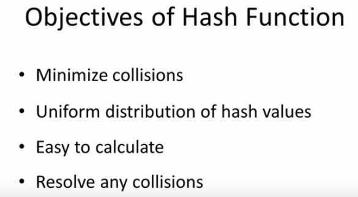
   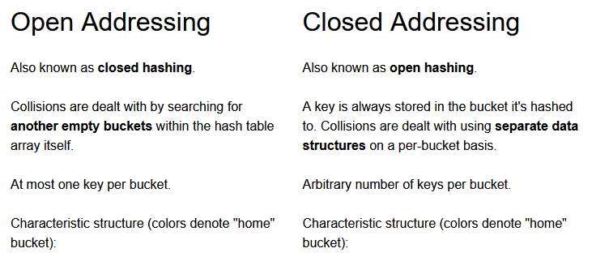
   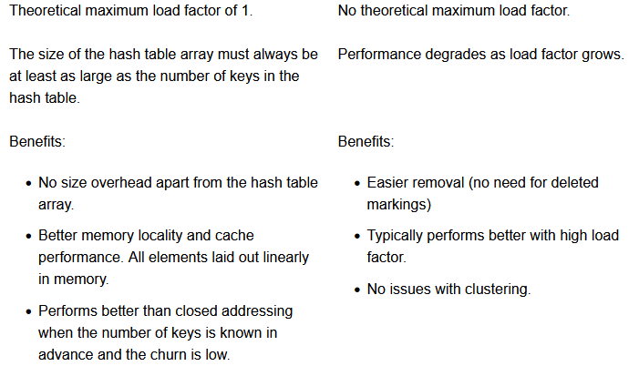
- Most common hash function MD5
- A bucket is simply a fast-access location (like an array index) that is the the result of the hash function
- By the way, "separate list" hints at why open hashing is also known as "separate chaining".
- Perfect Hash function: a hash function that maps each item into a unique slot (no collisions).
- Two or more items would need to be in the same slot. This is referred to as a collision (it may also be called a “clash”).
- Common way for constructing hash function:
    1. **folding method** for constructing hash functions begins by dividing the item into equal-size pieces.These pieces are then added together to give the resulting hash value. For example, if our item was the phone number 436-555-4601, we would take the digits and divide them into groups of 2 (43,65,55,46,01). After the addition, 43+65+55+46+01, we get 210. If we assume our hash table has 11 slots, then we need to perform the extra step of dividing by 11 and keeping the remainder. In this case 210 % 11 is 1, 
    2. Another numerical technique for constructing a hash function is called the **mid-square method**. We first square the item, and then extract some portion of the resulting digits. For example, if the item were 44, we would first compute 442=1,936. By extracting the middle two digits, 93, and performing the remainder step, we get 5 (93 % 11)
```
Following are the collision resolution techniques used:

    Open Hashing (Separate chaining)
    Closed Hashing (Open Addressing)
        Liner Probing
        Quadratic probing
        Double hashing
```


- **Open Addressing Techniques**
- When two items hash to the same slot, we must have a systematic method for placing the second item in the hash table. This process is called **collision resolution**
- Linear Probing:A simple way to do this is to start at the original hash value position and then move in a sequential manner through the slots until we encounter the first slot that is empty, **Disadvantage: clustering**. linear probing has the best cache performance but is most sensitive to clustering
- A variation of the linear probing idea is called **quadratic probing**. Instead of using a constant “skip” value, we use a rehash function that increments the hash value by 1, 3, 5, 7, 9, and so on.quadratic hashing falls in-between in both areas.
-  **Double Hashing** is based upon the idea that in the event of a collision we use an another hashing function with the key value as an input to find where in the open addressing scheme the data should actually be placed at.double hashing has poor cache performance but exhibits virtually no clustering.Also more computation.
-  **Chaining**: In the simplest chained hash table technique, each slot in the array references a linked list of inserted records that collide to the same slot. Insertion requires finding the correct slot, and appending to either end of the list in that slot; deletion requires searching the list and removal.
-  **Coalesced hashing**
A hybrid of chaining and open addressing, coalesced hashing links together chains of nodes within the table itself. Like open addressing, it achieves space usage and (somewhat diminished) cache advantages over chaining. Like chaining, it does not exhibit clustering effects; in fact, the table can be efficiently filled to a high density. Unlike chaining, it cannot have more elements than table slots.
- **Probabilistic hashing**: Perhaps the simplest solution to a collision is to replace the value that is already in the slot with the new value
- **Bucket Hashing** :One implementation for closed hashing groups hash table slots into buckets. The M slots of the hash table are divided into B buckets, with each bucket consisting of M/B slots. The hash function assigns each record to the first slot within one of the buckets. If this slot is already occupied, then the bucket slots are searched sequentially until an open slot is found. If a bucket is entirely full, then the record is stored in an overflow bucket of infinite capacity at the end of the table. All buckets share the same overflow bucket.

**Expression Notations**
- Infix, Prefix and Postfix Expressions
- 

**Trees**
   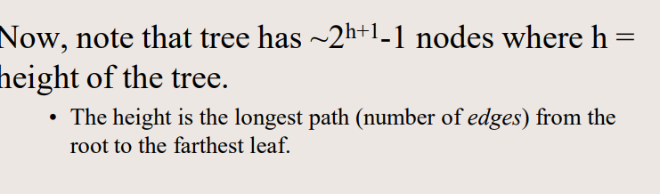
  - Root is the topmost node of the tree
  - Edge is the link between two nodes
  - Child is a node that has a parent node
  - Parent is a node that has an edge to a child node
  - Leaf is a node that does not have a child node in the tree
  - Height is the length of the longest path to a leaf
  - Depth is the length of the path to its root
  - Binary Tree:  a binary tree is a tree data structure in which each node has at the most two children, which are referred to as the left child and the right child
  - Tree traversal: Depth-First Search (DFS) and Breadth-First Search (BFS).
  - DFS “is an algorithm for traversing or searching tree data structure. One starts at the root and explores as far as possible along each branch before backtracking.
  -  types of DFS: pre-order, in-order, and post-order.
  - BFS “is an algorithm for traversing or searching tree data structure. It starts at the tree root and explores the neighbor nodes first, before moving to the next level neighbors.”

- it is observed that BST's worstcase performance is closest to linear search algorithms, that is Ο . In realtimedata, we cannot predict data pattern and their frequencies. So, a need arises to balance out the existing BST.
Named after their inventor Adelson, Velski & Landis, **AVL trees** are height balancing binary search tree. AVL tree checks the height of the left and the right subtrees and assures that the difference is not more than 1. This difference is called the **Balance Factor**.

To balance itself, an AVL tree may perform the following four kinds of rotations −
Left rotation
Right rotation
LeftRight rotation
RightLeft rotation


  
  **Greedy Algorithm**
  - Greedy algorithms try to find a localized optimum solution, which may eventually lead to globally optimized solutions. However, generally greedy algorithms do not provide globally optimized solutions
  
---
#### Keywords
- correctness proofs
- invariants
- specification,verification, Performance analysis
- data structure
- abstract data types
- encapsulation
- design patterns
- loops
- arrays
- constructors, selectors and conditions
- Linked List, Doubly Linked List, Circular Linked List
- Seach Problems ,Their specification `23`
---
#### Links
- Algorithm and Criteria: https://www.geeksforgeeks.org/introduction-to-algorithms/?ref=gcse
- Algorithm representation: https://www.public.asu.edu/~atrow/ser101/notes/ProblemSolving/representation.html
- Algorithm vs Pseudo code vs program: https://www.geeksforgeeks.org/difference-between-algorithm-pseudocode-and-program/?ref=gcse
- Flowchart: https://www.geeksforgeeks.org/an-introduction-to-flowcharts/
- Algorithm analysis and Asymptotic Notation: https://www.geeksforgeeks.org/analysis-of-algorithms-set-1-asymptotic-analysis/?ref=lbp
- Iterative substituton: Backward Substitution: Tracing Tree: https://www.youtube.com/watch?v=4V30R3I1vLI
- Recurrance relation: https://www.youtube.com/watch?v=MhT7XmxhaCE 9:47
- Linked list and types: https://www.geeksforgeeks.org/types-of-linked-list/?ref=gcse
- Stack ADT Implement: https://www.geeksforgeeks.org/stack-data-structure-introduction-program/
- Searching Algorithms: https://www.geeksforgeeks.org/searching-algorithms/?ref=gcse
- Hash tables: https://www.geeksforgeeks.org/hashing-data-structure/
- In Open Hashing each cell in the array points to a list containg the collisions. The hashing has produced the same index for all items in the linked list. In Closed Hashing you use only one array for everything. You store the collisions in the same array
- Hash table bucketing: https://opendsa-server.cs.vt.edu/ODSA/Books/CS3/html/BucketHash.html
- Binary trees: https://www.geeksforgeeks.org/binary-tree-set-3-types-of-binary-tree/?ref=lbp
- AVL : https://www.geeksforgeeks.org/complexity-different-operations-binary-tree-binary-search-tree-avl-tree/?ref=leftbar-rightbar
- AVL Left and right  rotation: https://www.youtube.com/watch?v=jDM6_TnYIqE
- Red black tree: https://www.geeksforgeeks.org/red-black-tree-set-1-introduction-2/?ref=lbp 
- BFS and DFS: https://www.youtube.com/watch?v=pcKY4hjDrxk&t=951s
- Prim and krushals traversal : https://www.youtube.com/watch?v=4ZlRH0eK-qQ
- Tree traversals : https://youtu.be/BHB0B1jFKQc
- binary tree from pre order inorder : https://www.youtube.com/watch?v=PoBGyrIWisE
- Krushal and Prim: https://www.youtube.com/watch?v=4ZlRH0eK-qQ
- Encryption: https://www.geeksforgeeks.org/difference-between-symmetric-and-asymmetric-key-encryption/?ref=gcse
- Dynamic Programming : https://www.tutorialspoint.com/data_structures_algorithms/dynamic_programming.htm
- Interpolation Search: https://www.tutorialspoint.com/data_structures_algorithms/interpolation_search_algorithm.htm
- **Dangling pointer** is a pointer that points to the memory location even after its deallocation. Or we can say that it is pointer that does not point to a valid data object of the appropriate type. The memory location pointed by dangling pointer is known as dangling reference.
- **Heuristic search** is class of method which is used in order to search a solution space for an optimal solution for a problem. The heuristic here uses some method to search the solution space while assessing where in the space the solution is most likely to be and focusing the search on that area.
- Graph vs Tree: https://www.geeksforgeeks.org/difference-between-graph-and-tree/
- 
#### Questions
1. WHat is algorithm ?
2. What are programming paradigms ?
3. What is declarative programming and imperative programming ?
4. What is a pseudo-code ?
5. What are the questions regarding Algorithms ?
6. What is specification,verification, Performance analysis ? How to perform these ?
7. difference between list and array
8. What are invariants ?Thier other name ? What are they importent for ?
9. What is XML and what is it used for ?
10. What is a Queue, stack and Linked List ?
11. What is Abstract Data Type ADT ?
12. Difference between abstract class vs ADT
13. What is recursion ? Time and space complexity ?
14. Recursion vs iteration ?
15. What are Linked List ? Why are ADTs used even through they are less efficient ?
16.  Pictures of Array, Queue, Linked List ? Their selectors and constructors, Conditions ?
17.  Advantages of Abstract Data types ?
18.  What are the 2 searching algorithms ? Their time complexity ? Their step by step implementation ? Advantages ?
19.  Which search algo works on ordered or unordered list/array ?
20.  Do at implementation of these in c++. Once .
21.  Algorithmic Paradigm
22.  Why array based representation for Binary Heap? https://www.geeksforgeeks.org/heap-sort/
23.  What is Binary Heap? https://www.geeksforgeeks.org/heap-sort/
24.  What is Complete Binary Tree? https://www.geeksforgeeks.org/heap-sort/
25.  what is Sorting algorithm stability ?`72`
26.  What are Hashtables ?Their average and worst case in Space,search,insert,Delete ?`https://en.wikipedia.org/wiki/Hash_table`
27.  What is a hashcode ?Principle of storing data in hash table or hash map ?
28.  What is hashing algorithm ? 
29.  What is collision ?Why is collision possible ?
30.  Techniques for resolving  collision ?
31.  What is a load factor in hashtable ? its purpose ? Formula
32.  Open and close addressing in Hash maps ? which techniques are which in collision ?
33.  What are objectives of hash function ?
34.  What is chaining , Its advantages and disadvantages ?
35.  What is Linear Probing,Quadratic Probing , Double Hash ? Advantages and Disadvantages ?
36.  What is a bucket in hash tables?
37.  What probablistic hashing, Bucket hashing , coalesed hashing ?
38.  What are trees ?
39.  Compare Insert,delete,search time complexity for tree, arrays, and linked List ?
40.  What is the formula for calculating number of nodes based on height of a tree ?
41.  What is height of a tree ?
42.  What is leaf in a tree ?
43.  What is depth ?
44.  What are different types of tree traversal techniques ?
45.  What is AVL tree ? How does it balance itself ?
46.  What are graphs ? In what case graphs and trees are same ? Visual example ?
47.  Describe these techniques and do a rough traversal ?
48.  What are pre-order, in-order, and post-order traversal ? Do these traversal of trees ?
49.  What are Infix, Prefix and Postfix ? How does conversion into each work ?
50.  Easiest way to do deletion from a tree ? Increment type ?
51.  What is genetic algorithm ? Who invented it ? 
52.  Give a pseudo code of Genetic algorithm ?
53.  Different components of GA. WHich one is the hardest ?
54. What are Greedy algorithms ? How do they find solution ? Example of greedy algorithms ?


---
### Object Oriented Paradigm  

#### Main Notes
- Object-oriented paradigm:
- **Data abstraction**: is a programming design technique that relies on the separation of interface
and implementation.

Abstraction separates code into interface and implementation. So while designing your
component, you must keep interface independent of the implementation so that if you change
underlying implementation then interface would remain intact.
Benefits: Class internals are protected from inadvertent user-level errors, which might corrupt the
state of the object.
The class implementation may evolve over time in response to changing requirements or
bug reports without requiring change in user-level code.

- Encapsulation:Data encapsulation, also known as data hiding, is the mechanism whereby the implementation details of a class are kept hidden from the user. The user can only perform a restricted set of operations on the hidden members of the class by executing special functions commonly called methods.
- Inheritance:
- Polymorphism:
- There are two simple ways in C++ to define constants:
  Using #define preprocessor.
  Using const keyword

- **Files**
  - seekg moves the file input pointer(position of reading frm file) while seekp moves file output pointer( position f writing to file). Another question from juice answerable simply by reading the documentation
  - tellp():It returns the position of the current character in the output stream.	
  - tellg():It returns the position of the current character in the input stream.

   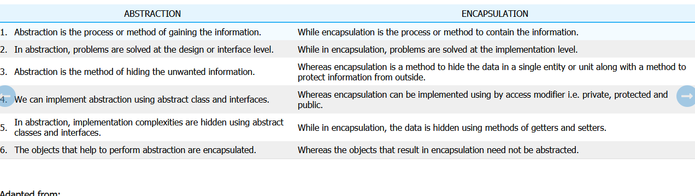

- A friend function is a friend of a class that is allowed to access to Public, private, or protected data in that same class. If the function is defined outside the class cannot access such information.

A friend can be declared anywhere in the class declaration, and it cannot be affected by access control keywords like private, public, or protected.

- Static linking is the process of copying all library modules used in the program into the final executable image. In contrast, dynamic linking is the process of loading the external shared libraries into the program and then binds those shared libraries dynamically to the program
- A random access file is a file where you can "jump" to anywhere within it without having to read sequentially until the position you are interested in.

For example, say you have a 1MB file, and you are interested in 5 bytes that start after 100k of data. A random access file will allow you to "jump" to the 100k-th position in one operation. A non-random access file will require you to read 100k bytes first, and only then read the data you're interested in.
Today almost all files are randomly accessed
  
#### Keywords
---
#### Questions
1. What is Object oriented paradigm ?
2. What is data abstraction ? How do you do it ? Examples in c++ ? What are benefits ?
3. What is encapsulation ? Example ?
4. What is inheritance ?
5. What is polymorphism ?
6. What is 
7. What are the ways to define a constant in C++ ? 
8. What is a constructor and Destructor ? Give example c++ ?
9. What are exceptions ? How to handle them in c++ ? How to derive new exceptions in c++ code from exception class ?
10. What is the standard library for reading file in c++ ?
11. Data types for that lib and what do they mean ?
12. In how many modes can you open a file and their function ?
13. How do you read from a file and write to a file c++ ?
14. What are file position pointers ? What methods do they have to control them ?
15. What is the difference between seekg and seekp?
16. What are the additional attributes that can be used with seekg and seekp ?
17. What is the difference between Tellg () and Tellp () functions?
18. What is a Friend function ? example c++ ?
19. Where is friend function specified ?
20. How to specify a whole class as friend ?
21. What things does the derived class not inherit ? List em ?
22. What are the types of inheritance ?
23. What are inline functions and how does compiler place them when they are called ? Recompiling issue ?
24. Difference between abstract class and abstraction ?
25. What are abstract classes and interfaces ?
26. What are abstract classes used for ?
27. How are interfaces made ?
28. What happens if you do not override a pure virtual function in a derived class ?
29. Diff between abstract and concrete class ?
30. How do you make a pure virtual function ?
31. What is function overloading ?
32. What are static memeber or variables ? DO they have access to this ? Properties of Static Method ?
33. How many parts can C++ standard library be divided into ?
34. What is polymorphisms ? How does it work ? Example ?
35. Abstraction vs Encapsulation
36. What is  ternary operator?
37. What are the different types of arguments?by value or reference ? Example ?`https://career.guru99.com/top-50-oops-interview-questions/`
38.  What is static or dynamic binding ? In context of overloading and overriding ?
39.  What is the difference between new and override?
40.  What are the various types of constructors?
41.  What is early and late Binding? 
42.  What is the difference between structure and a class?
43.  What are all the operators that cannot be overloaded?
44.  
---

## : Operating Systems

 Book:`Operating System 8th Edition Silberschatz`
#### Main Notes
   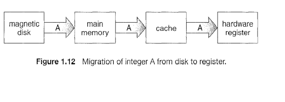
   - **Process Components**


   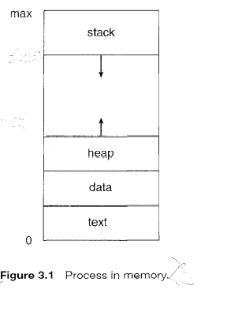

   - **Process control block**


   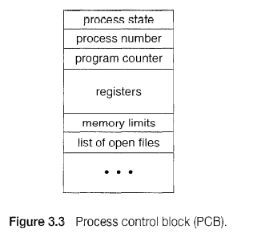

   - **Process Queue** 

   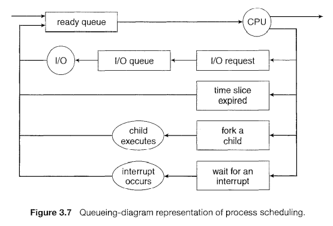


   - **Medium Term Scheduler** 

   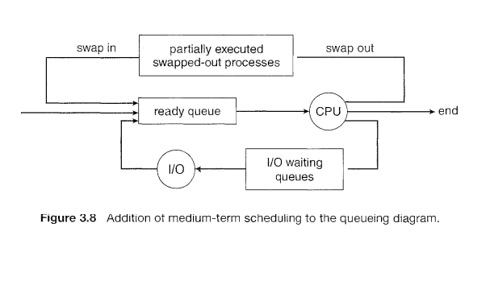


   - **Sub Process** 

   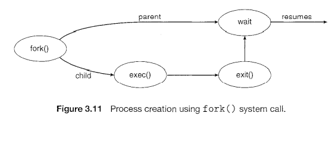


   - **Processing of a user program** 

   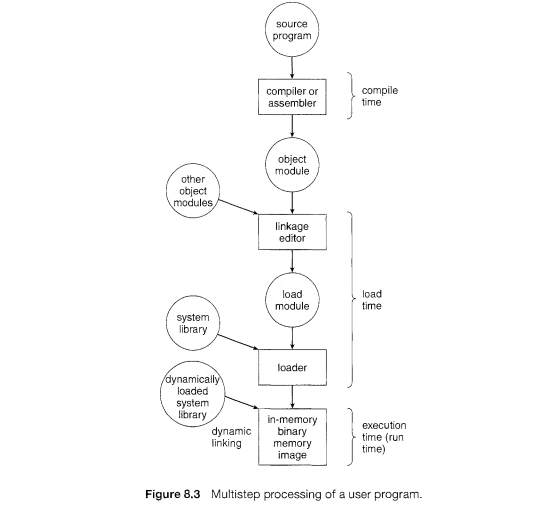
---
#### Keywords
---
#### Questions
1.  Draw structure of Operating System components ? Their purpose ?`22`
2.  What is a bootstrap program or firmware ?`26`
3.  What is interrupt ? Difference between interrupt by hardware and software ?
4.  How are hardware and software interrupt called ?
5.  What happens when cpu is interrupted ?
6.  What is system call or monitor call ?
7.  What is random access memory ?`27`
8.  What is a typical instruction execution cycle ? For von neumann architecture ?
9.  volatile vs non volatile storage ?`29`
10. Difference between symmetric and asymmetric processing ?
11. What are clustered systems ? Difference between clustered vs Multi processing systems ?`30`
12. Symmetric vs asymmetric clustering ?
13. Parallelization ?
14. Parallel clusters ?
15. What is distributed lock manager ?`31`
16. Storage area networks ?`32`
17. Multiprogramming ?
18. Job pools ? Where ARE jobs kepts ? Why  ? Job execution cycle ?`33`
19. What up happen to job in a non multiprogrammed system ?
20. What is time sharing(Multi tasking ) ?
21. What is a process ?`34`
22. Swapping  ?
23. What is advantage of virtual memory with respect to actual memory ?`34`
24. Are modern systems interrupt driven ?
25. What is a trap ?`35`
26. How do we differentiate between user defined code and operating system code ?`35`
27. What is mode bit ? Which kernel or user ?`35`
28. What are privileged instructions ?`36`
29. Can they be executed in user mode ?
30. What is the use of timer in cpu ?`37`
31. What is a program counter ?``
32. Does single threaded and multithreaded program have one program counter ?`37`
33. Responsibilities of OS in process management ?`38`
34. What is caching ?`41`
35. What is cache coherency in multiprocessors ?`42`
36. Distributed system ? `45`
37. Network ?
38. Network operating system ?`45`
39. Types of computing enviroments ?
40. Client server computing ?`49`
41. Type of client server system ?
42. Computer serversystem 
43. file server system ? Example ?
44. Peer to peer server system ? example ?
45. How does node determine what services are available in peer to peer ?`50`
46. Web based computing ?
47. What are load balancers ?
48. What are system calls ?`69`
49. Types of system calls ?
50. Models of interprocess communication ?`79`
51. System programs or system utilities ?`81`
52. System programs vs application programs ?
53. Mechanism vs policy ?`82`
54. Layered approach in system structure ? Its advantage ?`86`
55. What is a kernel  and a microkernel ? Advantage of micro kernel to kernel ?`87`
56. What is a virtual Machine ?Advantage`91`?
57. Process components ? Name them ?`116`
58. What are the states of a process ?`117`
59. What is Process control Block or task control block ? What information does it contain ?`118`
60. Ready queue `120`
61. What is device queue ? Which process are kept in it ?`121`
62. What is a Sceduler ? Long term or job scheduler ? Short term or CPU scheduler ?`122`
63. Major difference in cpu and job scheduler ?
64. What happens when degree of multi programming is stable ? Who controls this degree ?
65. Types of process ? I/O bound or cpu bound ?`123`
66. What is medium scheduler ? How is it different from short and long term ?`123`
67. What happens to cpu when an interrupt is called ?`124`
68. What is content switching ?`124`
69. When a process creates a new process, what two possibilities exist in terms of execution ?`126`
70. How does subprocess is created and communitate ? Procedure ?`126`
71. What system call is called when process is finished ?`129`
72. What is cascading termination ?`130`
73. What functions do process use to communicate ? Synchronous and Asynchronous Messaging ?`136`
74. What is cooperative and Pre emptive scheduling ?Who uses non pre emptive sched ?`200`
75. What is the dispatcher ?What is dispatch latence ?`201`
76. What criterias are mostly used for scheduling algorithms ?`201`
77. FCFS scheduling ? Its Negatives ?Is it pre emptive ?`202`
78. Why non preemptive scheduling is disastrous for priority?
79. How to calculate Average waiting time ?`Mathematical`
80. What is round robin scheduling how does it work ?`208`
81. What is processor sharing in Round robin ?
82. What is Multi level Queue scheduling ?What are some of the Levels in the This queue ? What are foreground and background processes ? Is it preemptive ?`210`
83. How are processes divided into different queues in multilevel ?
84. What is Multilevel feedback queue ? Difference between multi   multi feedback ?`212`
85. What processes are left in high priority queue  in feedback?
86. What is processor affinity ?`216`
87. What is a critical section ?`241`
88. What are the approachs to solve critical section problem ?``
89. What a preemptive and non preemptive kernels ?`242`
90. Why, then, would anyone favor a preemptive kernel over a nonpreemptive one?
91. What are semaphores ?
92. What a mutex locks ? spinlock  ?Adaptive mutex? `web`
93.   ?
94. What is priority inversion ?Solutions ?`253`
95. What is priority inheritance protocol ?
96. Bounded buffer problem ? Solution ? Reader writer problem ? Solution ?
97. Reader write lock solution ?`256`
98. Table philosopher problem ? solutions `258` ?
99.  Volatile non volatile and stable storage ?`274`
100. What are deadlocks ? soltuions to resolve them ?`web`
101. what are the 4 conditions for deadlocks to arise ?`299`
102. Resource allocation graph  ? Get visual for understanding deadlock situations?`301`
103. Cycles and Deadlock ? `302`
104. Three methods to handle deadlock ?`304`
105. Deadlock prevention ? What it effects ? Solutions fo Mutual Exclusion , Hold and wait , No preemption ,Circular wait ?`305`
106. Solutions for Hold and wait ? 2nd ones disadvantages ?
107. Deadlock Avoidance algorithns  ?`311`
108. Resource-Allocation-Graph Algorithm ,Bankers algorithm ,
109. Deadlock detection algorithms ?`web`
110. Deadlock recovery methods ?`318`
111. Ways of Binding Process ?`332`
112. Logical address(virtual address) ? Physical Address ?`333`
113. Dynamic Loading ?`335`
114. What is dynamic Linking ? example ?`335`
115. How is dynamic loading different from dynamic linking ?`336`
116. What is Contiguous memory allocation ?`338`
117. General dynamic memory allocation problem solutions ?`340`
118. Fragmentation internal and external ? Compaction ?`341`
119. Memory management techniques?`https://www.geeksforgeeks.orgpartition-allocation-methods-in-memory-management/`
120. What is 50 percent rule in fragmentation ?`341`
121. What is paging ?`342`What does it avoid ?
122. What is a translation look aside buffer(TLB) ? TLB Miss ?`347`
123. Paging ? Segmentation ? Paging vs segmentation ?
124. What is re-entrant code or Pure code ?`350`
125. What is virtual memory ?Advantage ?`371`
126.  What is demand paging ?`375`
127.  Purpose of valid invalid bit ?`376`
128.  But what happens if the process tries to access a page that was not brought into memory? `377`
129.  What is Page fault ?
130.  Pure demand paging ?`378`
131.  What is zero fill on demand ?`383`
132.  What is page replacement ?`384`
133.  Page replacement algorithms ?`387`
134.  FIFO replacement , LRU replacement ?
135.  What are page buffering algorithms ?`395`
136.  Difference between global frame allocation algos and local allocation algos ?`398`
137.  What is thrashing ?`400`
138.  Strategies for managing free memory for kernel processes ?`411`
139.  What are the registers in I/O Port ?`572` Their definitions what they do ?
140.  What are file access methods ? How do they work ? Advantages ?`445`
141.  


#### Links:
- overall Link: https://www.geeksforgeeks.org/operating-systems/?ref=lbp#ss
- Types of Operating System: https://www.geeksforgeeks.org/types-of-operating-systems/?ref=lbp
- For how operating sytem starts and UEFI vs BIOS : https://www.geeksforgeeks.org/uefiunified-extensible-firmware-interface-and-how-is-it-different-from-bios/
- symmetric and asymmetric multiprocessing: https://www.geeksforgeeks.org/difference-between-asymmetric-and-symmetric-multiprocessing/?ref=gcse
- 
- Difference between buffer and cache: https://www.geeksforgeeks.org/difference-between-buffer-and-cache/
- Multiple Difference questions: https://www.geeksforgeeks.org/process-table-and-process-control-block-pcb/
- **Interrupt Latency** : Interrupt latency, also called interrupt response time, is the length of time that it takes for a computer interrupt to be acted on after it has been generated. In most computers, a trade-off exists among interrupt latency, throughput, and processor utilization.
- calculate average waiting time in RR: https://www.youtube.com/watch?v=sl9xcJ3rsHg
- Deadlock Detection for Single instance wait for grpah: https://www.youtube.com/watch?v=2-7JGoy52Qo
- Bankers algorithm execution: https://www.youtube.com/watch?v=bYFVbzLLxfY
- **Difference between Deadlock, Starvation, and Livelock:**
A livelock is similar to a deadlock, except that the states of the processes involved in the livelock constantly change with regard to one another, none progressing. Livelock is a special case of resource starvation; the general definition only states that a specific process is not progressing.
- Starvation is a problem which is closely related to both, Livelock and Deadlock. In a dynamic system, requests for resources keep on happening. Thereby, some policy is needed to make a decision about who gets the resource when. This process, being reasonable, may lead to a some processes never getting serviced even though they are not deadlocked.
- Resource Allocation Graph single and multi-instance: https://www.geeksforgeeks.org/resource-allocation-graph-rag-in-operating-system/
- Deadlock in Distributed system: https://www.geeksforgeeks.org/deadlock-detection-in-distributed-systems/
- Spooling vs Buffering: https://www.geeksforgeeks.org/difference-between-spooling-and-buffering/
- Important : How address is converted and other stuff: https://www.geeksforgeeks.org/memory-allocation-techniques-mapping-virtual-addresses-to-physical-addresses/
- A **page fault** is an interruption that occurs when a software program attempts to access a memory block not currently stored in the system's RAM. This exception tells the operating system to find the block in virtual memory so it can be sent from a device's storage (SSD or HD) to RAM.
- Steps When page fault occurs and Virtual Memory: https://www.geeksforgeeks.org/virtual-memory-in-operating-system/
- **Memory Interleaving** is designed to compensate for the relatively slow speed of dynamic random-access memory (DRAM) or core memory by spreading memory addresses evenly across memory banks.
- **A translation lookaside buffer (TLB)** is a memory cache that stores the recent translations of virtual memory to physical memory. It is used to reduce the time taken to access a user memory location. It can be called an address-translation cache. It is a part of the chip's memory-management unit (MMU).
- How to handle thrashing look last: https://www.geeksforgeeks.org/techniques-to-handle-thrashing/
- Dynamic loading vs static loading and dynamic linking vs static linking: https://www.tutorialspoint.com/operating_system/os_memory_management.html
- SImple vs virtual paging: In simple paging, all the pages of a process must be in main memory for process to run, unless overlays are used.

But in virtual memory, not all pages of a process need be in main memory frames for the process to run. Pages may be read in as needed
- **Demand paging** is a process by which the operating system loads or copies a disk page into the physical memory, if an attempt to access the page is made and the page is not already present in the physical memory.

STEPS:

    Attempt to access the page 
    If the page is present in memory, process instructions 
    If the page is not, then a page-fault trap occurs
    Check if the memory reference is a valid reference to a location on secondary memory. If not, the process is terminated (illegal memory access). Otherwise, we have to page in the required page.
    Schedule disk operation to read the desired page into main memory.
    Restart the operation that was interrupted

- Page replacement algorithms: https://www.geeksforgeeks.org/page-replacement-algorithms-in-operating-systems/

## Software Engineering 
 Book:`Roger S. Pressman_ Bruce R. Maxin - Software Engineering_ A Practitioner’s Approach-McGraw-Hill Education (2014)`
#### Main Notes
- essence of software engineering practice: 
 1. Understand the problem (communication and analysis). 
 2. Plan a solution (modeling and software design). 
 3. Carry out the plan (code generation). 
 4. Examine the result for accuracy (testing and quality assurance). 


   - **Flows** 

   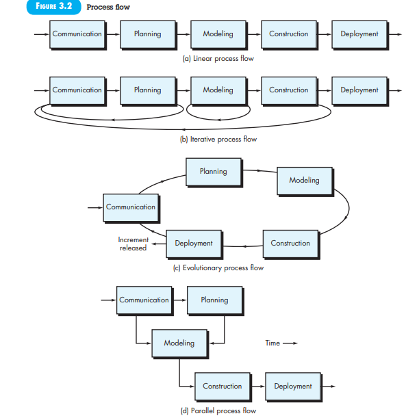


   - **Increment Modal** 

   


---
#### Keywords
**Definitions**

- **Desk checking** is an informal non-computerized or manual process for verifying the programming and logic of an algorithm before the program is launched. A desk check helps programmers to find bugs and errors which would prevent the application from functioning properly.
- 
- **Very good notes on Major topics**:https://ecomputernotes.com/software-engineering/principles-of-software-design-and-concepts
- Process Models: https://www.geeksforgeeks.org/software-engineering-iterative-waterfall-model
- ERD: https://www.youtube.com/watch?v=QpdhBUYk7Kk
- ER MODEL VS Relational MODEL:
- UML: https://www.youtube.com/watch?v=UI6lqHOVHic&list=PLUoebdZqEHTwbYD8oo6Wr81Xb7uCAh_oz
- Requirements Engineering Process: https://www.geeksforgeeks.org/software-engineering-requirements-engineering-process/?ref=gcse
- Elicitation techniques: https://www.softwaretestinghelp.com/requirements-elicitation-techniques/#7_Observation
- Requirement verification and validation(Check bottom): https://www.geeksforgeeks.org/software-engineering-verification-and-validation/?ref=gcse
- Functional vs Non Functional Requirements: https://www.geeksforgeeks.org/functional-vs-non-functional-requirements/?ref=leftbar-rightbar
- Coupling and Cohesion: https://www.geeksforgeeks.org/software-engineering-coupling-and-cohesion/?ref=lbp 
- Should know few Steps of Design activitiy: Such as Modularization, Abstraction, Data hiding, Cohesion and coupling,Refactoring. check book or website `296`
- Software Evolution: https://www.geeksforgeeks.org/software-engineering-software-evolution/?ref=gcse
- Software Testing and Onward: https://www.geeksforgeeks.org/software-testing-basics/?ref=gcse
- Architectural Design for Web Apps  `304`
- SQA goals and measures: https://www.geeksforgeeks.org/goals-and-measures-of-software-quality-assurance/?ref=rp
- SQL Activities: https://www.geeksforgeeks.org/software-engineering-software-quality-assurance/?ref=gcse
- Differences between Quality Assurance and Quality Control: https://www.geeksforgeeks.org/differences-between-quality-assurance-and-quality-control/?ref=rp
- Architectural designs: https://www.geeksforgeeks.org/software-engineering-architectural-design/?ref=lbp
- Aspect oriented Programming: https://www.differencebetween.com/difference-between-aop-and-vs-oop/
- Design Concepts: http://computationalsciencewithsuman.blogspot.com/p/introduction-fundamental-design-concepts.html
- Software Project Management: https://www.geeksforgeeks.org/software-engineering-software-project-management-spm/?ref=gcse
- Project Management Process: https://www.geeksforgeeks.org/software-engineering-project-management-process/?ref=lbp
- Difference between Project Management and Process Management: https://www.geeksforgeeks.org/difference-between-project-management-and-process-management/?ref=gcse


#### Cohesion is an indication of the relative functional strength of a module. 
is a natural extension of the information-hiding concept described in Section 12.3.6. A cohesive module performs a single task, requiring little interaction with other components in other parts of a program. Stated simply, a cohesive module should (ideally) do just one thing. Although you should always strive for high cohesion (i.e., single-mindedness)

---
#### Questions
1. What does a generic process framework for software engineering encompass in activities ?How many steps ?`48`
2. What are umberalla activities ? Name them explain ?`49`
3. Seven principles on Software Eng that david hooker gave ? `52`
4. What is a software process? 
5. What are the generic framework activities that are present in every software process? 
6. How are processes modeled and what are process patterns? 
7. What are the prescriptive process models and what are their strengths and weaknesses? 
8. Why is agility a watchword in modern software engineering work? 
9. What is agile software development and how does it differ from more traditional process models?
10. What is a process pattern and its types ?`66`
11. What is a prescriptive model ?`72` good in which situations and bad in which ?
12. What is water fall modal ? How is it good ? Its other name ? What are its main drawbacks ?`73`
13. What is blocking state in water fall ?
14. What processes do incremental modals combine ?`75`
15. What are evolutionary process modals ? evolutionary processes ?`76`
16. Prototyping in evolutionary ? Problems with prototyping modal ?`77`
17. What is concurrent modeling on general framework activities ?Example `81`
18. Main problems with evolutionary models ?`83`
19. What is component based development ?`84`
20. What are formal methods ? Problems that formal methods remove ?
21. What is aspect oriented software programming ?`85`
22. what are cross cutting concerns ?
23. What is a unified process ?Phases of unified process ?`87`
24. Define the different phases?
25. What is the personal software process ?its activities?`90`
26. Why PSP is not highly used in industry ?
27. What is agility ?
28. What is agile process ?``
29. Crucial element of agile prcoess ?`101`
30. What are some agility principles ?
31. What is extreme programming ?`103`
32. What is project velocity ?`104`
33. What is a spike solution ?
34. What is pair programming ?`106`
35. Industrial Extreme Programming and its principles ?`106`
36. What is Scrum appraoch ? Its components ?`110`
37. DSDM ? Dynamic System Development model ?`111`
38. Iterative cycles of DSDM ?`111`
39. Agile unified process ?`113`
40. Requirement engineering ?`163`
41. What are the tasks in requirement engineering ?`164`
42. What is the purpose of quality attributes and what are they ?`261`
43. Fundamental Design Concepts ?`263`
44. Difference between coupling and cohesion ?`268`
45. WHat are architectural design elements ?`276`
46. What are some of the architectural styles ?`289`
47. Check architectural design chapter last part :::
48. Concerns associated with software quality ?`481`
49. Goal of for SQA ?`485`
50.  What is verification and validation ?`499`
51.  General software testing strategies ?`504`
52. Testing strategies for OOP ?`512`
53. What alpha,beta,customer acceptance test ?`516`
54. Classic System testing ?`517`
55. What are the 4 p,s spectrums of management ?`716` 
56. 
57.   
---


## Digital Image Processing: 
 Book:`Digital.Image.Processing.4th.Edition.pdf`
 https://www.globalguideline.com/interview_questions/Questions.php?sc=Image_Processing_Expert
#### Main Notes
- Linear filtering is the filtering method in which the value of output pixel is linear combinations of the neighbouring input pixels. it can be done with convolution.For examples, mean/average filters or Gaussian filtering.
- A non-linear filtering is one that cannot be done with convolution or Fourier multiplication. A sliding median filter is a simple example of a non-linear filter. 
---
#### Keywords
- scaling, translation, rotation, and shearing
---
#### Questions
1. What is spatial resolution ?`73`
2. Intensity Resolution ?`74`
3. Effect of reducing spatial resolution ?
4. False contouring ?`76`
5. Interpolation ? How ? Sizing how is it done ?`79`
6. MEthods to do interpolation ?``
7. What is image subtraction ? Used for ?`90`
8. What is image multiplication and division used for ?`92`
9. What are spatial operations ? Types and their definitions and uses ?`101`
10. What are rubber sheet transformation ? Used for ?`103`
11. Image registration ?`105` Uses ?
12. What are some of the basic Intensity transformation techniques ?`124`
13. Image negatives ?Uses ? How is it done ?
14. Piece wise linear transformation method ? 
15. What is contrast streching and Intensity level slicing  ? Uses ?`131`
16. What are histograms ? What is Histogram processing ?`135`
17. Histogram equalization , Histogram Matching ?`142`
18. Image sampling and Quantization ?
19. How is digital image produced ? Process ?`66`
20.  Image Sensing and Acquisition ?
21.  Basic Image filtering ? Smoothning , Sharpening ?
22.  WHat are the principal source of noise in images ?`320`
23.  Types of Noise ? How to remove them ?
24.  Gausian noise ,Rayleigh noise , Erlang Noise, Exponential noise, Uniform noise ,Salt and Pepper noise ?
25.  How to remove these noises ? WHich filter methods ?
26. Linear vs Non linear filtering ?
27. Adaptive filters ?
28. What are the different color models ? How to inter convert them ? Advantages  and uses of one color model over the other ?
29. What is intensity slicing and color coding ?
30. Color segmentation, Color edge detection , Color image compression, Noise reduction in Color images ?
31. What is morphological Process ?
32. Erosion, Dilation ,Hit or miss transform ,Opening, closing, skeletionization,Thinning? Uses ? How its done and Examples ?
33. Morphological Algorithms ?
34. Pruning ?
35. Grayscale morphology ? graysca; erosion and dilation
36. Page 677 for most morphological operations
37. 
38. 
---

## DataBase: 
Book:`Silberschatz_A_databases_6th_ed.pdf`
 
#### Main Notes
  - **Database Symbols** 

   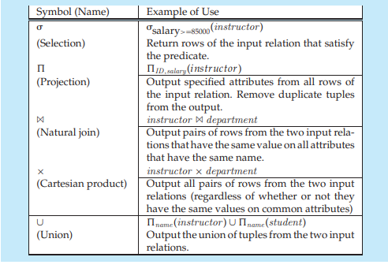
---
#### Keywords
- ER Diagrams: https://www.youtube.com/watch?v=F_xDqBa5w-s
- Number of pOssible superkeys: https://www.geeksforgeeks.org/number-of-possible-superkeys-in-dbms/
- Find Candidate keys and prime attributes: https://www.youtube.com/watch?v=L0LEtrIDYrE
- Better way to find candidate keys watch both: https://www.geeksforgeeks.org/finding-attribute-closure-and-candidate-keys-using-functional-dependencies/
- find number of superkeys: https://www.youtube.com/watch?v=sihST6iDHco
- Domain, key and relational constraint: https://www.geeksforgeeks.org/relational-model-in-dbms/
- 2nf conversion watch subsequent : https://www.youtube.com/watch?v=O16btnzfuYU
- Highest normal form of any relation: https://www.youtube.com/watch?v=nSnaGLtwgMc
- DEcompositions: https://www.youtube.com/watch?v=h_Va-DLQnBQ
- Good examp of natural join: https://www.youtube.com/watch?v=zb8ESEf36Zc 
- Query optimization: https://www.tutorialspoint.com/distributed_dbms/distributed_dbms_query_optimization_centralized_systems.htm
---
#### Questions
1. What are diff data abstraction levels ?`33`
2. Instance and schema ?types of schema ?`35`
3. Physical Data independence , Logical .Difference between them ?
4. Different types of data models ?`36`
5. DML and types of DML ?`37`
6. Data stored in DB must verify which constraints ?``
7. What is mapping cardinalities ?`45 or 296`
8. What is normalization ?``
9. What is a storage manager and its purpose and components ?`48`
10. Query processor components ?
11. What is atomicity ,consistancy, durability ? Transaction ?
12. What does transaction manager consist of ?`50`
13. What is data mining ?`52`
14. What is a super key, candidate key, primary key,foreign ? Examples ?`72`
15.  What is referncial integrity constraint ? `https://www.ibm.com/docs/en/informix-servers/14.10?topic=integrity-referential`
16.  All joins , Cartisan product,Union ,intersection,except, Set difference ?
17.  What problem do Null values present ?`110`
18.  All aggregate functions ?
19.  What is integrity constraint ?`155`
20.  What is an assertion ?`162`
21.  What is aan index? How to create , uses ?
22.  Participation constraint ?`297`
23.  Weat entity set, strong entity set `307`
24.  Specilization ? type of specilization and how depicted in ER diagrams?`323`
25.  What is top down process and bottom up ? Differences , advantages ?
26.  Generalization ?`324`
27.  Constraints on generalization ?`326`
28.  aggregation in ER diagram ?
29.  UML and their types ?`335`
30.  Query optimization ?`338`
31.  Temporal change in data ?`345`
32.  Decompositions and its types ? and normal forms ?`354`
33.  Functional dependeny theory ?armstrong axioms ?`365`
34.  Extraneous attribute ?
35.  Dependency preservation ?
36.  Comparison of BCNF and 3NF ?
37.  Cross site scripting , XSRF, SQL injection ?
38.  Functional Dependencies in DB ?
39.  QUery concurrency ?
40.  
---
## Computer and Networks: 
 
#### Main Notes
  - **Communication Model** 

   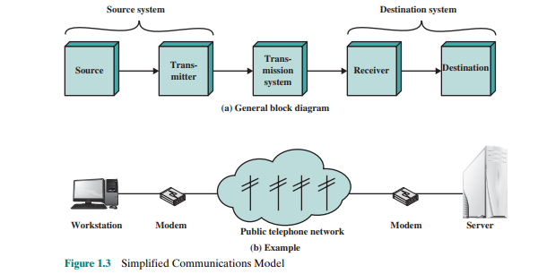
---
#### Keywords
- Topology
- OSI 7 Layers: APS men TNd karwa kr DP li
- Bit Stuffing : https://www.geeksforgeeks.org/framing-in-data-link-layer/
- Process of finding domain name from ip
- How is mail transfered from one user to another
- **DNS cache poisoning** is the act of entering false information into a DNS cache, so that DNS queries return an incorrect response and users are directed to the wrong websites. DNS cache poisoning is also known as 'DNS spoofing.
- how Http sends file: https://www.geeksforgeeks.org/http-non-persistent-persistent-connection/
- how  ftp works: https://www.geeksforgeeks.org/file-transfer-protocol-ftp-in-application-layer/
- how dhcp works:https://www.youtube.com/watch?v=RUZohsAxPxQ
- supernetting: https://www.youtube.com/watch?v=MnqP_TVwkbs, smaller supernetting example: https://www.youtube.com/watch?v=QqEcCzhlWis
- use this channel for all types of conversions of number systems: https://www.youtube.com/watch?v=rsxT4FfRBaM
- add subtract binary: https://www.youtube.com/watch?v=C5EkxfNEMjE&t=209s
- IP version 6 Header Format : VP Flow mein he  with PN in Hand.SaD Example: 128 bits
- ICMP packet: TCC ED
- 
---
#### Questions
1. Basic Communication model ?
2. Types of Network ? `47`
3. What is circuit switching and packet switching ? Diff ?
4. What are the 3 phases of circuit switching ?`297`
5.  Explain the difference between datagram and virtual circuit operation.
6. Types of circuit switching ? Space divison, Time divison ?
7. What is the significance of packet size in a packet-switching network?
8. Time Multiplexed switching ?
9. Frame relay , ATM ?`48`
10. How does internet work ?`50`
11. Key features of a protocol ?`58`
12. Network access layer, application layer,transport layer ?`59`
13. How data travels from each layer from one computer to another ?`60`
14. Heirarchy of layers in TCP/IP architecture ?`63`
15. What is TCP and UDP ? USES? How do they work ?
16. IP and IPv6 ? Differences ? Why IPv6 is needed ?
17. Confirmed and non confirmed service how do they work ?`72` Net
18. What is multiplexing - demultiplexer? How is it done ? Types of multiplexing ?`https://www.globalknowledge.com/us-en/resources/resource-library/articles/what-is-multiplexing/#gref`
19. Difference between packet switching system and Multiplexing systems ?
20. What are types of Multiplexing ?Types of it?`https://www.youtube.com/watch?v=fIZhDl35_XY`
21. TDM and FDM ? What type of signals do they use ?
22. Limitations of TDM and FDM ? Advantages of TDM and FDM?
23. why TDM can be inefficient when diff users have different priorities ? 
24. What is pulse stuffing ?
25. What is intermodulation distortion ?
26. What is echo cancellation ?
27. Upward Multiplexing and Downward multiplexing ?
28. What is flow control ?`238` Transmission time, propogation time ?
29. Types of flow control : Stop and wait flow control, How it works?`239`
30. Sliding window control,Piggybacking ?
31. What is Error control ?`245` What is ARQ and types of ARQ ?
32.  What is the advantage of sliding-window flow control compared to stop-and-wait flow control?
33. What was some error checking methods ?
34. Parity bit ? How its done ?Example
35. Two dimensional Parity bit ? How is done ? example ?
36. What is internet checksum ?How to perform ones complement operations? Both addition and multiplication `217`
37. What is cyclic redundancy check ? How its done ?
38. What is datagram lifetime its purpose ?`461`
39. IP vs IPv6 ?`475`
40. Give some reasons for using fragmentation and reassembly?
41.  How is the IPv4 header checksum calculated?
42.  What is the difference between the Traffic class and Flow Label fields in the IPv6 header?
43.  Briefly explain the three types of IPv6 addresse
44.  Convert IPv4 to binary and back ?`https://www.transtutors.com/questions/change-the-following-ipv4-addresses-from-binary-notation-to-dotted-decimal-notation--650742.html`
45.  What the ways to cope with overflow in flow control ?`496`
46.  Purpose of connection establishment ?`500`
47.  What is the 2 way handshake problem ? Resolution ?
48.  How to check sequence of packets in TCP and calculate ?
49.  What handshake tcp users ?
50.  How is connection established and terminated in TCP Process ?
51.  Acceptance policy in TCP ?`517`
52.  Retransmission strategies in TCP ?`518`
53.  Acknowledge policy in TCP ?`519`
54.  Check review questions `521`
55.  Key strategies for routing ?`620`
56. Properties of flooding in routing ?`622`
57. Principle conditions for adaptive routing ?
58. What are the approaches to routing ?`634`
59. IRP vs ERP ?
60. What is the purpose og BGP and Its functions ?`635`
61. How is connection established in BGP and information exchanged ?
62. Comparison between djskitra algo and bell man ford ?`649`
63. What are the various congestion control techniques ?`661`
64. Backpressure,Choke packet ,implicit congestion signaling ,Explicit congestion signaling ?   
65.  Explicit congestion signaling catogeries ?`663`
66.  What is ATM ?its use ?`317`
67.  What is CLP  Cell loss priority ?`322`
68.  frame relay vs ATMS ?`https://www.techtarget.com/searchnetworking/definition/frame-relay`
69.  HEC ?
70.  What are Hubs their purpose and example ?
71.  What are bridges their purpose and example ?
72.  What are switches their purpose and example ?
73.  What is network topology ?
74.  What is the difference between a store-and-forward switch and a cut-through switch?
75.   
76.  
---

## Web Engineering & Technologies 
 
#### Main Notes
-  **Properties For Website Modeling**
  -  web applications from three orthogonal perspectives (levels of modeling): web navigation,
web content and web behavior
   - **Web Navigation**
     - **Static navigation properties**:It addresses the checking of properties such as broken links, reachability
(e.g., return to the home page), consistency of frame structure, and other features related
to estimating the cost of navigation, such as longest path analysis.
     - **Dynamic navigation properties**: This analysis focuses on aspects that make the navigation
dynamic. That is, the same link may lead to different pages depending on given inputs.

     - **Interaction navigation properties**: This analysis focuses on properties that are related to
user navigation that happens outside the control of the web application, such as user
interaction with the browser. This includes features such as use of the back or forward
buttons.
   - **Web Content**
     - **Static content properties**: Consistency of the original web page content with respect to
syntax and semantics. Two properties are explored in this category, completeness/
     - **Dynamic content properties**: Consistency of the syntax and semantics of dynamic content.
This analysis requires the ability to check the dynamically generated content that results
from the execution of script code 
   - **Web Behavior**
     - **Security properties**: This issue is related to access control mechanisms that are employed
on the web content or web links. This issue could also be employed on the back-end, as
the database may contain data reserved to specific users. Non-authorized users must not
be able to access such data. These properties are also tied to session control mechanisms.
     - **Instruction processing properties**: These issues include both server and client side
execution. We define client-side execution as any process changing the state of the
application without communication with the web server. 


- Major Modeling Techniques:
- **Presentation Modeling**
  - **Objectives**:
    - Designing the structure and behavior of the user interface to ensure that interaction
    with the Web application is simple and self-explanatory
    - Communication and representation task of the Web application are taken into account
    - Results: a uniform presentation concept by modeling recurring elements on the pages, e.g.,
    headers and footers. It should ideally show the composition of each page and the
    design of the fields, texts, images, forms, etc., included in these pages.
    - describtiion of the behavior-oriented aspects of the user interface, e.g., which
    button to click to activate a function of the application logic.
    - Give users appropriate orientation help on the presentation level
     due to the wide variety of navigation options and the inherent risk of getting lost
    - Can be achieved, e.g., by displaying the current navigation path, or pages visited
    during the active session
    - Model elements are described on three hierarchical levels:
      - **Presentation page**: a page presented to the user as a
  visualization unit. It can be composed of different presentation
  units.
      - **Presentation unit**: serves to group related user interface
  elements, representing a logical fragment of the page. It
  presents a node stemming from the hypertext model.
      - **Presentation element**: basic building block of the presentation
  model. Presentation elements represent a node’s set of
infor-mation and can include text, images, audio, etc.

- **Requirement Engineer/Types/Techniques**: https://citeseerx.ist.psu.edu/viewdoc/download?doi=10.1.1.72.911&rep=rep1&type=pdf
---
#### Keywords
---
#### Questions
1. Component of Web architecture ?
2. classification of Web architecture ?
3. Web Application layered architecture ?`https://www.altexsoft.com/blog/engineering/web-application-architecture-how-the-web-works/`
4. web architecture: https://hackr.io/blog/web-application-architecture-definition-models-types-and-more
5. **Rss**: https://www.geeksforgeeks.org/introduction-to-rssrich-summary-site/?ref=gcse
6. XML: https://www.geeksforgeeks.org/xml-basics/?ref=gcse
7. Xml vs Html: https://www.geeksforgeeks.org/html-vs-xml/?ref=lbp
8. integration Architectures: https://www.techopedia.com/definition/30625/integration-architecture
9. Html vs Xhtml: https://www.geeksforgeeks.org/html-vs-xml/?ref=lbp
10. SVG: https://www.geeksforgeeks.org/difference-between-svg-and-html-5-canvas/?ref=gcse
11. URL vs URI: https://www.javatpoint.com/uri-vs-url
12. Web Services: https://www.geeksforgeeks.org/what-are-web-services/?ref=gcse
13. Web Deployment: https://umbraco.com/knowledge-base/deployment/
14. Web Promotion:
- **Newsletters** 
- **Affiliate Marketing** Affiliate marketing is the process by which an affiliate earns a commission for marketing another person's or company's products. The affiliate simply searches for a product they enjoy, then promotes that product and earns a piece of the profit from each sale they make.
- **Search Engine Marketing** Google Ads  
- **Content-related Marketing** Content marketing is a marketing strategy used to attract, engage, and retain an audience by creating and sharing relevant articles, videos, podcasts, and other media
- **Search Engine Optimization**
- Social Media Marketing Campaigns : Youtube and Facebook
- **Leverage Mobile Visits**: One of the objectives of developing web applications or web apps is to make it accessible from a mobile device.
15. Web Testing:
- **Link Testing**
- **Browser Testing** 
- **Usability Testing** : Usability testing refers to evaluating a product or service by testing it with representative users. Typically, during a test, participants will try to complete typical tasks while observers watch, listen and takes notes.
  - For example, if you are designing a website for a supermarket, and that website allows users to do their groceries online, the best way of testing your design is by having a user proceed through your product as you watch them trying to buy their groceries
- **Load, Stress** (Performance Testing):https://www.blazemeter.com/blog/performance-testing-vs-load-testing-vs-stress-testing
- **Testing Security** 
- **Test-driven Development** 
- **Continuous testing** (CT) is a software development process in which applications are tested continuously throughout the entire software development life cycle (SDLC). The goal of CT is to evaluate software quality across the SDLC, providing critical feedback earlier and enabling higher-quality and faster deliveries
  - The code is continuously developed, delivered, tested and deployed. For Example, whenever a developer checks the code in the Source Code Server like Jenkins automated set of unit tests are executed in the continuous process. If the tests fail, the build is rejected, and the developer is notified.
1.  Web application Performance: https://medium.com/expedia-group-tech/web-applications-analyzing-client-side-performance-37e9cc4ad86b
    1.  https://stackify.com/web-performance-monitoring-guide-developers/
2.  Web Security: https://www.geeksforgeeks.org/top-10-security-risks-in-web-applications/?ref=gcse
3.  
---

## Image Processing
- https://www.tutorialspoint.com/dip/gray_level_resolution.htm
- dimensions and size of an image: https://www.tutorialspoint.com/dip/pixel_resolution.htm
- Histogram Equations: https://www.youtube.com/watch?v=uqeOrtAzSyU
- Log and PowerLaw transformation: https://www.youtube.com/watch?v=jfoXoFoDb48
- Convolution: https://www.tutorialspoint.com/dip/concept_of_convolution.htm
- Application of various filters Blurring: https://www.youtube.com/watch?v=WlKAZeaE898
- Median filte rwith padding: https://www.youtube.com/watch?v=eJx3g-ZEfm4
- Sobel and PRewitt mask apply: https://www.youtube.com/watch?v=fhDBy-wV3ic
- Laplacian Filter: https://www.youtube.com/watch?v=zQKNVept4bU
- Erosion and Dilation: https://www.youtube.com/watch?v=2LAooUu1IjQ
- In dilation incase of numbers higher decimal is placed: 
- Opening and closing: https://www.youtube.com/watch?v=T8uWZXb92AU
- Just see problems: https://www.youtube.com/watch?v=eEXfxnZD3Ks
- Thickinging and thinning: https://www.youtube.com/watch?v=gwjcIMIf8lM
- 