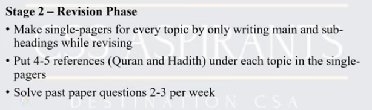
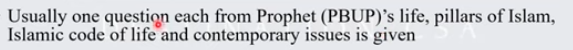

## Course

1. Introduction to Islam.
- Concept of Islam.
- Importance of Din in Human Life.
- Difference between Din and Religion.
- Distinctive Aspects of Islam.
- Islamic Beliefs & its Impact on Individual & Society and the Fundamental of Islam
- Islamic Worships: Spiritual, Moral and Social Impact.
2. Study of Sirah of the Prophet Muhammad (PBUH) as Role Model for:-
- Individual
- Diplomat
- Educator
- Military Strategist 
- Peace Maker
3. Human Rights & Status of Woman in Islam.
- Human Rights and Status of Woman in Islam
- Dignity of Men and Women
4. Islamic Civilization and Culture:
- Meanings and the Vital Elements
- Role of Civilization in Development of Human Personality and Community
- Characteristicts of Islamic Civilization (Tawhid, Self-purification, Dignity of Man, 
Equality, Social Justice, Moral Values, Tolerance, Rule of Law)
5. Islam and the World.
- Impact of Islamic Civilization on the West and Vice Versa
- The Role of Islam in the Modern World.
- Muslim World and the Contemporary Challenges.
- Rise of Extremism.
6. Public Administration and Governance in Islam
- Concept of Public Administration in Islam
- Quranic Guidance on Good Governance
- Concept of Governance and its Applications in the light of Qur’an, Sunnah and Fiqh.
- Governance Structure in Islam (Shura, Legislation, Sources of Islamic Law)
- Governance under Pious Khilafat
- Particular letters of Hazrat Umar (R.A) and Hazrat Ali (R.A) to different Authority.
- Responsibilities of Civil Servants
- System of Accountability(hisbah) in Islam
7. Islamic Code of Life.
- Salient Features of Islamic System, Social System, Political System, Economic 
System, Judicial System, Administrative System, 
- Procedure of Ijma and Ijtiha

- islamophobia manifestation dmensions , oic , pakistan or islamic world
- hajetul widha dimensions
- charter of madina dimensions compare with united nations charters
- 

## Books
Default: Understanding Psychology by Feldman

## Techniques
- Make Notes or bullet points into questions whenever possible 
- Cornell Note taking
- Write Notes in your own words instead of copy pasting 

## Sample Structure: 

### Section 1: 
#### Main Notes
#### Suggestion and Thoughts
#### Quranic Verses
---
#### Hadiths
#### Quotations
#### Keywords
#### Questions
---
#### Summary
---

## Note
- Video : https://www.youtube.com/watch?v=j5IeSJk88SM `Note: Review this video again.Especially on syllabus analysis.`
- Hadees Reference in Introduction bout thesis statement
- Suggestion in conclusion of Intro
- Write ayats without aehrab in arabic (Ultra scores)
- If you dont know specific reference write Al Quran 
- Must write poetry (Allama Iqbal is optimal for this)
- Quotations from Good scholars(Avoid Living scholars or recent dead)
- (All green Personalities for quotation: Reconstruction of Religion: Iqbal ,Shah wali ullah)
- Conclusions should have 8 to 12 lines. Shud have suggestions and Recommendations. Should contain analysis of what you have written.Positive or negative things.
- Keep your view moderate 
- Length of Question:At Least 6 Pages. Length of Question Matters.Never Write 1 page question 4
- First question and last questions that you attempt must be one that you know best.
- Choice of Question:  Avoid very easy questions.If you can .Like question on Namaz is easy.While on Public Administration are considered hard.
- People who attemp easy question are more likely to fail
- 
- Islamic Law must be expressed in precise and accurate wording. No ambiguity.
- 

(Economic,Tawheed,Hajj,Prophet of Peace and Safety)
Islamic economic financial 