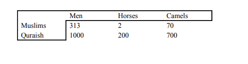
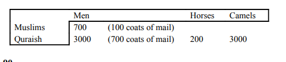

# Islamiat Notes
- Default Book: Mastering O Level Islamiat by Muhammad Bilal Aslam

## MNEMONICS (Check Islamiat.md for heading Points and check SEERAH)
- Beneficiaries of ZAKAT: `IMAMRGFF`(IMAM ragaf pronounce)
- Individual impacts of All IBADAH: `I SSSHADI at GC ORWPP` (Iqbals shadi at garrison cantt of rawalpindi Pakistan)
- Social impacts of All IBADAH:`TEST in MSC with [CR] and [CI]`
- Moral impacts of All IBADAH:`GD shb HID his C L with TARP`(GD shb HID his Choti L with TARP)
- Distinctive aspects of Islam:`NAME DSP CUF` (NAME DSP Chaudary Umer Farouq)
- Peace Maker & Diplomat:`I'M [AK] from [PK] taking DP with LAME HAT CHN`(I'M Akshe Kumar from Pakistan taking DP with LAME HAT CHaN)
- Educator: `QA of ZAB W PTV at EI`(Q/A of Zulfiqar Ali Bhutto With PTV at E-sector Islamabad)
- Seerat Individual: `F LOG out of CJ SHH account` (Fucking LOG out of Chief Justice Sindh Highcourt Harrapa's account)
- Human Rights: `CJ FH PASS TREE`(Chaudary Junaid From Hyderabad PASS TREE)
- Judicial System: `SJC ka IT dept RIP`(Supreme Judicial Council ka IT dept Rest In Peace)
- Economic System: `SJ F M H Z HOPE` ( Shahrukh Jatoi's Fucking Money Hurt Zahra,s HOPE)

## Bethane ki strategy(In general Ideas):
- Like Justice in Tawheed: Say Justice is attribute of Allah hence it is so and so ...

## Main Notes

## General Questions
### Life of Prophet PBUH
1. What was the reason  for rise of makkah inspite of terrible location ?
2. What was the sacriligious wars between kinana-quresh and hawazin tribe ? `https://en.wikipedia.org/wiki/Hawazin`
3. What was Harb al-fijar ? And why was this pact taken ?`https://en.wikipedia.org/wiki/Harb_al-fijar`
4. At what age did prophet Muhammad (SAW) marry Khadija bint Khuwalid ?
5. What place is also called Jabl-e-Noor ? and why is it famous ?
6. From whom house did prophet preach ? Whose house is called the house of islam ?
7. How long did the boycott of Banu hashim last ?
8. In a cave of which mountain did Prophet (SAW) and Hazrat Abu bakr stayed after their escape from Makkah ?
9. What were the effects of charter of madina in political,religious and civil spheres ?`79`
10. What was called the magna carta of early islam ?`81`
11. What were the effects of charter of madina ?
12. What were the steps Prophet Muhammad took to settle matters with Jews of madina ?
13. What was the significance of charter of madina ?
14. What were the three jew tribes in yathrib named ?
15. Who was the person nominated to judge the crimes of banu qureza ? Last tribe to be punished ?
16. causes for expulsion of jews from madina for all 3 tribes ?`98`
17. What was bayte rizwan? Why is it called bayte rizwan and its components ?
18. Why was treaty of hudabiya considered unfair by some muslims ? What was this treaty ?
19. Consequences of treaty of hudabiya ?
20. Which was the greatest fort in khyber and who conquered it ?
21. What was the cause of battle of Mu'tah ?
22. Cause of breaking of treaty of hudabiya ?
23. Why was makkah taken ? How was it taken ?`113`
24. Effects of fall of makkah to islam ?
25. What was the Prophets treatment of makkans after the conquest ?
26. Battle of Hunain and its cause ? Its effects as well ?
27. Why was the siege to taif raised eventually ? `117`
28. Which years were called `Years of Deputation` and why ?`118`
29. Causes of  Tabuk expedition and its effects ?`119`
30. How many men were there during Muhajirin and ansar pact ?

### Pious Caliphs
1. Choosing of Abu bakr as caliph ? `200`
2. Causes of War of apstasy ? `203`
3. Who were the major false prophets ?`204`
4. What does mmusilma mean and why was he called such ?`204`
5. What was Hazrat Abu bakrs policy towards apostates ? 
6. Cause of battle against byzantine empire ?
7. Causes of losses in batte of boat ? who lead this fight ?
8. Causes of expedition of egypt ?
9.  Contribution of Abu bakr to Islam ? `211`
10. Who are the kharajites? `231`
11. The term muhajir doesn't apply to the holy prophet PBUH. `Fact`
12. What was umars title ? and Why ? `212`
13. Which daughter of Caliph Umar was married to prophet PBUH ?`212`
14. In which expedition Abu bakr gave his full wealth and Umar gave his half wealth ? `212`
15. Cause of death of Umar by Firoz(Abu Lulu) and why did he act in this manner ?`219` https://en.wikipedia.org/wiki/Omar#Assassination
17. Administration of Umar ? `220`
18. Allegation against Hazrat usman ?`225`
19. What was Ali's source of Livehood ? `228`
20. Why was Ali's selection as caliph considered questionable by some muslims ? `228`  
21. Cause of Battle of Camel(Jamal) ?`229` 
22. Battle of siffin ? `231`
23. Who were the arbitrators at Battle of siffin ?
24. Why did Ali's troops desert him after battle of Nahrwan ?
25. Who was the battle of Nahrwan against ?`232`
26. Murdur of Ali ? Why and by whom ? `232`

## 6 Articles of Faith

### Unity or Oneness of Allah
1. What is Unity of Allah ?`234`
2. What happens when a person believes in Oneness of Allah ?
3. What is opposite to unity of Allah ?
4. How does Tawheed refute Trinity and other concepts of Multitude of gods ?`235`
5. What are the effects of tawheed on a persons life ? `236`
6. 
7. 

### Angels
1. Who is Ruh-ul-Quds or Ruh-ul-Amin ?
2. Recording Angels ?
3. What was the Prophet SAW response when jibril asked him about iman ?`239`

### Divine Books
1. What does belief in the books entail ?
   

### Prophets 240

### Day of Judgement

### Belief in Preordainment of everything good or bad
- Destiny

## Pillars of Islam

1. WHat does believing in Prophet PBUH entail  ?
2. What are the benefits of Salah ?
3. What are the Farz of Wudu ?
4. What prayers dont have azan ?`267`
5. Effects of Fasting ?`280`
6. Benefits of Zakat ? `276`
7. Types of Jihad ?What does jihad mean literally ?`298`
8. Compare the position of Women before islam and after islam ?`302`
9. In which specific matters, is there a difference in status among men and women ?`303`
10. What rights does islam give women ?`304`
11. Why polygamy was proscribed in certin situations ? `308`
12. 
13. 

## Difference between Deen and Religion

- Religion is a mere set of Incantations, Rituals and Beliefs. Where as Deen is a way of life .
- Without Deen in politics it simply becomes a fight for gaining power with no end goal of Higher morality or purpose.
- **And whosoever adopts any other way except Islam that shall not 
be accepted from him and in the Hereafter he shall be among the 
losers.** - Al Quran 
- Allah Says deen with him is al-Islam.
  `https://www.alquranclasses.com/difference-between-deen-and-religion/`
    Religion  | Deen
    ------------- | -------------
    Private Matter  | Collective matter
    Attention of Religion is Huqooq Allah | Attention of Deen is Both  
    Religion is not political  | Deen guides in politics
    Religion has no opinion economic systems  | Deen in respect to islam has it own economic system
    Where as religion is only restricted to matters of rituals and customs | Complete way of Life
    Goes toward Spiritualism  |  Covers both spiritualism and Secularism
 
- **Secularism** the belief that the state, morals, education, etc., should  be  independent  of  religion.

- The basic definition of Deen is reward

    Islam  | Secularism
    ------------- | -------------
    Every muslims know him higher goal  | There is no higher moral goal 
    Guidance at individual Level | No guidance at individual level
    Allah tells us in quran why he made us | No Ultimate Meaning of Life 
    Allah is soveriegn and only he can make or alter laws | People are soveriegn and they can make laws even in conflict with divine laws
    Allah must be put first in every affair | God has nothing to do with collective affairs

#### Questions
1. What is a religion and what is a deen ? What is the difference between these 2 words ?
2. Why is deen important for a political system ? Verse(Juda ho deen siyasat se to reh jati he changezi)
3. Comparision between deen and religion ?
4. What is Secularism ? and What is islam ?
5. Describe the contention between Islam and Secularism ?
6. What happens to religion under a secular system ? `https://www.qurtuba.edu.pk/thedialogue/The%20Dialogue/4_1/05_zamir.pdf`

## Islam and Other religions

  Islam | Other Religions
  ------------- | -------------
  Islam has Quran the direct speech of Allah | Their scriptures are usually passed down for centuries whose veractiy cannot be validated.
  Strict adherence to Monotheism | Whereas in most other major religions other than judaism there is a pantheon of gods
  We have the whole life of Prophet Muhammad before us as an example to strive for | Where as in other religions information about leaders or prophets obscure and hard to verify(Jesus of Nazareth content about where nazareth is)
  In Islam direct connection with Allah | Religions such as christianity have a mediary in the form of pope and clergy between the people and God.
  Islam provides guidance in collective aspects of life such as Political system, Economic system and Rules of warfare | In other major religions such as christianity this is not he case.

#### Questions
1. How is Islam Superior ?
2. What are the main differences  ?
   

## Sources of Shariah

### Ijtihad
`Source:`http://www.cssforum.com.pk/css-compulsory-subjects/islamiat/islamiat-notes/15108-concept-ijtihad-islam.html 

- While defining Ijtihad Shatibi writes, “A process in which one exerts one’s efforts to one’s full capacity in order to acquire exact or probable knowledge or reach judgement in a given case.”
- The Prophet Muhammad (Pbuh), while sending Ma’ad Ibn Jabal to Yemen as its governor, is reported to have asked him as to how he would decide matters coming up before him. ‘I will judge matters according to the Book of Allah,’ said Ma’ad. But if the book of Allah contains nothing to guide you’ then I will act on the precedents of the Prophet of Allah. But if the precedent fails? “Then I will exert to form my own judgement”. The Prophet (Pbuh) approved his answers.
The Qur’anic verse ‘their affairs are (conducted) by mutual counsel’, was applied to its fullest extent by the Prophet (Pbuh) in his private and public life and was fully acted upon by the Caliphs.

- During the life of the Prophet, he got the divine message from God, and his life itself is an attempt to concretely apply what the text means. It is of course in a metaphorical sense. There was not much gap between the message and the meaning. When he died the question as to the meaning of texts arose. Each human being see things differently, so differences get resolved through discourse
- **Qiyas** extend the laws to new cases that may be similar to the cases mentioned in the sources for which the laws cannot be discovered through literal interpretation (this is called the method of analogy, or qiyas.
- **Istihsan** extend the laws to new cases that have not been covered by the previous two methods by looking at the general principles and objectives of the sharia (this method is known as istihsan
- The work of the interpreter of the text is to ascertain the authenticity of the source(s) and then discover the laws through the interpretation of the sources; Qiyas and Istihsan.
-  **Qualifications of a Mujtahid** 
  1. a competence in the Arabic language which allows him to have a correct understanding of the Qur’an
  2. an adequate knowledge of the Meccan and Medinese contents of the Qu'ran.Context
  3. an adequate knowledge of the sunnah
  4. 	he must practice what he preaches
  5. he should have a thorough knowledge of the the rules and procedures for reasoning by analogy
- **Closing Itihad** this decision has resulted in chronic intellectual stagnation, as thousands of potential mujtahids and scholars have been prohibited from offering workable solutions to newly emerging problems
- The first step toward opening the door of ijtihad, according to Qazwini, should be the liberation of religious establishments from the influence of political regimes because they are dependant on them financially.
- Reforming Muslim educational systems is also essential to contain all schools of though for a more inclusive understanding in a common muslim.
-  lack of freedom and democracy as serious impediments to ijtihad
-  Many issues facing Muslims today require ijtihad, and urgent attention can be: The role of women,Sunnis and Shiites, Economics,Muslims in non-Muslim countries.

#### Questions
1. What is Ijtihad ?
2. Why is there a need for it ?
3. Definition of Mujtahid or Muslim jurists ?
4. Qualifications of a Mujtahid ?
5. What were the consequences of Closing the doors of Ijtihad ?
6. How can Ijtihad be revived ?
7. What issues should be subjected to Ijtihad ?

## Ijma and Qiya
`Source:`http://www.cssforum.com.pk/css-compulsory-subjects/islamiat/75163-ijmaa-qiyas-outcome-ijtihad.html

- After carrying out Ijtihad when the jurists agree upon some way-out it becomes Ijmaa` or consensus of opinion. So basically Ijtihad is an exercise the net result of which may be either in the form of Ijmaa`/ consensus of opinion or Qiyaas/analogical deduction.
- For becoming a qualified jurist or mujtahids it is mandatory that one is well conversant with Arabic language and Islamic legal science, i.e. fiqh. In addition to it he/she must be having command upon the translation and exegesis of the Holy Quran and the ability to distinguish between authentic and non-authentic traditions. He must be fully aware of the methods of Qiyas or analogical deduction. He/she must be a person who is famous for piety and not the one who is notorious for his/her immoral activities
- the mujtahids or jurists have been divided into three categories, namely Mujtahideen fil-Shara, Mujtahideen fil Madhab and Mujtahideen fil-Massail. 
- On account of Ijtihad Islamic laws retains the capacity to develop and are free from stagnation. Ijtihad enables the Muslims to solve any complicated legal issue in the light of teachings of Islam that may arise at any moment of time. No doubt, there is great scope of Ijtihad in this modern age but two points are worth considering in this regard. Firstly, those issues which are clear in the Holy Quran and Sunnah or about which there is an absolute Ijmaa` do not come under the purview of Ijtihad. For example, Ijtihad cannot be made for exempting Muslims from Salat, Zakat, Fasting and Hajj or for permitting and legalising interest, drinking, obscenity lewdness, corruption etc. Secondly, people belonging to other professions who do not fulfil the requirements needed for becoming jurists have no authority to do Ijtihad. 
- After the demise of the Holy Prophet (PBUH) the election of the first Caliph of Muslims Hazrat Abu Bakr (may Allah be pleased with him) was on the basis of Ijmaa`, when the absolute majority of companions of the Holy Prophet (PBUH) chose him as the first rightly-guided Caliph of Muslims. The Ijmaa` of one age can be repealed or modified by an Ijmaa` of any subsequent age with one exception that is the Ijmaa` of the companions of the Holy Prophet (PBUH) cannot be altered by the Ijmaa` of other ages. According to majority of Muslim scholars, at least three jurists are required for a valid Ijmaa`

- Qiyas or analogical deduction is the fourth source of Shariah that literally means to measure accord or equality. Those issues which have not been dealt with directly by the Holy Quran and Sunnah, nor determined by Ijmaa` or consensus of opinion may be resolved through Qiyas or analogical deduction. 
- Similarly, Abu Huraira (may Allah be pleased with him) reported that the talaq/divorce pronounced by an idiot and a mentally deranged person is not valid. Therefore, on account of analogy, it was declared that a talaq/divorce pronounced by a minor is also defective having no legal effect.

#### Questions
1. Benefits of Ijtehad ?
2. What is Qiyas ?  

## Political Theory in Islam
`Source:` islam-its-meaning-and-message-khurshid-ahmad
- Belief in Allah's Unity and his soverignity is the basic foundation of Political philosophy in islam.He is the Ultimate Law giver. `161`
- Main Charateristics of Islamic State:`162`
  1. No person,group or class can lay claim to sovereignity of the world
  2. Allah is the Law giver and ultimate authority rests with him
  3. An islam state must in all respects be found on the laws given by Allah through his prophets.
- In west laws are made and abrogated by the consensus of people no matter how moral or immoral. In Islam Allah is the highest authority and no law can be made that are in contention with the soul of Islamic principles.Such Normalization of Alcohol in west whereas in Islam it is haram and a dangerous evil.
- Limitations in Human Actions provided they do not inhibited necessary freedom are essentional to keep humans from harming oneself or each other due to desires and strong emotions.
- Purpose of Islamic State : To establish a system of well balanced and Just society in which people are not exploited on the basis of power and excessive wealth.

#### Questions
1. WHat is the ist principle in Political theory of islam ?
2. What is the difference between political theory between west and islam ?
3. WHat is the reason behind the limitations and restrictions set by Allah ?`165`
4. What is the purpose of Islamic state ? `168` 
5. Describe theory of Caliphate and nature of democracy in islam ? `171`
6. 

### Sayings of Quran and Sunnah with Relevant Topics

#### Political Islam
- 'Whoso does not establish and decide by that which Allah has revealed, such are the disbelievers'
- "They say: 'Have we also got authority ?' Say: 'All authority belongs to Allah alone'"
- Prophet: 'I do not follow anything except what is revealed to me'
- 'We Sent no Messanger except that he should be obeyed by Allah's command' 

---

## Concept of Islam(Soft Copy)

1. Concepth of islam with respect to other religions ?
2. What is meaning of word islam ?
3. For whom islam has come with respect to other religions ?
4. What did maulana maududi say regarding ISlam in non living matter ?
5. What is kufr in islam ? Why is Kufr a form of ignorance and tyranny ?
6. Consequences of Kufr ?
---

## Importance of Deen in human life(Hard Copy)

1. What is a deen ?
2. History of religion according to ibn khaldun ?
3. Shibli regarding religion ?
4. Iqbal verse regarding Religion ?
5. Why Deen was needed and  why Allah sent prophets in continuation ?
6. WHat are the individual benefits of Deen ? Surah al Imran, Al Qamar,At-talaq ?(MNEMONICS)
7. How deen gives purpose ?
8. How does it give power to endure adversity of life ? Surah younus
9. Social Benefits of Deen ?
   1. How is islam a deen ?In respect to secular and spiritual Life ?
   2. What problems ensue if we seperate these 2 issues ? ascetism and Materialism 
   3.  How is Deen a source of law ? Islam in this aspect
   4.  How is Deen a source of Knowledge ?(Al-Anbya -Water example ?)
   5.  How deen explains metaphysical aspects ?
   6.  Darkness to ligth reference ? Al-ibrahim

---

## Difference Between deen and religion(Hard Copy)

1. Dr israr definiton of religion ?
2. Literal meaning of mudhab/religion ?
3. grammatical meaning of mudhab ? book reference ? tasheel ul adab
4. Difference in Private or Collective matter ? Deen or religion ?
5.  

---

## Distinctive Aspects Islam and Other religions(Hard Copy)

---

## Islamic Beliefs (Iman e Mufasil)
1. How many beliefs in quran and in hadees ?
2. Iman/Faith
   1. Root of Iman ?
   2. Meaning of iman ?
   3. Who is Mu'min ?
   4. What does Faith lead to ?
   5. Who is Muslim ?
   6. What is Iman bil ghayb ?
   7. Relation of islam to Faith ?
   
3. Tawheed ?
   1. What is tawheed ?
   2. How Tawheed is a revolutionary concept ?
   3. What is the bedrock of islam ?
   4. How does differentiate muslim,kafir,mushrik and atheist ?
   5. What does `ilah` mean ?
   6. Difference in Allah and Ilah ?
   7. Why God is natural need for man ?
   8. Catogeries of tawheed ?
   9. Can laws of Allah be change based on unanimous decision ?
   10. Impact of tawheed
      1. Individual impact ?
      2. collective impacts ?

4. Belief on Prophets ?
    1. Purpose of Prophets ?
    2. Why is there a need for prophets ?
    3. What does islam say about prophets of other religions ?
    4. Finality of Prophethood or seal of prophets ?
       1. Necessicity for final Prophet ?
       2. Charateristic of Final Prophethood ?
    5. Why Muhammah PBUH is the last messanger ?

5. Belief in Gods Angels ?
   1. Why is it important ?
   2. Types of Angels ?
   3. What is the nature and characteristics of Angels ?
   4. Who are mukarabun ?
   5. With what name jibrael is called in quran ?
   6. Four Prominant ? What are they called ?
   7. Munkar - Nakir ? Kiramun katibeen ?
   8. Why denial is related to kufr ?(surah Bakra)

6. Belief in Allahs Books
   1. Quran is final unification message of all previous book ?
   2. For one nation or all ? Quran 
   
7. Belief in Life after death
   1. concept of hell & heaven ?
   2. Need of this concept ?
   3. Impact of belief in hereafter ?
   4. Social Impact

8. Predestination(According to Hadees)
   1. What is taqdeer ? 
   2. why is it not mentioned in quran ?
   3. impact of predestination

---

## Worships

1. Worship/Ibadah ?
   1. Derivation from ?
   2. Meaning of Abd and Ibadah ?
   3. Meaning of Ibadah in Fiqh ?
   4. Purpose of Ibadah ?
      1. Huqool ul Allah
   5. Islamic Concept of Ibadah ?
      1. Rituals,Action,Experience (Self Deniance),THoughts ?
      2. Primary Ibadah ?
      3. Secondary Ibadah ?
      4. Reason of Existence with respect to Ibadah ?
      5. Distinct Concept of Ibadah in Islam ?
      6. Individual Benefits of Ibadah ?
2. Saum ?
   1. Literal Meaning ?
   2. According to Imam ghazali ?
   3. Purpose and Impact of Saum
   4. Importance according to Quran and Hadees ?
   5. Hidden Ibadah ?
   6. Physical benefits ?
   7. Impact of Saum
      1. Collective
      2. Individual/Spiritual
      3. Moral
   8. How is it related to jihad ?
   9. Distinctive reward ?
3. Hajj ?
   1. Literal Meaning ?
   2. Meaning according to islamic juriprudence
   3. Purpose and Impact of Hajj
   4. Who is it compulsory on ?
   5. Importance of Hajj in quran and hadees ?
4. Zakat
   1. literal Meaning ?
   2. What is zakat ?
   3. How many times mentioned ?
   4. MA manan said what according to zakat in his book ?
   5. Purpose and impact 
      1. Collective 
      2. Spiritual/Individual
      3. Moral
      4. Economic
   6. How does it inhibit financial evils ?
   7. importance of Zakat in quran and hadees
   8. What was ottoman empire incident ?
   9. Importance of Zakat in quran and hadees ?
   10. Beneficiaries of Zakat ? How many (IMAMRGFF)?
   11. Who are Mulafati Qulubuhum ?
   12. Who are not allowed zakat ?
   13. Zakat to non-muslims ? Caliph Umer reference ?
   14. Zakat is incumbant upon ?
   15. Zakat percentage ? on which wealth ? 
5.  Salat?
    1.  Literal Meaning of Salat ?
    2.  Meaning in Islam ?
    3.  Importance of Salat in quran and hadees ?
    4. Purpose and impact 
      1. Collective 
      2. Spiritual/Individual
      3. Moral
    5. When was it made obligatory ? Which event ?
    6. What was the first thing made obligatory to ummah ?
    7. Physical benefits ?
    8. Iqbal verse ?  

---

## Women in Islam
1. Status of Women before Islam
2. Treatment of Women in other religions and civilizations 
3. status of women in islam 
4. Spiritual Aspect
5. Rights(Social,Economic,Political(MEHR Decision Umer)) ? Who was Rufaida al Aslamia ?
6. Haq Mehr ? Umer reference ?
7. How right of Khula(divorce) differs in islam and west ?
8. Inheritance
   1. Situation of inheritance before islam ? 
      1. Kubaisha complained what to prophet ?
   2. Injustice regarding women inheritance in islam
9.  What is mohtashib ? reference to women in islam 
10. Polygamy ? (Quran Ayat)
11. Misconception regarding women status in islam
12. Why polyandry not allowed ?
13. Women in contemporary world
14. Veil Freedom and the law against hijab in islam
    1.  Literal Meaning of Hijab ?
    2.  Meaning in islam
    3.  Purpose of Hijab (Hibjab experiment in new York)
    4.  Is hijab a social need or freedom violation ? Historical reference (Christian Nuns, Jewish women)
    5.  When was law passed ? What was argued against it ?
    6.  Why contemporary woman is reluctant to wear hijab ?
15. Women after the Prophet ? 
16.  Ahadiths & Ayats
---

## Human Rights (Hard Notes)
1. Define Human Rights ?
2. Difference between western and islamic Human rights ?
3. Basic human rights are for whom ? What are they ?(MNEMONIC)
4. Position of Slavery in Islam ?
   1. In what ways did islam encourage people to free enslaved people ?
   2. How many slaves did Prophet free ? Abdur rehman bin Auf freed how many slaves according to Maududi ?
   3. Who were comfort women during World war 2 ? (Korea -China)(Western treatment)
5. Right of Citizen in an islamic state ? (MNEMONIC)
6. Right of Enemies at war ?(MNEMONIC)
   1. Rights of Combatants ?
   2. Rights of Non-Combatants ?
7. Rights of Non Muslims in Islam (Dhimmi)?
8. Comparison of UDHR(Universal Declaration of Human Rights) with Prophets last sermon ?
   1. When were both create ?
   2. Concept of Individual Freedom of west vs Islam ?
   3.  
9.  Misconceptions of human rights in Islam by the west ?
10. Concept of Human Dignity in Islam ?
    1. Position of Human in Islam ?

## Seerah of Prophet PBUH
1. Seerah roots and What it means ?
2. Difference in Seerah and Sunna ?

### As a Diplomat and Peace Maker
1. Breaching of Treaties (Hilf-ul-Fudul)
2. Islam is a Message of Peace ( Ali meer, Maududi)
3. Fixation of Asward Stone
4. Migration to Abyssinia(Diplomatic Thinking)
5. Jourey to Taif(Propogation) 
6. Al Aqaba Pledges
7. Constitution of Madina 
8. Treaty of Hudabiya
9.  King Letters
10. Hospitality Point(Dar ul zefan )
11. Escaped Sahabi after treaty of hudabiya
12. Treaty of Najran: Friendly Ties with Neighbour State
13. Prohibited Killing Without Justification (kill all humanity saying)
14. Conquest of Makkah
15. Ending Long Lasting Hostility between Aws and Kharaj Made
16. Treaty of Najran(Treatment of Non muslims in Islamic state)
17. Muslima Ambassador
- Role Model for Modern Diplomacy

### As a Military Strategist 
1. Objective of Warfare altered 
2. Economic Blockade ( Makkah Caravan )

 
 

## As a Educator
1. Concept of Education in Islam( From Birth to death , Every man women should acquire,) (E)
2. First islamic University (Ashabe Sufa) (A)
3. Study of foreign Language ( Zaid bin sabit ) (Z)
4. Pattern of Teaching(speed of speech, pitch high low for flow,use of gestures,example and references) (P)
5. Encourage questions () (Q) (Purdah ahtamam ayat)
6. Analogical teaching ( Namaz, Neher) (A)
7. Prisoner of war release condition badr (B)
8. Taught through action (abolution) (T)
9. use of visualization for teaching(jabir waqiya) (V)
10. Made learners writes (W) (Wahi into writing)
11. Rewarded and appreciated positive behaviours (Ibn abbas) (I)

## As an Individual
1. Obedience of Allah (Namaz Feet swollen, Ayesha Check)
2. Love for Allah (Prophet spent all life in obedience, Muhammad does not utter anything himself)
3. Generosity (Faqeer Date,)
4. Courtesy (usman)
5. Sadiq and Ameen 
6. Hall mark of Justice (fatima)
7. Loving Father (Ans abi malik)
8. Best Husband (equality among wives)
9. Hardworking (Khandak)
    

## Tolerance & Forgiveness
1. Habshi story
2. Taif incident
3. Conquest of Makkah
4. Hamza acceptance of Islam
5. Banu Hamhim incident(Shibe abi talib)
6. Khandak 2 Pathar

## Salient Features of Islamic System

### Sharia
#### Prime Characteristics 
1. Main purpose of SHaria ?
2. Who does maroofat, Munkarat mean ?
3. Conscious aspect of Maroofat ?
4. Catogeries of Maroofat ?
5. What are recommended,Mandatory and Permissibly define ?
6. Mandab , Mubah ?
7. Types of Munkarat ? (waste waster Wuzu = Makrooh,Garlic Makrooh,Gossip Makrooh)
8. Example of Makruh ?

#### Social System
1. Concept of equality of mankind (Ummah ?)
2. Institution of Family (Also compare with west family disintergration,Divorce rate,Single motherhood,High mental disorder)
   1. How islam protects society through purdah ?(celibacy bad)
   2. how islam makes marriage easier ?
   3. Contemporary state of marriage ? Harder ?
   4. Head of the House hold 
   5. Basic Conditions for seperation ?
3. Relatives
   1. What does islam say on treatment of close relations ?(3 day non talk, Breaking relation Bad)
   2. Near relations in Arabic ?
   3. Islams stance on favouring on Relationships ? (Fatima Example)
4. Neighbours
   1. Catogeries of Neighbours ?
   2. How to treat them ?
   3. Prophet on rights of neighbour ?`He is not a believer whose stomach is filled while the neighbor to his side goes hungry` - al abbas
5. Quranic Injunctions
   1. tyrant
   2. Cooperate
   3. Camel and well
   4. other = himself

#### Moral System
1. what is morality for a system ?
2. Islamic Concept of Morality (GD sahab)

#### Political System
1. Fundamental Concept of Political System ? ()
   1. Christianity seperates religion from Politics While islam does not.()
      1. " "Render unto Caesar the things that are Caesar's, and unto God the things that are God's":synoptic gospel
      2. Christian kings say divine right to rule
   2. concept . Islam in no divine right(Khilafat)It is viceregency
2. Fundamental Principles of Islamic Political System
   1. No person,group or class can lay claim to sovereignity of the world
   2. Allah is the Law giver and ultimate authority rests with him
   3. An islam state must in all respects be found on the laws given by Allah through his prophets.
3. Basic Charateristics of Islamic Political system/ Duties and Responsibilites of an Islamic State
   1. Use(MNEMONICs)
   2. 

4. What is confusion with political system of islam ? (Theocracy/Democracy)
5. concept of Political sys in west ? (Cannabis in USA,Right of rule to ppl,Secularism)
   1. Popular soverignity what problem ?(Cannabis)
6. Compare between Islam and Clerical West rule ?
7.  Unique system of Citizenship in islam (Non geographical But ideological)
8.  Structure of government
    1. Executive  (Amir)
        1. Basic qualification of Amir
        2. Obligation of AMir
    2. Legislature (Shura). Purpose ,Elect by whom
       1. What should legistions be like ? 
    3. Judicary
       1. Power from Who? Answerable to whom ?
       2. Jurisdiction of court ?
 
9.  How is islamic system like democracy ?
   1. No class divison
   2. No divine right to rule
   3. No dictatorship
   4. Rule of Law
   5. Shurah Institution
   6. Ideological state
   7.  Union of Capitalism-communism (zakat,monopolization)
   8.  Independent Judiciary

#### Economic System
- Introduction
  - (Different types of systems in the world)Communism,Capitalism 
  - Islam provides a distinct feature.Middle way 
- Purpose of Economic System  in Islam
  - Establish a Social welfare state
  - Goals of Islamic System ?
    - Begging, Immoral Activities(Sex,Prostitution),Brother Hood, Justice,Circulation wealth,welfare     society
- Basic Features
1. `Prohibition of Interest`
2. `Zakat and Sadaqat` (Concentration of Weath)
3. Concept of Sustenance in islam ?
4. Allah ownership (Communision,capitalism,islam)
5. Distinction between halal and haram (Deceptive Marketing)
6. Equity not Equality (Limit Economic Inequality not to much)
7. Principle of Moderation in Materialism(Asceticism,Materialism)
8. Principle of Justice (Milawat,Monopoly)
9. Economic Freedom(Do what ever you want in confines of law)
10. Hoarding ()
11. Concept of Social Welfare (Bait ul Maal)

- Comparison between Capitalism, Communism and Islamic System

   
- Economic Resources in a Islamic System
  1. Zakat,Jizya,Fai (Tribute), Kharaj(Agriculture),Ushr(10% of Irrigated land tax,Mechandise)
  2. Who put Asher ?

- Can Islamic State put Taxes ?

- Riba/usury
  1. Literal means ?
  2. Sharia says ? (Battle against Allah)
  3. Why riba considered bad ? uneven risk
   
- Alternative System against Riba
  1. Mudarba ? Musharaka ? Ijara ? (Shariah compliant Bonds and Insurance (Sakuk and Takaful))
  2. AL rayan Bank 

#### Judicial System

1. Introduction
   1. Remedial Justice ?Upon whom ? (Greek)
   2. Natural Justice ? Upon whom ? (Roman)
   3. Anglo-Saxon (Formal Justice)
2. Need of Judicial System ? ( To maintain order, stop law of jungle)
3. Core goal of Islamic Justicial system ? (sent prophets to establish adal)
4. Importance of Justice in quran and Sunnah
   1. Had Fatima daughter of Mohammad committed theft, I would have cut her hands off (Bukhari)
   2. Do no conceal testimony and whosoever conceals it,surely his heart is sinful (Baqarah)
5. Characteristics of Judicial System
   1. Proportional Punishment
   2. Self defence is no offense
   3. Innocent until proven guilty
   4. Right to fair trial
   5. timely dispensation justice
   6. Rule of Law
      1. Types of Justice (According to Isphahani)
   7. Impartiality
   8.  Judicial Autonomy/Seperation of Judicary from Executive
   9.  Competent Judge
       1.  Qualifications: Muslim,Sane and Adult,Free citizen,Good Character ?,well versed in islamic law
6. Best law givers Prophet said US Supreme Court.

## Islamic Civilization  (From Shanza)

1. Civilization means ?
2. Meaning of Islamic Civilization ?
3. Civilization is an Advanced state of a Society .
4. Characteristics of Civilization
   1. Means of Subsistence
   2. Settlement Pattern
   3. Form of Government 
   4. Social Stratefication
   5. Economic System
5. Meaning,Definition and Characteristics of a Culture
   1. What is Culture ?
   2. Characteristic
      1. Social Construct
      2. Learned
      3. Dynamic
      4. Shared
6. Islamic Civilization
   1. Laid Foundation by the Prophet( Cairo,bagdad,Abbasids)
   2. Salient Features
      1. Tawheed
      2. Universal Dimension
      3. Open and Pluraristic
      4. Balanced
      5. Eternal
      6. Complete Code of Life
      7. Progressive and Flexibly
      8. Equality and Brotherhood
      9. Self Purification
      10. Dignity of Man
   
## Public Administration (Hard Copy)
1. Concept of Public Administration (Amanah-Authority)
   1. Role of Caliph (Abu bakr examples)
2. Characteristics
   1. Administration on Justice
   2. Transparency 
   3. Equity/Fairness
   4. Accountability
   5. Rule of Law
   6. Public Welfare
   7. Accessable and Approachable Administration
   8. Freedom of Expression
3. Administration under Pious Caliph
   1. Structure of Executive
      1. State under caliph
      2. Province under governor
      3. District under amil
      4. Gather in hajj and Accountability
   2. Revolutionary concept Bait ul Mal
   3. Establish Courts
   4. Police Department
   5. Irrigation Canals
   6. Census of Population
   7. Divide conquered land into provinces
   8. Hijri Calendar start
   9. Created a standard of Measures
4. Letters of Hazrat Umer
   1. How many letters ?
   2. Letter to Abu Musa Al ashari ? Governor of Kufe ? Basis of Letter ?(Guidelines for judiciary)
      1. Burden on Proof on whom ?
      2. Perceptive and Judicious
      3. Not Rash/Calm
      4. How umer selected Judges ?
      5. Qualification of Witness
         1. Non Adulturous
         2. Not fake testing
         3. Conflict of Interest
   3. Letter to Abu ubaidah Ibn Jarah
      1. Damacus and Wine Incident 
   4. Utbah bin Khazwan ( Iraq Governor)
      1. Protect non muslims,fulfill responsibility,its is imposed by Allah,keep it.
5. Letters of Hazrat Ali
   1. Malik al ashtar (Egypt-Advisory letter)
      1. Good deeds greatest treause, Public treat kindly, Do not transgress
      2. Strenght of state ?
      3. Importance of Good council and how to choose them
      4. Guidance from who ? 
      5. Nepotism ?
      6. Who to make Chief Judges ?
      7. why treat soldier good ?
      8. uncertain what to what ?
      9. what shortens life of the state ?
   2. Letter to Abdullah bin Al abbas (Basra Governor)
      1. Not Pleased or Grieved over what ?
      2. Worry about what ?
      3. What should please and grief for ?
   3. Letter of one of his officers on complain of Majoosi
6. Accountability
   1. Concept of Accountability ( Stable Society)
   2. Types of Accountability
      1. Self Accountability
      2. Accountability of the administration
      3. Abu Bakr (After made caliph)
      4. Civil Servants
         1. Qualities/Duties of Civil Servants 
            1. Avoid problems cause public service crisis
            2. Competent
            3. Fairness
            4. Truthful
            5. Abstain from miss appropriation
            6. Avoid Favouritism
            7. Promote Merit
            8. Fair use state resources

      
### Clash of Civilizations
1. WHo coined this Idea ? Samuel Huntington
2. Francis Fukuyama says ?
3. how does huntington theory evolve ?
4. Causes of Clash according Huntington
5. Flaw in theory of Huntington

### Concept and Structure of Muslim Ummah and Suggestion for Revival
1. Concept of Ummah (Universal)  (62 times mention in quran- Encyclopedia of Islam)
2. West concept of Nation based on ?
3. Meaning of Ummah
4. Formation of Ummah
   1. Purpose ?(WHat Allah says) (Surah Al imran- Best Nation)
   2. Arab before ummah
   3. classes in Arabs(Arbai Ajmi Hadees)
   4. Prophet left nation
   5. Expansion of Ummah
5. Characteristics of Muslim Ummah( Use Aspect MNEMONIC where possible)
   1. Unique concept of Nation
   2. Islam does not deny patriotism
   3. What does montgomery watt say about islam ?
   4. Combination of Different ppls
6. Threats to Ummah
   1. Ideological Conflict with the West
   2. Islamophobia 
   3. Sectarianism
   4. Extremeism
   5. Acculturation
   6. Ignorant to the needs of the Modern World
7. Revival of Ummah
   1. Political Emancipation,Economic Progress,Education
   2. Rejection of Western culture
   3. OIC,Islamic Chamber of Commerce and Industry
8. Pakistan efforts
   1. Yemen Issue,Kuala Lumpur Summit,Palestine Cause,Uyghur Cause
   
### Islamic Concept of Peace in Light of Quran and Sunnah
1. Concept of Islam (Syed Amir ali,Maududi,Ghazali)
2. Peace in Ayyat
3. Peace in Ahadith
4. Manifestation of Peace in the Form of Sunnah

### Jihad (Chugtai-186)
1. Intoduction 
   1. Meaning
   2. Does not mean holy war
   3. What is qital ?
   4. compare with crusade
   5. jihad/9-11
   6. Sometimes 6th pillar
   7. Different views on Jihad modern world
      1. Just war,Struggle for the expansion of Islam (Islamic Modernist-Islamic Revivalist)
   8. (Self ,State level jihad)
2. Modern understanding of Jihad
   1. dr fazlur rehman on jihad
   2. Mehmood ayub (Harmony)
3. Muslim Public Opinion of Jihad
   1. Different connotations in Muslim ummah
4. Types of Jihad
   1. Jihad Al Asgar 
   2. Jihad Al akbar
   3. Greater jihad reference (Jabir bin Abdullah)
5. Misconception regarding Jihad 
   1. Confuse Qital in Islam( Tabook Example)
   2. Farzae kifaya 
   3. Muslim Monarchs Misconception
6. Objectives of Holy war in islam (Molana Safih ur rehman mubarik puri-Seerah writer)
   1. Fight againsts aggression (Transgression ayat-Bakarh)
   2. Assist the oppressed even in non islamic land (not fight in the cause of Allah and of those who being weak are ill treated,nisah)
   3. To eradicate Mischief and Fitna (Figt them on until no more mischief and the religion become Allah's-bakarah)
   4. To eliminate cruelty (Prophet on stopping cruelty with hand mouth and heart)
   5. To remove hindrances in the way of islam
7. Principles of war in Islam
   1. rights of war
8. Modern day militancy and jihad
9. 

## Questions

1. Define Tauheed ? What is its impact on individual Life and Society ?
- Introduction (Bedrock,revolutionary)
- Meaning of Tawheed
- Types of Tawheed
- Importance in Quran and Sunnah(Ikhlas and Fatih)
- Impacts
  - Individual
  - Social
  
2. Charter of Madinah
   - Introduction (First piece of Written constitution in islam) (Made you into tribes ,so you may know one another.Surah-Al hujurat) (47 Clauses)
   - Need of this Charater ( end intertribal war (Aws-Khazraj),maintain peace and co-operation all groups,Establish Authority of Allah and Rasool as Mediator)
   - Significance of Charter
     - Magna Carta
     - Bound Muslim in single community (Muhajirin and Ansar)
     - Ended Warfare and replace loyal from tribe to Allah and rasool (AK)
   - Characteristics of Charter
     - Political
       - Muslim-jews one political ummah
       - Duties of War and Peace(Prophet declare war,one party peace-acceptable both,Fight together(jews,muslims))
       - Soverignity of Allah and Prophet(Mediator)
       - No civil Strife(Will be love,peace and faithful ness with each other)
       - No refuge to Qurash and their property
     - Civic
       - Blood Money(Muhajirin-ansar)
       - Muslim save each other from debt
       - No muslim kill other muslim on behalf of non muslim
       - Right of retaliation
       - Responsibility of murder on person and Tribe
     - Religious 
       - Freedom of Worship and tolerance
       - Jew become muslims ,he will be offered refuge
   - Effect of this charter on Muslims
     - Transformation of political,social and religios life
     - Protect life
     - Established peace and political Unity
     - Complete civil and criminal Law
3. Treat of Hudabiya (Check O levels book for this)
   1. Background(dream after battle of ditch ,umra)
   2. Opposition from Makkans (Strange, Not keep worst enemy out, No blood shed in holy months,Stayed at place called hudabiyah)
   3. Bayt e rizwan( Hazrat usman not return, Pledge to fight until death for islam in case of hostilities)
   4. Treaty hudabiya 4 points( no umra this year,makkan guy give back but not madina guy,10 year peace,both party free to ally anyone)
   5. Disappoint of Muslim/Umer
      1. Unfair exchange agreement
      2. not acpt Prophet as prophet of Allah in writing,
      3. Unable to do umar even when it is in sight
   6. Abu jandal incident (Based on agreemnet he sent back,Prophet said trust in Allah)
   7. Consequence of Treaty
      1. Makkans accepted muslims as legitimate Rivals
      2. Peace and intermingling .Made more muslims
      3. Jews and Makkan union broken.Muslim focus on jews only
      4. Creation of conducive enviroment since peace (Delegation,Letter sent)
      5. Clear victory ayat for sad muslims  

## Major Battles in Islam

### Battles with Quraysh

1. **Battle of Badr**
   1. Causes : (Threat to Makkan Economy,Abu sufyan Caravan incident,Revelation of Jihad)
   
   1. Muslim Advantages: Allah With, Water spot,Sun behind back,High morale
   2. Casualties: 13 Muslims,(70 Non Mus)
   3. PrisonerS: 70 Non Mus( Such as Abbas)
   4. Treatment of Prisoners
      1. Ransom self if afford
      2. Too poor for ransom.Free anyway
      3. who read and write.Teach a number of boys girls and free
      4. Treated Kindly
   5. Effects:
      1. Victory of Good over evil: Supermacy of islam
      2. Consolidation of Islam
      3. Decimation of Quraysh Leadership
2. **Battle of UHD**
   1. Causes: Revenge cause of Badr,Qureysh caravan Captured by Muslims,
   
   2. Council of War: Abdullah bin ubay said fight inside Madine, Young guys wanted fight out
      1. Prophet decided to fight out,Obay deserted
   3. Pass of Uhud: Prophet set 50 archers not to leave in any case.They relented and left after seeing booty.
   4. Khalid bin waleed saw this came back. resulted in loss for muslims
   5. Losses: Musim 74, Quresh 20.
      1. Prophet forbade mutiliation of corpse. Hamza death in this war.
   6. EffectS: Martydom of several muslim, Fall in prestige of Muslim,Psychological sobering for muslims
3. **Battle of Ditch**
   1. Cause: End problem of muslim once for all
   2. Strength
      1. Muslims:3000 men 50 cavalry
      2. Quresh: 10k to 15k
   3. Council of war: Salman farsi gave idea of ditch
   4. Siege of Madina: Last 30 days,Bani Qurayza joined quresh violating Madina contract,
   5. Reason for quesh defeat: Ditch new challenge, No unity in various tribes,
   6. Effects of Ditch Battle: Impoverish Quraysh,Prestige of Quraysh fell,Expulsion of Jews
4. **War with Jews** (3 Tribes: Banu Qunayqa, Nadir, Qurayza)
   1. Causes of Hostilities: Satirized Prophet with Hypocrites,Intentionally Mispronounced Quran, Ditch Muslims in ditch war
   2. What happened to each tribe:
      1. War why: Pin on muslim women dress incident.Qaynuqa: Expelled
      2. Nadir: Tried to assassinate Prophet through rock: Expelled to Khyber
      3. Qurayza: Open hostile in Ditch. Saad bin Muaz sentenced them to death: 700 jews executed and women and children made slaves
5. **Khyber**
   1. causes: Khyber become center of paganism and conspiracy by jews, Strategic location of khyber
   2. Kyber was a cluster of some 20 fortresses
   3. 1600 muslim with 200 cavalry
   4. Al Qamus was the strongest fortress. Under Ali command they were defeated
   5. No one came to help jews because treaty of hudabiya with quresh
6. **Battle of Makkah**
   1. Cause : Breaking treaty of Hudabiya
   2. Strategy Used: Light fires in light in night to greatly exaggerate number, Abu sufyan surrendered
      1. Makhzoom were eager to fight, Eenter makkah from  4 sides.
      2. Condition of safety: Stay in own house, in sufyan house, in Kabbah
   3. After; Broke 360 idols in Kabbah("Truth has come and Falsehood is vanished")
   4. Hinda forgiven, Ikrima bin ABu jahl also forgiven
   5. Effect of Fall of Makkah
      1. Start of Muslim expansion
      2. Most Arabs admitted he was True prophet
      3. End of Polytheism from Makkah
7. **Battle of Hunanin**
   1. Between hawazin tribe and Muslim ( 12k Muslims,20,000 Hawazin)
   2. Effect: Kyber area and other became muslim,Last great battle of Prophet,Put an end to hostily of hawazin
8. **Tabook**
   1. Between Muslim and Christians, Heraclius was king, He wanted to attack madina
   2. Muslims 30k (20k foot,10k cavalry):Hypocrites deserted muslim army in this as welll
   3. Christians run away 
   4. Effect: End Munafiqeen once for all,New allies in the region,Muslim a power to be reckoned with
9. Battle of Yamama(Part of Apostasy wars)
   1.  Started by Abubakr
   2.  Causes: Muslima become a self proclaimed Prophet(Prophet called him muslima the liar)
   3.  Outside yamama town.Wahshi killed
   4.  Khalid bin waleed led to victory
   5.  2000 muslim died, 10,000 muslim tribe died
   6. Effect: End of apostasy in Central arabia,Led to compilation of quran
10. Battle of Yarmouk(Against christians,Jews)
    1.  Led to siege of jerusalem
    2.  Amr bin as was commander
    3.  Enemy surrendered
    4.  Hamza Umer left to take keys of city.
    5.  Did not pray in church incident afraid of setting a precedent.
   

