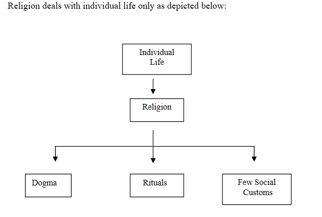

# Islamiat Notes
- Default Book: Mastering O Level Islamiat by Muhammad Bilal Aslam
## General Questions
### Life of Prophet PBUH
1. What was the reason  for rise of makkah inspite of terrible location ?
2. What was the sacriligious wars between kinana-quresh and hawazin tribe ? `https://en.wikipedia.org/wiki/Hawazin`
3. What was Harb al-fijar ? And why was this pact taken ?`https://en.wikipedia.org/wiki/Harb_al-fijar`
4. At what age did prophet Muhammad (SAW) marry Khadija bint Khuwalid ?
5. What place is also called Jabl-e-Noor ?
6. From whom house did prophet preach ? Whose house is called the house of islam ?
7. How long did the boycott of Banu hashim last ?
8. In a cave of which mountain did Prophet (SAW) and Hazrat Abu bakr stayed after their escape from Makkah ?
9. What were the effects of charter of madina in political,religious and civil spheres ?`79`
10. What was called the magna carta of early islam ?`81`
11. What were the effects of charter of madina ?
12. What were the steps Propget Muhammad took to settle matters with Jews of madina ?
13. What was the significance of charter of madina ?
14. What were the three jew tribes in yathrib named ?
15. Who was the person nominated to judge the crimes of banu qureza ? Last tribe to be punished ?
16. causes for expulsion of jews from madina for all 3 tribes ?`98`
17. What was bayte rizwan? Why is it called bayte rizwan and its components ?
18. Why was treaty of hudabiya considered unfair by some muslims ? What was this treaty ?
19. Consequences of treaty of hudabiya ?
20. Which was the greatest fort in khyber and who conquered it ?
21. What was the cause of battle of Mu'tah ?
22. Cause of breaking of treaty of hudabiya ?
23. Why was makkah taken ? How was it taken ?`113`
24. Effects of fall of makkah to islam ?
25. What was the Prophets treatment of makkans after the conquest ?
26. Battle of Hunain and its cause ? Its effects as well ?
27. Why was the siege to taif raised eventually ? `117`
28. Which years were called `Years of Deputation` and why ?`118`
29. Causes of  Tabuk expedition and its effects ?`119`
30. How many men were there during Muhajirin and ansar pact ?

### Pious Caliphs
1. Choosing of Abu bakr as caliph ? `200`
2. Causes of War of apstasy ? `203`
3. Who were the major false prophets ?`204`
4. What does mmusilma mean and why was he called such ?`204`
5. What was Hazrat Abu bakrs policy towards apostates ? 
6. Cause of battle against byzantine empire ?
7. Causes of losses in batte of boat ? who lead this fight ?
8. Causes of expedition of egypt ?
9.  Contribution of Abu bakr to Islam ? `211`
10. Who are the kharajites? `231`
11. The term muhajir doesn't apply to the holy prophet PBUH. `Fact`
12. What was umars title ? and Why ? `212`
13. Which daughter of Caliph Umar was married to prophet PBUH ?`212`
14. In which expedition Abu bakr gave his full wealth and Umar gave his half wealth ? `212`
15. Cause of death of Umar by Firoz(Abu Lulu) and why did he act in this manner ?`219` https://en.wikipedia.org/wiki/Omar#Assassination
17. Administration of Umar ? `220`
18. Allegation against Hazrat usman ?`225`
19. What was Ali's source of Livehood ? `228`
20. Why was Ali's selection as caliph considered questionable by some muslims ? `228`  
21. Cause of Battle of Camel(Jamal) ?`229` 
22. Battle of siffin ? `231`
23. Who were the arbitrators at Battle of siffin ?
24. Why did Ali's troops desert him after battle of Nahrwan ?
25. Who was the battle of Nahrwan against ?`232`
26. Murdur of Ali ? Why and by whom ? `232`

## 6 Articles of Faith

### Unity or Oneness of Allah
1. What is Unity of Allah ?`234`
2. What happens when a person believes in Oneness of Allah ?
3. What is opposite to unity of Allah ?
4. How does Tawheed refute Trinity and other concepts of Multitude of gods ?`235`
5. What are the effects of tawheed on a persons life ? `236`
6. 
7. 

### Angels
1. Who is Ruh-ul-Quds or Ruh-ul-Amin ?
2. Recording Angels ?
3. What was the Prophet SAW response when jibril asked him about iman ?`239`

### Divine Books
1. What does belief in the books entail ?
   

### Prophets 240

### Day of Judgement

### Belief in Preordainment of everything good or bad
- Destiny

## Pillars of Islam

1. WHat does believing in Prophet PBUH entail  ?
2. What are the benefits of Salah ?
3. What are the Farz of Wudu ?
4. What prayers dont have azan ?`267`
5. Effects of Fasting ?`280`
6. Benefits of Zakat ? `276`
7. Types of Jihad ?What does jihad mean literally ?`298`
8. Compare the position of Women before islam and after islam ?`302`
9. In which specific matters, is there a difference in status among men and women ?`303`
10. What rights does islam give women ?`304`
11. Why polygamy was proscribed in certin situations ? `308`
12. 
13. 

## Difference between Deen and Religion

- Religion is a mere set of Incantations, Rituals and Beliefs. Where as Deen is a way of life .
- Without Deen in politics it simply becomes a fight for gaining power with no end goal of Higher morality or purpose.
- **And whosoever adopts any other way except Islam that shall not 
be accepted from him and in the Hereafter he shall be among the 
losers.** - Al Quran 
- Allah Says deen with him is al-Islam.
  `https://www.alquranclasses.com/difference-between-deen-and-religion/`
    Religion  | Deen
    ------------- | -------------
    Private Matter  | Collective matter
    Attention of Religion is Allah and rituals | Attention of Deen is Humanity  
    Religion is not political  | Deen is entrenched in politics
    Religion has no opinion economic systems  | Deen in respect to islam has it own economic system
    Where as religion is only restricted to matters of rituals and customs | insists  that  all  our thoughts and deeds should be performed with God consciousness.  
 
- **Secularism** the belief that the state, morals, education, etc., should  be  independent  of  religion.

- The basic definition of Deen is reward

    Islam  | Secularism
    ------------- | -------------
    Every muslims know him higher goal  | There is no higher moral goal 
    Guidance at individual Level | No guidance at individual level
    Allah tells us in quran why he made us | No Ultimate Meaning of Life 
    Allah is soveriegn and only he can make or alter laws | People are soveriegn and they can make laws even in conflict with divine laws
    Allah must be put first in every affair | God has nothing to do with collective affairs

#### Questions
1. What is a religion and what is a deen ? What is the difference between these 2 words ?
2. Why is deen important for a political system ?
3. Comparision between deen and religion ?
4. What is Secularism ? and What is islam ?
5. Describe the contention between Islam and Secularism ?
6. What happens to religion under a secular system ? `https://www.qurtuba.edu.pk/thedialogue/The%20Dialogue/4_1/05_zamir.pdf`

## Islam and Other religions

  Islam | Other Religions
  ------------- | -------------
  Islam has Quran the direct speech of Allah | Their scriptures are usually passed down for centuries whose veractiy cannot be validated.
  Strict adherence to Monotheism | Whereas in most other major religions other than judaism there is a pantheon of gods
  We have the whole life of Prophet Muhammad before us as an example to strive for | Where as in other religions information about leaders or prophets obscure and hard to verify(Jesus of Nazareth content about where nazareth is)
  In Islam direct connection with Allah | Religions such as christianity have a mediary in the form of pope and clergy between the people and God.
  Islam provides guidance in collective aspects of life such as Political system, Economic system and Rules of warfare | In other major religions such as christianity this is not he case.

#### Questions
1. How is Islam Superior ?
2. What are the main differences  ?
   

## Sources of Shariah

### Ijtihad
`Source:`http://www.cssforum.com.pk/css-compulsory-subjects/islamiat/islamiat-notes/15108-concept-ijtihad-islam.html 

- While defining Ijtihad Shatibi writes, “A process in which one exerts one’s efforts to one’s full capacity in order to acquire exact or probable knowledge or reach judgement in a given case.”
- The Prophet Muhammad (Pbuh), while sending Ma’ad Ibn Jabal to Yemen as its governor, is reported to have asked him as to how he would decide matters coming up before him. ‘I will judge matters according to the Book of Allah,’ said Ma’ad. But if the book of Allah contains nothing to guide you’ then I will act on the precedents of the Prophet of Allah. But if the precedent fails? “Then I will exert to form my own judgement”. The Prophet (Pbuh) approved his answers.
The Qur’anic verse ‘their affairs are (conducted) by mutual counsel’, was applied to its fullest extent by the Prophet (Pbuh) in his private and public life and was fully acted upon by the Caliphs.

- During the life of the Prophet, he got the divine message from God, and his life itself is an attempt to concretely apply what the text means. It is of course in a metaphorical sense. There was not much gap between the message and the meaning. When he died the question as to the meaning of texts arose. Each human being see things differently, so differences get resolved through discourse
- **Qiyas** extend the laws to new cases that may be similar to the cases mentioned in the sources for which the laws cannot be discovered through literal interpretation (this is called the method of analogy, or qiyas.
- **Istihsan** extend the laws to new cases that have not been covered by the previous two methods by looking at the general principles and objectives of the sharia (this method is known as istihsan
- The work of the interpreter of the text is to ascertain the authenticity of the source(s) and then discover the laws through the interpretation of the sources; Qiyas and Istihsan.
-  **Qualifications of a Mujtahid** 
  1. a competence in the Arabic language which allows him to have a correct understanding of the Qur’an
  2. an adequate knowledge of the Meccan and Medinese contents of the Qu'ran.Context
  3. an adequate knowledge of the sunnah
  4. 	he must practice what he preaches
  5. he should have a thorough knowledge of the the rules and procedures for reasoning by analogy
- **Closing Itihad** this decision has resulted in chronic intellectual stagnation, as thousands of potential mujtahids and scholars have been prohibited from offering workable solutions to newly emerging problems
- The first step toward opening the door of ijtihad, according to Qazwini, should be the liberation of religious establishments from the influence of political regimes because they are dependant on them financially.
- Reforming Muslim educational systems is also essential to contain all schools of though for a more inclusive understanding in a common muslim.
-  lack of freedom and democracy as serious impediments to ijtihad
-  Many issues facing Muslims today require ijtihad, and urgent attention can be: The role of women,Sunnis and Shiites, Economics,Muslims in non-Muslim countries.

#### Questions
1. What is Ijtihad ?
2. Why is there a need for it ?
3. Definition of Mujtahid or Muslim jurists ?
4. Qualifications of a Mujtahid ?
5. What were the consequences of Closing the doors of Ijtihad ?
6. How can Ijtihad be revived ?
7. What issues should be subjected to Ijtihad ?

## Ijma and Qiya
`Source:`http://www.cssforum.com.pk/css-compulsory-subjects/islamiat/75163-ijmaa-qiyas-outcome-ijtihad.html

- After carrying out Ijtihad when the jurists agree upon some way-out it becomes Ijmaa` or consensus of opinion. So basically Ijtihad is an exercise the net result of which may be either in the form of Ijmaa`/ consensus of opinion or Qiyaas/analogical deduction.
- For becoming a qualified jurist or mujtahids it is mandatory that one is well conversant with Arabic language and Islamic legal science, i.e. fiqh. In addition to it he/she must be having command upon the translation and exegesis of the Holy Quran and the ability to distinguish between authentic and non-authentic traditions. He must be fully aware of the methods of Qiyas or analogical deduction. He/she must be a person who is famous for piety and not the one who is notorious for his/her immoral activities
- the mujtahids or jurists have been divided into three categories, namely Mujtahideen fil-Shara, Mujtahideen fil Madhab and Mujtahideen fil-Massail. 
- On account of Ijtihad Islamic laws retains the capacity to develop and are free from stagnation. Ijtihad enables the Muslims to solve any complicated legal issue in the light of teachings of Islam that may arise at any moment of time. No doubt, there is great scope of Ijtihad in this modern age but two points are worth considering in this regard. Firstly, those issues which are clear in the Holy Quran and Sunnah or about which there is an absolute Ijmaa` do not come under the purview of Ijtihad. For example, Ijtihad cannot be made for exempting Muslims from Salat, Zakat, Fasting and Hajj or for permitting and legalising interest, drinking, obscenity lewdness, corruption etc. Secondly, people belonging to other professions who do not fulfil the requirements needed for becoming jurists have no authority to do Ijtihad. 
- After the demise of the Holy Prophet (PBUH) the election of the first Caliph of Muslims Hazrat Abu Bakr (may Allah be pleased with him) was on the basis of Ijmaa`, when the absolute majority of companions of the Holy Prophet (PBUH) chose him as the first rightly-guided Caliph of Muslims. The Ijmaa` of one age can be repealed or modified by an Ijmaa` of any subsequent age with one exception that is the Ijmaa` of the companions of the Holy Prophet (PBUH) cannot be altered by the Ijmaa` of other ages. According to majority of Muslim scholars, at least three jurists are required for a valid Ijmaa`

- Qiyas or analogical deduction is the fourth source of Shariah that literally means to measure accord or equality. Those issues which have not been dealt with directly by the Holy Quran and Sunnah, nor determined by Ijmaa` or consensus of opinion may be resolved through Qiyas or analogical deduction. 
- Similarly, Abu Huraira (may Allah be pleased with him) reported that the talaq/divorce pronounced by an idiot and a mentally deranged person is not valid. Therefore, on account of analogy, it was declared that a talaq/divorce pronounced by a minor is also defective having no legal effect.

#### Questions
1. Benefits of Ijtehad ?
2. What is Qiyas ?  

## Political Theory in Islam
`Source:` islam-its-meaning-and-message-khurshid-ahmad
- Belief in Allah's Unity and his soverignity is the basic foundation of Political philosophy in islam.He is the Ultimate Law giver. `161`
- Main Charateristics of Islamic State:`162`
  1. No person,group or class can lay claim to sovereignity of the world
  2. Allah is the Law giver and ultimate authority rests with him
  3. An islam state must in all respects be found on the laws given by Allah through his prophets.
- In west laws are made and abrogated by the consensus of people no matter how moral or immoral. In Islam Allah is the highest authority and no law can be made that are in contention with the soul of Islamic principles.Such Normalization of Alcohol in west whereas in Islam it is haram and a dangerous evil.
- Limitations in Human Actions provided they do not inhibited necessary freedom are essentional to keep humans from harming oneself or each other due to desires and strong emotions.
- Purpose of Islamic State : To establish a system of well balanced and Just society in which people are not exploited on the basis of power and excessive wealth.

#### Questions
1. WHat is the ist principle in Political theory of islam ?
2. What is the difference between political theory between west and islam ?
3. WHat is the reason behind the limitations and restrictions set by Allah ?`165`
4. What is the purpose of Islamic state ? `168` 
5. Describe theory of Caliphate and nature of democracy in islam ? `171`
6. 

### Sayings of Quran and Sunnah with Relevant Topics

#### Political Islam
- 'Whoso does not establish and decide by that which Allah has revealed, such are the disbelievers'
- "They say: 'Have we also got authority ?' Say: 'All authority belongs to Allah alone'"
- Prophet: 'I do not follow anything except what is revealed to me'
- 'We Sent no Messanger except that he should be obeyed by Allah's command' 
