# Notes

- `Note` Go through recap pages of each chapter
- Default Book: `Understanding Psychology by Feldman` (UP)
## Part 1

---
### Definition and scope

- Psychology is the scientific study of Behaviour and Mental Processes. Behaviour and Mental Processes doesnt only involve what humans do and think but rather perception,emotions,reasonining processes and even biological processes that maintain the body.

- Behaviour Neuroscience is a subfield of psychology that deals with how brain, the nervous system and other biological processes determine behaviour.Like certain areas of brain causing tremors in muscles of those suffereing from parkinson,s disease.

- Experimental Psychology deals with sensing,percieving, learning and thinking about the world.
    - Sub Specialy of Experimental Psychology:
    1. Cognitive Psychology : It involves higher mental processes like thinking,Memory, Decision making, judging, Problem solving and language .Like a cognitive pstchology might be interested in what a victim of a plane crash might remember about their experience.

- Developmental Psychology studies how a person grows from the point of conception to death.
- Personality Psychology studies how a person changes over a course of time and what traits are consist in his personality.Moreover,it also deals with the traits that differentiate one person from another.

- 

### Psychology as a Science

### Schools of thought and Perspective
- Seven thousand years ago, people assumed that psychological problems were caused by 
evil spirits. To allow those spirits to escape from a person’s body, ancient healers chipped 
a hole in a patient’s skull with crude instruments—a procedure called **trephining** . 
- **Tabula Rasa** John locke a british philosopher of 17 century believed that children were born into this world with blank slates `(Tabula Rasa)`.
- **Structuralism** Wilhem wundt,s approach which deals with uncovering fundamental mental components of consciousness ,thinking,perception and emotions along with other mental tasks.
- 
- **Introspection** A procedure used by Wilhem wundt to understand how basic sensory processes build our understanding of the world.They presented people with a stimulus—such as a bright green object or a sentence printed on a card—and asked them to describe, in their own words and in as much detail as they could, what they were experiencing. Wundt argued that by analyzing people’s 
reports, psychologists could come to a better understanding of the structure of the mind.


- **Functionalism** The perspective that replaced structuralism is known as functionalism. Rather 
than focusing on the mind’s structure, functionalism concentrated on what the mind 
does and how behavior functions.Functionalists, whose perspective became prominent in the early 1900s, asked what role behavior plays in allowing people to adapt 
to their environments. For example, a functionalist might examine the function of 
the emotion of fear in preparing us to deal with emergency situations. 

- The American educator John Dewey drew  on functionalism to develop the fi eld of school psychology, proposing ways to best meet students’ educational needs. 

- **Gestalt Psychology** Another important reaction to structuralism was the development of gestalt 
psychology in the early 1900s. Gestalt psychology emphasizes how perception is 
organized. Instead of considering the individual parts that make up thinking, gestalt 
psychologists took the opposite tack, studying how people consider individual 
elements together as units or wholes. Led by German scientists such as Hermann 
Ebbinghaus and Max Wertheimer, gestalt psychologists proposed that “The whole is 
different from the sum of its parts,” meaning that our perception, or understanding, 
of objects is greater and more meaningful than the individual elements that make up 
our perceptions.

- **Womens contribution to Psychology** Despite the hurdles they faced, women made notable contributions to psychology,  although their impact on the field was largely overlooked until recently. 
For example, 
Margaret Floy Washburn (1871–1939) was the first woman to receive a doctorate in 
psychology, and she did important work on animal behavior. Leta Stetter Hollingworth 
(1886–1939) was one of the fi rst psychologists to focus on child development and on 
women’s issues. She collected data to refute the view, popular in the early 1900s, that 
women’s abilities periodically declined during parts of the menstrual cycle.y. Anna Freud (1895–1982), the daughter of Sigmund Freud, 
also made notable contributions to the treatment of abnormal behavior,


### Recent Trends and Models of Psychology

- For Recent trends must go thorough page 73 and 74 of Understanding Psychology by Feldman
  Total 5 modern perspectives:

  1.  **Neuroscience perspective** The approach  that views behavior from the perspective of the brain, the nervous system, and other biological functions. 
  2.  **Psychodynamic perspective** The approach based on the view that behavior is motivated by unconscious inner forces over which the individual has little control.
  3.  **Behavioral perspective** The approach that suggests that observable, measurable behavior should be the focus of study.
  4.  **cognitive perspective** The approach that focuses on how people think, understand, and know about the world.
  5.   **Humanistic perspective** The approach that suggests that all individuals naturally strive to grow, develop, and be in control of their lives and behavior. 

- Point of Contention and Debate in the Psychology
-  Nature(Hereditary) vs Nurture( Enviromental Influences)
-  Concious vs unconcious behaviour
-  Free will vs determinism
-  Observable vs Internal processes and behaviours
-  Individual DIfferences(Unique personality) vs universal Principles(Product of culture and society)

---

## Part 2

### Nervous System , Neuron and its function

- **BioPsychologists or Behavioural Neuroscientists** Psychologists who specialize in how biology and body functions determine or effect behaviour.
- Around 1 trillion neurons in a human brain
- **Dendrite** A cluster of fi bers at one end  of a neuron that receives messages from other neurons.
- **Axon** The part of the neuron that carries messages destined for other neurons. 
-  **Terminal buttons** Small bulges at the end of axons that send messages to other neurons. 
-   **Myelin sheath** A protective coat of fat and protein that wraps around the axon.myelin sheath also serves to increase the velocity with which electrical impulses travel through axons. Those axons that carry the most important and most urgently required information have the greatest concentrations of myelin. If your hand touches a painfully hot stove, for example, the information regarding the pain is passed through axons in the hand and arm that have a relatively thick 
coating of myelin, speeding the message of pain to the brain so that you can react 
instantly.  

 **all-or-none law** The rule that neurons are either on or off.
  
  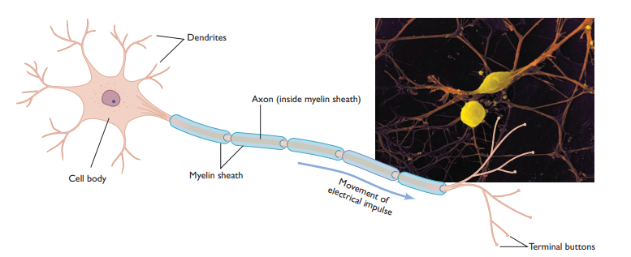

**resting state** The state in which there is a negative electrical charge of about –70 millivolts within a neuron.Also  Like a gun, neurons either fire—that is, transmit an electrical impulse along the axon—or don’t fire. There is no in-between stage, just as pulling harder on a gun 
trigger doesn’t make the bullet travel faster
 
 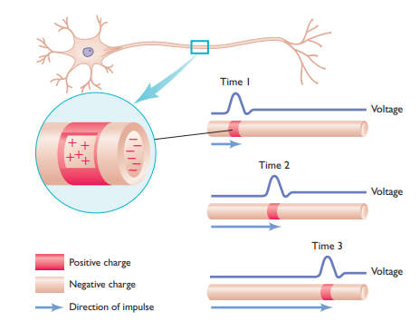

- **Action Potential** an electric nerve impulse that travels through a neuron’s axon when it is set off by a “trigger,” changing the neuron’s 
charge from negative to positive. Movement of an action potential along an axon. Just before Time 1, positively charged ions enter the cell membrane, changing the charge in the nearby part of the axon from negative to positive and triggering an action potential. The action potential travels along the axon, as illustrated in the changes occurring from Time 1 to Time 3 (from top to bottom in this drawing). Immediately after the action potential has passed through a section of the axon, positive ions are pumped out, restoring the charge in that section to negative.

- Just after an action potential has passed through a section of the axon, the cell 
membrane in that region cannot admit positive ions again for a few milliseconds, 
and so a neuron cannot fi re again immediately no matter how much stimulation it 
receives.

- Axons with small diameters carry impulses at about 2 miles per hour; longer and thicker ones can average speeds of more than 225 miles per hour.

- Some neurons are capable of firing as many as 1,000 times per second; others fi re at much slower rates. The intensity of a stimulus determines how much of a neuron’s potential fi ring rate is reached. A strong stimulus, such as a bright light or a loud sound, leads to a higher rate of 
firing than a less intense stimulus does 

- **Mirror neurons** Specialized neurons that fire not only when a person enacts a particular behavior, but also when a person simply observes anotherindividual carrying out the same 
behavior. 
-  **synapse** The space between two neurons where the axon of a sending neuron communicates with the dendrites of a receiving neuron by using chemical messages. 

-  **Neurotransmitters** Chemicals that carry messages across the synapse to 
the dendrite (and sometimes the cell body) of a receiver neuron

 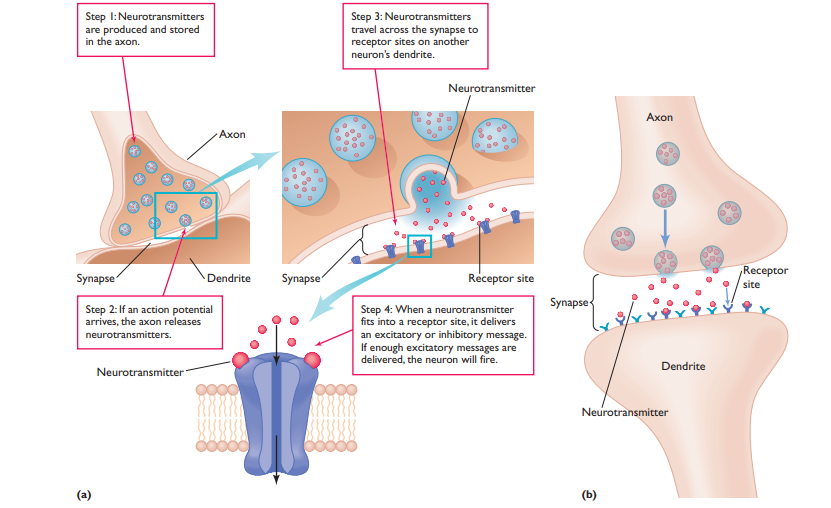

- Several types of neurotransmitters, and not all neurons are capable of receiving the chemical message carried by a particular neurotransmitter. In the same way that a jigsaw puzzle piece can fit in only one specifi c location in a puzzle, each kind of neurotransmitter has a distinctive configuration that allows it to fi t into a specific type of receptor site on the receiving neuron

- If a neurotransmitter does fit into a site on the receiving neuron, the chemical 
message it delivers is basically one of two types: excitatory or inhibitory

-  **Excitatory message** A chemical message that makes it more likely that a receiving neuron will fire and an action potential will travel down its axon.

- **Inhibitory message** A chemical message that prevents or decreases the likelihood that a receiving neuron will fire.

- If neurotransmitters remained at the site of the synapse, receiving neurons would 
be awash in a continual chemical bath, producing constant stimulation or constant 
inhibition of the receiving neurons—and effective communication across the synapse 
would no longer be possible. To solve this problem, neurotransmitters are either 
deactivated by enzymes or—more commonly—reabsorbed by the terminal button in 
an example of chemical recycling called **reuptake** .

- Some antidepressant drugs, called SSRIs, or selective serotonin reuptake inhibitors , permit certain neurotransmitters to remain active for a longer period at certain synapses in the brain, thereby reducing the symptoms of depression

 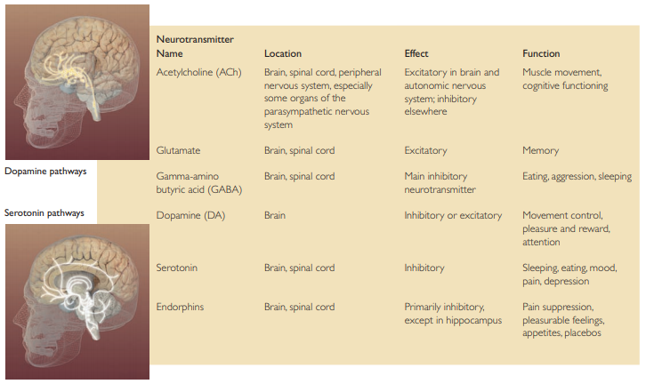

- **Parkinson’s disease**, from which actor Michael J. Fox suffers, is caused by a defi ciency of dopamine in the brain.

- **over production of dopamine** produces negative consequences. 
For example, researchers have hypothesized that schizophrenia and some other 
severe mental disturbances are affected or perhaps even caused by the presence of 
unusually high levels of dopamine. Drugs that block the reception of dopamine 
reduce the symptoms displayed by some people diagnosed with schizophrenia

- Endorphins also may produce the euphoric feelings that runners sometimes 
experience after long runs. The exertion and perhaps the pain involved in a long run 
may stimulate the production of endorphins, ultimately resulting in what has been 
called **“runner’s high”**

- Endorphin release might also explain other phenomena that have long puzzled 
psychologists. For example, the act of taking placebos (pills or other substances that 
contain no actual drugs but that patients believe will make them better) may induce 
the release of endorphins, leading to the reduction of pain

### Central and Peripheral Nervous System

- **Central nervous system (CNS)** The part of the nervous system that includes the brain and spinal cord. 
 
- **Spinal cord** A bundle of neurons that leaves the brain and runs down the length of the back and is the main means for transmitting messages between the brain and the body.

- `Example:` The spinal cord is not just a communication channel. It also controls some simple behaviors on its own, without any help from the brain. An example is the way the knee jerks forward when it is tapped with a rubber hammer. This behavior is a type of refl ex , an automatic, involuntary response to an incoming 
stimulus. A refl ex is also at work when you touch a hot stove and immediately withdraw your hand. Although the brain eventually analyzes and reacts to the situation (“Ouch—hot stove—pull away!”), the initial withdrawal is directed only by neurons in the spinal cord.

- **Reflex** An automatic, involuntary response to an incoming stimulus.

 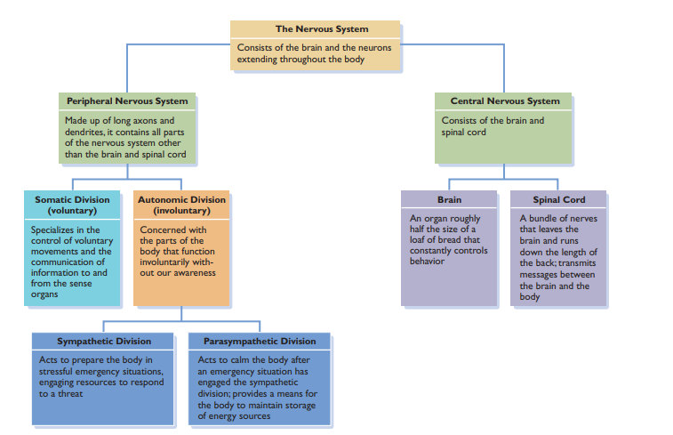

 
- **Sensory (afferent) neurons** Neurons that transmit information from the perimeter of the body to the central nervous system. 

- **Motor (efferent) neurons** Neurons that communicate information from the nervous system to muscles and glands. 
- **Interneurons** Neurons that connect sensory and motor neurons, carrying messages between the two. 

- **Peripheral nervous system** The part of the nervous system that includes the autonomic and somatic subdivisions; made up of neurons with long axons and dendrites, it branches out from the 
spinal cord and brain and reaches the extremities of the body. 

- **Somatic division** The part of the peripheral nervous system that specializes in the control of voluntary movements and the communication of information to and from the sense organs. 

- **Autonomic division** The part of the peripheral nervous system that controls involuntary movement of the heart, glands, lungs, and other organs. 

- **Sympathetic division** The part of the autonomic division of the nervous system that acts to prepare the body for action in stressful situations, engaging all the organism’s resources to 
respond to a threat. 

-  **Parasympathetic division** The part of the autonomic division of the nervous system that acts to calm the body after an emergency has ended. 

- **Physiological changes that occur during a crisis** `Example:`Page 126 Understanding Psychology
  


 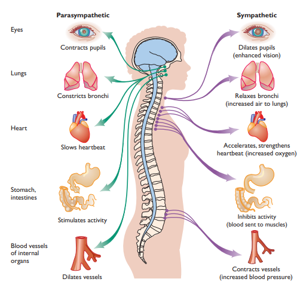


   
  - **Evolution of Nervous System**The complexities of the nervous system can be better understood if we take the course of evolution into consideration. The forerunner of the human nervous system 
is found in the earliest simple organisms to have a spinal cord. Basically, those organisms were simple input-output devices: When the upper side of the spinal cord was 
stimulated by, for instance, being touched, the organism reacted with a simple 
response, such as jerking away. Such responses were completely a consequence of 
the organism’s genetic makeup. 
 Over millions of years, the spinal cord became more specialized, and organisms 
became capable of distinguishing between different kinds of stimuli and responding 
appropriately to them. Ultimately, a portion of the spinal cord evolved into what we 
would consider a primitive brain. 
 Today, the nervous system is hierarchically organized, meaning that relatively 
newer (from an evolutionary point of view) and more sophisticated regions of the 
brain regulate the older, and more primitive, parts of the nervous system. As we 
move up along the spinal cord and continue upward into the brain, then, the functions controlled by the various regions become progressively more advanced

- **Evolutionary psychology** The branch of psychology that seeks to identify behavior patterns that are a result of our genetic inheritance from our ancestors. 

- **Behavioral genetics** The study of the effects of heredity on behavior. 

- **Behavioral genetics lies at the heart of the nature-nurture question**, one of the key 
issues in the study of psychology. Although no one would argue that our behavior is 
determined solely by inherited factors, evidence collected by behavioral geneticists 
does suggest that our genetic inheritance predisposes us to respond in particular ways 
to our environment, and even to seek out particular kinds of environments. For 
instance, research indicates that genetic factors may be related to such diverse behaviors as level of family conflict, schizophrenia, learning disabilities, and general sociability.(`Page 128: Understanding Psychology`)

- **Controversy: Behavioral genetics**For instance, questions about the existence of genetic 
infl uences on criminality, intelligence, and homosexuality raise considerable emotion. 
Furthermore, it is unclear what the social and political consequences of discoveries 
in behavioral genetics would be. Would finding a strong genetic basis for criminal 
behavior lead to genetic screening and restricted civil rights for individuals having 
“criminal” genes? Clearly, behavioral genetic discoveries could have an impact on a 
number of important social issues.

 - **Gene therapy** , scientists inject into a patient’s bloodstream genes meant to cure a particular disease. When the genes arrive at the site of defective genes that are producing the 
illness, they trigger the production of chemicals that can treat the disease.
- `Example:`  Gene therapy is now being used in experimental trials involving people with certain forms of cancer and blindnes
-  **Genetic counseling**. Genetic counselors help people deal with issues related to inherited disorders. For example, genetic counselors provide advice to prospective parents about the potential risks in a future pregnancy, based on their family history of birth defects and hereditary illnesses. 
 


### Endocrine System

- **Endocrine system** A chemical communication network that sends messages throughout the body via the bloodstream.
- **Hormones Chemicals** that circulate through the blood and regulate the functioning or growth of the body. 
- Although the endocrine system is not part of the brain, it is closely linked to the hypothalamus.

- Neural messages move through neurons in specific lines (like a signal carried by wires strung along telephone poles), whereas hormones travel throughout the body, similar to the way radio waves are transmitted across the entire landscape. Just as radio waves evoke a response only when a 
radio is tuned to the correct station, hormones flowing through the bloodstream 
activate only those cells that are receptive and “tuned” to the appropriate hormonal 
message. 

- **Pituitary gland** The major component of the endocrine system, or “master gland,” which secretes hormones that control growth and other parts of the endocrine system. It is 
found near—and regulated by—the hypothalamus.  called the “master gland” because it controls the functioning of the rest of the endocrine system.
<br/> 
`Example` 
hormones secreted by the pituitary gland control growth. Extremely short people and unusually 
tall ones usually have pituitary gland abnormalities.

## PART 3

### Sensation and Perception

### Section 1: Vision
#### `Main Notes`
- Super Recognition and Faceblindness are disorders
- **Sensation** Encompasses the processes through which our sense organs recieve information from the world around them.
- **Perception** is sorting,organization,analysis,interpretation and integration of that information by our sense organs and brain.
- Difference between sensation and perception is : Sensation is the first encounter of organism with raw sensory stimulus and perception is the process through which it analyzes, interprets and integrates that stimulus with other sensory information.
- **Stimulus** is any passing source of energy that produces a response in a sense organ.
- **Psychophysics** is the branch of psychology that studies the relationship between physical aspects of stimulus and our psychological experience of them.
- **Absolute Threshold** is the smallest intensity(amount) of a stimulus that must be present for it to be detected.Technically absolute threshold is a the intensity of a stimulus that can be detected 50% of the time.
- **Noise** as defined by psychophysicists is background stimulation that interferes with detection of other stimuli.(Unwanted Stimulus.Encompasses all the stimulus)
- **Difference Threshold**`(also called Just Noticeable difference)` The smallest intensity of added or reduced stimuli that makes it possible to detect that a change in the stimulus has occured.
- **Webers,s Law**`(Page 104: Understanding Psychology)`The just noticable difference is a constant proportion to the intensity of initial stimulus. 
- **Adaption** An adjustment in sensory capacity after prolonged exposure to unchanging stimuli
- **Visual Spectrum** Range of Wavelength that human beings are sensitive to.It is relatively small.
- **Accomodation** Lens changes its thickness to focus light on the back of the eye.
- **Retina** is the part of eye that converts light enery to electrical Impulses to be transmitted to the brain.
- **Rods** Thin cyclindrical receptor cells in the retina that are highly sensitive to Light.It is related to dim vision.Insensitive to color and detail.It is responsible for **peripheral Vision** Recognizing Objects that are outside of main focus. 
- **Cones** Cone shaped light sensitive receptor cells inside the retina that are responsible for focus and color  particularly in bright lights.Cones are concentrated on the part of retina called **Fovea**.Fovea is particularly sensitive.When you focus on a particular object of interest the image is centered on fovea to see it more sharply. 
- **Dark Adaptation** Processes of adapting to dim light after being in a bright light enviroment.Cones and rods are involved in it. **Light adaption** opposite of dark adaptation.These processes occur as a result of rate of change in chemical composition in Rods and cones.Because change in rods take 20 to 30 minutes to reach maximum level ,Dark adaptation takes longer.While cones reach maximum level in a minute or so. 

 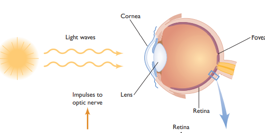


- **Optic Nerve** A bundle of `ganglion` axons that carry visual information to the brain.
- **Bipolar Cells** Inside Retina.Recieve from rods or cones , transmit to ganglion cells.
- **Ganglion Cells** Collect and summarize visual Information and then send it to the brain.Detect maximum light and darkness variation in the light.(`page 162:UP`)
- **Blind Spot** The opening of the optic nerve passes through the retina there are no rods or cones in that area so it creates a blind spot.
- **Optic Chiasm** Optic nerves from the 2 eyes meet at a specific point where `each optic` never then splits.

 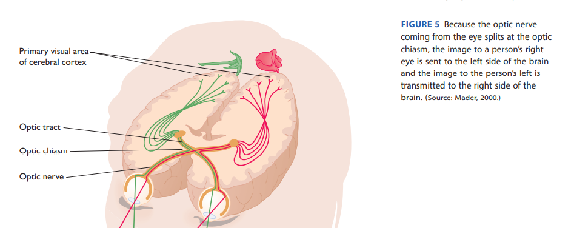

- David Hubel and Torsten Wiesel won the Nobel Prize in 1981 for their discovery that 
many neurons in the cortex are extraordinarily specialized.**Feature Detection** The activation of Neurons in Visual  Cortex by visual stimuli of specific shapes or patterns.Some cells are only activated by moving as opposed to stationary objects others by lines of diff shape ,width or orientation.
- Diff parts of brain process nerve impulses in several diff individual systems.
- **Ocular Dominance columns** Our brains process information coming from the 2 eyes seperatly, creating what is ODC.
- A normal Person is capable of distinguishing no less than 7 million colors.
- Approximatly 7 % men and 4 % women  are **color blind**. For most people with color blindness red fire appears yellow,Green grass seems yellow,Three colors of traffic light all appear yellow.
- Different types of color blindness , unable to differentiate between blue- Yellow.or all red,green seems yellow.In extreme cases ,no perception of color.Vision is like black and white tv.
- **Afterimage** Activity in the retina continues even when you are no longer looking at the original object.
- **Theories of Color Vision:**
  1. **Trichromatic theory of color vision:** Proposed by thomas young in the first half of 1800s.According to the theory retina contains 3 types of cones which are sensitive to specific wavelengths. One to yellow-red,one to green, one to blue-violet.According to the theory perception of color by the strength with which these cones are activated when they come in contact with light.
  **Example:** When looking at blue sky.Blue-violet cones are primarily activated and the other less so.
  **Issues:** It does not explain why the after image afterstaring at a yellow for one minute appears red.

  2. **Opponent Process Theory of color vision:** Proposed by Ewald hering in 19th century.Proposes that receptor cells are linked in pairs.Working in opposition.Pairs are Blue-Yellow, Red-Green and black-white.When an image contains more yellow than blue.Yellow receptors are activated and vice versa.
  **AfterImage Problem** It explains that after staring at a yellow page for long the yellow receptor cells become fatigued and are not able to respond well to new stimuli.However the paired blue cells are capable of responding because they have not been stimulated.So when you shift to white paper after staring at a yellow page for 1 minute.The Blue receptors are activated and respond and yellow cells being fatigued do not respond.Consequently, Blue color is seen in the after image.However the afterimage lasts only a while because the fatigue of yellow cells is quickly overcome.

  


#### `Thoughts`
```
- if our ears were more sensitive that they already are it would be problem matic because of we would be able to hear the sound of air molecules knocking into ear drum.
- Webers Law, According to him the difference threshold for weight is 1:50.It means that 1 ounce of weight change in an item of 50 ounces weight would be just noticable.It explains why a person sitting in a quiet room is more startled  by phone ringing than a person sitting in a noisy room.
- Webers Law hold for every kind of stimulus
- Pupil contraction in bright light allows us to see object at a greater distance in Fpcus.If pupil were to expand and let in all the light than our ability to see objects at a greater detail at distance would be reduced.
- Len becomes flatter when viewing distant objects and rounder when viewing objects at a closer distance.
- We never notice the blind spot because the information is automatically filled by  using nearby materials to compensate for the missing information.
```
---
#### `Keywords`
- Super-Recognition
- Faceblindness
- Iris
- Cornea
- Pupil
- Retina
- Bipolar Cells
- Ganglion cells
- Blind Spot
- Color Vision
- Color Blindness
  

#### `Questions`
1. What is Sensation and how do psychologists study it ?
2. What is the relationship between physical stimulus and the kinds of sensory response that result from it ?
3. How do we see colors ?
4. What processes underlie that vision system (Sense of vision)?
5. What role does ear play in senses of sound, motion and balance ?
6. How do smell and taste  function ?
7. What are skin senses and how do they relate to pain ?
8. What principles underlie our organization of visual world and allow us to make sense of it ?
9. How are we able to perceive 3D world when our retina can only sense 2D information ?
10. What clues do visual illusions give us about our understanding of general visual mechanism >
11. Difference between Sensation and Perception ?
12. How do we differenciate one person from another in context of sensation and perception ?
13. What would happen if our ears were more sensitive than they already are ?
14. Why would frequent multitaskers be more distractible than those who multitask 
less frequently?
15. Why a person sitting in a quiet room is more startled by phone ringing than a person sitting in a noisy room.
16. Why shouldn’t the pupil be open completely all the time, allowing the greatest 
amount of light into the eye?
17. Why does dark adaptation takes significantly longer than light adaptation ?
18. What happens when light enters the retina ?
19. Why do we never notice the blind spot ? and What advantage does this automatically filling has ?
20. How is image formed in the brain whole process ?(`Page 160:UP`)
---

#### `Summary`


### Section 1: Hearing and Other Senses
#### `Main Notes`
- Sound The Motion of air molecules brought about by a source of vibration
- The part of ear that vibrates when sound waves strike it
- A coiled tube in the ear filled with liquid that vibrates in response to sound waves.
- Basilar membrane A vibrating structure that lies inside the cochlea and divides it into upper and lower chamber with sound receptor cells attached to it.
- Process of Hearing: Sound enters out Ear ==> Strikes Ear drum .Transmit vibrations to middle ear==> Middle ear contains hammer,anvil and stirrup.They transmit and amplify vibrations through the oval window.It reaches inner ear ==> Inner ear contains Cochlea inside it is basilar membrane.(`Page 169:UP`)When vibrations bend hair cells on the basilar membrane neural Messages are sent to brain.
- Hair cells attached to the basilar membrane when bent due to sound send neural messages to the br ain. 
- Frequency is the number of wave cycles that occur in a second.
- Pitch is the characteristic that makes sound appear high or low.Low frequency translates into low pitched sound.Lowest pitch detectable by humans 20 decibels.Highest 20,000.When sound gets higher than 120 decibels it becomes painful to ear.Our hearing capacity diminishes as we age especially for high pitched sounds.`Thats why older people often cannot hear low pitched sounds`.
- Amplitude is the feature of waves that allow us to determine whether sound is loud or soft.Waves with `small peaks and valleys are soft and vice versa`.
- Place theory of Hearing States that different part of the basilar membrance respond to different frequencies.
  **Issues** Doesnt tell the whole story.Low frequency sounds trigger neurons basilar membrane over such a large area that no single point can be specified.
- Frequency theory of Hearing states that basilar membrane acts like a microphone responding as a whole to frequencies.The higher the pitch the greater the number of neural impulses to the brain
  **Issues** Both theories do not fully explain the process of hearing.Place theory provides a better explaination for higher frequencies while frequency theory for lower frequencies.
- Semicircular canal 3 tubelike structures with fluid inside them that sloshes around when the head is moved signaling rotational or angular movement of brain.
- Otholiths semi cicular crystals in side the semicircular canal which detect the pull of gravity ,accelation and movement.When we move otholiths shift like sand in wind and come in contact with hair cells.
- Human sense of smell(olfaction) allows us to distinguish between 10,000 smells.Women general have better sense of smell.People can distinguish gender base on smell alone.
- We smell when air molecules of some object interact with nasal receptor cells present inside our nose.Smell may also act as a secretive means of communication.Non humans use phermones to communicate sexual attraction or availability.
- Gustation(Sense of Taste) involves receptor cells that respond to basic 4 stimulus qualities : salty,Sweet,sour and bitter.There is a fifth one but debatable its called umami meaning meaty or savoury.Its japanes.Every taste is a simple combination of these basic 4.Like colors.Receptor cells are roughly 10,000.They wear out and are replaced every 10 days.If this did not happen we would lose our sense of taste if we accidently burned our tongue.Some people are super tasters with twice as many receptors on tongue as non tasters.
- Skin senses are touch,pressure, temperature and pain.
- Women experience pain more intensely than men.It may depend on the situation along with mental state,Experience and background of the individual.Soldiers after being hurt have a diminished because they are at a relief that they are alive.
- Gate control theory of Pain states that receptor cells in the spinal cord lead to certain areas in brain related to pain.When body is injured and these receptor cells become activate.A gate way is opened to the brain and we experience the sensation of pain.
  2 ways that this gateway  can be closed or diminished in some sense.
  1.  Other Impulses  than pain can overwhelm or compete for the path to brain and closing the gate.Hence ending the pain sensation.THis is one of reason rubbing around the area of injury than reduce pain.
  2.  Psychological factors can diminish pain such as soldier at relief of being alive.
- Strategies to Fight Pain:
    1. Medication
    2. Nerve and Brain stimulation .Passing current through nerve or centain parts of brain
    3. Light therapy.Exposure to lights of certan wavelengths results in pain reduction
    4. Hypnosis 
    5. BioFeedback and relaxation: Biofeedback is learning to control involuntary functions of body like heart beat.
    6. surgery: cutting the nerve pathway.
    7. Cognitive Restructuring : Thinking positively


- 
#### `Thoughts`
```
- Left ear reacts more to speech while right ear reacts more to music.
- Gate pain theory explains the pain relieving method of acupunture and why it works .The needle may block the gateway to the brain , lessening the experience of pain.
```
---
#### `Keywords`
- vocal cues
- Pitch 
- Frequency
- Otholths
- Supertasters
- Reflex Sympathetic dystrophy syndrome(Small movement or gust of wind can product agony)
- Skin senses
- Synesthesia( Like seeing color when listening to music,Or having bitter taste in ur month on touch a meat patty.)
---
#### `Questions`
1. `How are our brains able to sort out wavelengths of different frequencies and intensities?`(Part of basilar membrane neart to the oval window is most sensitive to high frequency sounds,Cochleas inner end is most sensitive to low frequency.So this explaination supports Place theory. )
2. Why does space sickness occur ? Due to weightless ness of otholiths.
3. Do humans communicate through smell ? 
4. Why do non tasters seek out relatively sweet foods as compared to super tasters ? less receptor cells.
5. `What are the causes for synesthesia ?` Possible explainations: Dense neural networks between different sensory areas of brain or lack of neural control that inhibits connection between sensory areas.
---
#### `Summary`

--- 
### Section 2: Perceptual Organization: Constructing Our View of the World
#### `Main Notes`
- **Gestalt Law of Organization** Some of the basic sensory processes can be described by the way we organize bits and pieces of information into meaningful wholes.Set forth in ear `1900s`.Some of the principles are close,proximity, similarity and simplicity.
 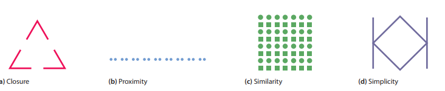
**Contemporary** Gestaltk psychology no longer play a prominant role in modern psychology but one principle that still retains its relevance is that two objects considered together form a whole different than the simple combination of singular objects. 
- **Ways of Processing**
- **Top down Processing(tdp)** Perception that is guided by high level known, experience and expectations. We try to see the whole picture instead of singular instances.Thats why you can understand words that might have some letters missing.Such as `Helo,l-tt-r,ev-ry`. Top down processing allows us to fill in gaps and  make sense of missing information.Top down processing cannot occur on its own.Bottom up processing is required. If we did not know the meaning of individual words it would be impossible to make sense of sentences that might be missing some words.
- **Bottom up Processing(bup)** Process of recognizing and processing information from individual bits and moving towards the perception of the whole.BUP and TDP occur simuntaniously .Context is very important in TDP.
- **Depth Perception** The Ability to view the world in 3 dimentional plane and perceive distance.
- **Binocular disparity** The difference between the images seen by the left and the right eye.In some cases particular cues allow us to percieve depth and distance. Through a single eye called **monocular cues** Like motion parallax.
- **Monocular cues** `Relative size`. Experience taught us that object of same size but making images of different size on the retina tell us that the object with small image is farther away.`Texture Gradient` tells us about the distance because the details of object that are far away are less distinct.`Linear Perspective` Like railway tracks in the distance.Far away objects appear to be closer to each other than objects that are not distant.
- **Perceptual Constancy** Perception of objects is unvarying and consistant even if their appearance or enviroment changes. Like person moving away from us.His size shrinks but we undstand them to be the same.It can sometimes mislead us.Like moon above the sky is perceived smaller and distant while moon appearing close to the horizon appears huge and closer.(`Page 185:UP`)
- **Apparant Movement** The perception that a stationary object is moving. Like sitting in stationary state you something think that it has started moving when infact it hasn't.
- **Perception of motion** Movement of the objects image on our retina.But its alway not the cases.Otherwise we would always consider the world at motion when we move our head.
- **Visual Illusions** Physical stimuli that consistantly produce error in perception.
- **Muller Lyer Illusion** `page 186:UP` 2 lines of equal length. One line with arrow tip pointed inward appears longer than the line with arrow tip pointed outward.One explaination is when tip is inward the eye movements are greater percieving it to be longer.

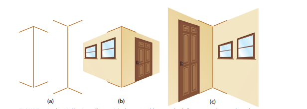


- **Devil tuning Folk** Problematice for people brought up in western world to reproduce because they perceive objects in 3D while people brought up in zulu culture can reproduct it easily.Cultural differences are reflected in depth perception
- **Subliminal Perception** Perceiving minor cues that we are not aware of.They do affect our behaviour.Such descriptive label called **prime** shown to a subject really fast before he can register it about some person and he forms an opinion based on that label such as happy or smart.
- Subliminal messages are called `priming`.Little evidence to prove that it leads to major changes.Thirst and coca cola example on it.`188:IP`.
- **ESP** Extra sensory perception.Scientists are skeptical of it.It involves perceiving information with out using our senses.Example mind reading,clarvoyance.
#### `Keywords`
- Motion Parallax : The change in position of an object caused by the movement of your body.
---
#### `Questions`
- What principles underlie organization of the visual world and allow us to make sense of the world ?
- How are we able to sense the world in 3D when our retina are only capable of sensing on 2-D Images ?
- What clues do illusions give us about our understanding of general perceptual mechanisms ?
- Why top down processing cannot occur on its own ?
- How does tdp and bup occur ?
- `How do we make transformation from 2d to 3d  and Percieve distance?` There is a distance between the 2 eyes and so the images reach each eye are different.The brain integrates that images into one.It also recognizes the difference in the images and uses that difference to determine the distance of an object.E.g Pencil at arm length example.(`Page 183:UP`)
- Why does perceptual constancy problem in moon viewing occurs ? Explain
- 
---
#### `Summary`

--- 
## Part 4 : Learning and Memory
### Section 1: Classical Conditioning
#### `Main Notes`
- **Learning** A relatively permanent change brought about by experience.
- **Habituation** is decreased response to a stimulus after repeated expose to it.Like an infant is excited by a toy initially but soon gets bored after being presented with it dialy.
- Ivan pavlov developed the framework for learning in 20th century called classical conditioning.
- **Classical Conditioning** A type of learning when a neutral stimulus brings about a condition response when it is associated with a stimulus that naturally brings out a response.
- Neutral Stimulus A stimulus that does not naturally bring out a response of interest before conditioning.
- Unconditioned stimulus UCS A stimulus that naturally brings out a response of interest without being conditioned
- A response that is natural and needs no conditioning. Like salivation at the sight of food for dog.
- Conditioned Response A response that after conditioned is produced after occurance of a neutral stimulus.
- The sequence and timing of  Neutral stimulus and uncondition stimulus is of grave importance.Research has shown that conditioning is most effective if the neutral stimulus precedes the unconditioned stimulus by half a second or a few seconds.
1. Neutral stimulus  after uncondition stimulus : Little chance of becoming a condition stimulus
2. Neutral stimulus  before uncondition stimulus : Good chance of becoming a condition stimulus
- Emotional responses are especially likely to be learned through classical conditioning.
- `Little  Albert rat experiment by John B watson (Page 232)`
-  **Phobias** Intense irrational fears formed through classical conditioning. PTSD is example of phobia when hearing loud sounds.
-  **Extinction** A basic phenomenon of learning in which the conditioned response diminishes over time and eventually stops occuring after a conditioned stimulus.
-  Spontaneous Recovery The reemergence of extinguish conditioned response after a period of rest.It explains why drug addicts often relapse when presented with a conditioned stimulus.
-  Stimulus Generalization A process in which after a conditioned stimulus has been learned, stimulus that are similar to the original stimulus produces condition response.Its intensity is not equal to the original but proportional to how similar is the stimulus to the original stimulus.
-  Stimulus discrimination When 2 stimulus are distinct from one another.Then one produces a conditioned response and the other does not.Like we learned to pet a barking dog whose tail is wailing but not a barking dog whose tail is standing straight.
-  Pavlov hypothesized that all learning is nothing more than a long string of condition response.But it is not true.`Page 235 for this discussion`

#### `Thoughts`
---
#### `Keywords`
#### `Questions`
- What is learning?
- How do we learn to form associations between stimuli and responses?
- How do we know when a behavior has been influenced by learning—or even is a result of learning?(Nature and Nurture problem.Whether learning involved or maturation.`Page 229`)
- How were traditional understanding of classical conditioning were challanged ? By John Garica a learning psychologist.He showed that humans and animals were `biologically prepared` to avoid foods that made them sick.They even `learned taste aversion` to aviod these foods.`Page 235`
---
#### `Summary`

---
### Section 2: Operant Conditioning 
 
#### `Main Notes`
- **Operant Conditioning** A process in which a voluntary response is strengthened or weakened depending upon whether it was favourable or not.
- **Throndikes's Law of effect** Responses that lead to desireable outcomes are more likely to be repeated.
- Throndikes work was perfected by B.F Skinner influential psychologist of 20th century.Rat and food experiment(`Page 238`)
- **Reinforcement** The process by which a stimulus that increases the probability that a preceding behaviour will be repeated.Pressing the lever a behaviour will more likely occur because of food stimulus in rats.
- **Reinforcer** A stimulus that increases the likelihood that a previous behaviour will be repeated.
- **Positive Reinforcer** A stimulus added to the enviroment that brings about an increase in the preceding behaviour.Like if food ,money or praise is added after a response.
- **Negative Reinforcer** An unpleasant stimulus whose removal from the enviroment  brings about an increase in the preceding behaviour.Like headaque is removed after taking certain medicine.`Positive is Add something while negative is removal`
- **Punishment** A stimulus that will decrease the probability that a preceding behaviour will occur.`Positive Punishment` decrease the likelihood of response by adding a stimulus.Like hitting a child for misbehaviour.`Negative Punishment` is taking away a childs toys incase of misbehaviour.
- **Schedules of Reinforcement** Different patterns of frequency and timings of reinforcement after a desired behaviour.
- **Continous Reinforcement Schedule(CRS)** Reinforcement of a behaviour every time it occurs.
- **Partial(Intermittent) Reinforcement Schedule(PRS)** Reinforcing of a behaviour some but not all the time.
- Learning happens more rapidly in CRS but it lasts shorter as compared to PRS.
- **Fixed Ratio Schedule (FIS)** A schedule in which a reinforcement occurs only after a specific number of responses are made. It is a type of PRS.**Variable ration schedule (VRS)** also a type of PRS. A schedule by which reinforcement occurs after a variable number of responses.In `FRS` response rate relatively slow.This is especially true just after reinforcement when the time between reinforcements is relatively great.Like a students study habits if the time between examination is large than the frequecy of them study at the start of semester is low.`VRS` increases the response rate and brings out a more consistant behaviour for longer period of time.
- **Stimulus Control Training** The process in which people learn to discriminate between stimuli.A behaviour is reinforced in presense of a specific stimuli but not in its absense.Like increased eye contact and closes can between discriminate between friendliness and romantic attraction.
- **Discriminative stimulus** indicates that the likelihood of a desired response is more likely.Like asking to borrow something when he is in a good mood. 
- **SHaping** is the Process of teaching complex behaviour through rewarding closer and closer approximations of the desired behaviour.e.g Lions jumping through hoops or dolphins rescuing divers lost at see
- **Biological Constraints** In some cases organisms are genetically predisposed to learn a specific behaviour and sometimes they are inhibited to learn a specific behaviour.Impossible to train a pig to pick up disks.

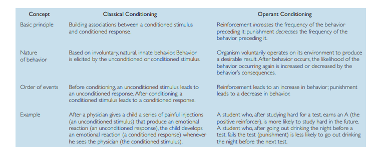

- **Behaviour Modification** A formalized technique to increase the frequency of desired behaviours and decrease the occuring of unwanted ones.
- **Generalization training** is taking a behavior that is learned in one setting and applying it in another setting. The goal of systematic programming for generalization in teacher education is to diminish the loss of effective strategies from preservice training to in-service implementation

- **Steps for Behaviour Modifications**
1. Identifying goals and target behaviors . The fi rst step is to defi ne desired behavior . 
Is it an increase in time spent studying?
2. Designing a data-recording system and recording preliminary data . To determine 
whether behavior has changed, it is necessary to collect data before any 
changes are made in the situation. 
3. Selecting a behavior-change strategy . The crucial step is to select an appropriate 
strategy. Because all the principles of learning can be employed to bring 
about behavior change, a “package” of treatments is normally used. This 
might include the systematic use of positive reinforcement for desired 
behavior
4. Implementing the program . Probably the most important aspect of program 
implementation is consistency. It is also important to reinforce the intended 
behavior. For example, suppose a mother wants her son to spend more time 
on his homework, but as soon as he sits down to study, he asks for a snack. 
If the mother gets a snack for him, she is likely to be reinforcing her son’s 
delaying tactic, not his studying. 
5. Keeping careful records after the program is implemented . Another crucial task is 
record keeping. If the target behaviors are not monitored, there is no way of 
knowing whether the program has actually been successful. 
6. Evaluating and altering the ongoing program . Finally, the results of the program 
should be compared with baseline, pre-implementation data to determine its 
effectiveness. If the program has been successful, the procedures employed can 
be phased out gradually. 


#### `Thoughts`
---
#### `Keywords`
#### `Questions`
- What is the role of reward and punishment in learning? 
- What are some practical methods for bringing about behavior change, both in ourselves and in others?
- `Difference between classical conditioning and operant conditioning ?` In classical the original behaviours are a biological response to a stimulus and conditioning is done to voluntary responses.But in the latter case the organism works on its enviroment to bring about a desireable outcome.Like  studying hard can result in good grades.
- What is the difference between primary and secondary reinforcer ? Primary reinforcer satisfies some basic biological need.While secondary reinforcer is a stimulus that becomes reinforcing because of its associated with the primary reinforcer. Like food is primary reinforcer but through money we can get food so money is secondary reinforcer.
- Why Refinforcement beats punishment ? Punishment is frequently ineffective particularly if it is not immediatly applied after that specific behaviour or if the person can leave.Like an employee quiting if he is reprimanded.In such instances that behaviour that is being punished is replaced with even a less desirable one.(`Page 241`).Even worse in case of physical punishment it conveys the idea that physical aggression is a desirable and  permissable.Also Punishment do not convey any information about appropriate alternative behaviour .
- Why do PRS results last longer than CRS ? Slot machines and candy machine example. `Page 243`
- How do you reinforce what doesnt come naturally ? THrough shaping 
---
#### `Summary`

---
### Section 3: Cognitive Approaches to Learning  
#### `Main Notes`
- **Cognitive Theory of Learning** An approach to study of learning which focuses on underlying thought process and learning.
-  cognitive learning approach focuses on the internal thoughts and expectations of learners, whereas classical and operant conditioning approaches focus on external stimuli, responses, and reinforcement.
- Two types of learning in which no obvious prior reinforcement is present are latent learning and observational learning. 
- **Latent Learning** in which new behaviour is acquired but not demonstrated until an incentive to display it is present. 3 grups of rat example `Page 253`
- **Cognitive Map** is mental Representation.
- **Observational Learning** Albert Bandura examined the principles of observational learning. Learning through the process of observing another person or model.It is a `social cognitive approach` to learning.E.g. In one experiment, for example, children who were afraid of dogs were exposed to a model—dubbed the Fearless Peer—playing with a dog. observers were considerably more likely to approach a strange dog than were children who had not viewed the Fearless Peer.
- Classical learning models do not explain situation where there is no definite reinforcer such rats in mazes with no reward.
- Observational learning is particularly important in acquiring skills in which the operant conditioning technique of shaping is inappropriate. Like brain surgery or flying air play where is there is little margin for error.Trail and error approach doesnt work.
- Mirror neurons fire when we observe
-  college students who frequently played violent video games, such as Postal or Doom, were more likely to have been involved in delinquent behavior and aggression.
- **Styles of Learning**
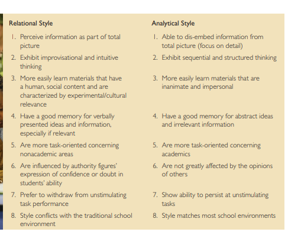

-  One theory suggests that members of minority groups who were voluntary 
immigrants are more apt to be successful in school than those who were brought into 
a majority culture against their will. For example, Korean children in the United States—
the sons and daughters of voluntary immigrants—perform quite well, as a group, in 
school. In contrast, Korean children in Japan, who were often the sons and daughters 
of people who were forced to immigrate during World War II, essentially as forced 
laborers, do less well in school. The theory suggests that the motivation to succeed is 
lower for children in forced immigration groups.
- 


#### `Thoughts`
---
#### `Keywords`

#### `Questions`
1. What is the role of cognition and thought in learning? 
2. To which observation of media aggression produces subsequent aggression on the part of viewers is a crucial—and controversial—question.`Page 255`
3. What about real-life exposure to actual violence? Does it also lead to increases in aggression? The answer is yes. Exposure to actual fi rearm violence (being shot or being shot at) doubles the probability that an adolescent will commit serious violence over the next two years.
4.  Do the differences in teaching approaches between cultures affect how people learn? Yes, Styles in learning
5. When people check their messages as soon as their device beeps, is that an example 
of classical conditioning, operant conditioning, or cognitive learning? Why? 
6. In the example of people checking their messages, what is the stimulus and what is 
the response? 
7. What is the reinforcement that keeps the message-checking behavior strong? Is it 
positive or negative reinforcement? Is the behavior ever punished? How so? 
8. If the message-checking behavior is so frequent that it becomes a problem, as 
Senator Cochran described, what strategies could be used to stop or control the 
behavior? 


---
#### `Summary`
---

## Memory 

### Section 1: The Foundations of Memory
#### `Main Notes`
- **Memory** The process by which we encode,store and retrieve information.
- **Encoding** The initial process of recording userful information in form useable to memory is encoding.
- **Storage** The maintainence of material stored in memory.
- **Three system approach to memory** 
  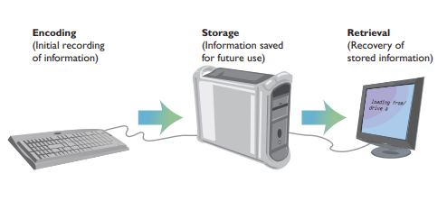
  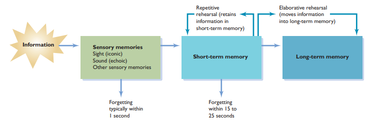
- **Sensory memory** The initial, momentary storage of information, lasting only an instant. 
- **Short-term memory** Memory that holds information for 15 to 25 seconds. 
- **Long-term memory** Memory that stores information on a relatively permanent basis, although it may be difficult to retrieve. 
- 
- **Iconic memory** reflects information from the visual system. 
- **Echoic memory** stores auditory information coming from the ears.
- Psychologist George Sperling in 1960 proved existence of sensory memory through 12 letter experimentation in rows.`Page 264`
- **Chunk** is a meaningful group of stimuli that can be stored in memory
- Process through which sensory memory is transformed to short termn is not known.
- **Rehearsal** Transfer of Information from short term memory to long term memory is done through reharsal.It serves 2 purposes.Retain the information in short term memory through repetition and transfer the info to long term memory.
-  if the information in short-term memory is rehearsed using a process called elaborative rehearsal, it is much more likely to be transferred into long-term memory. **Elaborative rehearsal** occurs when the information is considered and organized in some fashion.using organizational strategies such as these—called `mnemonics` —we can vastly improve our retention of information. **Mnemonics** formal techniques for organizing information in a way that makes it more likely to be remembered.
-  **Working Memory** A set of active temporary memory stores that actively manipulate and rehearse information.
-  Working memory is thought to contain a `central executive processor` that is 
involved in reasoning and decision making. The central executive coordinates three 
distinct storage-and-rehearsal systems: the visual store, the verbal store, and the episodic buffer.
  

-  Researchers now regard long-term memory as having several different components, or memory modules
-  **Declarative memory** Memory for factual information: names, faces, dates, and the like. 
- **Procedural memory** Memory for skills and habits, such as riding a bike or hitting a baseball; sometimes referred to as nondeclarative memory.
- **Semantic memory** Memory for general knowledge and facts about the world, as well as memory for the rules of logic that are used to deduce other facts.
- **Episodic memory** Memory for events that occur in a particular time, place, or context. 

  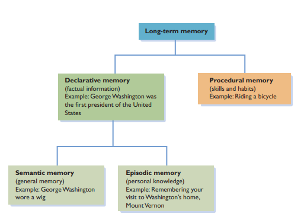

- **Semantic Network** Mental representation of cluster of interconnected information.


  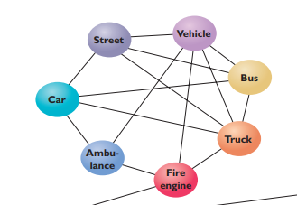

- Activating one memory triggers the activation of related memories in a process known as **spreading activation**.
- **Engram** is a term for Physical memory trace.
- Roughly seven (plus or minus two) chunks of information can be transferred

#### `Thoughts`
---
#### `Keywords`
- Serial position effect
- Primacy effect
- Recency Effect
- 
#### `Questions`
1. What is memory?
2. Are there diff erent kinds of memory?
3. What are the biological bases of memory?
4. `What is the distinction between Long term and short term memory?` The distinction between short- and long-term memory is also supported by the serial position effect, in which the ability to recall information in a list depends on where in the list an item appears. For instance, often a primacy effect occurs, in which items presented early in a list are remembered better. There is also a recency effect, in which items presented late in a list are remembered best.
5. `Where is long termn memory located in the brain ?` Different parts of brain specialize in different types of memory activities.`Hippocampus`, a part of the brain’s limbic system plays a central role in the consolidation of memories.`Amygdala` is especially involved with memories involving emotion. For example, if you are frightened by a large Doberman, you’re likely to 
remember the event vividly.
6. `How is the transformation of information into a memory reflected at the level of neurons?` One answer is `long-term potentiation`, which shows that certain neural pathways 
become easily excited while a new response is being learned. At the same time, the number of synapses between neurons increase as the dendrites branch out to receive 
messages. These changes reflect a process called consolidation , in which memories 
become fixed and stable in long-term memory
7. Why might researchers want only to reduce the intensity of a traumatic memory rather than erase it altogether?
8. What might be some of the practical or ethical issues involved with erasing unwanted memories?
9.  `Why are memory traces are distributed throughout the brain ?` when you recall a beautiful beach sunset, your recollection draws on memory stores located in visual areas of the brain 
(the view of the sunset), auditory areas (the sounds of the ocean). Diff areas process differet types of memory.

---

#### `Summary`
---
### Section 2: 
#### `Main Notes`
- **The top of the tongue phenomenon** The inability to recall information that one realizes one know but is unable to due to the difficulty of retrieveing information from long termn memory.
- **Recall** Memory task in which a specific information must be retrieved.
- **Recognition** Memory task in which individuals are exposed to stimuli and asked whether they have been exposed to it before or to identify it from a list of alternatves.
- **Retrievel Cue** A stimulus that allows to recall information more easily from the long term memory.
- **Level-of-processing-theory** The degree to which new information is deeply and critcally analyzed is crucial to how well we can remeber it later. More processing and analysis of information easier to remember. Theory says that information is processed at several levels.3 levels of processing
- Shallow Level: Conside only shape and sensory aspects
- Intermediate Level: Shapes is translated in meaninful of units such as letters in alphabets.Those letters are considered in their context and specific phonetic sounds.
- Deep Level:Thinking on meaning of information and how they relate to one another. We draw associations and link information with one another.For example in case of a shape of dog we may process it is associated with domesicated animals such as cats.  
- **Explicit Information** Intentional and concious recollection of information. You remember where you left the keys.
- **Implicit Information** Memorys of which people are not aware can affect their behaviour and performance. Such as jumping out of the path of an automobile coming towards you.Feeling of vague dislike for an acquaintance.It is closly related to prejudice and discrimation people exhibit towards minority.
- **Priming** When exposure to a word or concept makes it easier to recall information even when there is no concious memory or concept of that word.Example .Exposed to a word phobos in documentary and some months later when completing a crossword puzzle we come across a missing letters with obos we immediatly think of phobos.That is priming.Also called `retention without memory`.
- **Flashbulb memories** are memories related to a specific, important, or surprising event 
that are so vivid they represent a virtual snapshot of the event.e.g memory of a car accident,Seeing your crush for the first time etc.Details recalled in flashbulb memory are inaccurate.
- **Source amnesia** occurs when some has a memory about a material but cannot recall where he or she encountered it.E.g Meeting someone for the first time but unable to recall where you actually met.
- **Constructive Process** Processes in which memories are influenced by the context or meaning we give to events.
- **Schema** Organized body of stored memories that bias the way new information is interpreted,stored and retrieved.`Page 281. African american Prejudice recollection`
- **Contructive Process in Memory** Memory is based on contructive processes is put forward by `fredrick bartlett`.He argued that we rely on schemas to recall memories and schemas not only include the material information but also our understanding,perception,expectation and prejudices about the experience.
- **Memories in court** Calvin willis lost 2 decades of his life due to mistaken identity in a rape case.
- **Repressed Memories** Memories that are initially so shocking that individuals respond with push these memories to the unconcious.They can be error prone or entirely `false memories`.
- **Autobiographical Memories** Memories and recollections of our own lives.Influenced by constructive processes
- Culture determines how people frame information initially, how much they practice learning and recalling it, and the strategies they use to try to recall it.
- Eyewitnesses are apt to make substantial errors when they try to recall the details of crimes. The problem of memory reliability becomes even more acute when the witnesses are children.

#### `Thoughts`
---
#### `Keywords`
#### `Questions`
1. What causes diffi culties and failures in remembering?
2. Difference between recall and recognition ?
3. Why do mistaken identities or memory prone erros happen in court of law ? One reason it happens is that questions word by prosecutor or police officers effect the they recall that information. Second is weapons when a criminal brings out a gun it serves as an attention magnet and victims pay less attention to their surroundings and focus on the weapon.
4. What is the controversy regarding repressed memories ? When the source of memory becomes unclear and ambigious.People become confused and doubt whether the memories is real of fabricated .


---
#### `Summary`
---
### Section 3: Forgetting: When Memory Fails 
#### `Main Notes`
- **Decay** The loss of information in memory through its nonuse. This explanation for forgetting 
assumes that `memory traces`, the physical changes that take place in the brain when new material is learned, simply fade away over time.
- **Interference**. In interference, information in memory disrupts the recall of other information
- **Cue-dependent forgetting** Forgetting that occurs when there are insufficient retrieval cues to rekindle information that is in memory. 
-  In **Proactive interference**, information learned earlier disrupts the recall 
of newer material. Suppose, as a student of foreign languages, you fi rst learned 
French in the 10th grade, and then in the 11th grade you took Spanish. When in the 
12th grade you take a college achievement test in Spanish, you may fi nd you have 
diffi culty recalling the Spanish translation of a word because all you can think of is 
its French equivalent.

- In contrast, retroactive interference refers to diffi culty in the recall of information because of later exposure to different material. If, for example, you have diffi -
culty on a French achievement test because of your more recent exposure to Spanish, 
retroactive interference is the culprit (see Figure 3). One way to remember the difference between proactive and retroactive interference is to keep in mind that proactive 
interference progresses in time—the past interferes with the present—whereas retro-
active interference retrogresses in time, working backward as the present interferes 
with the past.

- The causes of Alzheimer’s disease are not fully understood. Increasing evidence 
suggests that Alzheimer’s results from an inherited susceptibility to a defect in the 
production of the `protein beta amyloid`, which is necessary for the maintenance of 
nerve cell connections. When the synthesis of beta amyloid goes awry, large clumps 
of cells form, triggering inflammation and the deterioration of nerve cells in the brain

- **Amnesia** Memory loss that occurs without other mental diffi culties 
- **Retrograde amnesia** Amnesia in which memory is lost for occurrences prior to a certain event.
- **Anterograde amnesia** Amnesia in 
which memory is lost for events that 
follow an injury.
- **Korsakoff’s syndrome** A disease that 
afflicts long-term alcoholics, leaving 
some abilities intact but including 
hallucinations and a tendency to 
repeat the same story.
- **Ways to Improve our Memory** 
1. Use the keyword technique. If you are studying a foreign 
language, try the keyword technique of pairing a foreign 
word with a common English word that has a similar 
sound. This English word is known as the keyword . For example, to learn the 
Spanish word for duck ( pato, pronounced pot-o ), you might choose the keyword 
pot;
2. Rely on organization cues . Recall material you read in textbooks by organizing the 
material in memory the fi rst time you read it. 
3. Take effective notes . “Less is more” is perhaps the best advice for taking lecture 
notes that facilitate recall.
4. Practice and rehearse . Although practice does not necessarily make perfect, it 
helps.
5. Don’t believe claims about drugs that improve memory.Not so, according to the results of numerous studies. No research has shown that 
commercial memory enhancers are effective


#### `Thoughts`
---

#### `Keywords`

#### `Questions`
1. Why do we forget information? Failure due to encode.lack of attention.Never transfered the information to long term memory. 
2. What are the major memory impairments?
3. Difference between interference and decay?In decay, the old books are constantly crumbling and rotting away, leaving room for new arrivals. Interference processes suggest that new books knock the old ones off the shelf, where they become inaccessible. 
4. `Forgetting is caused by the actual loss or modifi cation of information or by problems in the retrieval of information ?` Most research suggests that material that has apparently been lost 
because of interference can eventually be recalled if appropriate stimuli are presented 
(Tulving & Psotka, 1971; Anderson, 1981), but the question has not been fully 
answered. 
5. 
---
#### `Summary`
---
## Intelligence 

### Section 1: What Is Intelligence? 
#### `Main Notes`
- **Intelligence** The capacity to understand the world, think rationally and ability to use the available resources effectively when faced with challenges.
- **G-Factor** The single underlying factor assumed to measure intelligence in the early theories .It recorded spaital visualization skill,verbal competency and mathematical expertise.
- **Fluid Intelligence** Intelligence that reflects information processing ability, along with reasoning and memory.`E.g`Ability to reason abstractly.Group a series of letters according to some criteria or remember a set of numbers.
- **Cystallized Intelligence** Accumulation of Information, skills and strategies that people can apply for problem-solving.`E.g` Asked to take part in a discussion regarding political structure.We have to reply on our past experience and knowledge to come up arguments.
- **Theory of Multiple Intelligences** Howard gardner gave this theory. According to him there are 8 basic intelligences which are musical, bodily kinesthetic, logicalmathematical, linguistic, spatial, interpersonal, intrapersonal, and naturalist.These are relatively independent of each other.They are connected to different aspects of the brain.Every person has them in different degree.They do not work in isolation but rather in harmony with one another. Like writing an essay on nature would involve different aspects of intelligence from visualization to linguistical capability.Howard also says that there may be more such intelligences like `existential intelligence` thinking about our purpose. Dalai lama would show this sort of intelligence.
- When tasks require more general global intelligence more areas of brain are activated.
-  **Emotional intelligence** The set of skills that underlie the accurate assessment, evaluation, expression, and regulation of emotions.
- **Practical Intelligence** According to sternberg .Intelligence related to your overall success in life.   Sternberg argues there are 2 basic forms of intelligence. Creative and Analytical intelligence .
- **Analytical Intelligence** Related to understnading and dealing with abstract ideas.Such as measured in IQ tests.
- **Creative Intelligence** Related to generation of novel ideas and products.
- **Emotional Intelligence** Intelligence which is accurate assessment,understanding,expression and regulation of emotions .

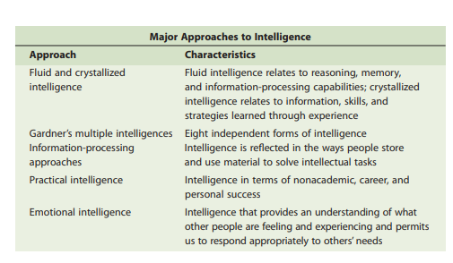

- **Intelligence Tests** Tests devised to quantify a persons level of intelligence.
- The first effort at intelligence testing was based on an uncomplicated 
but completely wrong assumption: that the size and shape of a person’s head could 
be used as an objective measure of intelligence. The idea was put forward by Sir 
Francis Galton (1822–1911), an eminent English scientist whose ideas in other domains 
proved to be considerably better than his notions about intelligence .

- **Mental age** The age for which a given 
level of performance is average or 
 typical. 
- French Psychologist `Alfred binet` developed the first real iq tests. Found Quesions through dull and bright students.To help the dullest student.
- **Intelligence quotient** A score that takes into accounts an individuals mental and chronological ages.
-  First formula for IQ in `CA` is chronological age and `MA` is Mental Age

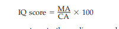

#### `Thoughts`
---
#### `Keywords` 
#### `Questions`
1. What are the diff erent definitions and conceptions of intelligence? 
2. What are the major approaches to measuring intelligence ?
3.  what do intelligence tests measure?
4. How is information process associated with general intelligence ? Research shows that people who spend more time on inital encoding of the problem, identifying different aspects of the problem and recalling information from long term memory to associate with the problem score higher than those who do not.Also speed of information processing shows another aspect of intelligence.  
5. What kinds of human intelligence might machines be unable to mimic?
6. Do you believe society should place limitations on just how smart machines can become?
7. What was Galton’s motivation to identify people of high intelligence ? Sense of superiorty in showing that people of high social class were more intelligent.
8. Difference between test validity and test reliability ?
---
#### `Summary`
---
### Section 2: Variations in Intellectual Ability
#### `Main Notes`
- **Mental retardation (or intellectual disability)** A condition characterized by significant limitations both in intellectual functioning and in conceptual, social, and practical adaptive skills.Occurs in 1% to 3% of population.Types of mental retardation: Mild retardation(55-69 IQ),moderate retardation(40-54) IQ,Severe retardation(25-39)IQ,Profound Retardation(Below 25)IQ.Only mild and moderate can function independently and hold families with little supervision. Others require life long care.
-**Causes**
1. **Down syndrome**, the type of mental retardation represents another major cause of mental retardation.Down syndrome results when a person is born with 47 chromosomes instead of the usual 46.
2. Birth complications, such as a temporary lack of oxygen, 
may also cause retardation. 
3. In some cases, mental retardation occurs after birth following a head injury, a stroke, or infections such as meningitis.
4. Majority of cases of mental retardation are classified as familial 
retardation, in which no apparent biological defect exists but there is a history of 
retardation in the family. Whether the family background of retardation is caused by 
environmental factors, such as extreme continuous poverty leading to malnutrition, 
or by some underlying genetic factor is usually impossible to determine.

- **Intellectually gifted** The 2%–4% segment of the population who have IQ scores greater than 130.

- 
#### `Thoughts`
---
#### `Keywords`
#### `Questions`
1. How are the extremes of intelligence characterized? 
2. How can we help people reach their full potential? 
3. Major cause of retardation ? `Fetal Alcohol syndrome`.Mothers drinking while pregnant.Research shows even little alcohol can cause damage to the fetus during pregnancy.
---
#### `Summary`
---
### Section 3: Group Diff erences in Intelligence: Genetic and Environmental Determinants
#### `Main Notes`
- Cultural Background and experience can effect the performance of an iq test taker.
- **Culture-fair IQ test** A test that does not discriminate against the members of any minority group. 
- **Heritability** A measure of the degree to which a characteristic is related to genetic, inherited factors. 
-  Average person today gets more items correct on IQ tests than the average person several generations ago, scores have risen signifi cantly—a phenomenon named `the Flynn effect`.e cause of the Flynn effect is not clear.It may due to better nutrition, better parenting, or improvements in the general social environment, including education. 
education
-  
#### `Thoughts`
---
#### `Keywords`
#### `Questions`
1. Are traditional IQ tests culturally biased? 
2. Are there racial differences in intelligence? 
3. To what degree is intelligence influenced by the environment and to what degree by heredity?
4.  Group, blacks tend to average 10 to 15 IQ points lower than whites.Does this variation reflect a true difference in intelligence, or are the questions biased with regard to the kinds of knowledge they test? `Good reason to believe that some standardized IQ tests contain elements that discriminate against minority-group members whose experiences differ from those of the white majority`
5.  
---
#### `Summary`
---
##  Motivation and Emotion 

### Section 1: Explaining Motivation

#### `Main Notes`
- **Motivation** The factor that directs and energizes the activities of humans and other organisms.
- **Instinct** Biologically built in patterns of behaviour in an organism.No consensus about how many instincts are these in the scientific community.
- **Instinct Theory** Instinct energizes our motivation. Like sexual behaviour is an outcome of instinct of reproduction.Inconclusive explaination into difficult complex motivations.  
- **Drive Reduction Approaches to motivation** States that a lack of basic biological requirement produces a motivation to fulfill that requirement. Such as lack of water, thirst may produce a motivation to acquire water.This model suggests if our stimulation and activity levels become too high, we try to reduce them.
- **Drive** Motivational Tension that energizes behaviour to fulfill that need.
- **Primary Drives** Sex, hunger, Thirsts , sleep are primary drives. In born.
- **Secondary Drives** Prior learning and experience bring about needs. They do not fulfill any obvious basic drive.Such as acadamical achievement.
- **Homeostasis** Tendency of body to keep a stable internal state.Like maintaining temperature by a thermostat.Receptor cells monitor body constantly.Like nutrition ,sleep requirements. When deviation from ideal state occurs , the body tries to bring it back to that state.
- **Drive reduction theory** does not explain when there is motivation not to reduce a drive but rather to maintain or arouse it even further.Like some behaviour seems to be motivated by nothing more than curiosity like checking email.
- **Arousal Approach to motivation** Goal is to maintain or increase excitement. Like drive reduction if our stimulation and activity levels become too high, we try to reduce them.But if our activity levels become too low we will increase it.People vary widely in the optimal level of arousal they seek out, with some people looking for especially high levels of arousal. For example, people who participate in daredevil sports, high-stakes gamblers, and criminals who pull off high-risk robberies may be exhibiting a particularly high need for arousal .
- **Incentive approaches to motivation Theories** suggesting that motivation stems from the desire to obtain valued external goals, or incentives.Like eating dessert after a fulfilling meal. it does 
not provide a complete explanation of motivation because organisms sometimes seek 
to fulfill needs even when incentives are not apparent.Drive and incentive explaination may work together in case of choosing a delicious look means when we are hungry rather than a bland looking one.
-  **Cognitive approaches to motivation Theories** suggesting that motivation is a product of people’s thoughts, expectations, and goals—their cognitions.Draws a key distinction between `intrinsic` and `extrinsic` motivation.Intrinsic motivation causes us to participate in an activity for our own enjoyment rather than for any concrete, tangible reward that it will bring us. In contrast, extrinsic motivation causes us to do something for tangible reward.

- **Maslow’s model** places motivational needs in a hierarchy and suggests that 
before more sophisticated, higher-order needs can be met, certain primary needs 
must be satisfied.

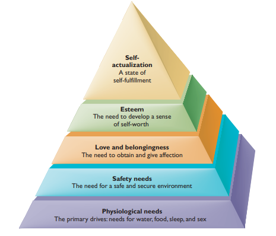
- **Self-actualization** A state of self-fulfillment in which people realize their highest potential in their own unique way. 
- Maslows, approach spawned other approaches.Edward Deci and Richard Ryan (2008) have considered human needs in terms of psychological well-being. They suggest in their `self-determination theory`
that people have the three basic needs of competence, autonomy, and relatedness. 
Competence is the need to produce desired outcomes, while autonomy is the perception that we have control over our own lives. Finally, relatedness is the need to be 
involved in close, warm relationships with others. In the view of self-determination 
theory, these three psychological needs are innate and universal across cultures, and 
they are essential as basic biological needs
-  
-   
#### `Thoughts`
---
#### `Keywords`
#### `Questions`
1.  How does motivation direct and energize behavior?
---
#### `Summary` Human Needs and Motivation: Eat, Drink, and Be Daring
---

### Section 2: 
#### `Main Notes`
- **Obesity** Body weight that is more than 20% above the average weight for a person of a particular height. 
- . Internal mechanisms regulate not only the quantity of food they take in, but also the kind of food they desire.
-  Hypothalamus acts as the brain’s “feeding center” and is primarily responsible 
for monitoring food intake.
- **Weight set point** The particular level of weight that the body strives to maintain. 
- **Metabolism** The rate at which food is converted to energy and expended by the body.
-  Eating and hunger are influenced both by biological and social factors. People in USA eat bigger portions compared to france or UK.
-  Psychologists suggest that oversensitivity to external eating cues based on 
social factors, coupled with insensitivity to internal hunger cues, produce obesity. 
Others argue that overweight people have higher `weight set points` than other people 
do. Because their set points are unusually high, their attempts to lose weight by eating less may make them especially sensitive to external, food-related cues and therefore more apt to overeat and perpetuate their obesity.
- Another biologically based explanation for obesity relates to fat cells in the body. 
Starting at birth, the body stores fat either by increasing the number of fat cells or 
by increasing the size of existing fat cells. Furthermore, any loss of weight past infancy 
does not decrease the number of fat cells; it only affects their size. Consequently, 
people are stuck with the number of fat cells they inherit from an early age, and the 
rate of weight gain during the fi rst 4 months of life is related to being overweight 
during later childhood .According to the `weight-set-point hypothesis`, the presence of too many fat cells from earlier weight gain may result in the set point’s becoming “stuck” at a higher 
level than desirable.
- **Eating Disorders**
-  **Anorexia nervosa** A severe eating disorder in which people may refuse to eat while denying that their behavior and appearance—which can become skeleton-like—are unusual.
-   **Bulimia** A disorder in which a person binges on large quantities of food, followed by efforts to purge the food through vomiting or other means.
-   **Ways to Lose Weight**
1. `There is no easy route to weight control` . You will have to make permanent changes 
in your life.
2. Keep track of what you eat and what you weigh
3.  Cut out television .
4.  Exercise
5.  Decrease the infl uence of external social stimuli on your eating behavior
6.  `Avoid fad diets` . No matter how popular they are at a particular time, extreme 
diets, including liquid diets, usually don’t work in the long run and can be 
dangerous to your health
7. Avoid taking any of the numerous diet pills advertised on television that promise quick 
and easy results
8. Maintain good eating habits
9. Set reasonable goals
-  **Need for achievement** A stable, learned characteristic in which a person obtains satisfaction by striving for and attaining a level of excellence.`Levels`People high in achievement motivation generally choose tasks that are of intermediate difficulty .In contrast, people with low achievement motivation tend to be motivated primarily by a desire to avoid failure.They too difficult or too easy tasks.
-  The measuring instrument used most frequently is the Thematic Apperception Test (TAT).Write a task achievement oriented story.`Page 379`
-  **Need for affiliation** An interest in establishing and maintaining relationships with other people.
-  **Need for power** A tendency to seek impact, control, or infl uence over others and to be seen as a powerful individual.  Men with high power needs tend to show unusually high levels of aggression, drink heavily, act in a sexually exploitative manner.


#### `Thoughts`
---
#### `Keywords`
#### `Questions`
1.  What biological and social factors underlie hunger?
2.  How are needs relating to achievement, affiliation, and power motivation exhibited?
3.  Why may some people’s weight set points be higher than those of others? One biological explanation is that obese individuals have a higher level of the hormone leptin, which appears to be designed, from an evolutionary standpoint, to “protect” the body against weight loss.
4.  What are the causes of anorexia nervosa and bulimia? Cause has roots in society’s valuation of slenderness.Another explaination  is mental imbalance in chemicals.
the parallel notion that obesity is undesirable
5. Why do obesity increases as countries become more developed ?
---
#### `Summary`
---
### Section 3:  Understanding Emotional Experiences 

#### `Main Notes`
- **Emotions** Feelings that have both congnitive and physiological elements and that influence behaviour.
- we can experience emotions that involve little or no conscious thought.
**Function of Emotions**
  1. `Preparing us for action` . Emotions act as a link between events in our environment and our responses.
  2.  `Shaping our future behavior` . Emotions promote learning that will help us make 
appropriate responses in the future. For instance, your emotional response to 
unpleasant events teaches you to avoid similar circumstances in the future.
  3. `Helping us interact more effectively with others` . We often communicate the 
emotions we experience through our verbal and nonverbal behaviors, making 
our emotions obvious to observers. These behaviors can act as a signal to 
observers, allowing them to understand better what we are experiencing and 
to help them predict our future behavior.

- Most researchers suggest that a list of basic emotions would include, at a minimum, happiness, anger, fear, sadness, and disgust.
  
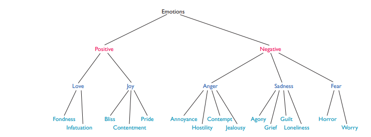

- One difficulty in defining a basic set of emotions is that substantial differences 
exist in descriptions of emotions among various cultures.
- Some theorists suggest that specifi c bodily reactions cause us to experience 
a particular emotion—we experience fear, for instance, because the heart is pounding 
and we are breathing deeply. In contrast, other theorists suggest that the physiological reaction results from the experience of an emotion.
- **James-Lange theory of emotion** The concept that emotional experience is a result of changes in physiology caused by events in our enviroment.Given by William James and Carl Lange.They suggested that for every major emotion there is an accompanying physiological or “gut” 
reaction of internal organs—called a `visceral experience`.`Page 385`
**Issues** 
  1. Emotional experiences frequently occur even before there is time for certain physiological changes to be set into motion.
  2.  The James-Lange theory poses another diffi culty: Physiological arousal does not 
invariably produce emotional experience. For example, a person who is jogging has 
an increased heartbeat and respiration rate as well as many of the other physiological 
changes associated with certain emotions. Yet joggers typically do not think of such 
changes in terms of emotion.

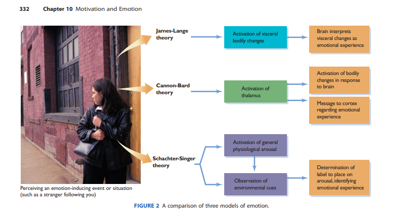

- **Cannon-Bard theory of emotion** The belief that both physiological arousal and emotional experience are produced simultaneously by the same nerve stimulus.  Walter Cannon and 
later Philip Bard suggested an alternative view.
**Development** More recent research has led to some important modifi cations of the theory. For one thing, we now understand that the hypothalamus and the limbic system, not the thalamus, play a major role in emotional experience. In addition, the simultaneous occurrence of the physiological and emotional responses, which is a fundamental assumption of the Cannon-Bard theory, has yet to be demonstrated conclusively
- **THE SCHACHTER-SINGER THEORY** The belief that emotions are determined jointly by a nonspecific kind of physiological arousal and its interpretation, based on environmental cues. Example `Page 387`.Schachter and Singer believed, they were right in 
assuming that when the source of physiological arousal is unclear, we may look to 
our surroundings to determine what we are experiencing.
- The amygdala , in the brain’s temporal lobe, is important in the experience of emotions for it provides a link between the perception of an emotionproducing stimulus and the recall of that stimulus later.
- **Facial-affect program** Activation of a set of nerve impulses that make the face display the appropriate expression.
- **Facial-feedback hypothesis** 
The hypothesis that facial expressions not only reflect emotional experience but also help determine how people experience and label emotions. For instance, the muscles activated when we smile may send a message to the brain indicating the experience of happiness—even if there is nothing in the environment that would produce that particular emotion.Some psychologist argue that facial expressions are necessary for an emotion to be experienced.

#### `Thoughts`
---
#### `Keywords`
#### `Questions`
1. What are emotions, and how do we experience them? 
2. What are the functions of emotions? 
3. What are the explanations for emotions?
4. How does nonverbal behavior relate to the expression of emotions? 
5. A current controversy focuses on whether the emotional response predominates over the cognitive response or vice versa ?`page 382`
6. Are basic facial expressions inborn or are they learned ?
7. How could blind athletes have learned when they would be expected to “smile politely,” even if they did not feel happiness ?
8. Although it seems like basic emotions are expressed similarly across cultures, can you think of examples of nonverbal behaviors that differ across cultures?
---
#### `Summary`
---


