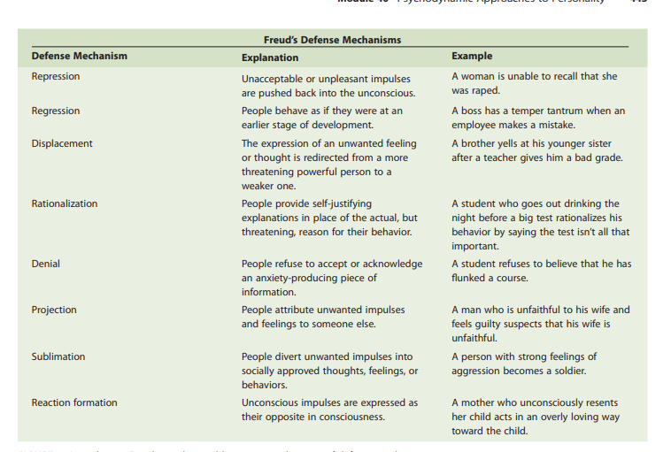
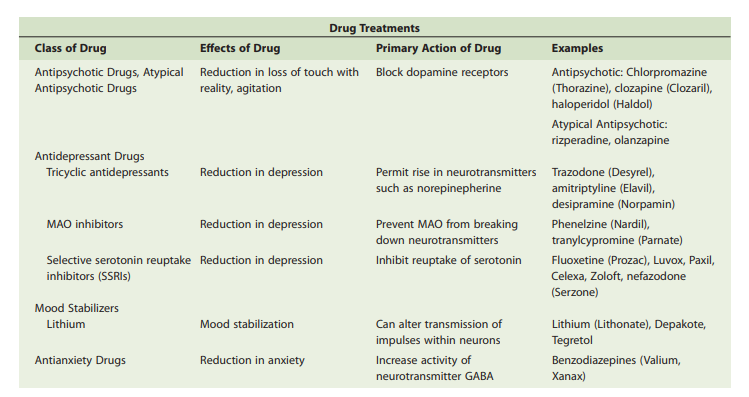

# Notes

- `Note` Go through recap pages of each chapter
- Default Book: `Understanding Psychology by Feldman` (UP)
- Jargon: symptoms,victim,maladaptive
- Alway read the Recap chapter part after each chapter
- Insert Twin example whereever you can
## Progress
| Chapters | Progress | 
|----------------|---------------|
| [Personality](#personality) | &#10004; Done
| [Learning](#learning)   | &#10004; Done
| [Memory](#memory)   |   &#10004; Done
| [Intelligence](#intelligence)   |   &#10004; Done
| [Motivation and Emotion](#motivation-and-emotion)   |   &#10004; Done
| [Health Psychology](#health-psychology)   |   &#10004; Done
| [Sensation and Percepion](#sensation-and-perception)   |   &#10004; Done
| [Central and Peripheral Nervous System](#central-and-peripheral-nervous-system)   |   In Progress
| [Social Psychology](#social-psychology)   |   In Progress
| [Psychological Disorders](#psychological-disorders)   |   In Progress

---
### Definition and scope

- Psychology is the scientific study of Behaviour and Mental Processes. Behaviour and Mental Processes doesnt only involve what humans do and think but rather perception,emotions,reasonining processes and even biological processes that maintain the body.

- Behaviour Neuroscience is a subfield of psychology that deals with how brain, the nervous system and other biological processes determine behaviour.Like certain areas of brain causing tremors in muscles of those suffereing from parkinson,s disease.

- Experimental Psychology deals with sensing,percieving, learning and thinking about the world.
    - Sub Specialy of Experimental Psychology:
    1. Cognitive Psychology : It involves higher mental processes like thinking,Memory, Decision making, judging, Problem solving and language .Like a cognitive pstchology might be interested in what a victim of a plane crash might remember about their experience.

- Developmental Psychology studies how a person grows from the point of conception to death.
- Personality Psychology studies how a person changes over a course of time and what traits are consist in his personality.Moreover,it also deals with the traits that differentiate one person from another.

- 

### Psychology as a Science

### Schools of thought and Perspective
- Seven thousand years ago, people assumed that psychological problems were caused by 
evil spirits. To allow those spirits to escape from a person’s body, ancient healers chipped 
a hole in a patient’s skull with crude instruments—a procedure called **trephining** . 
- **Tabula Rasa** John locke a british philosopher of 17 century believed that children were born into this world with blank slates `(Tabula Rasa)`.
- **Structuralism** Wilhem wundt,s approach which deals with uncovering fundamental mental components of consciousness ,thinking,perception and emotions along with other mental tasks.
- 
- **Introspection** A procedure used by Wilhem wundt to understand how basic sensory processes build our understanding of the world.They presented people with a stimulus—such as a bright green object or a sentence printed on a card—and asked them to describe, in their own words and in as much detail as they could, what they were experiencing. Wundt argued that by analyzing people’s 
reports, psychologists could come to a better understanding of the structure of the mind.


- **Functionalism** The perspective that replaced structuralism is known as functionalism. Rather 
than focusing on the mind’s structure, functionalism concentrated on what the mind 
does and how behavior functions.Functionalists, whose perspective became prominent in the early 1900s, asked what role behavior plays in allowing people to adapt 
to their environments. For example, a functionalist might examine the function of 
the emotion of fear in preparing us to deal with emergency situations. 

- The American educator John Dewey drew  on functionalism to develop the fi eld of school psychology, proposing ways to best meet students’ educational needs. 

- **Gestalt Psychology** Another important reaction to structuralism was the development of gestalt 
psychology in the early 1900s. Gestalt psychology emphasizes how perception is 
organized. Instead of considering the individual parts that make up thinking, gestalt 
psychologists took the opposite tack, studying how people consider individual 
elements together as units or wholes. Led by German scientists such as Hermann 
Ebbinghaus and Max Wertheimer, gestalt psychologists proposed that “The whole is 
different from the sum of its parts,” meaning that our perception, or understanding, 
of objects is greater and more meaningful than the individual elements that make up 
our perceptions.

- **Womens contribution to Psychology** Despite the hurdles they faced, women made notable contributions to psychology,  although their impact on the field was largely overlooked until recently. 
For example, 
Margaret Floy Washburn (1871–1939) was the first woman to receive a doctorate in 
psychology, and she did important work on animal behavior. Leta Stetter Hollingworth 
(1886–1939) was one of the fi rst psychologists to focus on child development and on 
women’s issues. She collected data to refute the view, popular in the early 1900s, that 
women’s abilities periodically declined during parts of the menstrual cycle.y. Anna Freud (1895–1982), the daughter of Sigmund Freud, 
also made notable contributions to the treatment of abnormal behavior,


### Recent Trends and Models of Psychology

- For Recent trends must go thorough page 73 and 74 of Understanding Psychology by Feldman
  Total 5 modern perspectives:

  1.  **Neuroscience perspective** The approach  that views behavior from the perspective of the brain, the nervous system, and other biological functions. 
  2.  **Psychodynamic perspective** The approach based on the view that behavior is motivated by unconscious inner forces over which the individual has little control.
  3.  **Behavioral perspective** The approach that suggests that observable, measurable behavior should be the focus of study.
  4.  **cognitive perspective** The approach that focuses on how people think, understand, and know about the world.
  5.   **Humanistic perspective** The approach that suggests that all individuals naturally strive to grow, develop, and be in control of their lives and behavior. 

- Point of Contention and Debate in the Psychology
-  Nature(Hereditary) vs Nurture( Enviromental Influences)
-  Concious vs unconcious behaviour
-  Free will vs determinism
-  Observable vs Internal processes and behaviours
-  Individual DIfferences(Unique personality) vs universal Principles(Product of culture and society)

---

## Part 2

### Nervous System , Neuron and its function

- **BioPsychologists or Behavioural Neuroscientists** Psychologists who specialize in how biology and body functions determine or effect behaviour.
- Around 1 trillion neurons in a human brain
- **Dendrite** A cluster of fi bers at one end  of a neuron that receives messages from other neurons.
- **Axon** The part of the neuron that carries messages destined for other neurons. 
-  **Terminal buttons** Small bulges at the end of axons that send messages to other neurons. 
-   **Myelin sheath** A protective coat of fat and protein that wraps around the axon.myelin sheath also serves to increase the velocity with which electrical impulses travel through axons. Those axons that carry the most important and most urgently required information have the greatest concentrations of myelin. If your hand touches a painfully hot stove, for example, the information regarding the pain is passed through axons in the hand and arm that have a relatively thick 
coating of myelin, speeding the message of pain to the brain so that you can react 
instantly.  

 **all-or-none law** The rule that neurons are either on or off.
  
  

**resting state** The state in which there is a negative electrical charge of about –70 millivolts within a neuron.Also  Like a gun, neurons either fire—that is, transmit an electrical impulse along the axon—or don’t fire. There is no in-between stage, just as pulling harder on a gun 
trigger doesn’t make the bullet travel faster
 
 

- **Action Potential** an electric nerve impulse that travels through a neuron’s axon when it is set off by a “trigger,” changing the neuron’s 
charge from negative to positive. Movement of an action potential along an axon. Just before Time 1, positively charged ions enter the cell membrane, changing the charge in the nearby part of the axon from negative to positive and triggering an action potential. The action potential travels along the axon, as illustrated in the changes occurring from Time 1 to Time 3 (from top to bottom in this drawing). Immediately after the action potential has passed through a section of the axon, positive ions are pumped out, restoring the charge in that section to negative.

- Just after an action potential has passed through a section of the axon, the cell 
membrane in that region cannot admit positive ions again for a few milliseconds, 
and so a neuron cannot fi re again immediately no matter how much stimulation it 
receives.

- Axons with small diameters carry impulses at about 2 miles per hour; longer and thicker ones can average speeds of more than 225 miles per hour.

- Some neurons are capable of firing as many as 1,000 times per second; others fi re at much slower rates. The intensity of a stimulus determines how much of a neuron’s potential fi ring rate is reached. A strong stimulus, such as a bright light or a loud sound, leads to a higher rate of 
firing than a less intense stimulus does 

- **Mirror neurons** Specialized neurons that fire not only when a person enacts a particular behavior, but also when a person simply observes anotherindividual carrying out the same 
behavior. 
-  **synapse** The space between two neurons where the axon of a sending neuron communicates with the dendrites of a receiving neuron by using chemical messages. 

-  **Neurotransmitters** Chemicals that carry messages across the synapse to 
the dendrite (and sometimes the cell body) of a receiver neuron

 

- Several types of neurotransmitters, and not all neurons are capable of receiving the chemical message carried by a particular neurotransmitter. In the same way that a jigsaw puzzle piece can fit in only one specifi c location in a puzzle, each kind of neurotransmitter has a distinctive configuration that allows it to fi t into a specific type of receptor site on the receiving neuron

- If a neurotransmitter does fit into a site on the receiving neuron, the chemical 
message it delivers is basically one of two types: excitatory or inhibitory

-  **Excitatory message** A chemical message that makes it more likely that a receiving neuron will fire and an action potential will travel down its axon.

- **Inhibitory message** A chemical message that prevents or decreases the likelihood that a receiving neuron will fire.

- If neurotransmitters remained at the site of the synapse, receiving neurons would 
be awash in a continual chemical bath, producing constant stimulation or constant 
inhibition of the receiving neurons—and effective communication across the synapse 
deactivated by enzymes or—more commonly—reabsorbed by the terminal button in 
would no longer be possible. To solve this problem, neurotransmitters are either 
an example of chemical recycling called **reuptake** .

- Some antidepressant drugs, called SSRIs, or selective serotonin reuptake inhibitors , permit certain neurotransmitters to remain active for a longer period at certain synapses in the brain, thereby reducing the symptoms of depression

 

- **Parkinson’s disease**, from which actor Michael J. Fox suffers, is caused by a defi ciency of dopamine in the brain.

- **over production of dopamine** produces negative consequences. 
For example, researchers have hypothesized that schizophrenia and some other 
severe mental disturbances are affected or perhaps even caused by the presence of 
unusually high levels of dopamine. Drugs that block the reception of dopamine 
reduce the symptoms displayed by some people diagnosed with schizophrenia

- Endorphins also may produce the euphoric feelings that runners sometimes 
experience after long runs. The exertion and perhaps the pain involved in a long run 
may stimulate the production of endorphins, ultimately resulting in what has been 
called **“runner’s high”**

- Endorphin release might also explain other phenomena that have long puzzled 
psychologists. For example, the act of taking placebos (pills or other substances that 
contain no actual drugs but that patients believe will make them better) may induce 
the release of endorphins, leading to the reduction of pain

### Questions
1. 

### Central and Peripheral Nervous System

- **Central nervous system (CNS)** The part of the nervous system that includes the brain and spinal cord. 
 
- **Spinal cord** A bundle of neurons that leaves the brain and runs down the length of the back and is the main means for transmitting messages between the brain and the body.

- `Example:` The spinal cord is not just a communication channel. It also controls some simple behaviors on its own, without any help from the brain. An example is the way the knee jerks forward when it is tapped with a rubber hammer. This behavior is a type of refl ex , an automatic, involuntary response to an incoming 
stimulus. A refl ex is also at work when you touch a hot stove and immediately withdraw your hand. Although the brain eventually analyzes and reacts to the situation (“Ouch—hot stove—pull away!”), the initial withdrawal is directed only by neurons in the spinal cord.

- **Reflex** An automatic, involuntary response to an incoming stimulus.

 

 
- **Sensory (afferent) neurons** Neurons that transmit information from the perimeter of the body to the central nervous system. 

- **Motor (efferent) neurons** Neurons that communicate information from the nervous system to muscles and glands. 
- **Interneurons** Neurons that connect sensory and motor neurons, carrying messages between the two. 

- **Peripheral nervous system** The part of the nervous system that includes the autonomic and somatic subdivisions; made up of neurons with long axons and dendrites, it branches out from the 
spinal cord and brain and reaches the extremities of the body. 

- **Somatic division** The part of the peripheral nervous system that specializes in the control of voluntary movements and the communication of information to and from the sense organs. 

- **Autonomic division** The part of the peripheral nervous system that controls involuntary movement of the heart, glands, lungs, and other organs. 

- **Sympathetic division** The part of the autonomic division of the nervous system that acts to prepare the body for action in stressful situations, engaging all the organism’s resources to 
respond to a threat. 

-  **Parasympathetic division** The part of the autonomic division of the nervous system that acts to calm the body after an emergency has ended. 

- **Physiological changes that occur during a crisis** `Example:`Page 126 Understanding Psychology
  


 


   
  - **Evolution of Nervous System**The complexities of the nervous system can be better understood if we take the course of evolution into consideration. The forerunner of the human nervous system 
is found in the earliest simple organisms to have a spinal cord. Basically, those organisms were simple input-output devices: When the upper side of the spinal cord was 
stimulated by, for instance, being touched, the organism reacted with a simple 
response, such as jerking away. Such responses were completely a consequence of 
the organism’s genetic makeup. 
 Over millions of years, the spinal cord became more specialized, and organisms 
became capable of distinguishing between different kinds of stimuli and responding 
appropriately to them. Ultimately, a portion of the spinal cord evolved into what we 
would consider a primitive brain. 
 Today, the nervous system is hierarchically organized, meaning that relatively 
newer (from an evolutionary point of view) and more sophisticated regions of the 
brain regulate the older, and more primitive, parts of the nervous system. As we 
move up along the spinal cord and continue upward into the brain, then, the functions controlled by the various regions become progressively more advanced

- **Evolutionary psychology** The branch of psychology that seeks to identify behavior patterns that are a result of our genetic inheritance from our ancestors. 

- **Behavioral genetics** The study of the effects of heredity on behavior. 

- **Behavioral genetics lies at the heart of the nature-nurture question**, one of the key 
issues in the study of psychology. Although no one would argue that our behavior is 
determined solely by inherited factors, evidence collected by behavioral geneticists 
does suggest that our genetic inheritance predisposes us to respond in particular ways 
to our environment, and even to seek out particular kinds of environments. For 
instance, research indicates that genetic factors may be related to such diverse behaviors as level of family conflict, schizophrenia, learning disabilities, and general sociability.(`Page 128: Understanding Psychology`)

- **Controversy: Behavioral genetics**For instance, questions about the existence of genetic 
infl uences on criminality, intelligence, and homosexuality raise considerable emotion. 
Furthermore, it is unclear what the social and political consequences of discoveries 
in behavioral genetics would be. Would finding a strong genetic basis for criminal 
behavior lead to genetic screening and restricted civil rights for individuals having 
“criminal” genes? Clearly, behavioral genetic discoveries could have an impact on a 
number of important social issues.

 - **Gene therapy** , scientists inject into a patient’s bloodstream genes meant to cure a particular disease. When the genes arrive at the site of defective genes that are producing the 
illness, they trigger the production of chemicals that can treat the disease.
- `Example:`  Gene therapy is now being used in experimental trials involving people with certain forms of cancer and blindnes
-  **Genetic counseling**. Genetic counselors help people deal with issues related to inherited disorders. For example, genetic counselors provide advice to prospective parents about the potential risks in a future pregnancy, based on their family history of birth defects and hereditary illnesses. 
 


### Endocrine System

- **Endocrine system** A chemical communication network that sends messages throughout the body via the bloodstream.
- **Hormones Chemicals** that circulate through the blood and regulate the functioning or growth of the body. 
- Although the endocrine system is not part of the brain, it is closely linked to the hypothalamus.

- Neural messages move through neurons in specific lines (like a signal carried by wires strung along telephone poles), whereas hormones travel throughout the body, similar to the way radio waves are transmitted across the entire landscape. Just as radio waves evoke a response only when a 
radio is tuned to the correct station, hormones flowing through the bloodstream 
activate only those cells that are receptive and “tuned” to the appropriate hormonal 
message. 

- **Pituitary gland** The major component of the endocrine system, or “master gland,” which secretes hormones that control growth and other parts of the endocrine system. It is 
found near—and regulated by—the hypothalamus.  called the “master gland” because it controls the functioning of the rest of the endocrine system.
<br/> 
`Example` 
hormones secreted by the pituitary gland control growth. Extremely short people and unusually 
tall ones usually have pituitary gland abnormalities.

## PART 3

### Sensation and Perception

### Section 1: Vision
#### Main Notes
- Super Recognition and Faceblindness are disorders
- **Sensation** Encompasses the processes through which our sense organs recieve information from the world around them.
- **Perception** is sorting,organization,analysis,interpretation and integration of that information by our sense organs and brain.
- Difference between sensation and perception is : Sensation is the first encounter of organism with raw sensory stimulus and perception is the process through which it analyzes, interprets and integrates that stimulus with other sensory information.
- **Stimulus** is any passing source of energy that produces a response in a sense organ.
- **Psychophysics** is the branch of psychology that studies the relationship between physical aspects of stimulus and our psychological experience of them.
- **Absolute Threshold** is the smallest intensity(amount) of a stimulus that must be present for it to be detected.Technically absolute threshold is a the intensity of a stimulus that can be detected 50% of the time.
- **Noise** as defined by psychophysicists is background stimulation that interferes with detection of other stimuli.(Unwanted Stimulus.Encompasses all the stimulus)
- **Difference Threshold**`(also called Just Noticeable difference)` The smallest intensity of added or reduced stimuli that makes it possible to detect that a change in the stimulus has occured.
- **Webers,s Law**`(Page 104: Understanding Psychology)`The just noticable difference is a constant proportion to the intensity of initial stimulus. 
- **Adaption** An adjustment in sensory capacity after prolonged exposure to unchanging stimuli
- **Visual Spectrum** Range of Wavelength that human beings are sensitive to.It is relatively small.
- **Accomodation** Lens changes its thickness to focus light on the back of the eye.
- **Retina** is the part of eye that converts light enery to electrical Impulses to be transmitted to the brain.
- **Rods** Thin cyclindrical receptor cells in the retina that are highly sensitive to Light.It is related to dim vision.Insensitive to color and detail.It is responsible for **peripheral Vision** Recognizing Objects that are outside of main focus. 
- **Cones** Cone shaped light sensitive receptor cells inside the retina that are responsible for focus and color  particularly in bright lights.Cones are concentrated on the part of retina called **Fovea**.Fovea is particularly sensitive.When you focus on a particular object of interest the image is centered on fovea to see it more sharply. 
- **Dark Adaptation** Processes of adapting to dim light after being in a bright light enviroment.Cones and rods are involved in it. **Light adaption** opposite of dark adaptation.These processes occur as a result of rate of change in chemical composition in Rods and cones.Because change in rods take 20 to 30 minutes to reach maximum level ,Dark adaptation takes longer.While cones reach maximum level in a minute or so. 

 


- **Optic Nerve** A bundle of `ganglion` axons that carry visual information to the brain.
- **Bipolar Cells** Inside Retina.Recieve from rods or cones , transmit to ganglion cells.
- **Ganglion Cells** Collect and summarize visual Information and then send it to the brain.Detect maximum light and darkness variation in the light.(`page 162:UP`)
- **Blind Spot** The opening of the optic nerve passes through the retina there are no rods or cones in that area so it creates a blind spot.
- **Optic Chiasm** Optic nerves from the 2 eyes meet at a specific point where `each optic` never then splits.

 

- David Hubel and Torsten Wiesel won the Nobel Prize in 1981 for their discovery that 
many neurons in the cortex are extraordinarily specialized.**Feature Detection** The activation of Neurons in Visual  Cortex by visual stimuli of specific shapes or patterns.Some cells are only activated by moving as opposed to stationary objects others by lines of diff shape ,width or orientation.
- Diff parts of brain process nerve impulses in several diff individual systems.
- **Ocular Dominance columns** Our brains process information coming from the 2 eyes seperatly, creating what is ODC.
- A normal Person is capable of distinguishing no less than 7 million colors.
- Approximatly 7 % men and 4 % women  are **color blind**. For most people with color blindness red fire appears yellow,Green grass seems yellow,Three colors of traffic light all appear yellow.
- Different types of color blindness , unable to differentiate between blue- Yellow.or all red,green seems yellow.In extreme cases ,no perception of color.Vision is like black and white tv.
- **Afterimage** Activity in the retina continues even when you are no longer looking at the original object.
- **Theories of Color Vision:**
  1. **Trichromatic theory of color vision:** Proposed by thomas young in the first half of 1800s.According to the theory retina contains 3 types of cones which are sensitive to specific wavelengths. One to yellow-red,one to green, one to blue-violet.According to the theory perception of color by the strength with which these cones are activated when they come in contact with light.
  **Example:** When looking at blue sky.Blue-violet cones are primarily activated and the other less so.
  **Issues:** It does not explain why the after image afterstaring at a yellow for one minute appears red.

  2. **Opponent Process Theory of color vision:** Proposed by Ewald hering in 19th century.Proposes that receptor cells are linked in pairs.Working in opposition.Pairs are Blue-Yellow, Red-Green and black-white.When an image contains more yellow than blue.Yellow receptors are activated and vice versa.
  **AfterImage Problem** It explains that after staring at a yellow page for long the yellow receptor cells become fatigued and are not able to respond well to new stimuli.However the paired blue cells are capable of responding because they have not been stimulated.So when you shift to white paper after staring at a yellow page for 1 minute.The Blue receptors are activated and respond and yellow cells being fatigued do not respond.Consequently, Blue color is seen in the after image.However the afterimage lasts only a while because the fatigue of yellow cells is quickly overcome.

  


#### Thoughts
```
- if our ears were more sensitive that they already are it would be problem matic because of we would be able to hear the sound of air molecules knocking into ear drum.
- Webers Law, According to him the difference threshold for weight is 1:50.It means that 1 ounce of weight change in an item of 50 ounces weight would be just noticable.It explains why a person sitting in a quiet room is more startled  by phone ringing than a person sitting in a noisy room.
- Webers Law hold for every kind of stimulus
- Pupil contraction in bright light allows us to see object at a greater distance in Fpcus.If pupil were to expand and let in all the light than our ability to see objects at a greater detail at distance would be reduced.
- Len becomes flatter when viewing distant objects and rounder when viewing objects at a closer distance.
- We never notice the blind spot because the information is automatically filled by  using nearby materials to compensate for the missing information.
```
---
#### Keywords
- Super-Recognition
- Faceblindness
- Iris
- Cornea
- Pupil
- Retina
- Bipolar Cells
- Ganglion cells
- Blind Spot
- Color Vision
- Color Blindness
  

#### Questions
1. What is Sensation and how do psychologists study it ?
2. What is the relationship between physical stimulus and the kinds of sensory response that result from it ?
3. How do we see colors ?
4. What processes underlie that vision system (Sense of vision) ?
5. Why shouldn’t the pupil be open completely all the time, allowing the greatest amount of light into the eye?`160`
6. What role does ear play in senses of sound, motion and balance ?
7. How do smell and taste  function ?
8. What are skin senses and how do they relate to pain ?
9. What principles underlie our organization of visual world and allow us to make sense of it ?
10. How are we able to perceive 3D world when our retina can only sense 2D information ?
11. What clues do visual illusions give us about our understanding of general visual mechanism >
12. Difference between Sensation and Perception ?
13. How do we differenciate one person from another in context of sensation and perception ?
14. What would happen if our ears were more sensitive than they already are ?
15. Why would frequent multitaskers be more distractible than those who multitask 
less frequently?
15. Why a person sitting in a quiet room is more startled by phone ringing than a person sitting in a noisy room.
16. Why shouldn’t the pupil be open completely all the time, allowing the greatest 
amount of light into the eye?
17. Why does dark adaptation takes significantly longer than light adaptation ?
18. What happens when light enters the retina ?
19. Why do we never notice the blind spot ? and What advantage does this automatically filling has ?
20. How is image formed in the brain whole process ?(`Page 160:UP`)
---

#### Summary


### Section 1: Hearing and Other Senses
#### Main Notes
- Sound The Motion of air molecules brought about by a source of vibration
- The part of ear that vibrates when sound waves strike it
- A coiled tube in the ear filled with liquid that vibrates in response to sound waves.
- Basilar membrane A vibrating structure that lies inside the cochlea and divides it into upper and lower chamber with sound receptor cells attached to it.
- Process of Hearing: Sound enters out Ear ==> Strikes Ear drum .Transmit vibrations to middle ear==> Middle ear contains hammer,anvil and stirrup.They transmit and amplify vibrations through the oval window.It reaches inner ear ==> Inner ear contains Cochlea inside it is basilar membrane.(`Page 169:UP`)When vibrations bend hair cells on the basilar membrane neural Messages are sent to brain.
- Hair cells attached to the basilar membrane when bent due to sound send neural messages to the br ain. 
- Frequency is the number of wave cycles that occur in a second.
- Pitch is the characteristic that makes sound appear high or low.Low frequency translates into low pitched sound.Lowest pitch detectable by humans 20 decibels.Highest 20,000.When sound gets higher than 120 decibels it becomes painful to ear.Our hearing capacity diminishes as we age especially for high pitched sounds.`Thats why older people often cannot hear low pitched sounds`.
- Amplitude is the feature of waves that allow us to determine whether sound is loud or soft.Waves with `small peaks and valleys are soft and vice versa`.
- Place theory of Hearing States that different part of the basilar membrance respond to different frequencies.
  **Issues** Doesnt tell the whole story.Low frequency sounds trigger neurons basilar membrane over such a large area that no single point can be specified.
- Frequency theory of Hearing states that basilar membrane acts like a microphone responding as a whole to frequencies.The higher the pitch the greater the number of neural impulses to the brain
  **Issues** Both theories do not fully explain the process of hearing.Place theory provides a better explaination for higher frequencies while frequency theory for lower frequencies.
- Semicircular canal 3 tubelike structures with fluid inside them that sloshes around when the head is moved signaling rotational or angular movement of brain.
- Otholiths semi cicular crystals in side the semicircular canal which detect the pull of gravity ,accelation and movement.When we move otholiths shift like sand in wind and come in contact with hair cells.
- Human sense of smell(olfaction) allows us to distinguish between 10,000 smells.Women general have better sense of smell.People can distinguish gender base on smell alone.
- We smell when air molecules of some object interact with nasal receptor cells present inside our nose.Smell may also act as a secretive means of communication.Non humans use phermones to communicate sexual attraction or availability.
- Gustation(Sense of Taste) involves receptor cells that respond to basic 4 stimulus qualities : salty,Sweet,sour and bitter.There is a fifth one but debatable its called umami meaning meaty or savoury.Its japanes.Every taste is a simple combination of these basic 4.Like colors.Receptor cells are roughly 10,000.They wear out and are replaced every 10 days.If this did not happen we would lose our sense of taste if we accidently burned our tongue.Some people are super tasters with twice as many receptors on tongue as non tasters.
- Skin senses are touch,pressure, temperature and pain.
- Women experience pain more intensely than men.It may depend on the situation along with mental state,Experience and background of the individual.Soldiers after being hurt have a diminished because they are at a relief that they are alive.
- Gate control theory of Pain states that receptor cells in the spinal cord lead to certain areas in brain related to pain.When body is injured and these receptor cells become activate.A gate way is opened to the brain and we experience the sensation of pain.
  2 ways that this gateway  can be closed or diminished in some sense.
  1.  Other Impulses  than pain can overwhelm or compete for the path to brain and closing the gate.Hence ending the pain sensation.THis is one of reason rubbing around the area of injury than reduce pain.
  2.  Psychological factors can diminish pain such as soldier at relief of being alive.
- Strategies to Fight Pain:
    1. Medication
    2. Nerve and Brain stimulation .Passing current through nerve or centain parts of brain
    3. Light therapy.Exposure to lights of certan wavelengths results in pain reduction
    4. Hypnosis 
    5. BioFeedback and relaxation: Biofeedback is learning to control involuntary functions of body like heart beat.
    6. surgery: cutting the nerve pathway.
    7. Cognitive Restructuring : Thinking positively


- 
#### Thoughts
```
- Left ear reacts more to speech while right ear reacts more to music.
- Gate pain theory explains the pain relieving method of acupunture and why it works .The needle may block the gateway to the brain , lessening the experience of pain.
```
---
#### Keywords
- vocal cues
- Pitch 
- Frequency
- Otholths
- Supertasters
- Reflex Sympathetic dystrophy syndrome(Small movement or gust of wind can product agony)
- Skin senses
- Synesthesia( Like seeing color when listening to music,Or having bitter taste in ur month on touch a meat patty.)
---
#### Questions
1. `How are our brains able to sort out wavelengths of different frequencies and intensities?`(Part of basilar membrane neart to the oval window is most sensitive to high frequency sounds,Cochleas inner end is most sensitive to low frequency.So this explaination supports Place theory. )
2. Why does space sickness occur ? Due to weightless ness of otholiths.
3. Do humans communicate through smell ? 
4. Why do non tasters seek out relatively sweet foods as compared to super tasters ? less receptor cells.
5. `What are the causes for synesthesia(see color with sound) ?` Possible explainations: Dense neural networks between different sensory areas of brain or lack of neural control that inhibits connection between sensory areas.
---
#### Summary

--- 
### Section 2: Perceptual Organization: Constructing Our View of the World
#### Main Notes
- **Gestalt Law of Organization** Some of the basic sensory processes can be described by the way we organize bits and pieces of information into meaningful wholes.Set forth in ear `1900s`.Some of the principles are close,proximity, similarity and simplicity.
 
**Contemporary** Gestaltk psychology no longer play a prominant role in modern psychology but one principle that still retains its relevance is that two objects considered together form a whole different than the simple combination of singular objects. 
- **Ways of Processing**
- **Top down Processing(tdp)** Perception that is guided by high level known, experience and expectations. We try to see the whole picture instead of singular instances.Thats why you can understand words that might have some letters missing.Such as `Helo,l-tt-r,ev-ry`. Top down processing allows us to fill in gaps and  make sense of missing information.Top down processing cannot occur on its own.Bottom up processing is required. If we did not know the meaning of individual words it would be impossible to make sense of sentences that might be missing some words.
- **Bottom up Processing(bup)** Process of recognizing and processing information from individual bits and moving towards the perception of the whole.BUP and TDP occur simuntaniously .Context is very important in TDP.
- **Depth Perception** The Ability to view the world in 3 dimentional plane and perceive distance.
- **Binocular disparity** The difference between the images seen by the left and the right eye.In some cases particular cues allow us to percieve depth and distance. Through a single eye called **monocular cues** Like motion parallax.
- **Monocular cues** `Relative size`. Experience taught us that object of same size but making images of different size on the retina tell us that the object with small image is farther away.`Texture Gradient` tells us about the distance because the details of object that are far away are less distinct.`Linear Perspective` Like railway tracks in the distance.Far away objects appear to be closer to each other than objects that are not distant.
- **Perceptual Constancy** Perception of objects is unvarying and consistant even if their appearance or enviroment changes. Like person moving away from us.His size shrinks but we undstand them to be the same.It can sometimes mislead us.Like moon above the sky is perceived smaller and distant while moon appearing close to the horizon appears huge and closer.(`Page 185:UP`)
- **Apparant Movement** The perception that a stationary object is moving. Like sitting in stationary state you something think that it has started moving when infact it hasn't.
- **Perception of motion** Movement of the objects image on our retina.But its alway not the cases.Otherwise we would always consider the world at motion when we move our head.
- **Visual Illusions** Physical stimuli that consistantly produce error in perception.
- **Muller Lyer Illusion** `page 186:UP` 2 lines of equal length. One line with arrow tip pointed inward appears longer than the line with arrow tip pointed outward.One explaination is when tip is inward the eye movements are greater percieving it to be longer.


- **Devil tuning Folk** Problematice for people brought up in western world to reproduce because they perceive objects in 3D while people brought up in zulu culture can reproduct it easily.Cultural differences are reflected in depth perception
- **Subliminal Perception** Perceiving minor cues that we are not aware of.They do affect our behaviour.Such descriptive label called **prime** shown to a subject really fast before he can register it about some person and he forms an opinion based on that label such as happy or smart.
- Subliminal messages are called `priming`.Little evidence to prove that it leads to major changes.Thirst and coca cola example on it.`188:IP`.
- **ESP** Extra sensory perception.Scientists are skeptical of it.It involves perceiving information with out using our senses.Example mind reading,clarvoyance.
#### Keywords
- Motion Parallax : The change in position of an object caused by the movement of your body.
---
#### Questions
- What principles underlie organization of the visual world and allow us to make sense of the world ?`180`
- Overarching rule in gestalt law of organization ?`181`
- Types of processing ?`181`
- What is top down and bottom up processing >`182`
- What is depth perception ?`183`
- Why top down processing cannot occur on its own ?
- binocular disparity ?`183`
- How are we able to sense the world in 3D when our retina are only capable of sensing on 2-D Images ?`183`
- How can percieve depth and distance with only one eye ?`183`
- perception constancy ?`184`
- What clues do illusions give us about our understanding of general perceptual mechanisms ?`185`
-  Can stimuli that we’re not consciously aware of change our behavior? In some ways? `188`
- How does tdp and bup occur ?
- `How do we make transformation from 2d to 3d  and Percieve distance?` There is a distance between the 2 eyes and so the images reach each eye are different.The brain integrates that images into one.It also recognizes the difference in the images and uses that difference to determine the distance of an object.E.g Pencil at arm length example.(`Page 183:UP`)
- Why does perceptual constancy problem in moon viewing occurs ? Explain
- 
---
#### Summary

--- 
## Learning
### Section 1: Classical Conditioning
#### Main Notes
- **Learning** A relatively permanent change brought about by experience.
- **Habituation** is decreased response to a stimulus after repeated expose to it.Like an infant is excited by a toy initially but soon gets bored after being presented with it dialy.
- Ivan pavlov developed the framework for learning in 20th century called classical conditioning.
- **Classical Conditioning** A type of learning when a neutral stimulus brings about a condition response when it is associated with a stimulus that naturally brings out a response.
- Neutral Stimulus A stimulus that does not naturally bring out a response of interest before conditioning.
- Unconditioned stimulus UCS A stimulus that naturally brings out a response of interest without being conditioned
- A response that is natural and needs no conditioning. Like salivation at the sight of food for dog.
- Conditioned Response A response that after conditioned is produced after occurance of a neutral stimulus.
- The sequence and timing of  Neutral stimulus and uncondition stimulus is of grave importance.Research has shown that conditioning is most effective if the neutral stimulus precedes the unconditioned stimulus by half a second or a few seconds.
1. Neutral stimulus  after uncondition stimulus : Little chance of becoming a condition stimulus
2. Neutral stimulus  before uncondition stimulus : Good chance of becoming a condition stimulus
- Emotional responses are especially likely to be learned through classical conditioning.
- `Little  Albert rat experiment by John B watson (Page 232)`
-  **Phobias** Intense irrational fears formed through classical conditioning. PTSD is example of phobia when hearing loud sounds.
-  **Extinction** A basic phenomenon of learning in which the conditioned response diminishes over time and eventually stops occuring after a conditioned stimulus.
-  Spontaneous Recovery The reemergence of extinguish conditioned response after a period of rest.It explains why drug addicts often relapse when presented with a conditioned stimulus.
-  Stimulus Generalization A process in which after a conditioned stimulus has been learned, stimulus that are similar to the original stimulus produces condition response.Its intensity is not equal to the original but proportional to how similar is the stimulus to the original stimulus.
-  Stimulus discrimination When 2 stimulus are distinct from one another.Then one produces a conditioned response and the other does not.Like we learned to pet a barking dog whose tail is wailing but not a barking dog whose tail is standing straight.
-  Pavlov hypothesized that all learning is nothing more than a long string of condition response.But it is not true.`Page 235 for this discussion`

#### Thoughts
---
#### Keywords
#### Questions
- What is learning? `229`
- habituation ?example `229`
- How do we learn to form associations between stimuli and responses?
- How do we know when a behavior has been influenced by learning—or even is a result of learning?(Nature and Nurture problem.Whether learning involved or maturation.`Page 229`)
- What is classical conditioning >`230`
- What things can be learned by classical conditioning ? phobias and ptsd `232`
- Extinction ? how to do it ? Spontaneous reemergence ?`233`
- Spontaneous recovery how does it connect with drug recidivism ?`234`
- Stimulus generalization and stimulus discrimination ? example ?`234`
- How were traditional understanding of classical conditioning were challanged ? By John Garica a learning psychologist.He showed that humans and animals were `biologically prepared` to avoid foods that made them sick.They even `learned taste aversion` to aviod these foods.`Page 235`
---
#### Summary

---
### Section 2: Operant Conditioning 
 
#### Main Notes
- **Operant Conditioning** A process in which a voluntary response is strengthened or weakened depending upon whether it was favourable or not.
- **Throndikes's Law of effect** Responses that lead to desireable outcomes are more likely to be repeated.
- Throndikes work was perfected by B.F Skinner influential psychologist of 20th century.Rat and food experiment(`Page 238`)
- **Reinforcement** The process by which a stimulus that increases the probability that a preceding behaviour will be repeated.Pressing the lever a behaviour will more likely occur because of food stimulus in rats.
- **Reinforcer** A stimulus that increases the likelihood that a previous behaviour will be repeated.
- **Positive Reinforcer** A stimulus added to the enviroment that brings about an increase in the preceding behaviour.Like if food ,money or praise is added after a response.
- **Negative Reinforcer** An unpleasant stimulus whose removal from the enviroment  brings about an increase in the preceding behaviour.Like headaque is removed after taking certain medicine.`Positive is Add something while negative is removal`
- **Punishment** A stimulus that will decrease the probability that a preceding behaviour will occur.`Positive Punishment` decrease the likelihood of response by adding a stimulus.Like hitting a child for misbehaviour.`Negative Punishment` is taking away a childs toys incase of misbehaviour.
- **Schedules of Reinforcement** Different patterns of frequency and timings of reinforcement after a desired behaviour.
- **Continous Reinforcement Schedule(CRS)** Reinforcement of a behaviour every time it occurs.
- **Partial(Intermittent) Reinforcement Schedule(PRS)** Reinforcing of a behaviour some but not all the time.
- Learning happens more rapidly in CRS but it lasts shorter as compared to PRS.
- **Fixed Ratio Schedule (FIS)** A schedule in which a reinforcement occurs only after a specific number of responses are made. It is a type of PRS.**Variable ration schedule (VRS)** also a type of PRS. A schedule by which reinforcement occurs after a variable number of responses.In `FRS` response rate relatively slow.This is especially true just after reinforcement when the time between reinforcements is relatively great.Like a students study habits if the time between examination is large than the frequecy of them study at the start of semester is low.`VRS` increases the response rate and brings out a more consistant behaviour for longer period of time.
- **Stimulus Control Training** The process in which people learn to discriminate between stimuli.A behaviour is reinforced in presense of a specific stimuli but not in its absense.Like increased eye contact and closes can between discriminate between friendliness and romantic attraction.
- **Discriminative stimulus** indicates that the likelihood of a desired response is more likely.Like asking to borrow something when he is in a good mood. 
- **SHaping** is the Process of teaching complex behaviour through rewarding closer and closer approximations of the desired behaviour.e.g Lions jumping through hoops or dolphins rescuing divers lost at see
- **Biological Constraints** In some cases organisms are genetically predisposed to learn a specific behaviour and sometimes they are inhibited to learn a specific behaviour.Impossible to train a pig to pick up disks.


- **Behaviour Modification** A formalized technique to increase the frequency of desired behaviours and decrease the occuring of unwanted ones.
- **Generalization training** is taking a behavior that is learned in one setting and applying it in another setting. The goal of systematic programming for generalization in teacher education is to diminish the loss of effective strategies from preservice training to in-service implementation

- **Steps for Behaviour Modifications**
1. Identifying goals and target behaviors . The fi rst step is to defi ne desired behavior . 
Is it an increase in time spent studying?
2. Designing a data-recording system and recording preliminary data . To determine 
whether behavior has changed, it is necessary to collect data before any 
changes are made in the situation. 
3. Selecting a behavior-change strategy . The crucial step is to select an appropriate 
strategy. Because all the principles of learning can be employed to bring 
about behavior change, a “package” of treatments is normally used. This 
might include the systematic use of positive reinforcement for desired 
behavior
4. Implementing the program . Probably the most important aspect of program 
implementation is consistency. It is also important to reinforce the intended 
behavior. For example, suppose a mother wants her son to spend more time 
on his homework, but as soon as he sits down to study, he asks for a snack. 
If the mother gets a snack for him, she is likely to be reinforcing her son’s 
delaying tactic, not his studying. 
5. Keeping careful records after the program is implemented . Another crucial task is 
record keeping. If the target behaviors are not monitored, there is no way of 
knowing whether the program has actually been successful. 
6. Evaluating and altering the ongoing program . Finally, the results of the program 
should be compared with baseline, pre-implementation data to determine its 
effectiveness. If the program has been successful, the procedures employed can 
be phased out gradually. 


#### Thoughts
---
#### Keywords
#### Questions
- What is the role of reward and punishment in learning?`250`
- positive reinforcer, negative reinforcer and punishment ? examples ?`240`
- Types of punishment ? examples `240`
- What are some practical methods for bringing about behavior change, both in ourselves and in others?
- Difference between classical conditioning and operant conditioning ? 
  - In classical the original behaviours are a biological response to a stimulus and conditioning is done to voluntary responses.But in the latter case the organism works on its enviroment to bring about a desireable outcome.Like  studying hard can result in good grades.
- How do we know when a behavior has been influenced by learning—or even is a result of learning?`237`
- What is the difference between primary and secondary reinforcer ? 
  - Primary reinforcer satisfies some basic biological need.While secondary reinforcer is a stimulus that becomes reinforcing because of its associated with the primary reinforcer. Like food is primary reinforcer but through money we can get food so money is secondary reinforcer.
- Why Reinforcement beats punishment ? 
  - Punishment is frequently ineffective particularly if it is not immediatly applied after that specific behaviour or if the person can leave.Like an employee quiting if he is reprimanded.In such instances that behaviour that is being punished is replaced with even a less desirable one.(`Page 241`).Even worse in case of physical punishment it conveys the idea that physical aggression is a desirable and  permissable.Also Punishment do not convey any information about appropriate alternative behaviour .
- Effect of 
- Why do PRS () results last longer than CRS(Continous reinforcement schedule) ? Slot machines and candy machine example. `Page 243`
- Fixed ratio schedule, variable ratio schedule, fixed interval shedule ,variable interval schedule ?`244`
- n stimulus control training? example `245`
- shaping ?example`246`
- 
- How do you reinforce what doesnt come naturally ? THrough shaping 
---
#### Summary

---
### Section 3: Cognitive Approaches to Learning  
#### Main Notes
- **Cognitive Theory of Learning** An approach to study of learning which focuses on underlying thought process and learning.
-  cognitive learning approach focuses on the internal thoughts and expectations of learners, whereas classical and operant conditioning approaches focus on external stimuli, responses, and reinforcement.
- Two types of learning in which no obvious prior reinforcement is present are latent learning and observational learning. 
- **Latent Learning** in which new behaviour is acquired but not demonstrated until an incentive to display it is present. 3 grups of rat example `Page 253`
- **Cognitive Map** is mental Representation.
- **Observational Learning** Albert Bandura examined the principles of observational learning. Learning through the process of observing another person or model.It is a `social cognitive approach` to learning.E.g. In one experiment, for example, children who were afraid of dogs were exposed to a model—dubbed the Fearless Peer—playing with a dog. observers were considerably more likely to approach a strange dog than were children who had not viewed the Fearless Peer.
- Classical learning models do not explain situation where there is no definite reinforcer such rats in mazes with no reward.
- Observational learning is particularly important in acquiring skills in which the operant conditioning technique of shaping is inappropriate. Like brain surgery or flying air play where is there is little margin for error.Trail and error approach doesnt work.
- Mirror neurons fire when we observe
-  college students who frequently played violent video games, such as Postal or Doom, were more likely to have been involved in delinquent behavior and aggression.
- **Styles of Learning**


-  One theory suggests that members of minority groups who were voluntary 
immigrants are more apt to be successful in school than those who were brought into 
a majority culture against their will. For example, Korean children in the United States—
the sons and daughters of voluntary immigrants—perform quite well, as a group, in 
school. In contrast, Korean children in Japan, who were often the sons and daughters 
of people who were forced to immigrate during World War II, essentially as forced 
laborers, do less well in school. The theory suggests that the motivation to succeed is 
lower for children in forced immigration groups.
- 


#### Thoughts
---
#### Keywords

#### Questions
1. What is the role of cognition and thought in learning? 
2. What is cognitive learning theory ?`252`
3. Difference between cognitive learning theory  vs classical or operant learning ?`252`
4. 
5. To which observation of media aggression produces subsequent aggression on the part of viewers is a crucial—and controversial—question.`Page 255`
6. What about real-life exposure to actual violence? Does it also lead to increases in aggression? The answer is yes. Exposure to actual fi rearm violence (being shot or being shot at) doubles the probability that an adolescent will commit serious violence over the next two years.
7.  Do the differences in teaching approaches between cultures affect how people learn? Yes, Styles in learning
8. When people check their messages as soon as their device beeps, is that an example 
of classical conditioning, operant conditioning, or cognitive learning? Why? 
6. In the example of people checking their messages, what is the stimulus and what is 
the response? 
7. What is the reinforcement that keeps the message-checking behavior strong? Is it 
positive or negative reinforcement? Is the behavior ever punished? How so? 
8. If the message-checking behavior is so frequent that it becomes a problem, as 
Senator Cochran described, what strategies could be used to stop or control the 
behavior? 
9. styles of learning ? `257`


---
#### Summary
---

## Memory 

### Section 1: The Foundations of Memory
#### Main Notes
- **Memory** The process by which we encode,store and retrieve information.
- **Encoding** The initial process of recording userful information in form useable to memory is encoding.
- **Storage** The maintainence of material stored in memory.
- **Three system approach to memory** 
  
  
- **Sensory memory** The initial, momentary storage of information, lasting only an instant. 
- **Short-term memory** Memory that holds information for 15 to 25 seconds. 
- **Long-term memory** Memory that stores information on a relatively permanent basis, although it may be difficult to retrieve. 
- 
- **Iconic memory** reflects information from the visual system. 
- **Echoic memory** stores auditory information coming from the ears.
- Psychologist George Sperling in 1960 proved existence of sensory memory through 12 letter experimentation in rows.`Page 264`
- **Chunk** is a meaningful group of stimuli that can be stored in memory
- Process through which sensory memory is transformed to short termn is not known.
- **Rehearsal** Transfer of Information from short term memory to long term memory is done through reharsal.It serves 2 purposes.Retain the information in short term memory through repetition and transfer the info to long term memory.
-  if the information in short-term memory is rehearsed using a process called elaborative rehearsal, it is much more likely to be transferred into long-term memory. **Elaborative rehearsal** occurs when the information is considered and organized in some fashion.using organizational strategies such as these—called `mnemonics` —we can vastly improve our retention of information. **Mnemonics** formal techniques for organizing information in a way that makes it more likely to be remembered.
-  **Working Memory** A set of active temporary memory stores that actively manipulate and rehearse information.
-  Working memory is thought to contain a `central executive processor` that is 
involved in reasoning and decision making. The central executive coordinates three 
distinct storage-and-rehearsal systems: the visual store, the verbal store, and the episodic buffer.
  

-  Researchers now regard long-term memory as having several different components, or memory modules
-  **Declarative memory** Memory for factual information: names, faces, dates, and the like. 
- **Procedural memory** Memory for skills and habits, such as riding a bike or hitting a baseball; sometimes referred to as nondeclarative memory.
- **Semantic memory** Memory for general knowledge and facts about the world, as well as memory for the rules of logic that are used to deduce other facts.
- **Episodic memory** Memory for events that occur in a particular time, place, or context. 

  

- **Semantic Network** Mental representation of cluster of interconnected information.


  

- Activating one memory triggers the activation of related memories in a process known as **spreading activation**.
- **Engram** is a term for Physical memory trace.
- Roughly seven (plus or minus two) chunks of information can be transferred

#### Thoughts
---
#### Keywords
- Serial position effect
- Primacy effect
- Recency Effect
- 
#### Questions
1. What is memory?`263`
2. Are there different kinds of memory?`264`
3. What are the biological bases of memory?
4. Working memory and how it operates ?What sections are there ? `267`
5. `What is the distinction between Long term and short term memory?` The distinction between short- and long-term memory is also supported by the serial position effect, in which the ability to recall information in a list depends on where in the list an item appears. For instance, often a primacy effect occurs, in which items presented early in a list are remembered better. There is also a recency effect, in which items presented late in a list are remembered best.
6. `Where is long termn memory located in the brain ?` Different parts of brain specialize in different types of memory activities.`Hippocampus`, a part of the brain’s limbic system plays a central role in the consolidation of memories.`Amygdala` is especially involved with memories involving emotion. For example, if you are frightened by a large Doberman, you’re likely to 
remember the event vividly.`272`
6. `How is the transformation of information into a memory reflected at the level of neurons?` One answer is `long-term potentiation`, which shows that certain neural pathways 
become easily excited while a new response is being learned. At the same time, the number of synapses between neurons increase as the dendrites branch out to receive 
messages. These changes reflect a process called consolidation , in which memories 
become fixed and stable in long-term memory
7. Why might researchers want only to reduce the intensity of a traumatic memory rather than erase it altogether?
8. What might be some of the practical or ethical issues involved with erasing unwanted memories?
9.  `Why are memory traces are distributed throughout the brain ?` when you recall a beautiful beach sunset, your recollection draws on memory stores located in visual areas of the brain 
(the view of the sunset), auditory areas (the sounds of the ocean). Diff areas process differet types of memory.
10. What are semantic networks ?`270`

---

#### Summary
---
### Section 2: 
#### Main Notes
- **The top of the tongue phenomenon** The inability to recall information that one realizes one know but is unable to due to the difficulty of retrieveing information from long termn memory.
- **Recall** Memory task in which a specific information must be retrieved.
- **Recognition** Memory task in which individuals are exposed to stimuli and asked whether they have been exposed to it before or to identify it from a list of alternatves.
- **Retrievel Cue** A stimulus that allows to recall information more easily from the long term memory.
- **Level-of-processing-theory** The degree to which new information is deeply and critcally analyzed is crucial to how well we can remeber it later. More processing and analysis of information easier to remember. Theory says that information is processed at several levels.3 levels of processing
- Shallow Level: Conside only shape and sensory aspects
- Intermediate Level: Shapes is translated in meaninful of units such as letters in alphabets.Those letters are considered in their context and specific phonetic sounds.
- Deep Level:Thinking on meaning of information and how they relate to one another. We draw associations and link information with one another.For example in case of a shape of dog we may process it is associated with domesicated animals such as cats.  
- **Explicit Information** Intentional and concious recollection of information. You remember where you left the keys.
- **Implicit Information** Memorys of which people are not aware can affect their behaviour and performance. Such as jumping out of the path of an automobile coming towards you.Feeling of vague dislike for an acquaintance.It is closly related to prejudice and discrimation people exhibit towards minority.
- **Priming** When exposure to a word or concept makes it easier to recall information even when there is no concious memory or concept of that word.Example .Exposed to a word phobos in documentary and some months later when completing a crossword puzzle we come across a missing letters with obos we immediatly think of phobos.That is priming.Also called `retention without memory`.
- **Flashbulb memories** are memories related to a specific, important, or surprising event 
that are so vivid they represent a virtual snapshot of the event.e.g memory of a car accident,Seeing your crush for the first time etc.Details recalled in flashbulb memory are inaccurate.
- **Source amnesia** occurs when some has a memory about a material but cannot recall where he or she encountered it.E.g Meeting someone for the first time but unable to recall where you actually met.
- **Constructive Process** Processes in which memories are influenced by the context or meaning we give to events.
- **Schema** Organized body of stored memories that bias the way new information is interpreted,stored and retrieved.`Page 281. African american Prejudice recollection`
- **Contructive Process in Memory** Memory is based on contructive processes is put forward by `fredrick bartlett`.He argued that we rely on schemas to recall memories and schemas not only include the material information but also our understanding,perception,expectation and prejudices about the experience.
- **Memories in court** Calvin willis lost 2 decades of his life due to mistaken identity in a rape case.
- **Repressed Memories** Memories that are initially so shocking that individuals respond with push these memories to the unconcious.They can be error prone or entirely `false memories`.
- **Autobiographical Memories** Memories and recollections of our own lives.Influenced by constructive processes
- Culture determines how people frame information initially, how much they practice learning and recalling it, and the strategies they use to try to recall it.
- Eyewitnesses are apt to make substantial errors when they try to recall the details of crimes. The problem of memory reliability becomes even more acute when the witnesses are children.

#### Thoughts
---
#### Keywords
#### Questions
1. What causes diffi culties and failures in remembering?`283`
2. Difference between recall and recognition ?`276`
3. Levels of Processing theory ?`277` Different levels and example ?
4. Explicit vs implicit memeory and example ?`278`
5. What is priming ?Example ?`278`
6. Source amnesia ? Example ? `279`
7. memory is a constructive process ?What does it mean ? `280`
8. What is schema and its relevance ? Its association with prejudice ? and its experiment example ?`281`
9. Why do mistaken identities or memory prone erros happen in court of law ? `One reason it happens is that questions word by prosecutor or police officers affect the way they recall that information. Second is weapons when a criminal brings out a gun it serves as an attention magnet and victims pay less attention to their surroundings and focus on the weapon.`
10. What is the controversy regarding repressed memories ? When the source of memory becomes unclear and ambigious.People become confused and doubt whether the memories is real of fabricated .`281`
11. Why are children unreliable witnesses ?example `282`
12. How do false memories develop ?`282`
13. Autobiographical memories ?Example ?`283`


---
#### Summary
---
### Section 3: Forgetting: When Memory Fails 
#### Main Notes
- **Decay** The loss of information in memory through its nonuse. This explanation for forgetting 
assumes that `memory traces`, the physical changes that take place in the brain when new material is learned, simply fade away over time.
- **Interference**. In interference, information in memory disrupts the recall of other information
- **Cue-dependent forgetting** Forgetting that occurs when there are insufficient retrieval cues to rekindle information that is in memory. 
-  In **Proactive interference**, information learned earlier disrupts the recall 
of newer material. Suppose, as a student of foreign languages, you fi rst learned 
French in the 10th grade, and then in the 11th grade you took Spanish. When in the 
12th grade you take a college achievement test in Spanish, you may fi nd you have 
diffi culty recalling the Spanish translation of a word because all you can think of is 
its French equivalent.

- In contrast, retroactive interference refers to diffi culty in the recall of information because of later exposure to different material. If, for example, you have diffi -
culty on a French achievement test because of your more recent exposure to Spanish, 
retroactive interference is the culprit (see Figure 3). One way to remember the difference between proactive and retroactive interference is to keep in mind that proactive 
interference progresses in time—the past interferes with the present—whereas retro-
active interference retrogresses in time, working backward as the present interferes 
with the past.

- The causes of Alzheimer’s disease are not fully understood. Increasing evidence 
suggests that Alzheimer’s results from an inherited susceptibility to a defect in the 
production of the `protein beta amyloid`, which is necessary for the maintenance of 
nerve cell connections. When the synthesis of beta amyloid goes awry, large clumps 
of cells form, triggering inflammation and the deterioration of nerve cells in the brain

- **Amnesia** Memory loss that occurs without other mental diffi culties 
- **Retrograde amnesia** Amnesia in which memory is lost for occurrences prior to a certain event.
- **Anterograde amnesia** Amnesia in 
which memory is lost for events that 
follow an injury.
- **Korsakoff’s syndrome** A disease that 
afflicts long-term alcoholics, leaving 
some abilities intact but including 
hallucinations and a tendency to 
repeat the same story.
- **Ways to Improve our Memory** 
1. Use the keyword technique. If you are studying a foreign 
language, try the keyword technique of pairing a foreign 
word with a common English word that has a similar 
sound. This English word is known as the keyword . For example, to learn the 
Spanish word for duck ( pato, pronounced pot-o ), you might choose the keyword 
pot;
2. Rely on organization cues . Recall material you read in textbooks by organizing the 
material in memory the fi rst time you read it. 
3. Take effective notes . “Less is more” is perhaps the best advice for taking lecture 
notes that facilitate recall.
4. Practice and rehearse . Although practice does not necessarily make perfect, it 
helps.
5. Don’t believe claims about drugs that improve memory.Not so, according to the results of numerous studies. No research has shown that 
commercial memory enhancers are effective


#### Thoughts
---

#### Keywords

#### Questions
1. Why do we forget information? Failure due to encode.lack of attention.Never transfered the information to long term memory. 
2. What is decay ?`287`
3. Who do we forget ?`287` Prcesses which contribute towards decay ?
4. Proactive interference and retroactive interference ? Example ?`288`
5. What are the major memory impairments?
6. Difference between interference and decay?In decay, the old books are constantly crumbling and rotting away, leaving room for new arrivals. Interference processes suggest that new books knock the old ones off the shelf, where they become inaccessible. 
7. `Forgetting is caused by the actual loss or modification of information or by problems in the retrieval of information ?` Most research suggests that material that has apparently been lost 
because of interference can eventually be recalled if appropriate stimuli are presented 
(Tulving & Psotka, 1971; Anderson, 1981), but the question has not been fully 
answered. 
5. Amnesia ? retrograde amnesia ? Anterograde amnesia ?`290`
---
#### Summary
---
## Intelligence 

### Section 1: What Is Intelligence? 
#### Main Notes
- **Intelligence** The capacity to understand the world, think rationally and ability to use the available resources effectively when faced with challenges.
- **G-Factor** The single underlying factor assumed to measure intelligence in the early theories .It recorded spaital visualization skill,verbal competency and mathematical expertise.
- **Fluid Intelligence** Intelligence that reflects information processing ability, along with reasoning and memory.`E.g`Ability to reason abstractly.Group a series of letters according to some criteria or remember a set of numbers.
- **Cystallized Intelligence** Accumulation of Information, skills and strategies that people can apply for problem-solving.`E.g` Asked to take part in a discussion regarding political structure.We have to reply on our past experience and knowledge to come up arguments.
- **Theory of Multiple Intelligences** Howard gardner gave this theory. According to him there are 8 basic intelligences which are musical, bodily kinesthetic, logicalmathematical, linguistic, spatial, interpersonal, intrapersonal, and naturalist.These are relatively independent of each other.They are connected to different aspects of the brain.Every person has them in different degree.They do not work in isolation but rather in harmony with one another. Like writing an essay on nature would involve different aspects of intelligence from visualization to linguistical capability.Howard also says that there may be more such intelligences like `existential intelligence` thinking about our purpose. Dalai lama would show this sort of intelligence.
- When tasks require more general global intelligence more areas of brain are activated.
-  **Emotional intelligence** The set of skills that underlie the accurate assessment, evaluation, expression, and regulation of emotions.
- **Practical Intelligence** According to sternberg .Intelligence related to your overall success in life.   Sternberg argues there are 2 basic forms of intelligence. Creative and Analytical intelligence .
- **Analytical Intelligence** Related to understnading and dealing with abstract ideas.Such as measured in IQ tests.
- **Creative Intelligence** Related to generation of novel ideas and products.


- **Intelligence Tests** Tests devised to quantify a persons level of intelligence.
- The first effort at intelligence testing was based on an uncomplicated 
but completely wrong assumption: that the size and shape of a person’s head could 
be used as an objective measure of intelligence. The idea was put forward by Sir 
Francis Galton (1822–1911), an eminent English scientist whose ideas in other domains 
proved to be considerably better than his notions about intelligence .

- **Mental age** The age for which a given 
level of performance is average or 
 typical. 
- French Psychologist `Alfred binet` developed the first real iq tests. Found Quesions through dull and bright students.To help the dullest student.
- **Intelligence quotient** A score that takes into accounts an individuals mental and chronological ages.
-  First formula for IQ in `CA` is chronological age and `MA` is Mental Age


#### Thoughts
---
#### Keywords 
#### Questions
1. What are the different definitions and conceptions of intelligence? `334`
2. Fluid and crystallized intelligence ? `334`
3. Gardners theory of multiple intelligences ?`335`
4. Information processing appraoch on intelligence ?`336`
5. Practical intelligence ?`339`
6. Emotional intelligence ?`339`
7. What are the major approaches to measuring intelligence ?`341`
8. Evolution of intelligence tests ?`341`
9. Francis dalton's take, Alfred binet test ?`341 ->`
10. IQ formula ?`342`
11. what do intelligence tests measure?
12. How is information processing associated with general intelligence ? `Research shows that people who spend more time on inital encoding of the problem, identifying different aspects of the problem and recalling information from long term memory to associate with the problem score higher than those who do not.Also speed of information processing shows another aspect of intelligence.`  
13. What kinds of human intelligence might machines be unable to mimic?
14. What was Galton’s motivation to identify people of high intelligence ? Sense of superiorty in showing that people of high social class were more intelligent.
15. Difference between test validity and test reliability ?
---
#### Summary
---
### Section 2: Variations in Intellectual Ability
#### Main Notes
- **Mental retardation (or intellectual disability)** A condition characterized by significant limitations both in intellectual functioning and in conceptual, social, and practical adaptive skills.Occurs in 1% to 3% of population.Types of mental retardation: Mild retardation(55-69 IQ),moderate retardation(40-54) IQ,Severe retardation(25-39)IQ,Profound Retardation(Below 25)IQ.Only mild and moderate can function independently and hold families with little supervision. Others require life long care.
-**Causes**
1. **Down syndrome**, the type of mental retardation represents another major cause of mental retardation.Down syndrome results when a person is born with 47 chromosomes instead of the usual 46.
2. Birth complications, such as a temporary lack of oxygen, 
may also cause retardation. 
3. In some cases, mental retardation occurs after birth following a head injury, a stroke, or infections such as meningitis.
4. Majority of cases of mental retardation are classified as familial 
retardation, in which no apparent biological defect exists but there is a history of 
retardation in the family. Whether the family background of retardation is caused by 
environmental factors, such as extreme continuous poverty leading to malnutrition, 
or by some underlying genetic factor is usually impossible to determine.

- **Intellectually gifted** The 2%–4% segment of the population who have IQ scores greater than 130.

- 
#### Thoughts
---
#### Keywords
#### Questions
1. How are the extremes of intelligence characterized?
2. Mental Retardation ?`349` 
3. How can we help people reach their full potential? 
4. Major cause of retardation ? `Fetal Alcohol syndrome`.Mothers drinking while pregnant.Research shows even little alcohol can cause damage to the fetus during pregnancy.
---
#### Summary
---
### Section 3: Group Diff erences in Intelligence: Genetic and Environmental Determinants
#### Main Notes
- Cultural Background and experience can effect the performance of an iq test taker.
- **Culture-fair IQ test** A test that does not discriminate against the members of any minority group. 
- **Heritability** A measure of the degree to which a characteristic is related to genetic, inherited factors. 
-  Average person today gets more items correct on IQ tests than the average person several generations ago, scores have risen signifi cantly—a phenomenon named `the Flynn effect`.e cause of the Flynn effect is not clear.It may due to better nutrition, better parenting, or improvements in the general social environment, including education. 
education
-  
#### Thoughts
---
#### Keywords
#### Questions
1. Are traditional IQ tests culturally biased? `354`
2. Are there racial differences in intelligence? `355`
3. What is flynn effect ?What are the reasons for flynn effect ?`357`
4. To what degree is intelligence influenced by the environment and to what degree by heredity?
5.  Group, blacks tend to average 10 to 15 IQ points lower than whites.Does this variation reflect a true difference in intelligence, or are the questions biased with regard to the kinds of knowledge they test? `Good reason to believe that some standardized IQ tests contain elements that discriminate against minority-group members whose experiences differ from those of the white majority`
6.  
---
#### Summary
---
## Motivation and Emotion 

### Section 1: Explaining Motivation

#### Main Notes
- **Motivation** The factor that directs and energizes the activities of humans and other organisms.
- **Instinct** Biologically built in patterns of behaviour in an organism.No consensus about how many instincts are these in the scientific community.
- **Instinct Theory** Instinct energizes our motivation. Like sexual behaviour is an outcome of instinct of reproduction.Inconclusive explaination into difficult complex motivations.  
- **Drive Reduction Approaches to motivation** States that a lack of basic biological requirement produces a motivation to fulfill that requirement. Such as lack of water, thirst may produce a motivation to acquire water.This model suggests if our stimulation and activity levels become too high, we try to reduce them.
- **Drive** Motivational Tension that energizes behaviour to fulfill that need.
- **Primary Drives** Sex, hunger, Thirsts , sleep are primary drives. In born.
- **Secondary Drives** Prior learning and experience bring about needs. They do not fulfill any obvious basic drive.Such as acadamical achievement.
- **Homeostasis** Tendency of body to keep a stable internal state.Like maintaining temperature by a thermostat.Receptor cells monitor body constantly.Like nutrition ,sleep requirements. When deviation from ideal state occurs , the body tries to bring it back to that state.
- **Drive reduction theory** does not explain when there is motivation not to reduce a drive but rather to maintain or arouse it even further.Like some behaviour seems to be motivated by nothing more than curiosity like checking email.
- **Arousal Approach to motivation** Goal is to maintain or increase excitement. Like drive reduction if our stimulation and activity levels become too high, we try to reduce them.But if our activity levels become too low we will increase it.People vary widely in the optimal level of arousal they seek out, with some people looking for especially high levels of arousal. For example, people who participate in daredevil sports, high-stakes gamblers, and criminals who pull off high-risk robberies may be exhibiting a particularly high need for arousal .
- **Incentive approaches to motivation Theories** suggesting that motivation stems from the desire to obtain valued external goals, or incentives.Like eating dessert after a fulfilling meal. it does 
not provide a complete explanation of motivation because organisms sometimes seek 
to fulfill needs even when incentives are not apparent.Drive and incentive explaination may work together in case of choosing a delicious look means when we are hungry rather than a bland looking one.
-  **Cognitive approaches to motivation Theories** suggesting that motivation is a product of people’s thoughts, expectations, and goals—their cognitions.Draws a key distinction between `intrinsic` and `extrinsic` motivation.Intrinsic motivation causes us to participate in an activity for our own enjoyment rather than for any concrete, tangible reward that it will bring us. In contrast, extrinsic motivation causes us to do something for tangible reward.

- **Maslow’s model** places motivational needs in a hierarchy and suggests that 
before more sophisticated, higher-order needs can be met, certain primary needs 
must be satisfied.


- **Self-actualization** A state of self-fulfillment in which people realize their highest potential in their own unique way. 
- Maslows, approach spawned other approaches.Edward Deci and Richard Ryan (2008) have considered human needs in terms of psychological well-being. They suggest in their `self-determination theory`
that people have the three basic needs of competence, autonomy, and relatedness. 
Competence is the need to produce desired outcomes, while autonomy is the perception that we have control over our own lives. Finally, relatedness is the need to be 
involved in close, warm relationships with others. In the view of self-determination 
theory, these three psychological needs are innate and universal across cultures, and 
they are essential as basic biological needs
-  
-   
#### Thoughts
---
#### Keywords
#### Questions
1.  Only List all the motivation theories ?
2.  How does motivation direct and energize behavior?
3.  Motivation ? Instinct ? Examples ?`363`
4.  Instinct approaches to behaviour ?`363` shortcomings ?
5.  Drive-reduction approaches to motivation ?`364` Deficieny of drive reduction approach ?
6.  Arousal approaches to motivation ?`365` shortcomings ?
7.  Incentive approaches to motivation ?`366` What is the problem with this theory ?
8.  Cognitive approaches to motivation Theories ? shortcomings ?
9.  Maslows's hierarchy of needs ?`368` shortcomings ?
10. Self determination theory ? 
---
#### Summary 
---

### Section 2: Human Needs and Motivation: Eat, Drink, and Be Daring
#### Main Notes
- **Obesity** Body weight that is more than 20% above the average weight for a person of a particular height. 
- . Internal mechanisms regulate not only the quantity of food they take in, but also the kind of food they desire.
-  Hypothalamus acts as the brain’s “feeding center” and is primarily responsible 
for monitoring food intake.
- **Weight set point** The particular level of weight that the body strives to maintain. 
- **Metabolism** The rate at which food is converted to energy and expended by the body.
-  Eating and hunger are influenced both by biological and social factors. People in USA eat bigger portions compared to france or UK.
-  Psychologists suggest that oversensitivity to external eating cues based on 
social factors, coupled with insensitivity to internal hunger cues, produce obesity. 
Others argue that overweight people have higher `weight set points` than other people 
do. Because their set points are unusually high, their attempts to lose weight by eating less may make them especially sensitive to external, food-related cues and therefore more apt to overeat and perpetuate their obesity.
- Another biologically based explanation for obesity relates to fat cells in the body. 
Starting at birth, the body stores fat either by increasing the number of fat cells or 
by increasing the size of existing fat cells. Furthermore, any loss of weight past infancy 
does not decrease the number of fat cells; it only affects their size. Consequently, 
people are stuck with the number of fat cells they inherit from an early age, and the 
rate of weight gain during the fi rst 4 months of life is related to being overweight 
during later childhood .According to the `weight-set-point hypothesis`, the presence of too many fat cells from earlier weight gain may result in the set point’s becoming “stuck” at a higher 
level than desirable.
- **Eating Disorders**
-  **Anorexia nervosa** A severe eating disorder in which people may refuse to eat while denying that their behavior and appearance—which can become skeleton-like—are unusual.
-   **Bulimia** A disorder in which a person binges on large quantities of food, followed by efforts to purge the food through vomiting or other means.
-   **Ways to Lose Weight**
1. `There is no easy route to weight control` . You will have to make permanent changes 
in your life.
2. Keep track of what you eat and what you weigh
3.  Cut out television .
4.  Exercise
5.  Decrease the infl uence of external social stimuli on your eating behavior
6.  `Avoid fad diets` . No matter how popular they are at a particular time, extreme 
diets, including liquid diets, usually don’t work in the long run and can be 
dangerous to your health
7. Avoid taking any of the numerous diet pills advertised on television that promise quick 
and easy results
8. Maintain good eating habits
9. Set reasonable goals
-  **Need for achievement** A stable, learned characteristic in which a person obtains satisfaction by striving for and attaining a level of excellence.`Levels`People high in achievement motivation generally choose tasks that are of intermediate difficulty .In contrast, people with low achievement motivation tend to be motivated primarily by a desire to avoid failure.They too difficult or too easy tasks.
-  The measuring instrument used most frequently is the Thematic Apperception Test (TAT).Write a task achievement oriented story.`Page 379`
-  **Need for affiliation** An interest in establishing and maintaining relationships with other people.
-  **Need for power** A tendency to seek impact, control, or infl uence over others and to be seen as a powerful individual.  Men with high power needs tend to show unusually high levels of aggression, drink heavily, act in a sexually exploitative manner.


#### Thoughts
---
#### Keywords
#### Questions
1.  What biological and social factors underlie hunger?
2.  How are needs relating to achievement, affiliation, and power motivation exhibited?
3.  What could be the roots of obesity ?`375`
4.  2 known eating disorders ?`376`
5.  how does high need for achievement differ in high and low motivated individuals?`379`
6.  how do men and women display high need for power ?`380`
7.  Why may some people’s weight set points be higher than those of others? `One biological explanation is that obese individuals have a higher level of the hormone leptin, which appears to be designed, from an evolutionary standpoint, to “protect” the body against weight loss.`
8.  What are the causes of anorexia nervosa and bulimia? `Cause has roots in society’s valuation of slenderness.Another explaination  is mental imbalance in chemicals.the parallel notion that obesity is undesirable`
9. Why do obesity increases as countries become more developed ?
---
#### Summary
---
### Section 3:  Understanding Emotional Experiences 

#### Main Notes
- **Emotions** Feelings that have both congnitive and physiological elements and that influence behaviour.
- we can experience emotions that involve little or no conscious thought.
**Function of Emotions**
  1. `Preparing us for action` . Emotions act as a link between events in our environment and our responses.
  2.  `Shaping our future behavior` . Emotions promote learning that will help us make 
appropriate responses in the future. For instance, your emotional response to 
unpleasant events teaches you to avoid similar circumstances in the future.
  3. `Helping us interact more effectively with others` . We often communicate the 
emotions we experience through our verbal and nonverbal behaviors, making 
our emotions obvious to observers. These behaviors can act as a signal to 
observers, allowing them to understand better what we are experiencing and 
to help them predict our future behavior.

- Most researchers suggest that a list of basic emotions would include, at a minimum, happiness, anger, fear, sadness, and disgust.
  


- One difficulty in defining a basic set of emotions is that substantial differences 
exist in descriptions of emotions among various cultures.
- Some theorists suggest that specifi c bodily reactions cause us to experience 
a particular emotion—we experience fear, for instance, because the heart is pounding 
and we are breathing deeply. In contrast, other theorists suggest that the physiological reaction results from the experience of an emotion.
- **James-Lange theory of emotion** The concept that emotional experience is a result of changes in physiology caused by events in our enviroment.Given by William James and Carl Lange.They suggested that for every major emotion there is an accompanying physiological or “gut” 
reaction of internal organs—called a `visceral experience`.`Page 385`
**Issues** 
  1. Emotional experiences frequently occur even before there is time for certain physiological changes to be set into motion.
  2.  The James-Lange theory poses another diffi culty: Physiological arousal does not 
invariably produce emotional experience. For example, a person who is jogging has 
an increased heartbeat and respiration rate as well as many of the other physiological 
changes associated with certain emotions. Yet joggers typically do not think of such 
changes in terms of emotion.


- **Cannon-Bard theory of emotion** The belief that both physiological arousal and emotional experience are produced simultaneously by the same nerve stimulus.  Walter Cannon and 
later Philip Bard suggested an alternative view.
**Development** More recent research has led to some important modifi cations of the theory. For one thing, we now understand that the hypothalamus and the limbic system, not the thalamus, play a major role in emotional experience. In addition, the simultaneous occurrence of the physiological and emotional responses, which is a fundamental assumption of the Cannon-Bard theory, has yet to be demonstrated conclusively
- **THE SCHACHTER-SINGER THEORY** The belief that emotions are determined jointly by a nonspecific kind of physiological arousal and its interpretation, based on environmental cues. Example `Page 387`.Schachter and Singer believed, they were right in 
assuming that when the source of physiological arousal is unclear, we may look to 
our surroundings to determine what we are experiencing.
- The amygdala , in the brain’s temporal lobe, is important in the experience of emotions for it provides a link between the perception of an emotionproducing stimulus and the recall of that stimulus later.
- **Facial-affect program** Activation of a set of nerve impulses that make the face display the appropriate expression.
- **Facial-feedback hypothesis** 
The hypothesis that facial expressions not only reflect emotional experience but also help determine how people experience and label emotions. For instance, the muscles activated when we smile may send a message to the brain indicating the experience of happiness—even if there is nothing in the environment that would produce that particular emotion.Some psychologist argue that facial expressions are necessary for an emotion to be experienced.

#### Thoughts
---
#### Keywords
#### Questions
1. What are emotions, and how do we experience them? `382`
2. What are the functions of emotions? `383`
3. What are the explanations for emotions?
4. How does nonverbal behavior relate to the expression of emotions? 
5. A current controversy focuses on whether the emotional response predominates over the cognitive response or vice versa ?`page 382`
6. James lang theory of emotion and its set backs ?`385- ^`
7. Cannon bard theory ? drawbacks ?`386- ^`
8. Schater singer theory and its experiment ?`387`
9. Are basic facial expressions inborn or are they learned ?`390`
10. Facial effect program and facial feedback hypothesis ?experiment on feedback.`390`
11. How could blind athletes have learned when they would be expected to “smile politely,” even if they did not feel happiness ?
12. Although it seems like basic emotions are expressed similarly across cultures, can you think of examples of nonverbal behaviors that differ across cultures?
---
#### Summary
---

## Personality

### Section 1: Psychodynamic Approaches to Personality 
#### Main Notes
- **Psychodynamic Approaches to Personality**  States that personality is motivated by inner forces and conflicts and people have little awareness and control over.
- **Psychoanalytical theory** Sigmund freud ,austrian scientist developed it in early 1900s.It states that personality is determined by unconscious forces.
- **Unconcious** A part of personality that contains memory, knowledge, beliefs, urges,emotions drives and instincts of which people have no awareness.Clues to the unconcious are slips of tongue,fantasies and dreams.Slip of tongue also called `freudian slip`.
- **Structure of Personality According to Freud**`Page 494` Divided in 3 parts . ID, Ego and superego.
- **ID** It is the primitive part of the personality concerned only with the primal urges such as sex,hunger,aggression and sleep.it operates on the pleasure principle which means that it will try to gratify its every desire and wish.It is the first part of personality that develops.
- **Ego** Developed soon after a person is born.it acts in a controlling and restraining capacity between id and real world. So that the personality remains safe and is integrated in its surrounding society.Works on `reality principle`.
- **SuperEgo** It is the sense of right and wrong that we learn from our parents,teachers and other important figures for us.  It includes the concious.
- If personality only left to superego it would create a perfectionist personality unable to comprise with its circumstances that life very often requires.If left to id, It would create a primitive beast who would only be concerned with satisfying his every desire through whatever means. So ego acts as a mediator between id and superego through a principle of `give and take`.
- **Psychosexual Stages** Stages of development through which a child passes and comes in conflict with the demands of society and his own sexual urges.


### PAGOL - psycho wale sare pagol hain
  1. **oral stage** According to Freud, a stage from birth to age 12 to 18 months, in which an infant’s center of pleasure is the mouth. Fixation at the oral stage might produce an adult 
who was unusually interested in oral activities—eating, talking, smoking—or who 
showed symbolic sorts of oral interests such as being “bitingly” sarcastic or very 
gullible.
  2. At **anal stage**, the major source of pleasure changes from the mouth to the anal region, 
and children obtain considerable pleasure from both retention and expulsion of feces. 
If toilet training is particularly demanding, fi xation might occur. Fixation during the 
anal stage might result in unusual rigidity, orderliness, punctuality—or extreme disorderliness or sloppiness—in adulthood.
  3. **Phallic stage** According to Freud, a period beginning around age 3 during which a child’s pleasure focuses on the genitals. 
- **Oedipal conflict** A child’s sexual interest in his or her opposite-sex parent, typically resolved through identification with the same-sex parent.
- **Identification** The process of wanting to be like another person as much as possible, imitating that person’s behavior and adopting similar beliefs and values.
- **Latency period** According to Freud, the period between the phallic stage and puberty during which children’s sexual concerns are temporarily put aside.
- **Genital stage** According to Freud, the period from puberty until death, marked by mature sexual behavior (that is, sexual intercourse).
- **Fixations** Conflicts and concerns that persist beyond the developmental stage.

#### SP sahab ne 4 Rotion ka kaha for 2 Dakus
- **Defense mechanisms** In Freudian theory, unconscious strategies that people use to reduce anxiety by concealing the source of it from themselves and others.
- The lack of evidence is due, in part, to the fact that Freud’s conception of personality is built on unobservable abstract concepts.
-  Furthermore, Freud can be faulted for seeming to view women as inferior to men because he argued that women have weaker superegos than men and in some ways unconsciously yearn to be men (the concept of `penis envy`).
  



- **criticism on freud**
  - We also know now that important changes in personality can occur in adolescence and adulthood—something that Freud did not believe happened. Instead, he argued that personality 
  largely is set by adolescence
  - Lack of evidence
  - Finally, Freud made his observations and derived his theory from a limited population. His theory was based almost entirely on upper-class Austrian women liv

- Some people fall prey to defense mechanisms to such an extent that they must constantly direct a large amount of psychic energy toward hiding and rechanneling unacceptable impulses. When this occurs, everyday living becomes difficult. In such cases, the result is a mental disorder produced by anxiety—what Freud called `neurosis`.
- **Neo-Freudian psychoanalysts** Psychoanalysts who were trained in traditional Freudian theory but who later rejected some of its major points.
- Freud generated an important method of treating psychological disturbances called `psychoanalysis`.

-  **JUNG’S COLLECTIVE UNCONSCIOUS** Carl Jung (pronounced “yoong”), one of the most influential neo-Freudians, rejected Freud’s view of the primary importance of unconscious sexual urges. Instead, he looked at the primitive urges of the unconscious more positively and argued that 
they represented a more general and positive life force.
- **Collective unconscious** According to Jung, a common set of ideas, feelings, images, and symbols that we inherit from our ancestors, the whole human race, and even animal ancestors from the distant past.
- **Archetypes** According to Jung, universal symbolic representations of a particular person, object, or experience. (such as good and evil).Like a `mother archetype`, which contains reflections of our ancestors’ relationships with mother figures, is suggested by the prevalence of mothers in art, religion, literature, and mythology.Personality types derived from Jung’s personality approach form the basis for the `Myers-Briggs personality test`.
- `Page 500` Other Neo-freudians. Karen horney sometimes called the first female psychologist,She suggested that personality develops in context of social relationships especially with parents.. and Alfred adler says primary human motivation is striving for superiority.
#### Thoughts
---
#### Keywords
- castration anxiety`496`
- Penis envy `496`
- 
#### Questions
1. How do psychologists define and use the concept of personality?
2. What do the theories of Freud and his successors tell us about the structure and development of personality? `494`
3. What would happen if the personality is only driven by superego or id ?
4. Different stages of development freud theory ?`495`
5. What was the controversy concerned with freuds phallic stage ? `495`
6. Is identification similar in all cultures?
7. Criticism on Freuds theory ? 3 `498`
8. karen horneys perspective ?`500`
9. Alfred adler neo freudian perspective ?`500`
10. Can you think of ways in which Freud’s theories of unconscious motivations are commonly used in popular culture? How accurately do you think such popular uses of Freudian theories reflect Freud’s ideas?
   
---
#### Summary

---

### Section 2: Trait, Learning, Biological and Evolutionary, and Humanistic Approaches to Personality 

#### Main Notes
- **Personality**  The pattern of enduring characteristics that produce consistency and individuality in a given person.
- **Traits** are consistant characteristics and behaviour of a personality displayed in different situations.`502`
- **Trait theory** A model of personality that seeks to identify the basic traits necessary to describe a personality.Everyone has traits but to differing degrees.
- A growing consensus exists that the Big Five(OCEAN) represent the best description of personality traits we have today.
- **Self Efficacy** is our personal belief in ourself whether we are capable of something or not.
- Compared with other learning theories of personality, social cognitive approaches 
are distinctive in their emphasis on the reciprocity between individuals and their 
environment. Not only is the environment assumed to affect personality, but people’s 
behavior and personalities are also assumed to “feed back” and modify the environment.
- **Self esteem** is not unidimensional. we view ourselves positively in one aspect and negatively in another.


- **EVALUATING LEARNING APPROACHES TO PERSONALITY** `Page 508`
- **Biological and evolutionary** approaches to personality Theories that suggest that important components of personality are inherited.
- social potency (the degree to which a person assumes mastery and leadership roles in social 
situations) and traditionalism (the tendency to follow authority) had particularly 
strong genetic components
- **Temperament** The innate disposition that emerges early in life.Temperament is quite consistent, with significant stability from infancy well into adolescence.`Page 510`
- **Humanistic approaches to personality** Theories that emphasize people’s innate goodness and desire to achieve higher levels of functioning. Major proponent of the humanistic point of view is 
`Carl Rogers` (1971). Along with other humanistic theorists, such as `Abraham Maslow`.`Page 512`
- **unconditional positive regard** An attitude of acceptance and respect on the part of an observer, no matter what a person says or does.

- **Comparison between theories**


#### Thoughts
---
#### Keywords
#### Questions
1. What are the major aspects of trait, learning, biological and evolutionary, and humanistic approaches to personality? `Page 514`
2. What is trait theory ?`502`
3. What are traits ?`502`
4. What is All ports trait theory?`503`
5. What is the definition and  difference between cardinal, central and secondary traits ?`Page 503`
6. What is factor analysis in trait theories ?
7. List different types of personality tests ?
8. What are catell trait factor analysis methods for personality determination ? `Page 503`
9. According to Hans Eysnck, 3 major factors what are extraversion,neuroticism and psychoticism ?
10. What are Big 5 personality states, who gave them and what do they mean ?
11. What is the problem of trait appraoch ? `Page 504`
12. Do you think people should attempt to override their first judgments about others’ personalities and make more thoughtful judgments? Why or why not?
13. Why would the ability to judge personality characteristics quickly be valuable from an evolutionary perspective?
14. What is B.F skinners behaviours approach. How does it define personality ?
15. What is SOCIAL COGNITIVE APPROACHES TO PERSONALITY ? Give example of it ? Give name of a propoent of this appraoch ?
16. What is self-efficacy ? How do we develop self efficacy ?
17. What is situationism in CAPS ? What is CAPS(cognition-affection processing system) given by Walter mischel? Give example ? `Page 507`
18. How much consistancy exists in personality ? `Page 507` Walter Mishcel thoughts and CAPS system.
19. How can low self-esteem lead to a cycle of failure ?`Page 507` self esteem in cultures ?
20. Evaluate different personality approaches ?
21. What is biological and evolution personality appraoch ? twins ?`509`
22. Which personality traits are more like to be hereditary ? Give example ? `509`
23. What is temperament ?`509`
24. Does the identification of specifi c genes linked to personality, coupled with the 
existence of temperaments from the time of birth, mean that we are destined to have certain types of personalities?`Page 510`
25. What fault does humanist theorists consider all other approaches have ?`Page 511`
26. According to rogers what leads to anixety in Humanistic approach ? and how to reduce it ? `Page 512`
27. What is the criticism on humanistic approach ?  
---
#### Summary
---

### Section 3:  Assessing Personality: Determining What Makes Us Distinctive  

#### Main Notes
- **Psychological tests** Standard measures devised to assess behavior objectively; used by psychologists to help people make decisions about their lives and understand more about themselves.
- **Reliability** refers to a test’s measurement consistency. If a test is reliable, it yields the same result each time it is administered to a specifi c person or group. In contrast, unreliable tests give different results each time they are administered
- Tests have **validity** when they actually measure what they are designed to measure. If a test is constructed to measure sociability, for instance, we need to know that it actually measures sociability and not some other trait.
- **Norms**, standards of test performance that permit the comparison of one person’s score on a test with the scores of others who have taken the same test. For example, a norm permits test-takers who have received a certain score on a test to know that they have scored in the top 10% of all those who have taken the test. 
- **Test standardization** A technique used to validate questions in personality tests by studying the responses of people with known diagnoses.
- **Self-report measures** A method of gathering data about people by asking them questions about a sample of their behavior.3 types : MMPI, the 16PF, and the NEO Personality Inventory.
- **READ TESTS PART FROM VARIATION BOOK PAGE 560** :: Strength weakness, Factors
  - **Minnesota Multiphasic Personality Inventory-2 (MMPI-2)** A widely used self-report test that identifies people with psychological difficulties and is employed to predict some everyday behaviors
    - It measures ten personality traits that, when manifested to an extreme degree, are thought to be symptoms of disorders. Examples include traits such as paranoia, depression, and hysteria
    - Are the MMPI clinical scales valid?  Originally, it was assumed that the ten clinical subscales would provide direct indexes of specifi c types of disorders. In other words, a high score on the depression scale would be indicative of depression, a high score on the paranoia scale would be indicative of a paranoid disorder, and so forth. However, relations between MMPI scores and various types of mental illness are much more complex.Certain score `Profiles` are indicative of disorders.
    - Strengths and Weaknesses of Self-Report Inventories : 

- **Projective personality test** A test in which a person is shown an ambiguous stimulus and asked to describe it or tell a story about it.Like `Rorschach inkblots` .Devised by Swiss psychiatrist Hermann Rorschach (1924),
  - **Rorschach test** A test that involves showing a series of symmetrical visual stimuli to people who then are asked what the figures represent to them.Many critics complain that the Rorschach does not provide much valid information about underlying personality traits.
  - **Thematic Apperception Test (TAT)** A test consisting of a series of pictures 
  about which a person is asked to write a story.
  - **Behavioral assessment** Direct measures of an individual’s behavior used to describe personality characteristics.
#### Thoughts
---
#### Keywords
#### Questions
1.  How can we most accurately assess personality? 
2.  What are the major types of personality measures? 
3.  What are Psychological tests ?
4.  What is reliability and validity ?`515`
5.  What are test norms ? How are norms established ? `Page 516`
6.  What is self report measure ?
7.  What is MMPI and how it is done ? WHat is it used for ?
8.  What is test standardization ?
9.  WHat are projective personality tests ? GIve examples ?
10. What is rorschach test ?What is its criticism ? How is its validity and reliability ?`520`
11. What is TAT ?`520`
12. What is behavioural assessment? How is it carried out ?
---
#### Summary
---

## Health Psychology

### Section 1: Stress and Coping
#### Main Notes
- **Health psychology** investigates the psychological factors related to wellness and illness, including the prevention, diagnosis, and treatment of medical problems.
- **Stress** A person’s response to events that are threatening or challenging. 
- **Stressors** Cause stress
- There are three general types of stressors: cataclysmic events, personal stressors, and background stressors.
- **Cataclysmic events** are strong stressors that occur suddenly and typically affect many people simultaneously. Disasters such as tornadoes and plane crashes as well as terrorist 
attacks are examples of cataclysmic events that can affect hundreds or thousands of people simultaneously. Difference between earthquake and terrorist attack in Cataclysmic events.`Page 528`
- **Personal stressors** include major life events such as the death of a parent or spouse, the loss of one’s job, a major personal failure, or even something positive such as getting married. Typically, personal stressors produce an immediate major reaction that soon tapers off. For example, stress arising from the death of a loved one tends to be greatest just after the time of death, but people begin to feel less stress and are better able to cope with the loss after the 
passage of time. 
- Some victims of major catastrophes and severe personal stressors experience `posttraumatic stress disorder, or PTSD`, in which a person has experienced a significantly stressful event that has long-lasting effects that may include re-experiencing the event in vivid flashbacks or dreams. An episode of PTSD may be triggered by an otherwise innocent stimulus, such as the sound of a honking horn, that leads a person to re-experience a past event that produced considerable stress.
- **Posttraumatic stress disorder (PTSD)** A phenomenon in which 
victims of major catastrophes or strong 
personal stressors feel long-lasting 
effects that may include re-experiencing 
the event in vivid fl ashbacks or dreams. 
- **Background stressors (“daily hassles”)** Everyday annoyances, such 
as being stuck in traffi c, that cause 
minor irritations and may have 
long-term ill effects if they continue 
or are compounded by other stressful 
events
-  In fact, the number of daily `hassles` people face is associated with psychological symptoms and health problems such as flu, sore throat, and backaches. The flip side of hassles is `uplifts`, the minor positive events that make us feel good—even if only temporarily.What is especially intriguing about uplifts is that they are associated with people’s psychological health in just the opposite way that hassles are: The greater the number of uplifts we experience, the fewer the psychological symptoms we report later.
-  Exposure to stressors generates a rise in hormone secretions by the adrenal glands, an increase in heart rate and blood pressure, and changes in how well the skin conducts electrical impulses.
- Continued exposure to stress results in a decline in the body’s overall 
level of biological functioning because of the constant secretion of stress-related 
 hormones. Over time, stressful reactions can promote deterioration of body tissues 
such as blood vessels and the heart. Ultimately, we become more susceptible to 
disease as our ability to fight off infection is lowered.
- **Psychophysiological disorders** Medical problems influenced by an interaction of psychological, emotional, and physical difficulties.Once referred to as psychosomatic 
disorders (a term dropped because people assumed that the disorders were somehow 
unreal).
- **General adaptation syndrome (GAS)** A theory developed by Selye 
that suggests that a person’s response 
to a stressor consists of three stages: 
alarm and mobilization, resistance, 
and exhaustion.
1. The first stage— alarm and 
mobilization —occurs when people become aware of the presence of a stressor. On a 
biological level, the sympathetic nervous system becomes energized, which helps a 
person cope initially with the stressor.
2. if the stressor persists, people move into the second response stage: 
resistance . During this stage, the body is actively fighting the stressor on a biological 
level. During resistance, people use a variety of means to cope with the stressor—
sometimes successfully but at a cost of some degree of physical or psychological 
well-being. For example, a student who faces the stress of failing several courses 
might spend long hours studying seeking to cope with the stress.
3. If resistance is inadequate, people enter the last stage of the GAS: exhaustion . 
During the exhaustion stage, a person’s ability to fight the stressor declines to 
the point where negative consequences of stress appear: physical illness and 
psychological symptoms in the form of an inability to concentrate, heightened 
irritability, or, in severe cases, disorientation and a loss of touch with reality. In 
a sense, people wear out, and their physiological resources to fight the stressor 
are used up.
- **Criticism on selye** Selye’s theory has not gone unchallenged. For example, the theory suggests that the biological reaction is similar regardless of the stressor, but some health psychologists 
disagree. They believe that people’s biological responses are specific to the way they 
appraise a stressful event. If a stressor is seen as unpleasant but not unusual, then 
the biological response may be different than if the stressor is seen as unpleasant, 
out of the ordinary, and unanticipated. 
- **Consequences of stress** First, stress has direct physiological results, including an increase in blood pressure, an increase in hormonal activity, and an overall decline in the functioning of the immune system. Second, stress leads people to engage in behaviors that are 
harmful to their health, including increased nicotine, drug, and alcohol use; poor 
eating habits; and decreased sleep. Finally, stress produces indirect consequences that 
result in declines in health: a reduction in the likelihood of obtaining health care.
-  One reason is that stress may overstimulate immune system. Rather than fighting invading bacteria, viruses, and other foreign invaders, it may begin to attack the body itself and damage healthy tissue.
-  **coping** The efforts to control, reduce, 
or learn to tolerate the threats that lead 
to stress. 
- **Emotion-focused coping** In emotion-focused coping , people try to manage their 
emotions in the face of stress by seeking to change the way they feel about or 
perceive a problem. Examples of emotion-focused coping include strategies 
such as accepting sympathy from others and looking at the bright side of a 
situation. 
 • **Problem-focused coping**   Problem-focused coping attempts to modify the 
stressful problem or source of stress. Problem-focused strategies lead to 
changes in behavior or to the development of a plan of action to deal with 
stress. Starting a study group to improve poor classroom performance is an 
example of problem-focused coping. In addition, one might take a time-out 
from stress by creating positive events. For example, taking a day off from 
caring for a relative with a serious, chronic illness to go a health club or spa 
can bring significant relief from stress. 
- One of the least effective forms of coping is **avoidant coping**. In avoidant coping, a person may use wishful thinking to reduce stress or use more direct escape routes, such as drug use, alcohol use, and overeating. An example of wishful thinking to avoid a test would be to say to oneself, “Maybe it will snow so hard tomorrow that the test will be canceled.”
- **Defense mechanisms** defense mechanisms are unconscious strategies that people use to reduce anxiety by concealing the source of stress from themselves and others.
- Another defense mechanism used to cope with stress is `emotional insulation` in 
which a person stops experiencing any emotions at all and thereby remains unaffected and unmoved by both positive and negative experiences. The problem with defense mechanisms, of course, is that they merely hide the problem and do not deal with reality. 
- **Learned helplessness** A state in which 
people conclude that unpleasant or 
aversive stimuli cannot be controlled—
a view of the world that becomes so 
ingrained that they cease trying to 
remedy the aversive circumstances 
even if they actually can exert some 
influence on the situation. 
- **Hardiness** A personality characteristic 
that is associated with a lower rate of 
stress-related illness and consists of 
three components: commitment, 
challenge, and control
-  **Resilience** is the ability to withstand, overcome, and actually thrive after profound adversity.
-  A final strategy for coping with stress is `proactive coping`, anticipating and preparing for stress before it is encountered
-  
- 
#### Thoughts
---
#### Keywords
#### Questions
1. What is health psychology ?
2. How is health psychology a union between medicine and psychology?
3. What is stress, how does it affect us, and how can we best cope with it?
4. Difference between stressor and stress ?
5. What kinds of events tend to be seen as stressful?
6. What are  cataclysmic events, personal stressors, and background stressors ? Example ?
7. What is PTSD  and how does it happen ? What are its symptoms ? `Page 529`
8. What are hassles and what is the flip side of to hassles ?
9. What are uplifts and their association with our psychological health? Same with hassles ? `Page 529`
10. What is the biological response to exposure of stress ?
11. What effect does continued exposure to stressors have on health ?`Page 530`
12. What are Psychophysiological disorders and psychosomatic disorders ? Describe any change ?
13. How does stress affect us ? `Page 531`
14. What is General adaptation syndrome (GAS)? What are its stages ? Define the stages ?`532`
15. How do people move out of the third stage after they have entered it?`532`
16. What is the criticism on seyle,s theory ?`533`
17. What are the consequences of stress ?`534`
18. Why is stress so damaging to the immune system?`534`
19. What is coping and catogeries of coping ?`534`
20. List different coping strategies ?`534 ->`
21. What is the least successful form of coping ?
22. What are defense mechanism ?   Give examples ?  
23. What is emotional Insinuation ? Why is it not useful ?
24. What is learned helplessness and how is it learned ?`Page 535`
25. What are coping style ? What is hardiness ? `Page 535`
26. How do hardy people approach stressful situations ?
27. What is resilience ?
28. How social support affects brain processing ?
29. How can we deal with the stress in our lives? `Page 537`
---
#### Summary
---
### Section 2:Psychological Aspects of Illness and Well-Being  
#### Main Notes
- **Type A behavior pattern** A cluster of behaviors involving hostility, competitiveness, time urgency, and feeling driven. 
- **Type B behavior pattern** A cluster of behaviors characterized by a patient, cooperative, noncompetitive, and nonaggressive manner.
- Hostility is the key component of the Type A behavior pattern that is related to 
heart disease.
- The key reason is that hostility produces excessive 
physiological arousal in stressful situations. That arousal, in turn, results in increased 
production of the hormones epinephrine and norepinephrine as well as increases in 
heart rate and blood pressure. Such an exaggerated physiological response ultimately 
produces an increased incidence of coronary heart disease.
- 
#### Thoughts
---
#### Keywords
#### Questions
1. How do psychological factors affect health-related problems such as coronary heart disease, cancer, and smoking? 
2. What is Type A and Type B behaviour patterns ?
3. Which aspect  is particularly assocaited with coronary heart disease ?
4. Why is hostility so toxic?`Page 540`
5. Process through which cancer spreads ?
6. Is a particular personality type linked to cancer? `Page 541`
7. Role of Genetics in smoking ? `Page 541`
8. Why It’s So Difficult to Quit ? `Page 542`
---
#### Summary
---

### Section 3:  Promoting Health and Wellness  
#### Main Notes
- **Reactance** A negative emotional and cognitive reaction that results from the restriction of one’s freedom. For instance, a man who is placed on a strict diet may experience reactance and tend to eat even more than he did before his diet was restricted.
- **Positively framed messages** suggest that a change in behavior will lead to a gain and thus emphasize the benefits of carrying out a health related behavior. For instance, suggesting that skin cancer is curable if it is detected early and that you can reduce your chances of getting the disease by using a sun screen places information in a positive frame. 
- **Negatively framed messages** highlight what you can lose by not performing a behavior. For instance, a physician might say that if you don’t use sunscreen, you’re more likely to get skin cancer, which can kill you if it’s not detected early. 
- **subjective well-being** People’s own evaluation of their lives in terms of both their thoughts and their emotions.
-  
#### Thoughts
---
#### Keywords
#### Questions
1.  How do our interactions with physicians affect our health and compliance with medical treatment? 
2. How does a sense of well being develop? 
3. What is reactance ?
4. What type of message is more effective?`Page 549`
5.  WHAT ARE THE CHARACTERISTICS OF HAPPY PEOPLE?`Page 550`
6.  Why do you think happiness and other emotions might be contagious?
7.  What could explain the finding that obese people are more likely to have friends 
who are obese
8. Why is the level of subjective well-being so stable?`Page 551`
9. Recap Page`Page 552`
---
#### Summary
---

## Psychological Disorders 

### Section 1: Normal Versus Abnormal: Making the Distinction
#### Main Notes
- Different definitions of Abnormality `Page 557`
- **Abnormal Behaviour** Behaviour that causes people distress and makes them incapable of functioning effectively in their dialy lives.
- **Perspectives of Abnormal behaviour**
  

  1. **Medical perspective** The perspective 
that suggests that when an individual 
displays symptoms of abnormal 
behavior, the root cause will be found 
in a physical examination of the 
individual, which may reveal a 
hormonal imbalance, a chemical 
deficiency, or a brain injury.serious criticisms have been leveled 
against it. For one thing, no biological cause has been identified for many forms of 
abnormal behavior.`Criticism:` In addition, some critics have argued that the use of the term 
illness implies that people who display abnormal behavior have no responsibility for 
their actions.Although, some of the more severe forms of psychological disturbance, such as 
major depression and schizophrenia, are influenced by genetic factors and malfunctions in neurotransmitter signals
  2. **Psychoanalytic perspective** 
The perspective that suggests that 
abnormal behavior stems from childhood confl icts over opposing wishes 
regarding sex and aggression. To uncover the roots of people’s disordered behavior, the psychoanalytic perspective scrutinizes their early life history. However, because there is no conclusive 
way to link people’s childhood experiences with the abnormal behaviors they display 
as adults, we can never be sure that the causes suggested by psychoanalytic theory 
are accurate. Moreover, psychoanalytic theory paints a picture of people as having 
relatively little control over their behavior because much of it is guided by unconscious impulses.`Criticism:` In the eyes of some critics, this perspective suggests that people 
have little responsibility for their own behavior. 
  3. **Behavioral perspective** The perspective that looks at the behavior itself as 
the problem.Using the basic principles of learning, behavioral 
theorists see both normal and abnormal behaviors as responses to various stimuli—
responses that have been learned through past experience and are guided in the 
present by stimuli in the individual’s environment. To explain why abnormal behavior 
occurs, we must analyze how an individual has learned it and observe the circumstances in which it is displayed. 
 The emphasis on observable behavior represents both the greatest strength and 
the greatest weakness of the behavioral approach to abnormal behavior. This perspective provides the most precise and objective approach for examining behavioral 
symptoms of specifi c disorders, such as attention-defi cit hyperactivity disorder 
(ADHD).`Criticism:` At the same time, though, critics 
charge that the perspective ignores the rich inner world of thoughts, attitudes, and 
emotions that may contribute to abnormal behavior. 
  4. **Cognitive perspective** The perspective 
that suggests that people’s thoughts 
and beliefs are a central component of 
abnormal behavior. The medical, psychoanalytic, and behavioral perspectives view people’s behavior as the result of factors largely beyond their control. To many critics of these views, 
however, people’s thoughts cannot be ignored. `Treatment:` A primary goal of treatment using the cognitive perspective is to explicitly teach new, more adaptive ways of thinking. 
 For instance, suppose that you develop the erroneous belief that “doing well on 
this exam is crucial to my entire future” whenever you take an exam. Through therapy, you might learn to hold the more realistic and less anxiety-producing thought, 
“my entire future is not dependent on this one exam.”`Criticism:` The cognitive perspective is not without critics. For example, it is possible that maladaptive cognitions are the symptoms or consequences of disorders rather than 
their cause. Furthermore, there are circumstances in which negative beliefs may not 
be irrational at all but simply refl ect the unpleasant environments in which people 
live—after all, there are times when a single exam may be extremely important.
  5. **Humanistic perspective** The perspective that emphasizes the responsibility 
  people have for their own behavior, 
  even when such behavior is abnormal.`Criticism:` Although the humanistic perspective has been criticized for its reliance on unscientific, unverifiable information and its vague, almost philosophical formulations, it 
  offers a distinctive view of abnormal behavior. It stresses the unique aspects of being 
  human and provides a number of important suggestions for helping those with 
  psychological problems.`Treatment:` Rather than assuming that individuals require a “cure,” the humanistic perspective suggests that they can, by and large, set their own limits of what is 
  acceptable behavior. As long as they are not hurting others and do not feel personal 
  distress, people should be free to choose the behaviors in which they engage.
  6. **Sociocultural perspective** The perspective that assumes that people’s 
  behavior—both normal and abnormal—
  is shaped by the kind of family group, 
  society, and culture in which they live. `Treatment:` . Furthermore, sociocultural explanations provide relatively little 
  specific guidance for the treatment of individuals showing 
  mental disturbance because the focus is on broader societal 
  factors.`Causes:` This perspective finds statistical support for the position that sociocultural factors 
shape abnormal behavior given the fact that some kinds of abnormal behavior are far 
more prevalent among certain social classes than they are in others. For instance, 
diagnoses of schizophrenia tend to be higher among members of lower socioeconomic 
groups than among members of more affluent groups. 
- **Diagnostic and Statistical Manual of Mental Disorders** A system, 
devised by the American Psychiatric 
Association, used by most professionals to diagnose and classify abnormal 
behavior. 
- **Axis** Factors which have to be considered in assessing a patient
 1. Axis I: Clinical Disorders. Disorders that produce distress and impair 
functioning. 
 2. Axis II: Personality Disorders and Mental Retardation. Enduring, rigid 
behavior patterns. 
 3. Axis III: General Medical Conditions. Physical disorders that may be related 
to psychological disorders. 
 4. Axis IV: Psychosocial and Environmental Problems. Problems in a person’s 
life such as stressors or life events that may affect the diagnosis, treatment, 
and outcome of psychological disorders. 
 5. Axis V: Global Assessment of Functioning. Overall level of mental, social, 
occupational, and leisure functioning. 

- **THE SHORTCOMINGS OF DSM** When clinical psychologist David Rosenhan and eight colleagues sought admission to separate mental hospitals across the United States in the 1970s, each stated 
that he or she was hearing voices—“unclear voices” that said “empty,” “hollow,” 
and “thud”—and each was immediately admitted to the hospital. However, the 
truth was that they actually were conducting a study, and none of them was really 
hearing voices.We might assume that Rosenhan and his colleagues would have been quickly 
discovered as the impostors they were, but this was not the case. Instead, each of 
them was diagnosed as severely abnormal on the basis of observed behavior. Mental health professionals labeled most as suffering from schizophrenia and kept them 
in the hospital 3–52 days.`Rosenhan’s classic study illustrate` that placing labels on individuals powerfully influences the way mental health workers perceive and interpret their 
actions. It also points out that determining who is psychologically disordered is not 
always a clear-cut or accurate process.`Issues:` some critics argue that labeling an individual as abnormal provides a de-humanizing, lifelong stigma. (Think, for example, of political contenders whose candidacies have been terminated by the disclosure that they received treatment for severe 
psychological disorders.`Advantages:` DSM-IV-TR has had 
an important influence on the way in which mental health professionals view psychological disorders. It has increased both the reliability and the validity of diagnostic categorization. In addition, it offers a logical way to organize examination of the 
major types of mental disturbance.
- **Phobias** Intense, irrational fears of specifi c objects or situations.
- **Panic disorder** Anxiety disorder that 
takes the form of panic attacks lasting 
from a few seconds to several hours. Panic attacks seemingly come out of nowhere and are 
unconnected to any specifi c stimulus.In addition to the physical symptoms, panic disorder affects how the brain processes information. For instance, people with panic disorder have reduced reactions in the anterior cingulate cortex to stimuli (such as viewing a fearful face) that normally produce a strong reaction in those without the disorder. It may be that recurring high levels of emotional arousal that patients with panic disorder experience 
desensitizes them to emotional stimuli.
- **Generalized anxiety disorder** 
The experience of long-term, 
persistent anxiety and worry. Furthermore, their anxiety is often accompanied by physiological symptoms 
such as muscle tension, headaches, dizziness.
- **obsessive-compulsive disorder (OCD)** 
 A disorder characterized by obsessions 
or compulsions. 
- An **obsession** is a persistent, unwanted thought or idea that keeps recurring. 
For example, a student may be unable to stop thinking that she has neglected to 
put her name on a test and may think about it constantly for the two weeks it 
takes to get the paper back
- **compulsion** An irresistible urge to 
repeatedly carry out some act that 
seems strange and unreasonable. 
- **Somatoform disorders** Psychological 
diffi culties that take on a physical 
(somatic) form, but for which there is 
no medical cause. 
- **Hypochondriasis** A disorder in which 
people have a constant fear of illness 
and a preoccupation with their health. It is a form of Somatoform disorder.
- **Conversion disorder** A major somatoform disorder that involves an actual 
physical disturbance, such as the 
inability to use a sensory organ or the 
complete or partial inability to move 
an arm or leg. 
- **Dissociative disorders** Psychological 
dysfunctions characterized by the 
separation of different facets of a 
person’s personality that are normally 
integrated.
- **Dissociative identity disorder (DID)** 
 A disorder in which a person displays 
characteristics of two or more distinct 
personalities.ALso called multiple personality disorder.
- **Dissociative amnesia** A disorder in 
which a significant, selective memory 
loss occurs.. The term `repressed memories` is sometimes 
used to describe the lost memories of people with dissociative amnesia.
- **Dissociative fugue** A form of amnesia 
in which the individual leaves home 
and sometimes assumes a new identity.The common thread among dissociative disorders is that they allow people to 
escape from some anxiety-producing situation. Either the person produces a new 
personality to deal with stress, or the individual forgets or leaves behind the situation 
that caused the stress as he or she journeys to some new.
- **Mood disorder** A disturbance in 
emotional experience that is strong 
enough to intrude on everyday living.
- **Major depression** A severe form 
of depression that interferes with 
concentration, decision making, and 
sociability. 
- **Mania** An extended state of intense, wild elation.
- **Bipolar disorder** A disorder in which 
a person alternates between periods of 
euphoric feelings of mania and periods 
of depression.
- **schizophrenia** A class of disorders in 
which severe distortion of reality occurs.A number of characteristics reliably distinguish schizophrenia from other disorders. They include the following:`Page 578`
- Thinking and logic is frequently faulty and peculiar, which is referred to as a `formal thought disorder` . “Why do you 
think people believe in God?” 
 Uh, let’s, I don’t know why, let’s see, balloon travel. He holds it up for you, the 
balloon. He don’t let you fall out, your little legs sticking down through the clouds. 
He’s down to the smokestack.`Happens`The onset of schizophrenia occurs in early adulthood, and the symptoms 
follow one of two primary courses. In process schizophrenia, the symptoms develop 
slowly and subtly. There may be a gradual withdrawal from the world, excessive 
daydreaming, and a blunting of emotion until eventually the disorder reaches the 
point where others cannot overlook it. In other cases, known as reactive schizophrenia,
the onset of symptoms is sudden and conspicuous. The treatment outlook for reactive 
schizophrenia is relatively favorable, but process schizophrenia has proved more 
diffi cult to treat.`Cause`  dopamine hypothesis suggests that schizophrenia occurs 
when there is excess activity in the areas of the brain that use dopamine as a neurotransmitter.

  

-  **hallucinations**,
the experience of perceiving things that do not actually exist

- The predominant approach used to explain the onset of schizophrenia today, the 
`predisposition model of schizophrenia`.
- **Personality disorder** A disorder 
characterized by a set of inflexible, 
maladaptive behavior patterns that 
keep a person from functioning 
appropriately in society.
- **Antisocial personality disorder** 
A disorder in which individuals show 
no regard for the moral and ethical 
rules of society or the rights of others.r (sometimes referred to as a sociopathic personality). 
Individuals with this disturbance show no regard for the moral and ethical rules of 
society or the rights of others. Although they can appear quite intelligent and likable 
(at least at fi rst), upon closer examination they turn out to be manipulative and 
deceptive. Moreover, they lack any guilt or anxiety about their wrongdoing. When 
those with antisocial personality disorder behave in a way that injures someone else, 
they understand intellectually that they have caused harm but feel no remorse.

- **Borderline personality disorder** 
A disorder in which individuals have 
difficulty developing a secure sense 
of who they are.
-  **Narcissistic personality disorder** 
A personality disturbance characterized by an exaggerated sense of 
self- importance.
-  **Childhood Disorders** 
-  **Attention-deficit hyperactivity disorder (ADHD)** A disorder marked 
by inattention, impulsiveness, a low 
tolerance for frustration, and a great 
deal of inappropriate activity.  The cause of ADHD is not known, although most experts feel that it is produced 
by dysfunctions in the nervous system. 
- **Autism** A severe developmental 
disability that impairs children’s 
ability to communicate and relate 
to others. 


#### Thoughts
---
#### Keywords
#### Questions
1. What are the different definitions of abnormality ? `Page 557`
2. What are the major perspectives on psychological disorders used by mental health professionals?`559` 
3. What are the major categories of psychological disorders?
4. DSM-IV-TR ? Its pros and cons ?`562` Criticism on DSM ?`564`
5.  What are Phobias ? example ?
6.  What are Panic disorders ?  example ? How does it effect body and brain ?
7.  Difference beteen phobia and panic disorders?
8.  What are general anxiety disorder ? example?
9.  what is ocd ? example ?
10. What is compulsion ?
11. Causes fo anxiety disorders ?`Page 571`According to all perspectives ?
12.  What are Somatoform disorders ? Example. 
13.  What are conversion disorders ?
14.  What dissociative disorders ? Example ?
15.  What is DID ?
16.  What is DA ? Example 
17.  What is Dissociative fugue ?Explain why it happens ?
18.  What is mood disorder ? Exmaple ?causes`577`
19.  What is major depression ? Are women more susceptible to it ?
20.  What is mania ? Example ?
21.  What is bipolar disorder ?`Page 576`
22.  What is schizophrenia ? `Page 578`
23.  What are hallucinations ?
24.  What is formal thought disorder ?
25.  Types schizophernia happens ?`579`
26.  Difference between Type I and  Type II schizophrenia ?
27.  Biological causes of schizophrenia ?`Page 581`
28.  What is dopamine hypothesis ?
29.  What are enviromental causes of schizophrenia ? `Page 582`
30.  What is predisposition model of schizophrenia ? `Page 583`
31.  What is antipersonality disorder ?
32.  What is a sociopath ? Describe sociopaths ?`Page 584`
33.  What causes such an unusual constellation of problem behaviors? in sociopaths ? `Page 584`
34.  What is bpd ? Cause ?
35.  What is narcisistic personality disorder ? cause ?
36.  What is adhd ? what causes it ?
37.  What is autism ?
---
#### Summary
---

### Section 3: Psychological Disorders in Perspective
#### Main Notes
- People who experienced simultaneous multiple disorders (known as **comorbidity**)
- The term self-defeating personality disorder had been applied to cases in which people who were treated unpleasantly or demeaningly in relationships neither left nor took other action. It 
was typically used to describe people who remained in abusive relationships. 
- In fact, among all the major adult disorders included in the DSM categorization only four are found across all cultures of the world: schizophrenia, bipolar disorder, major depression, and anxiety disorders.
- In fact, this perception has a name: medical student’s 
disease . Although in this case it might more aptly be labeled 
“psychology student’s disease,” the basic symptoms are the 
same: feeling that you suffer from the same sorts of problems 
you are studying. 
#### Thoughts
---
#### Keywords
#### Questions
1. How prevalent are psychological disorders?
2. What indicators signal a need for the help of a mental health practitioner? 
3. How common are the kinds of psychological disorders ? Every second person you meet in theUnited States is likely to suffer at some point during his or her life from a psychological disorder. `Page 588`
4. What is comorbidity ?
5. Why was self-defeating personality disorder and premenstrual dysphoric disorder removed from DSM ? `Page 590`
6. Do you think college students might be at particular risk for developing a psychological disorder? Why?
7. Why might having a parent lose a job during the school year lead to an increased 
risk for depression?
Give an example of abnormality changes according to cultures ? `Page 592` Red indian talking to ancestors example.
---
#### Summary
---
##  Treatment of Psychological Disorders 

### Section 1: Psychotherapy: Psychodynamic, Behavioral, and Cognitive Approaches to Treatment   
#### Main Notes
- **Psychotherapy** Treatment in which a trained professional—a 
therapist—uses psychological techniques to help a person overcome 
psychological diffi culties and disorders, resolve problems in living, or 
bring about personal growth.
- **Biomedical therapy** Therapy that relies on drugs and other medical 
procedures to improve psychological functioning.
- **Psychodynamic therapy** Therapy that 
seeks to bring unresolved past conflicts 
and unacceptable impulses from the 
unconscious into the conscious, where 
patients may deal with the problems 
more effectively. 
- Anxiety associated with unacceptable conflicts and impluses can produce abnormal behavior in the form of what 
Freud called neurotic symptoms .
- **Psychoanalysis** Freudian psychotherapy in which the goal is to release 
hidden unconscious thoughts and 
feelings in order to reduce their power 
in controlling behavior. They often use a technique developed by Freud called **free association** Psychoanalysts using this technique tell patients to say aloud whatever comes to mind, 
regardless of its apparent irrelevance or senselessness.**Resistance**
is an inability or unwillingness to discuss or reveal particular memories.**Transference** is the transfer to a psychoanalyst feelings of 
love or anger that had been originally directed to a patient’s parents or other authority fi gures.
- **Behavioral treatment** approaches 
 Treatment approaches that build on 
the basic processes of learning, such as 
reinforcement and extinction, and 
assume that normal and abnormal 
behavior are both learned.
- **Aversive conditioning** A form of 
therapy that reduces the frequency of 
undesired behavior by pairing an 
aversive, unpleasant stimulus with 
undesired behavior. `Page 603`
-  **Systematic desensitization** A behavioral technique in which gradual exposure to an anxiety-producing stimulus is paired with relaxation to extinguish the response of anxiety. 
-  **Exposure** A behavioral treatment for 
anxiety in which people are confronted 
either suddenly or gradually with a 
stimulus that they fear. 
  
- One example of the systematic application of operant conditioning principles is 
the `token system`, which rewards a person for desired behavior with a token such as 
a poker chip or some kind of play money. Although it is most frequently employed 
in institutional settings for individuals with relatively serious problems and sometimes with children as a classroom management technique
- **Contingency contracting** `Page 605`
- Behavioural therapists also use observational learning .
- **Dialectical behavior therapy** A form 
of treatment in which the focus is on 
getting people to accept who they are 
regardless of whether it matches their 
ideal. 
-  **cognitive treatment approaches** Treatment approaches that teach people to 
think in more adaptive ways by changing their dysfunctional cognitions about the world and themselves.
-  **cognitive-behavioral approach** 
A treatment approach that incorporates basic principles of learning to 
change the way people think. 
- **Rational-emotive behavior therapy** 
A form of therapy that attempts to 
restructure a person’s belief system 
into a more realistic, rational, and 
logical set of views by challenging 
dysfunctional beliefs that maintain 
irrational behavior. 
- In `cognitive appraisal`, clients are asked to evaluate situations, themselves, and others in terms of their memories, values, beliefs, thoughts, and 
expectations. During the course of treatment, therapists help clients discover ways 
of thinking more appropriately about themselves and others
#### Thoughts
---
#### Keywords
#### Questions
1. What are the goals of psychologically and biologically based treatment approaches? 
2. What are the psychodynamic, behavioral, and cognitive approaches to treatment?
3. What is Psychotherapy ?
4. What is Biomedical Therapy ?
5. How do we rid ourselves of the anxiety produced by unconscious, unwanted 
impulses and drives? 
6. What psychoanalysis ?
7. What is Psychodynamic therapy ? How is it done ?
8. What is free association ? example ?
9. What is resistance ? `Page 601` example ?
10. What is transference ? example ?
11. What is the criticism on   PSYCHODYNAMIC THERAPY ? `Page 602`
12. What is the behaviorual therapy approach ? example ?
13. What is Aversive conditioning ? Example ?
14. What is Systematic desensitization ?Example ?
15. What is exposure ?
16. What  is the token system in behavioural therapy ?
17. What is Contingency contracting ?
18. What is Dialectical behaviour therapy ?
19. Evaluate Behaviour therapy ?`Page 606`
20. What are cognitive approaches ?
21. What is cognitive behaviour approach ? `Page 607`
22. What is Rational-emotive behavior therapy ? Example ?
23. Wha is the A-B-C model of thinking ? `Page 607`
24. What is cognitive appraisal ? examplee ?
25. Evaluate cognitive approaches ?
  
---
#### Summary
---

### Section 2: Psychotherapy: Humanistic, Interpersonal, and Group Approaches to Treatment 

#### Main Notes
- `Page 610`
- **Humanistic therapy** Therapy in which 
the underlying rationale is that people 
have control of their behavior, can 
make choices about their lives, and are 
essentially responsible for solving their 
own problems. 
- **Person-centered therapy**(also called client-centered therapy) Therapy 
in which the goal is to reach one’s 
potential for self-actualization. 
- **Interpersonal therapy (IPT)** Shortterm therapy that focuses on the 
context of current social relationships. 
-  **Group therapy**   Therapy in which 
people meet in a group with a therapist to discuss problems.Groups vary greatly in terms of the particular model they employ; 
there are psychoanalytic groups, humanistic groups, and groups corresponding to the other therapeutic approaches
-  **Family therapy** An approach that 
focuses on the family and its dynamics
-  **spontaneous remission** Recovery 
without treatment. 
#### Thoughts
---
#### Keywords
#### Questions
1. What are the humanistic approaches to treatment? 
2. What is interpersonal therapy? 
3. How does group therapy differ from individual types of therapy? 
4. How effective is psychotherapy, and which kind of psychotherapy works best in a given situation? 
5. What is person centered therapy ? Is it used today ?
6. Evaluate humanistic therapy ?`Page 612` 
7. What is group therapy ? 
8. what is Family therapy ?
9. Does Therapy Work? `Page 614`
10. What is  SELF-HELP THERAPY  ?`Page 613`
11. IS THERAPY EFFECTIVE?
12. What is  spontaneous remission ?
---
#### Summary
---

### Section 3: Biomedical Therapy: Biological Approaches to Treatment

#### Main Notes
- **Drug therapy** Control of psychological 
disorders through the use of drugs. 
- **Antipsychotic drugs** Drugs that 
temporarily reduce psychotic symptoms such as agitation, hallucinations, 
and delusions. 



#### Thoughts
---
#### Keywords
#### Questions
1. How are drug, electroconvulsive, and psychosurgical techniques used today in the treatment of psychological disorders? 
2. What is Drug therapy ? What is it used for ? How does it work ?
3. What are Antipsychotic drugs ?Consequences of these drugs ?Example ?
4. What antidepressant drugs ? Famous example ? Side Effects ? Prozac
5. What are mood stablizers ?
6. 
---
#### Summary
---


##  Social Psychology 

### Section 1: Attitudes and Social Cognition  
#### Main Notes
- **Attitudes** Evaluations of a particular person, behavior, belief, or concept.For example, you probably hold attitudes toward the U.S. president (a person), 
abortion.
- **Central route processing** Message 
interpretation characterized by 
thoughtful consideration of the issues 
and arguments used to persuade.
- **Peripheral route processing** Message 
interpretation characterized by 
consideration of the source and related 
general information rather than of the 
message itself
- **Cognitive dissonance** The conflict that 
occurs when a person holds two 
contradictory attitudes or thoughts 
(referred to as cognitions).Smokers know smoking leads to lung cancer. `637` Way to modify cognition.
- **Social cognition** The cognitive processes by which people understand and 
make sense of others and themselves.
- **schemas** Sets of cognitions about 
people and social experiences. schema for “teacher,”
- **Impression Formation** The process by which an individual organizes information about another person to form an overall impression of that person.
- **central traits** The major traits considered in forming impressions of others.
- Happy people form more favorable impressions and make more 
positive judgments than people who are in a bad mood
- **Attribution theory** The theory of 
personality that seeks to explain how 
we decide, on the basis of samples of 
an individual’s behavior, what the 
specific causes of that person’s 
behavior are.
- **situational causes** (of behavior) 
Perceived causes of behavior that 
are based on environmental factors.
- **Dispositional causes** (of behavior) Perceived causes of behavior that are based 
on internal traits or personality factors.
**Bias** is a natural inclination for or against an idea, object, group, or individual. It is often learned and is highly dependent on variables like a person’s socioeconomic status, race, ethnicity, educational background.
- These are Biases
- **Halo effect** A phenomenon in which 
an initial understanding that a person 
has positive traits is used to infer other 
uniformly positive characteristics.
- **Assumed-similarity bias** The tendency to think of people as being 
similar to oneself even when meeting 
them for the first time.
- **Self-serving bias** The tendency to 
attribute personal success to personal 
factors (skill, ability, or effort) and to 
attribute failure to factors outside 
oneself.
- **Fundamental attribution error** 
A tendency to overattribute others’ 
behavior to dispositional causes and 
minimize of the importance of 
situational causes. It is also affected by culture.

- The difference in thinking between people in Asian and Western cultures is a 
reflection of a broader difference in the way the world is perceived. Asian societies 
generally have a **collectivistic orientation**, a worldview that promotes the notion of 
interdependence. People with a collectivistic orientation generally see themselves as 
parts of a larger, interconnected social network and as responsible to others. In contrast, 
people in Western cultures are more likely to hold an **individualist orientation** that 
emphasizes personal identity and the uniqueness of the individual. They focus more 
on what sets them apart from others and what makes them special
#### Thoughts
---
#### Keywords
#### Questions
1. What are attitudes, and how are they formed, maintained, and changed?`633`
2. What factor effect change in our attitudes ?`633`
3. Central route processing and peripheral route processing of the message ?`634`
4. How we can change our attitude and with what speed ?`633`
5.  What is attitude communicator ?
6. Cognitive dissonance ? example ?How to resolve cognitive dissonance ?`636-637`
7. Social cognition 
8.  What is Central route processing ?Example.`634`
9.  What is Peripheral route processing ?Example.`634`
10. What is  Cognitive dissonance ? Example `636`
11. What is Social cognition ?
12. How do people form impressions of what others are like and of the causes of their behavior?`638`
13. How does mood effect impression formation ?`638`
14. What are the biases that influence the ways in which people view others’ behavior?
15. Are some people more likely than others to use central route 
16.  What is Attribution theory ? `639`Example
17.  Steps for attribution theory ?`639`
18.  What is situational causes ?Example`639`
19.  What is Dispositional causes ?Example`640`
20.  What is halo effect ? Example`640`
21.  What is Assumed-similarity bias ? Example ? `640`
22.  What is self serving bias ?`641`
23.  What is Fundamental attribution error ? Example`641`
24.  Why is the fundamental attribution error so common?`641`
25.  Collectivistic orientation  and individualist orientation ?`642`
---
#### Summary
---

### Section 2: Social Influence and Groups 
 
#### Main Notes
- **social influence** The process by which 
the actions of an individual or group 
affect the behavior of others
- **group** Two or more people who 
interact with one another, perceive 
themselves as part of a group, and 
are interdependent.
- **Group Pressue or Social Pressure** Groups exert considerable social influence over individuals ranging from minor to extreme.`644`There are 3 types of such pressures. conformity, compliance, and obedience.
- **Conformity** A change in behavior or 
attitudes brought about by a desire to 
follow the beliefs or standards of other 
people.`Asch conformity experiment:645`
- **status** The social rank held within 
a group.
- **Social supporter** A group member 
whose dissenting views make non conformity to the group easier.
- **groupthink** A type of thinking in 
which group members share such a 
strong motivation to achieve consensus 
that they lose the ability to critically 
evaluate alternative points of view.
- **Compliance** Behavior that occurs in 
response to direct social pressure.
- **Industrial-organizational (I/O) psychology** The branch of psychology 
focusing on work- and job-related 
issues, including worker motivation, 
satisfaction, safety, and productivity
- **obedience** A change in behavior in 
response to the commands of others.`Stanley Milgram experiment:649`
- 
#### Thoughts
---
#### Keywords
#### Questions
1. What are the major sources and tactics of social influence?
2. What is social influence ?`644`
3. Why can conformity pressures in groups be so strong?`644`
4. What happens when group norms are disregarded ?`644`
5. What are groups ? Explain group pressure or social pressue  and their types ?`644`
6. To what degree can a group produce conformity and it depends on what factors ? `645`
7. What are social supporters ?
8. What is group think ? How does it happen? How does it effect adversly  Example `646`
9. What is compliance ?Techniques to gain compliance ? `647`
10. What is foot in the door technique ?Why does the foot-in-the-door technique work?
11. What is I/O psychology ?`649`
12. What is obedience ? Shock experiment ?`649`
13. Difference between compliance and obedience ?
14. Why did so many individuals comply with the experimenter’s demands in Stanley Milgram experiment?`650`
15. 
---
#### Summary
---

### Section 3: Prejudice and Discrimination 
 
#### Main Notes
- **prejudice** A negative (or positive) 
evaluation of a particular group and its 
members.
- **Stereotype** A set of generalized beliefs 
and expectations about a particular 
group and its members.
- **Discrimination** Behavior directed 
toward individuals on the basis of their 
membership in a particular group.
- **social neuroscience** The subfi eld of 
social psychology that seeks to identify 
the neural basis of social behavior
- 
#### Thoughts
---
#### Keywords
#### Questions
1. What is modern racism ?`652`
2. What are stereotypes, prejudice, and discrimination?`652`
3. How to stereotyping lead to a self-fulfilling prophecy ?`652`
4. How do stereotypes, prejudice, and discrimination differ and how do we learn them?`653`
5. social identity theory and observational learning theory ?`653`
6. How can you measure bias ? `Implicit Association Test 655`
7. What are the approaches in learning discrimintion,prejudice and stereotypes ?`656`
9. How can we reduce prejudice and discrimination?`656` 
---
#### Summary
---

### Section 4: Positive and Negative Social Behavior 

#### Main Notes
- **interpersonal attraction** (or close relationship) Positive feelings for others; liking and loving
- **Reciprocity-of-liking effect** A tendency to like those who like us.
- **Passionate (or romantic) love** A state 
of intense absorption in someone that 
includes intense physiological arousal, 
psychological interest, and caring for 
the needs of another.
- **companionate love** The strong 
affection we have for those with whom 
our lives are deeply involved.
- **aggression** The intentional injury of, 
or harm to, another person.
- **Catharsis** The process of discharging 
built-up aggressive energy.
- **Frustration-aggression theory** tries to explain aggression in terms of 
events like this one. It suggests that frustration (the reaction to the thwarting or blocking of goals) produces anger, which leads to a readiness to 
act aggressively.
- **Diffusion of responsibility** The 
tendency for people to feel that responsibility for acting is shared, or diffused, 
among those present.
- Model of helping Process
 

- **altruism** Helping behavior that is 
benefi cial to others but clearly requires 
self-sacrifice.
 
#### Thoughts
---
#### Keywords
#### Questions
1. Why are we attracted to certain people, and what progression do social relationships follow?
2. What factors underlie aggression and prosocial behavior?`658`
3. What are the factors that initially attract two people to each other ?`658`
4. Why do we tend to like those who are similar to us ?`659`
5. Difference between liking and loving ? 
6. Types of love`660`
7. Why might college students who use social networking sites more heavily have 
greater satisfaction in life than those who use it less?
8. What aspects of social networking sites allow students to explore their identities? 
What might be the drawbacks of such experimentation?
9. What is Psychologist Robert Sternberg differentiation of Love ?
10. What is aggression ? Freud on aggression and Konrad Lorenz instinct approach ?`662`
11. What is Catharsis?`663`
12. Explain  Frustration-aggression theory ?`664`
13. What kinds of stimuli act as aggressive cues? in this theory ?
14. Explain OBSERVATIONAL LEARNING APPROACHES sometimes called social learning approach ?`664`
15. What is Diffusion of responsibility ?`665`
16. Explain  model of the helping process ? `665`
17. What is Altruism ?
18. Difference between prosocial behavior and altruism ?
19. what leads people to make moral decisions?`666`
20. Strategies to deal with anger ? `667`
---
#### Summary
---

## Development  

### Section 1: Nature and Nurture: The Enduring Developmental Issue
#### Main Notes
- **developmental psychology** 
The branch of psychology that studies 
the patterns of growth and change 
that occur throughout life. 
- **nature–nurture issue** The issue of the 
degree to which environment and 
heredity infl uence behavior. 
- **Cross-sectional research** A research 
method that compares people of 
different ages at the same point in time. 
- **Longitudinal research** A research 
method that investigates behavior as 
participants age. 
- **sequential research** A research 
method that combines cross-sectional 
and longitudinal research by considering a number of different age groups 
and examining them at several points 
in time. 
#### Thoughts
---
#### Keywords
#### Questions
1. How do psychologists study the degree to which development is an interaction of hereditary and environmental factors?`Twin research and Research on animals with similar genetic makeup`
2. What is nature-nurture issue ?`Level of influence in development`
3.  What aspects of development do psychologists agree upon ? `436` Limitations and Benefits
4.  What appraoches do Developmental psychologists use  to determine the relative influence of genetic and environmental factors on behavior ? `437`
5.  What is Cross-sectional research and Longitudinal research ? What are the draw backs in longitudinal research ?`437`
6.  Issue with longitutal research ?`438`
7. What is sequential research ?  `438`
---
#### Summary
---

### Section 2:  Prenatal Development: Conception to Birth  
#### Main Notes
- **chromosomes** Rod-shaped structures 
that contain all basic hereditary 
information. 
- **Genes** The parts of the chromosomes 
through which genetic information is 
transmitted. 
- **zygote** The new cell formed by the 
union of an egg and sperm. 
- **age of viability** The point at which a 
fetus can survive if born prematurely
- **Teratogens** Environmental agents such 
as a drug, chemical, virus, or other 
factor that produce a birth defect. 
#### Thoughts
---
#### Keywords
#### Questions
1. What is the nature of development before birth?
2.  What factors affect a child during the mother’s pregnancy?  
3.  What Chromosomes ?
4.  What are Genes ?
5.  What was human genome project and it significance ?`442`
6. What is Zygote,embryo,fetus, ?`442`
7. What are the stages of development ?
8. What is age of viability ?`443`
9. What are the common genetic difficulties during development ?`444`
10. What are Teratogens ?`444`
11. What are the PRENATAL ENVIRONMENTAL INFLUENCES ?`444`
12. Why do infants of stressed mother are more apt to have irritable infants who sleep and eat poorly ?
13. What is fetal alcohol syndrome ? `445`
14. How do you overcome infertility in mothers ?`446`
---
#### Summary
---

### Section 3:  Infancy and Childhood  
#### Main Notes
-  **neonate** A newborn child. 
-  **Reflexes** Unlearned, involuntary 
responses that occur automatically in 
the presence of certain stimuli.
-  **Habituation** The decrease in the 
response to a stimulus that occurs after 
repeated presentations of the same 
stimulus.
- **attachment** The positive emotional 
bond that develops between a child 
and a particular individual.
 
- **Authoritarian parents** Parents who are 
rigid and punitive and value unquestioning obedience from their children
- **Permissive parents** Parents who give 
their children relaxed or inconsistent 
direction and, although they are warm, 
require little of them.
- **authoritative parents** Parents who are 
firm, set clear limits, reason with their 
children, and explain things to them.
- **uninvolved parents** Parents who 
show little interest in their children 
and are emotionally detached.
- **Temperament** Basic, innate disposition.
- **Cognitive development** The process 
by which a child’s understanding of 
the world changes as a function of 
age and experience

 

- **object permanence**, the 
awareness that objects—and people—continue to exist even if they are out of sight. 
-  **egocentric thought** A way of thinking 
in which a child views the world 
entirely from his or her own perspective.
-  **principle of conservation** The 
knowledge that quantity is unrelated 
to the arrangement and physical 
appearance of objects.  
- **information processing** The way in 
which people take in, use, and store 
information. 
- **metacognition** An awareness and 
understanding of one’s own cognitive 
processes. 
- **Zone of proximal development** 
(ZPD) According to Vygotsky, the 
level at which a child can almost, but 
not fully, comprehend or perform a 
task on his or her own. 
#### Thoughts
---
#### Keywords
#### Questions
1. What are the major competencies of newborns? 
2. What are the milestones of physical and social development during childhood? 
3. How does cognitive development proceed during childhood? 
4. What is a neonate ? What causes the strange shape of a neonate ?
5. What are reflexes ?
6. What is the sucking reflex,gag reflex,babinski reflex,startle reflex ?`448`
7. What is habituation ? Why does it happen ?
8. What is attachment ?`452`
9. What is imprinting and why does it happen ? Who discovered it ?`453`
10. What are the ways to assess attachment ?`453` What is ainsworth attachment estimation method ?
11. What is the fathers role in early development ?
12. How does social interact help children ? `454`
13. Do child-care arrangements outside the home benefit children’s development?`455`
14. What are different parenting styles ? `456`
15. What is temperament ?
16. What is Erikson’s Theory of Psychosocial Development ?`457` Criticism ?
17. What is Cognitive development ?
18. What is  Piaget’s Theory of Cognitive Development ? Criticism ? `459`
19. How does each stage differ in Piagets theory for each individual ?
20. What is object permanence ?How can we know that children lack object permanence?`460`
21. What is egocentric thought ?
22. What is principle of conservation ?
23. What is information processing ? How does improvement in information processing occur ?
24. What is metacognition ?
25. What is Vygotsky’s View of Cognitive Development ?
26. What is Zone of proximal development ?
27. What is scaffolding in ZPD ?`461`
28. 

---
#### Summary
---

### Section 4:  Adolescence: Becoming an Adult 
 
#### Main Notes
-  **Adolescence** The developmental stage 
between childhood and adulthood. 
- **Puberty** The period at which maturation of the sexual organs occurs, 
beginning at about age 11 or 12 for 
girls and 13 or 14 for boys. 
 

- **Identity** The distinguishing character 
of the individual: who each of us is, 
what our roles are, and what we are 
capable of

#### Thoughts
---
#### Keywords
#### Questions
1. What major physical, social, 
and cognitive transitions 
characterize adolescence? 
1. What is Adolescence ?
3. What is Puberty ?
4. What is KOHLBERG’S THEORY OF MORAL DEVELOPMENT ?Stages of Moral development ?Criticism ?`468`
5. Carol Gilligan on moral Development ? `459`
6. What The difference between the Kohlberg and Gilligan approaches to moral development ?
7. What is ERIKSON’S THEORY OF PSYCHOSOCIAL DEVELOPMENT ? Stages 5 onwards ? Criticism ? `471`
8. What is Identity ?
9. Does puberty invariably foreshadow a stormy, rebellious period of adolescence?`472`
10. What are boomerang children ? `472` adolescent egocentrism?
11. Main causes of suicide ?`473`
12. 
---
#### Summary
---

### Section 5: Adulthood 
#### Main Notes
- **emerging adulthood** The period 
beginning in the late teenage years and 
extending into the mid-20s.
- **Menopause** The period during which 
women stop menstruating and are no 
longer fertile. 
- Some psychologists—and popular opinion—suggest that physical 
aging and dissatisfaction with one’s life mark a so-called “midlife crisis,”
- **genetic preprogramming theories of aging** Theories that suggest that human 
cells have a built-in time limit to their 
reproduction and that they are no 
longer able to divide after a certain time.
- **wear-and-tear theories** of aging 
Theories that suggest that the mechanical functions of the body simply stop 
working efficiently. 
- Declines in cognitive functioning in late adulthood are, for the most 
part, not inevitable. The key to maintaining cognitive skills may lie in intellectual 
stimulation
- **Disengagement theory of aging** 
 A theory that suggests that aging 
produces a gradual withdrawal from 
the world on physical, psychological, 
and social levels. 
- activity theory of aging A theory that 
suggests that the elderly who are most 
successful while aging are those who 
maintain the interests and activities 
they had during middle age.
- **life review** The process by which 
people examine and evaluate their 
lives. 
#### Thoughts
---
#### Keywords
#### Questions
1.  What are the principal kinds 
of physical, social, and intellectual changes that occur in 
early and middle adulthood, 
and what are their causes? 
2. How does the reality of late 
adulthood diff er from the 
stereotypes about that 
 period? 
3.  How can we adjust to death?
4.  What is hormone therapy ? Its uses and Dangers ?
5.  What is midlife crisis ?
6.  What are the economic and emotional consequences for children living in homes with only one parent?`479`
7.   genetic preprogramming theories of aging and wear-and-tear theories of aging ?`481`
8.  What are the reasons for these physical declines? Theories ? `481`
9.  Why is iq lower in older age ? `482`
10. What aspects of video games do you think would be most helpful in preventing 
cognitive declines in late adulthood?
10. What other sorts of activities do you think would be helpful in averting such cognitive deterioration?
11. One of the characteristics most frequently attributed to late adulthood is 
forgetfulness. How accurate is this assumption?
12. How does alzeimer's disease happen ?`484`
13. What is Disengagement theory of aging ?`485`
14. What is activity theory of aging ? `485`
15. What stages do ppl go through when facing impending death ?`486`Kübler-Ross
16. What is preparatory grief ?
17. 

---
#### Summary
---


##  Organizational/Industrial Psychology

### Book: Psychology Merged EvilishTouch `29`

