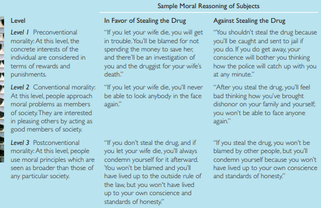
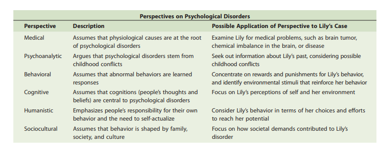

##  Sensation and Perception 

- **Types of Perception**
    Vision.
    Touch.
    Sound.
    Taste.
    Smell

- **Weber’s law** A basic law of psychophysics stating that a just noticeable 
difference is a constant proportion to 
the intensity of an initial stimulus 
(rather than a constant amount)
  - **Example:** For example, Weber found that the just noticeable difference for weight is 1:50. 
Consequently, it takes a 1-ounce increase in a 50-ounce weight to produce a noticeable difference, and it would take a 10-ounce increase to produce a noticeable difference if the initial weight were 500 ounces.
  - **Explains** Weber’s law helps explain why a person in a quiet room is more startled by the 
ringing of a telephone than is a person in an already noisy room. To produce the 
same amount of reaction in a noisy room, a telephone ring might have to approximate the loudness of cathedral bells.

- **Theories of Vision**
  -  **Trichromatic theory of color vision**  This theory suggests that there 
are three kinds of cones in the retina, each of which responds primarily to a specifi c 
range of wavelengths. One is most responsive to blue-violet colors, one to green, and 
the third to yellow-red (Brown & Wald, 1964). According to trichromatic theory, perception of color is infl uenced by the relative strength with which each of the three 
kinds of cones is activated. If we see a blue sky, the blue-violet cones are primarily 
triggered, and the others show less activity
      - **Criticism** trichromatic theory does not 
explain color vision completely. Why should the colors in the afterimage be different 
from those in the original?
     - **Given By** Thomas Young
  
  -  **Opponent-process theory of color vision**  there are a blue-yellow pairing, a red-green pairing, and a black-white pairing. If an object refl ects light that contains more blue than yellow, it will stimulate 
the fi ring of the cells sensitive to blue, simultaneously discouraging or inhibiting the 
fi ring of receptor cells sensitive to yellow—and the object will appear blue. If, in 
contrast, a light contains more yellow than blue, the cells that respond to yellow will 
be stimulated to fi re while the blue ones are inhibited, and the object will appear 
yellow
      - **Explains Afterimage** When 
we stare at the yellow in the fi gure, for instance, our receptor cells for the yellow 
component of the yellow-blue pairing become fatigued and are less able to respond 
to yellow stimuli. In contrast, the receptor cells for the blue part of the pair are not 
tired, because they are not being stimulated. When we look at a white surface, the 
light refl ected off it would normally stimulate both the yellow and the blue receptors 
equally. But the fatigue of the yellow receptors prevents this from happening. They 
temporarily do not respond to the yellow, which makes the white light appear to be 
blue
     - **Given By** Ewald Hering
  
- **Theories of Hearing**
  - **Place Theory of Hearing**  Basilar membrane 
nearest to the oval window is most sensitive to high-frequency sounds, and the part 
nearest to the cochlea’s inner end is most sensitive to low-frequency sounds. This 
fi nding has led to the place theory of hearing , which states that different areas of 
the basilar membrane respond to different frequencies 
    - **Criticism**  place theory does not tell the full story of hearing, because very low 
frequency sounds trigger neurons across such a wide area of the basilar membrane 
that no single site is involved. Consequently, an additional explanation for hearing 
has been proposed: frequency theory
  - **frequency theory of hearing** suggests that 
the entire basilar membrane acts as a microphone, vibrating as a whole in response 
to a sound. According to this explanation, the nerve receptors send out signals that 
are tied directly to the frequency (the number of wave crests per second) of the 
sounds to which we are exposed, with the number of nerve impulses being a direct 
function of a sound’s frequency. Thus, the higher the pitch of a sound (and therefore 
the greater the frequency of its wave crests), the greater the number of nerve impulses 
that are transmitted up the auditory nerve to the brain
  - **Both Issue**  Neither place theory nor frequency theory provides the full explanation for hearing. Place theory provides a better explanation for the sensing of high-frequency.sounds, whereas frequency theory explains what happens when low-frequency 
sounds are encountered. Medium-frequency sounds incorporate both processes 

- **Gate-control theory of pain** , particular 
nerve receptors in the spinal cord lead to specifi c areas of the 
brain related to pain. When these receptors are activated 
because of an injury or problem with a part of the body, a 
“gate” to the brain is opened, allowing us to experience the 
sensation of pain (Melzack & Katz, 2004). 
However, another set of neural receptors can, when stimulated, close the “gate” to the brain, thereby reducing the experience of pain. The gate can be shut in two different ways.
  -  nonpainful stimuli compete with 
and sometimes displace the neural message of pain, thereby shutting off the painful 
stimulus. This explains why rubbing the skin around an injury  
  - Gate-control theory also may explain cultural differences in the experience of 
pain. Some of these variations are astounding. For example, in India people who 
participate in the “hook-swinging” ritual to celebrate the power of the gods have 
steel hooks embedded under the skin and muscles of their backs .Also explains Acupuncture chinese
  - **Given by** Ronald Melzack and Patrick Wall
- **Gestalt Laws of Organization**
  - **closure** : We usually group elements to form enclosed or complete figures rather than open on 
  - **proximity** : We perceive elements that are closer 
together as grouped together. As a result, we tend to see pairs 
of dots rather than a row of single dots
  - **similarity** in appearance we perceive as 
grouped together. We see, then, horizontal rows of circles and 
squares 
  - **simplicity** : When we observe a pattern, we perceive it in the 
most basic, straightforward manner that we can
  - Example: Images on `Page 181`
  - One fundamental gestalt principle that remains infl uential is that two 
objects considered together form a whole that is different 
from the simple combination of the objects. Gestalt psychologists argued that the perception of stimuli in our environment 
goes well beyond the individual elements that we sense. 
Instead, it represents an active, constructive process carried 
out within the brain
  - **Given by** Wolfgang Köhler and Kurt Koffka

## Learning

-  **classical conditioning** A type of 
learning in which a neutral stimulus 
comes to bring about a response after 
it is paired with a stimulus that 
naturally brings about that response.
   - **Given By** Ivan Pavlov
   - **Example** Learning by means of classical conditioning also occurs during adulthood. For 
example, you may not go to a dentist as often as you should because of previous 
associations of dentists with pain. In more extreme cases, classical conditioning can 
lead to the development of phobias.
   - PTSD in war veterans who have had traumatic experiences, can also be produced by classical 
conditioning

- **Thorndike’s Law of Effect** 
  - Responses that lead to satisfying consequences are more likely to be repeated. 
- **OPERANT CONDITIONING**  page 238
  - **Given by** B. F. Skinner
-  **COMPARING CLASSICAL AND OPERANT CONDITIONING** Page 247
- **behavior modification Strategies**  The techniques used by behavior analysts are as varied as the list of processes 
that modify behavior. They include reinforcement scheduling, shaping, generalization training, discrimination training, and extinction. Participants in a behaviorchange program do, however, typically follow a series of similar basic steps that   

-  **Cognitive Approaches to Learning**
   -  **cognitive learning theory** An 
approach to the study of learning that 
focuses on the thought processes that 
underlie learning 
   - **latent learning** Behaviour is acquired but not shown unless a motivation is present.
     - Latent learning puts question on Operant Conditioning `pg 254` 

   - **observational learning or Social learning theory** Learning by 
observing the behavior of another 
person, or model.
     - **Given by** Albert Bandura
     - Observational learning is particularly important in acquiring skills in which the 
operant conditioning technique of shaping is inappropriate. Piloting an airplane and 
performing brain surgery, for example, are behaviors that could hardly be learned 
by using trial-and-error methods without grave cost—literally—to 
   - **Insight learning theory** is proposed by Wolfgang Kohler. Insight learning is the sudden understanding of the relation between a problem and a solution. By learning through insight, the correct solution not only appears seemingly out of nowhere but also repeated readily of subsequent presentations of that problem

- **levels-of-processing theory** The 
theory of memory that emphasizes the 
degree to which new material is 
mentally analyzed.

  - At **shallow levels**, 
information is processed merely in terms of its physical and sensory aspects. For 
example, we may pay attention only to the shapes that make up the letters in the 
word dog . 
  - At an **intermediate level of processing**, the shapes are translated into meaningful units—in this case, letters of the alphabet. Those letters are considered in the 
context of words, and specific phonetic sounds may be attached to the letters. 
  - **deepest level of processing**, information is analyzed in terms of its meaning. We may see it in a wider context and draw associations between the meaning 
of the information and broader networks of knowledge

- **Forgetting and reasons for forgetting**
  - **Decay** is the loss of information through nonuse. 
    - **Physical Explaination** This explanation for forgetting 
assumes that memory traces, the physical changes that take place in the brain when 
new material is learned, simply fade away over time
  -  **interference** The phenomenon by 
which information in memory disrupts 
the recall of other information
     - **proactive interference** Interference in 
which information learned earlier 
disrupts the recall of newer material. 
     - **retroactive interference** Interference 
in which there is diffi culty in the recall 
of information learned earlier because 
of later exposure to different materia
  - **cue-dependent forgetting** Forgetting 
that occurs when there are insuffi cient 
retrieval cues to rekindle information 
that is in memory
  - **Medical Problems** Alzheimer’s disease An illness 
characterized in part by severe 
memory problems. 

##  Motivation and Emotion 

#### Theories of Motivation or Approaches

-  **Instinct Approaches**: According 
to instinct approaches to motivation, people and animals are born preprogrammed 
with sets of behaviors essential to their survival. Those instincts provide the energy 
that channels behavior in appropriate directions. Hence, sexual behavior may be a 
response to an instinct to reproduce, and exploratory behavior may be motivated by 
an instinct to examine one’s territory. 
   - **motivation** The factors that direct and 
energize the behavior of humans and 
other organisms. 
   - **instincts** Inborn patterns of behavior 
that are biologically determined rather 
than learned
   - **Problem**: This conception presents several diffi culties, however. For one thing, psychologists do not agree on what, or even how many, primary instincts exist. One early 
psychologist, William McDougall (1908), suggested that there are 18 instincts

- **Drive-reduction** approaches to 
motivation suggest that a lack of some basic biological requirement such as water 
produces a drive to obtain that requirement (in this case, the thirst drive). 
  - **Example**:  A drive is 
motivational tension, or arousal, that energizes behavior to fulfi ll a need. Many basic 
drives, such as hunger, thirst, sleep, and sex, are related to biological needs of the 
body or of the species as a whole. These are called primary drives . Primary drives 
contrast with secondary drives in which behavior fulfi lls no obvious biological need. 
In secondary drives , prior experience and learning bring about needs. For instance, 
some people have strong needs to achieve academically and professionally
  - We usually try to satisfy a primary drive by reducing the need underlying it. For 
example, we become hungry after not eating for a few hours
  - **Problem** drive-reduction theories provide a good explanation of how primary 
drives motivate behavior, they cannot fully explain a behavior in which the goal is 
not to reduce a drive but rather to maintain or even increase the level of excitement 
or arousal.  Similarly, many people pursue thrilling activities such as riding a roller coaster or steering a raft down the rapids of a river

- **Homeostasis**, the body’s tendency to maintain a steady internal state, underlies primary drives. Using feedback loops, homeostasis brings deviations in body functioning back to an optimal state, similar to the way a thermostat does.

- **Arousal approaches to motivation**  According to arousal approaches to motivation, each person 
tries to maintain a certain level of stimulation and activity. As with the drivereduction model, this model suggests that if our stimulation and activity levels 
become too high, we try to reduce them. But, in contrast to the drive-reduction 
model, the arousal model also suggests that if levels of stimulation and activity are 
too low, we will try to increase them by seeking stimulation. 
 
  - **Example :** People vary widely in the optimal level of arousal they seek out, with some people 
looking for especially high levels of arousal. For example, people who participate in 
daredevil sports, high-stakes gamblers, and criminals who pull off high-risk robberies 
may be exhibiting a particularly high need for arousal 

- **Incentive approaches** to motivation suggest that motivation stems from the 
desire to obtain valued external goals, or incentives. In this view, the desirable properties of external stimuli—whether grades, money, affection, food, or sex—account 
for a person’s motivation 

  -  **Problem** it does 
not provide a complete explanation of motivation because organisms sometimes seek 
to fulfi ll needs even when incentives are not apparent.

- **Cognitive approaches to motivation** suggest that motivation is a product of people’s 
thoughts, expectations, and goals—their cognitions. 
  - **Example** :For instance, the degree to which 
people are motivated to study for a test is based on their expectation of how well 
studying will pay off in terms of a good grade
  - Explain: Cognitive theories of motivation draw a key distinction between intrinsic and 
extrinsic motivation. 

  - **Intrinsic motivation** causes us to participate in an activity for our 
own enjoyment rather than for any concrete, tangible reward that it will bring us. In 
contrast, 
  - **extrinsic motivation** causes us to do something for money, a grade, or some 
other concrete, tangible reward. For example, when a physician works long hours 
because she loves medicine

- **Maslow’s model** places motivational needs in a hierarchy and suggests that 
before more sophisticated, higher-order needs can be met, certain primary needs 
must be satisfied
  - **Problem** Although research has been unable to validate the specific ordering of Maslow’s 
stages, and it is difficult to measure self-actualization objectively, Maslow’s hierarchy 
of needs is important for two reasons: It highlights the complexity of human needs, 
and it emphasizes the idea that until more basic biological needs are met, people will 
be relatively unconcerned with higher-order needs 
  - **Abraham Maslow**

- **self-determination theory** that people have the three basic needs of competence, autonomy, and relatedness. 
Competence is the need to produce desired outcomes, while autonomy is the perception that we have control over our own lives.Finally, relatedness is the need to be 
involved in close, warm relationships with others. In the view of self-determination 
theory, these three psychological needs are innate and universal across cultures, and 
they are essential as basic biological needs 
  - **Given By**  Edward Deci and Richard Ryan

- **Functions of Emotions**
  1. **Preparing us for action** . Emotions act as a link between events in our environment and our responses. For example, if you saw an angry dog charging 
toward you, your emotional reaction would be fear.
  2. **Shaping our future behavior** . Emotions promote learning that will help us make 
appropriate responses in the future. For instance, your emotional response to 
unpleasant events teaches you to avoid similar circumstances in the future. 
  3. **Helping us interact** more effectively with others . We often communicate the 
emotions we experience through our verbal and nonverbal behaviors, making 
our emotions obvious to observers. T 

#### Theories of Emotion

-  **James-Lange theory of emotion**  James and Lange proposed that we experience emotions as a result of 
physiological changes that produce specifi c sensations. The brain interprets these 
sensations as specifi c kinds of emotional experiences (see the fi rst part of Figure 2). 
This view has come to be called the James-Lange theory of emotion
   - They suggested that for every major emotion there is an accompanying physiological or “gut” 
reaction of internal organs—called a **visceral experience**
   - **Drawback** James-Lange theory has some serious drawbacks, however. For the theory 
to be valid, visceral changes would have to occur relatively quickly because we 
experience some emotions—such as fear upon hearing a stranger rapidly approaching 
on a dark night—almost instantaneously. Yet emotional experiences frequently occur 
even before there is time for certain physiological changes to be set into motion. 
Because of the slowness with which some visceral changes take place, it is hard to 
see how they could be the source of immediate emotional experience
     - **Another issue**:  Physiological arousal does not 
invariably produce emotional experience. For example, a person who is jogging has 
an increased heartbeat and respiration rate as well as many of the other physiological 
changes associated with certain emotions. Yet joggers typically do not think of such 
changes in terms of emotion
   - **William James and Carl Lange**

- **CANNON-BARD THEORY** This theory rejects the view that physiological arousal alone 
leads to the perception of emotion. Instead, the theory assumes that both physiological 
arousal and the emotional experience are produced simultaneously by the same nerve 
stimulus, which Cannon and Bard suggested emanates from the thalamus in the brain.
  - **Explain**  thalamus is the initial site of the emotional response. Next, the thalamus sends a signal 
to the autonomic nervous system,
  - **Criticism** Recent research 
has led to some important modifications of the theory. For one thing, we now understand that the hypothalamus and the limbic system, not the thalamus, play a major 
role in emotional experience. In addition, the simultaneous occurrence of the physiological and emotional responses, which is a fundamental assumption of the Cannon.Bard theory, has yet to be demonstrated conclusively.
  - **Walter Cannon and Philip Bard**
   
- **SCHACHTER-SINGER THEORY(Cognitive Perspective)** According to an explanation that focuses on the role of cognition, the SchachterSinger theory of emotion, this might very well happen. This approach to explaining emotions emphasizes that we identify the emotion we are experiencing by 
observing our environment and comparing ourselves with others
  - **Explaination** Schachter and Singer’s classic experiment `page 387`

### Intelligence Chapter Mix from  theories file and Book

## Personality : From Book fully

## Health PSychology and Stress

- **general adaptation syndrome**  (GAS) A theory developed by Selye  
that suggests that a person’s response 
to a stressor consists of three stages: 
alarm and mobilization, resistance, 
and exhaustion.(532)
  - 
  -  **Hans Selye**

- Effects of Stress

## Devlopment

- **Developmental Research Techniques**
  - **cross-sectional research** A research 
method that compares people of 
different ages at the same point in time
  -  **longitudinal research** A research 
method that investigates behavior as 
participants age. 
  - **sequential research** A research 
method that combines cross-sectional 
and longitudinal research by considering a number of different age groups 
and examining them at several points 
in time. 
- **Stages of Development**
  - germinal period
  - embryonic period
  - fetal period
  -  age of viability
  -  sensitive periods
-  **Factors that effect development**
   -  Genetic
      -  Phenylketonuria
      -  Sickle-cell anemia
      -  Tay-Sachs disease
      -  Down syndrome
   - **Enviromental**
     - Mother’s nutrition .
     - Mother’s illness .
     - Mother’s emotional state
     - Mother’s use of drugs
     - Alcohol(h fetal alcohol syndrome) 
 
- **Parenting Styles and Social Development**
  - **authoritarian parents** Parents who are 
rigid and punitive and value unquestioning obedience from their child
  - **permissive parents** Parents who give 
their children relaxed or inconsistent 
direction and, although they are warm, 
require little of them.
  - **authoritative parents** Parents who are 
fi rm, set clear limits, reason with their 
children, and explain things to them.
  - **uninvolved parents** Parents who 
show little interest in their children 
and are emotionally detached

  

- **Erikson’s Theory of Psychosocial Development**
  - Developmental changes that occur throughout life as a 
series of eight stages of psychosocial development; of these, four occur during childhood. Psychosocial development involves changes in our interactions and understanding of one another as well as in our knowledge and understanding of ourselves 
as members of society. 
 Erikson suggests that passage through each of the stages necessitates the resolution of a crisis or confl ict.
  - **Given by** Erik Erikson
  - **Criticism** Male Centric
  - Page 458 and 470
  - Mnemonic : 

- **Piaget’s Theory of Cognitive Development**
  -  **Jean Piaget**

-  **INFORMATION-PROCESSING APPROACHES to development**
   -  According to this approach, quantitative changes occur in children’s ability to 
organize and manipulate information. From this perspective, children become 
increasingly adept at information processing, much as a computer program may 
become more sophisticated as a programmer modifi es it on the basis of experience. 
Information-processing approaches consider the kinds of “mental programs” that 
children invoke when approaching problems
   - Types of development in Info-processing
     - Speed of Processing
     - Improvement in Memory
     - Metacognition (An awareness and understanding of one’s own cognitive processes.)
- **Vygotsky’s View of Cognitive Development(Social)**
  - Lev Vygotsky, the culture in which we are raised 
signifi cantly affects our cognitive development. In an increasingly infl uential view, 
Vygotsky suggests that the focus on individual performance of both Piagetian and 
information-processing approaches is misplaced. Instead, he holds that we cannot 
understand cognitive development without taking into account the social aspects of 
learning
  - **Vygotsky argues that cognitive development** occurs as a consequence of social 
interactions in which children work with others to jointly solve problems. Through 
such interactions, children’s cognitive skills increase, and they gain the ability to 
function intellectually on their own. More specifi cally, he suggests that children’s 
cognitive abilities increase when they encounter information that falls within their 
zone of proximal development. The zone of proximal development (ZPD) is the 
level at which a child can almost, but not fully, comprehend or perform a task on 
his or her own.

-  **KOHLBERG’S THEORY OF MORAL DEVELOPMENT**
    
    - According to Kohlberg, people pass through a 
series of stages in the evolution of their sense of justice and in the kind of reasoning 
they use to make moral judgments (Kohlberg, 1984). Largely because of the various 
cognitive limitations that Piaget described.
   - **Limitation** One glaring shortcoming of Kohlberg’s research is that he primarily used male participants.
   - **Lawrence Kohlberg**

- **Gilligan THeory of Moral Development** According to Gilligan, men view morality 
primarily in terms of broad principles, such as justice and fairness. In contrast, women 
see it in terms of responsibility toward individuals and willingness to make sacrifi ces 
to help a specifi c individual within the context of a particular relationship. Compassion 
for individuals is a more salient factor in moral behavior for women than it is for men. women may develop identity through the establishment of relationships. In her view, a primary component of women’s identity is the construction of caring networks among themselves and others.

  - **Carol Gilligan** 
   

- **Aging Theories**
  - **Genetic preprogramming theories of aging** suggest that human cells have a built-in time limit to their reproduction. These theories suggest that after a certain time cells stop dividing or 
become harmful to the body—as if a kind of automatic self-destruct button had 
been pushed. 
  - In contrast, **wear-and-tear theories** of aging suggest that the mechanical functions of the body simply work less effi ciently as people age. Waste by products of energy production eventually accumulate, and mistakes are made when cells divide. Eventually the body in effect wears out like an old automobile.
  - **Social**
    -  **disengagement theory of aging** 
 A theory that suggests that aging 
produces a gradual withdrawal from 
the world on physical, psychological, 
and social levels. 
    - **activity theory of aging** A theory that 
suggests that the elderly who are most 
successful while aging are those who 
maintain the interests and activities 
they had during middle age

- **Elisabeth Kübler-Ross five broad stages of death**: 
  - Denial
  - Anger
  - Bargaining
  - Depression
  - Acceptance

## Social Psychology (From book)

- **Cognitive dissonance theory** postulates that an underlying psychological tension is created when an individual's behavior is inconsistent with his or her thoughts and beliefs. This underlying tension then motivates an individual to make an attitude change that would produce consistency between thoughts and behaviors.(636)
  - How cD is solved
    - Modify one or both cognitions
    - Change importance of cognition
    - Add additional cognition
    - Deny relation between cognitions
  - **Leon Festinger**
- https://www.simplypsychology.org/attribution-theory.html
- **Attribution Theory**
  - Attribution theory deals with how the social perceiver uses information to arrive at causal explanations for events. It examines what information is gathered and how it is combined to form a causal judgment”. Heider (1958) believed that people are naive psychologists trying to make sense of the social world
  - Ideas by Fritiz: Situational Attribution and Dispositional Attribution
  - **Types of Attribution** biases people make
    
    - **hALO EFFECT**:initial understanding 
that a person has positive traits is used to infer other uniformly positive 
characteristics
    - **assumed-similarity bias** The tendency to think of people as being 
similar to oneself even when meeting 
them for the fi rst time.
    - **self-serving bias** The tendency to 
attribute personal success to personal 
factors (skill, ability, or effort) and to 
attribute failure to factors outside 
oneself
    - **fundamental attribution error** 
A tendency to overattribute others’ 
behavior to dispositional causes and 
minimize of the importance of 
situational causes.
  - **Fritz Heider**
- **Correspondent inference theory**
  - Jones and Davis (1965) thought that people pay particular attention to intentional behavior
  - They say that we tend to do this when we see a correspondence between motive and behavior.  For example, when we see a correspondence between someone behaving in a friendly way and being a friendly person.
  -  Jones and Davis say we draw on five sources of information:
  -  
  - **Edward E. Jones and Keith E. Davis**
  - Rest from Notes
  - **Factors in COnformity**
    - Characteristic of Group : high value or not
    - Situation to respond : if public more conformity
    - kind of task: If ambigous or no knowledge then more conformity
    - Unanimity of group: 
    - Techniques of Compliance:
      - **Foot-in-the-door technique** ask a person to agree to a small request and later ask that person to comply with a more important one
      -  **Door-in-the-face technique** someone makes a large request, expects it to be refused, and follows it with a smaller one
      -  **Not-so-free sample** the need for reciprocation—in the form of a purchase, of course
      -  **That’s-not-all technique**  a salesperson offers you a deal at an infl ated price. But immediately after the initial offer, the salesperson offers an incentive, discount, or bonus to clinch the deal.
 -  **Prejudice and its explaination**
    -  According to **observational learning approaches** to stereotyping and prejudice, the 
behavior of parents, other adults, and peers shapes children’s feelings about members of various groups. For instance, bigoted parents may commend their children for expressing prejudiced attitudes
     - **social identity theory**, we use group membership as a source of pride and self-worth. 
Social identity theory suggests that people tend to be ethnocentric, viewing the 
world from their own perspective and judging others in terms of their group membership.

- **Approaches to aggression**
  - INSTINCT APPROACHES drive. Konrad Lorenz, an ethologist (a 
scientist who studies animal behavior), expanded Freud’s notions by arguing that 
humans, along with members of other species, have a fighting instinct, which in 
earlier times ensured protection of food supplies and weeded out the weaker of the 
species (Lorenz, 1966, 1974). Lorenz’s instinct approach led to the controversial notion 
that aggressive energy constantly builds up in an individual until the person fi nally discharges it in a process called catharsis.
  -  **Frustration-aggression theory** tries to explain aggression in terms of 
events like this one. It suggests that frustration (the reaction to the thwarting or blocking of goals) produces anger, which leads to a readiness to 
act aggressively. Whether actual aggression occurs depends on the presence of aggressive cues, stimuli that have been associated in the past with 
actual aggression or violence and that will trigger aggression again
  - According to **observational learning theory**, 
people observe the behavior of models and the subsequent consequences of that 
behavior. If the consequences are positive, the behavior is likely to be imitated when 
observers fi nd themselves in a similar situation

## Abnormal and Clinical Psychology

- **Causes and concept of Abnormality**

- **anxiety disorder** The occurrence of 
anxiety without an obvious external 
cause that affects daily functioning.
  - **PHOBIC DISORDER**  phobia , an intense, irrational fear of a specifi c object or situation. For example, claustrophobia is a fear of enclosed places, acrophobia is a fear 
of high places, xenophobia is a fear of strangers, social phobia is the fear of being 
judged or embarrassed by others, and—as in Donna’s case—electrophobia is a fear 
of electricity. 
  - **panic disorder** Anxiety disorder that 
takes the form of panic attacks lasting 
from a few seconds to several hours
  - **Panic attacks** seemingly come out of nowhere and are 
unconnected to any specifi c stimulus. Because they don’t 
know what triggers their feelings of panic, victims of panic 
attacks may become fearful of going places

  -  **generalized anxiety disorder** 
The experience of long-term, 
persistent anxiety and worry
     -  **obsessive-compulsive disorder** In obsessive-compulsive disorder (OCD) , people 
are plagued by unwanted thoughts, called obsessions, or feel that they must carry 
out behaviors, termed compulsions, which they feel driven to perform
  - **Causes of Anxiety Disorders**
    - **Genetic factors** clearly are part of the picture. For example, if one member of a pair 
of identical twins has panic disorder, there is a 30% chance that the other twin will 
have it also. 
    - There are also **biological causes** at work in OCD. For example, researchers have 
found differences in the brains of those with the disorder compared to those without.
    - **behavioral perspective** have taken a different 
approach that emphasizes environmental factors. They consider anxiety to be a 
learned response to stress. For instance, suppose a dog bites a young girl. When the 
girl next sees a dog, she is frightened and runs away—a behavior that relieves her 
anxiety and thereby reinforces her avoidance behavior. After repeated encounters 
with dogs in which she is reinforced for her avoidance behavior.
    - **cognitive perspective** suggests that anxiety disorders grow out of 
inappropriate and inaccurate thoughts and beliefs about circumstances in a person’s 
world. For example, people with anxiety disorders may view a friendly puppy as a 
ferocious and savage pit bull.

- **somatoform disorders** Psychological 
diffi culties that take on a physical 
(somatic) form, but for which there is 
no medical cause. 
  -  **hypochondriasis** A disorder in which 
people have a constant fear of illness 
and a preoccupation with their health.
  -  **conversion disorder** A major somatoform disorder that involves an actual 
physical disturbance, such as the 
inability to use a sensory organ or the 
complete or partial inability to move 
an arm or leg. 

-  **Dissociative Disorders**
   -  **dissociative identity disorder** (DID) 
 A disorder in which a person displays 
characteristics of two or more distinct 
personalities.  
   - **Dissociative amnesia** is another dissociative disorder in which a signifi cant, selective memory loss occurs. Dissociative amnesia is unlike simple amnesia, which involves 
an actual loss of information from memory and typically results from a physiological 
cause. In contrast, in cases of dissociative amnesia, the “forgotten” material is still present in memory—it simply cannot be recalled. The term repressed memories is sometimes 
used to describe the lost memories of people with dissociative amnesia.
   - A more unusual form of amnesia is a condition known as **dissociative fugue** . In 
this state, people take sudden, impulsive trips and sometimes assume a new identity. 
After a period of time—days, months, or sometimes even years—they suddenly realize that they are in a strange place and completely forget the time they have spent 
wandering

-  **Mood Disorders**
   -  **mood disorder** A disturbance in 
emotional experience that is strong 
enough to intrude on everyday living 
   -  **major depression** A severe form 
of depression that interferes with 
concentration, decision making, and 
sociability. 
      - Women twice as like to suffer. one exp, women face double pressue from working in home and job.
    - **bipolar disorder** A disorder in which 
a person alternates between periods of 
euphoric feelings of mania and periods 
of depression
      - Some mood disorders clearly have **genetic and biochemical roots**. In fact, most 
evidence suggests that bipolar disorders are caused primarily by biological factors. 

- **schizophrenia** A class of disorders in 
which severe distortion of reality occurs
  - **Disorganized (hebephrenic) schizophrenia**Inappropriate laughter and giggling, silliness, 
incoherent speech, infantile behavior, strange and 
sometimes obscene behavior.
  - **Paranoid schizophrenia** Delusions and hallucinations of persecution or 
of greatness, loss of judgment, erratic and 
unpredictable behavior
  - **Catatonic schizophrenia** Major disturbances in movement; in some phases, 
loss of all motion, with patient frozen into a single 
position, remaining that way for hours and 
sometimes even days; in other phases, hyperactivity 
and wild, sometimes violent, movement
  - **Undifferentiated schizophrenia** Variable mixture of major symptoms of 
schizophrenia; classifi cation used for patients who 
cannot be typed into any of the more specifi c 
categories
  - **Residual schizophrenia** Minor signs of schizophrenia after a more serious 
episode

  - **Causes**
    - **Biological**
      - **Imbalance of Neural chemicals**  **dopamine hypothesis** suggests that schizophrenia occurs when there is excess activity in the areas of the brain that use dopamine as a neurotransmitter.
      - **structural abnormalities** exist in the 
brains of people with schizophrenia perhaps as a result of exposure to a virus during 
prenatal development
    - **Enviromental** 
      - Freud believed that people with schizophrenia lack egos that are strong enough to cope 
with their unacceptable impulses. They regress to the oral stage—a time when the 
id and ego are not yet separated. Therefore, individuals with schizophrenia essentially lack an ego and act out impulses without concern for reality. 
    -  **cognitive perspective** on schizophrenia suggest that the 
       - problems in thinking that people with the disorder experience point to a cognitive 
cause. Some suggest that schizophrenia results from overattention to stimuli in the 
environment. Rather than being able to screen out unimportant

     - **Predisposition model of schizophrenia** Used today
       - This model suggests that individuals may inherit a predisposition or 
an inborn sensitivity to schizophrenia that makes them particularly vulnerable to 
stressful factors in the environment, such as social rejection or dysfunctional family 
communication patterns. 

-  **Personality Disorders** 
   -  A disorder 
characterized by a set of infl exible, 
maladaptive behavior patterns that 
keep a person from functioning 
appropriately in society.
   - **antisocial personality disorder** 
A disorder in which individuals show 
no regard for the moral and ethical 
rules of society or the rights of others
   -  **borderline personality disorder** 
A disorder in which individuals have 
diffi culty developing a secure sense 
of who they are. 
   -  **narcissistic personality disorder** 
A personality disturbance characterized by an exaggerated sense of 
self- importance
- **Treatment of Disorders**
  - **psychodynamic therapy** Therapy that 
seeks to bring unresolved past confl icts 
and unacceptable impulses from the 
unconscious into the conscious, where 
patients may deal with the problems 
more effectively
  - **psychoanalysis** Freudian psychotherapy in which the goal is to release 
hidden unconscious thoughts and 
feelings in order to reduce their power 
in controlling behavior
  - Methods Used
    - **Free Association**
    - **Dream Interpretation** 
    - **Transference** The transfer of feelings 
to a psychoanalyst of love or anger 
that had been originally directed to a 
patient’s parents or other authority 
figures. 
  - **issues**
    - Length ,Expensive,Dont know whether work or not. Whether patient got better.Cannot be proved
-  **behavioral treatment** **approaches** 
 Treatment approaches that build on 
the basic processes of learning, such as 
reinforcement and extinction, and 
assume that normal and abnormal 
behavior are both learned. 
   - `Classical Conditioning Techniques`
   -  **aversive conditioning** A form of 
therapy that reduces the frequency of 
undesired behavior by pairing an 
aversive, unpleasant stimulus with 
undesired behavior. 
      - Like drugs with Alcohol
    - **systematic desensitization** A behavioral technique in which gradual 
exposure to an anxiety-producing 
stimulus is paired with relaxation to 
extinguish the response of anxiety. 
      - Steps 
        - Create **Hierarchy of Fear** first.Aeroplane Example
        - Once you had developed this hierarchy and learned relaxation techniques, you 
            would learn to associate the two sets of responses
        - imagine yourself in the first 
situation identifi ed in your hierarchy and so on
    - **Exposure Treatments** Although systematic desensitization has proven to be a successful treatment, today it is often replaced with a less complicated form of therapy 
called exposure. Exposure is a behavioral treatment for anxiety in which people are 
confronted either suddenly or gradually with a stimulus that they fear.
   -  `OPERANT CONDITIONING TECHNIQUES`
   -  **Contingency contracting**, the therapist and client (or 
teacher and student or parent and child) draw up a written 
agreement. The contract states a series of behavioral goals the 
client hopes to achieve. It also specifies the positive consequences for the client if the client reaches goals—usually an 
explicit reward such as money or additional privileges 
   - **observational learning**, the process in which the behavior of other people is modeled, to systematically teach people new skills and ways of handling their 
fears and anxieties. For example, modeling helps when therapists are teaching basic 
social skills, such as maintaining eye
   -  **Good things** works especially well for eliminating anxiety disorders, treating 
phobias and compulsions, establishing control over impulses, and learning complex 
social skills to replace maladaptive behaviour
   - **Issues** Critics of behavior therapy believe that because it emphasizes changing external 
behavior, people do not necessarily gain insight into thoughts and expectations that 
may be fostering their maladaptive behavior
- **cognitive treatment approaches** Treatment approaches that teach people to 
think in more adaptive ways by 
changing their dysfunctional cognitions about the world and themselves. 
  - **rational-emotive behavior therapy** 
A form of therapy that attempts to 
restructure a person’s belief system 
into a more realistic, rational, and 
logical set of views by challenging 
dysfunctional beliefs that maintain 
irrational behavior. 
  - **Good things** Cognitive approaches to therapy have proved successful in dealing with a broad 
range of disorders, including anxiety disorders, depression, substance abuse, and 
eating disorders
- **humanistic therapy** Therapy in which 
the underlying rationale is that people 
have control of their behavior, can 
make choices about their lives, and are 
essentially responsible for solving their 
own problems.
  - **Person-centered therapy** (also called client-centered therapy ) aims to enable people 
to reach their potential for self-actualization. By providing a warm and accepting 
environment, therapists hope to motivate clients to air their problems and feelings. 
In turn, this enables clients to make realistic and constructive choices and decisions 
about the things that bother them in their current lives,
    -  therapists provide what Rogers 
calls **unconditional positive regard**
  - **Issues** humanistic treatments lack specifi city, a problem that has troubled 
their critics. Humanistic approaches are not very precise and are probably the least 
scientifi cally and theoretically developed type of treatment.
- **Biomedical Therapy**
  -  **drug therapy** Control of psychological 
disorders through the use of drugs.
  -  **antipsychotic drugs** Drugs that 
temporarily reduce psychotic symptoms such as agitation, hallucinations, 
and delusions.such as `promazine`
  - **How it works**  work? Most block dopamine receptors at the brain’s 
synapse
  -  **antidepressant drugs**   Medications 
that improve a severely depressed 
patient’s mood and feeling of wellbeing. 
  - **antianxiety drugs**   Drugs that reduce 
the level of anxiety a person experiences essentially by reducing excitability and increasing feelings of well-being. 
    - Antianxiety drugs such as Xanax and Valium
  - **Electroconvulsive therapy** (ECT)   
 A procedure used in the treatment of 
severe depression in which an electric 
current of 70–150 volts is briefly 
administered to a patient’s head.

